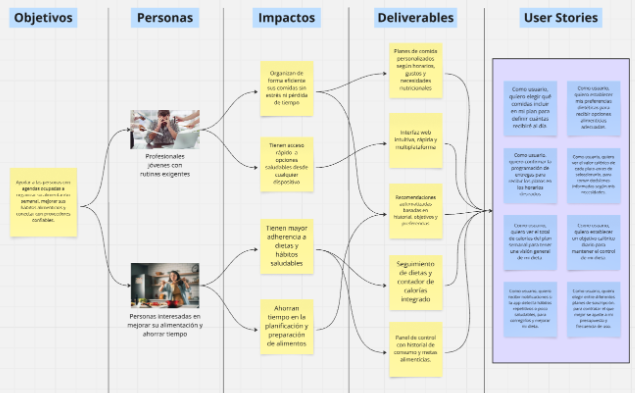
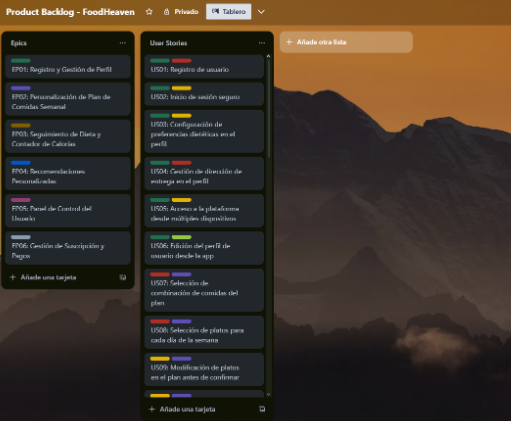

  

<strong>Universidad Peruana de Ciencias Aplicadas</strong>

<strong>Ingeniería de Software</strong> 
Aplicaciones Web  
<strong>Profesor:</strong> Naldo Reupo-Masayon Gastulo

<h2 align="center">INFORME</h2>

<h3 align="center">Startup: EuroCausas</h3>

<strong>Producto: FoodHeaven</strong>

<h3 align="center">Team Members:</h3>

| **Member**                           | **Code**     |
|--------------------------------------|--------------|
|Paulo Percy Quincho Gamarra      |  U20191E562  |
|         |  |
|          |   |
|       |  |

<strong>Abril 2025</strong>

# Registro de Versiones del Informe
| Versión | Fecha       | Autor(es)                                                              | Descripción                                                                                                                                         |
|---------|-------------|------------------------------------------------------------------------|-----------------------------------------------------------------------------------------------------------------------------------------------------|
| TB1     | 25/03/2025  | Santiago Iván Cárdenas Concha                                          | Desarrollo del capítulo I: Introducción                                                                                                             |
|         | 29/03/2025  | Ricardo Fernando Cárdenas Minaya                                       | Desarrollo del capítulo II: Competidores                                                                                                            |
|         | 29/03/2025  | Santiago Iván Cárdenas Concha, Luis Piero Zinadine Rodríguez Rodríguez, Paulo Percy Quincho Gamarra, Ricardo Fernando Cárdenas Minaya | Desarrollo del capítulo II: Entrevistas                                                                                                             |
|         | 30/03/2025  | Paulo Percy Quincho Gamarra                                            | Desarrollo del capítulo II: Needfinding                                                                                                             |
|         | 08/04/2025  | Paulo Percy Quincho Gamarra                                            | Desarrollo del capítulo III: To-Be Scenario Mapping y Product Backlog                                                                              |
|         | 10/04/2025  | Paulo Percy Quincho Gamarra, Luis Gustavo Román Pajuelo               | Desarrollo del capítulo III: User stories                                                                                                           |
|         | 12/04/2025  | Luis Piero Zinadine Rodríguez Rodríguez                                | Desarrollo del capítulo III: Impact Mapping                                                                                                         |
|         | 14/04/2025  | Paulo Percy Quincho Gamarra, Ricardo Fernando Cárdenas Minaya         | Desarrollo del capítulo IV: Style Guidelines, Landing Page UI Design, Web Applications UX/UI Design, Web Application Prototyping y Domain-Driven Software Architecture |
|         | 16/04/2025  | Santiago Manuel Suárez Romero                                          | Desarrollo del capítulo IV: Software Object-Oriented Design y Database Design                                                                      |
|         | 18/04/2025  | Santiago Manuel Suárez Romero                                          | Desarrollo del capítulo V: Software Configuration Management                                                                                       |
|         | 20/04/2025  | Luis Gustavo Román Pajuelo                                             | Desarrollo del capítulo V: Sprint Planning 1                                                                                                        |
                                                                                   |

# Student Outcome
| Criterio específico | Acciones realizadas | Conclusiones |
|---------------------|---------------------|--------------|
| Participa en equipos multidisciplinarios con eficacia, eficiencia y objetividad, en el marco de un proyecto en soluciones de ingeniería de software. | **Santiago Iván Cárdenas Concha** (TB1): Durante el desarrollo del TB1, mi principal aporte fue la realización de los impact maps de nuestro negocio. Asimismo, desarrollé una primera versión del Landing Page de nuestro producto, la cuál sirvió al equipo para poder hacer las modificaciones necesarias.    **Ricardo Fernando Cárdenas Minaya** (TB1): En la elaboración del TB1, redacté las historias de usuario, colaboré en el desarrollo del landing page, así como en las secciones finales del capítulo 5 y revisión del documento.    **Paulo Percy Quincho Gamarra** (TB1): En la presentación de TB1 desarrollé el Needfinding de los segmentos objetivos y el To-Be Scenario Mapping. Asimismo, redacté las historias de usuario y me ocupé de organizar el control de proyectos con Trello. Por otro lado, desarrollé el diseño del producto de landing page y aplicación web y los diagramas C4.    **Luis Piero Zinadine Rodríguez Rodríguez** (TB1): Ayudé en la coordinación del equipo para llevar a cabo un correcto desarrollo del TB1 en el cuál desarrollé en su totalidad el capítulo 1 del informe. Asimismo, participé en el desarrollo colaborativo del diagrama UML y de bases de datos, así como de varias secciones del capítulo 5 y revisión general del contenido desarrollado.    **Luis Gustavo Román Pajuelo** (TB1): Para la realización del TB1, me encargué de la elaboración de los Wireframes, tanto para el landing page como para la versión Mobile. De igual forma, me encargué de elaborar los Mockups y Prototipos de la versión Mobile.    **Santiago Manuel Suárez Romero** (TB1): La herramienta Figma para el diseño del landing page y aplicaciones web resulta ser una herramienta sumamente útil al momento de diseñar prototipos previos al desarrollo gracias a sus funciones colaborativas en tiempo real y la conformación de proyectos organizados con la función de organizaciones. | Se reafirma la importancia de la comunicación a la hora de hacer las entrevistas a los diferentes segmentos objetivo que hemos definido.    Es indispensable conocer a nuestro segmento objetivo para poder darle un producto acorde a sus necesidades y que tengan una buena experiencia de usuario al ser clientes nuestros.    El desarrollo del product backlog permite tener un mejor control sobre el flujo de trabajo en equipos colaborativos. Asimismo, permite a los desarrolladores tener un panorama general y claro sobre lo que se busca desarrollar para el sprint actual.    En una entrevista acerca de nuestra aplicación, es fundamental estar abiertos a críticas y opiniones sinceras. Al escuchar activamente a los usuarios y permitirles expresar sus puntos de vista, podemos identificar áreas de mejora y realizar ajustes para satisfacer mejor sus necesidades. La retroalimentación constructiva es una oportunidad valiosa para fortalecer nuestra aplicación y brindar una experiencia de usuario excepcional.    El video about the team nos ha permitido realizar una autoevaluación del proceso de trabajo y rescatar puntos de mejora que podemos aplicar en futuros proyectos. |
| Conoce al menos un sector empresarial o dominio de aplicación de soluciones de software. | **Santiago Iván Cárdenas Concha** (TB1): Coordiné y realicé una entrevista con uno de los miembros de nuestros segmentos objetivos, garantizando obtener toda la información posible para el proyecto. También dediqué tiempo a revisar las user stories definidas entre el equipo.    **Ricardo Fernando Cárdenas Minaya** (TB1): Redacté las historias de usuario para cada segmento objetivo y el Product Backlog, de esta manera se prioriza las funcionalidades que debe tener nuestra aplicación web para ofrecerles un producto de calidad a nuestros clientes.    **Paulo Percy Quincho Gamarra** (TB1): Realicé una entrevista al segmento objetivo y colaboré en el análisis de entrevistas para postulantes.    **Luis Piero Zinadine Rodríguez Rodríguez** (TB1): Desarrollé el diseño de entrevistas y registro de las mismas para 3 entrevistados que pertenecen al segmento objetivo de reclutador. Por lo que, adquirí un mejor conocimiento del sector de reclutamiento en el área de recursos humanos de una empresa. Asimismo, realicé el análisis de las entrevistas dónde se me permitió conocer (de manera más resumida) cómo se llevan a cabo las diferentes actividades de los reclutadores y cómo se siente el reclutador al afrontar un proceso de reclutamiento.    **Luis Gustavo Román Pajuelo** (TB1): Me encargué de la búsqueda de posibles competidores de nuestra start-up. Es así que se desarrolló un análisis de cada uno de esos para compararlo con lo que nuestro proyecto propone. De igual forma, realicé una de las entrevistas al segmento objetivo de postulantes y redacté su análisis.    **Santiago Manuel Suárez Romero** (TB1): El procedimiento de recopilación de información demostró los diferentes puntos de vista de nuestros usuarios en potencia, permitiendo así construir los elementos necesarios para un proyecto más sólido para nuestro objetivo principal. | La construcción de los diferentes mapas con diferentes plataformas ayuda a mejorar nuestras capacidades y expandir nuestras habilidades.    Realizar la priorización de requisitos y tareas que la aplicación debe contener es fundamental, ya que el equipo sabrá qué es lo que se tiene que entregar en primer lugar.    La comunicación interna del equipo resulta de vital importancia para mantener un correcto flujo de desempeño y lograr que todos puedan cumplir con los objetivos actuales.    La retroalimentación de los usuarios en la entrevista ha sido valiosa para mejorar nuestra aplicación y cumplir con sus necesidades. La comunicación interna y la priorización de tareas son clave para un desarrollo exitoso.    El video about the product nos permitirá presentar un demo de nuestro producto a nuestros clientes potenciales, por lo que resulta indispensable al ser una primera vista de la aplicación.    Incluir un testimonio personal en el video "About the Team" resalta las actividades y esfuerzos del proyecto, aportando una perspectiva humana y real. Es una oportunidad para compartir experiencias, desafíos superados, colaboración en equipo y aprendizajes obtenidos. |
                                                                                                    |                     |              |

# Contenido
- [Registro de Versiones del Informe](#registro-de-versiones-del-informe)
- [Project Report Collaboration Insights](#project-report-collaboration-insights)
- [Student Outcome](#student-outcome)

## Capítulo I: Introducción
- [1.1 Start-up Profile](#11-start-up-profile)
  - [1.1.1. Descripción de la Startup](#111-descripción-de-la-startup)
  - [1.1.2. Perfiles de integrantes del equipo](#112-perfiles-de-integrantes-del-equipo)
- [1.2. Solution Profile](#12-solution-profile)
  - [1.2.1 Antecedentes y problemática](#121-antecedentes-y-problemática)
  - [1.2.2 Lean UX Process](#122-lean-ux-process)
    - [1.2.2.1. Lean UX Problem Statements](#1221-lean-ux-problem-statements)
    - [1.2.2.2. Lean UX Assumptions](#1222-lean-ux-assumptions)
    - [1.2.2.3. Lean UX Hypothesis Statements](#1223-lean-ux-hypothesis-statements)
    - [1.2.2.4. Lean UX Canvas](#1224-lean-ux-canvas)
- [1.3. Segmentos objetivo](#13-segmentos-objetivo)

## Capítulo II: Requirements Elicitation & Analysis
- [2.1. Competidores](#21-competidores)
  - [2.1.1. Análisis competitivo](#211-análisis-competitivo)
  - [2.1.2. Estrategias y tácticas frente a competidores](#212-estrategias-y-tácticas-frente-a-competidores)
- [2.2. Entrevistas](#22-entrevistas)
  - [2.2.1. Diseño de entrevistas](#221-diseño-de-entrevistas)
  - [2.2.2. Registro de entrevistas](#222-registro-de-entrevistas)
  - [2.2.3. Análisis de entrevistas](#223-análisis-de-entrevistas)
- [2.3. Needfinding](#23-needfinding)
  - [2.3.1. User Personas](#231-user-personas)
  - [2.3.2. User Task Matrix](#232-user-task-matrix)
  - [2.3.3. User Journey Mapping](#233-user-journey-mapping)
  - [2.3.4. Empathy Mapping](#234-empathy-mapping)
  - [2.3.5. As-is Scenario Mapping](#235-as-is-scenario-mapping)
- [2.4. Ubiquitous Language](#24-ubiquitous-language)

## Capítulo III: Requirements Specification
- [3.1. To-Be Scenario Mapping](#31-to-be-scenario-mapping)
- [3.2. User Stories](#32-user-stories)
- [3.3. Impact Mapping](#33-impact-mapping)
- [3.4. Product Backlog](#34-product-backlog)

## Capítulo IV: Product Design
- [4.1. Style Guidelines](#41-style-guidelines)
  - [4.1.1. General Style Guidelines](#411-general-style-guidelines)
  - [4.1.2. Web Style Guidelines](#412-web-style-guidelines)
- [4.2. Information Architecture](#42-information-architecture)
  - [4.2.1. Organization Systems](#421-organization-systems)
  - [4.2.2. Labeling Systems](#422-labeling-systems)
  - [4.2.3. SEO Tags and Meta Tags](#423-seo-tags-and-meta-tags)
  - [4.2.4. Searching Systems](#424-searching-systems)
  - [4.2.5. Navigation Systems](#425-navigation-systems)
- [4.3. Landing Page UI Design](#43-landing-page-ui-design)
  - [4.3.1. Landing Page Wireframe](#431-landing-page-wireframe)
  - [4.3.2. Landing Page Mock-up](#432-landing-page-mock-up)
- [4.4. Web Applications UX/UI Design](#44-web-applications-uxui-design)
  - [4.4.1. Web Applications Wireframes](#441-web-applications-wireframes)
  - [4.4.2. Web Applications Wireflow Diagrams](#442-web-applications-wireflow-diagrams)
  - [4.4.2. Web Applications Mock-ups](#442-web-applications-mock-ups)
  - [4.4.3. Web Applications User Flow Diagrams](#443-web-applications-user-flow-diagrams)
- [4.5. Web Applications Prototyping](#45-web-applications-prototyping)
- [4.6. Domain-Driven Software Architecture](#46-domain-driven-software-architecture)
  - [4.6.1. Software Architecture Context Diagram](#461-software-architecture-context-diagram)
  - [4.6.2. Software Architecture Container Diagrams](#462-software-architecture-container-diagrams)
  - [4.6.3. Software Architecture Components Diagrams](#463-software-architecture-components-diagrams)
- [4.7. Software Object-Oriented Design](#47-software-object-oriented-design)
  - [4.7.1. Class Diagrams](#471-class-diagrams)
  - [4.7.2. Class Dictionary](#472-class-dictionary)
- [4.8. Database Design](#48-database-design)
  - [4.8.1. Database Diagram](#481-database-diagram)

  ## Capítulo V: Product Implementation, Validation & Deployment
- [5.1. Software Configuration Management](#51-software-configuration-management)
  - [5.1.1. Software Development Environment Configuration](#511-software-development-environment-configuration)
  - [5.1.2. Source Code Management](#512-source-code-management)
  - [5.1.3. Source Code Style Guide & Conventions](#513-source-code-style-guide--conventions)
  - [5.1.4. Software Deployment Configuration](#514-software-deployment-configuration)
- [5.2. Landing Page, Services & Applications Implementation](#52-landing-page-services--applications-implementation)
  - [5.2.1. Sprint ](#52x-sprint)
    - [5.2.1.1. Sprint Planning n](#5211-sprint-planning-n)
    - [5.2.1.2. Sprint Backlog n](#52x2-sprint-backlog-n)
    - [5.2.1.3. Development Evidence for Sprint Review](#5213-development-evidence-for-sprint-review)
    - [5.2.1.4. Testing Suite Evidence for Sprint Review](#5214-testing-suite-evidence-for-sprint-review)
    - [5.2.1.5. Execution Evidence for Sprint Review](#5215-execution-evidence-for-sprint-review)
    - [5.2.1.6. Services Documentation Evidence for Sprint Review](#5216-services-documentation-evidence-for-sprint-review)
    - [5.2.1.7. Software Deployment Evidence for Sprint Review](#5217-software-deployment-evidence-for-sprint-review)
    - [5.2.1.8. Team Collaboration Insights during Sprint](#5218-team-collaboration-insights-during-sprint)

# Project: FoodHaven
# Chapter 1: Introduction
# Startup Profile

##  Descripción de la Startup

EuroCausas es una startup liderada por estudiantes de la Universidad Peruana de Ciencias Aplicadas (UPC), dedicada a transformar la forma en que las personas organizan sus comidas diarias a través de soluciones digitales prácticas y personalizadas. Con el objetivo de brindar una alternativa eficiente y accesible para la gestión alimentaria, se ha desarrollado el proyecto FoodHaven, una innovadora plataforma web que facilita la organización de comidas semanales mediante un sistema de suscripción flexible.
En EuroCausas, creemos que la buena alimentación es clave para una vida equilibrada, productiva y saludable. Sabemos que muchas personas enfrentan el desafío del tiempo y la planificación, por ello FoodHeaven busca convertirse en el aliado ideal para quienes desean resolver sus comidas de manera práctica, sin renunciar a la calidad ni al sabor. La plataforma permite combinar planes personalizados, reservar comidas especiales, elegir horarios de entrega y llevar un control nutricional mediante funciones como el contador de calorías y el seguimiento de dietas.

- **Nombre:** FoodHaven  
- **Misión:** Facilitar la organización de comidas semanales en Perú a través de una plataforma digital intuitiva, conectando a usuarios con una red diversa de proveedores de comida bajo un modelo de suscripción personalizado. FoodHeaven busca ofrecer una experiencia práctica y saludable, adaptada a los ritmos de vida modernos.
- **Visión:** Convertirse en la plataforma líder en Perú para la planificación y entrega de comidas personalizadas, promoviendo una alimentación organizada, saludable y accesible. Aspiramos a construir una comunidad de usuarios que valoran su tiempo, bienestar y calidad de vida, revolucionando la forma en que se gestionan las comidas en el día a día.
- **Valores:** Transparencia, simplicidad y colaboración.  

##  Perfiles de Integrantes del Grupo

| Foto                          | Información                                                                 |
|-------------------------------|------------------------------------------------------------------------------|
|  | **Nombre:** Paulo Percy Quincho Gamarra  
**Código de estudiante:** U20191E562  
**Carrera:** Ingeniería de Software  
**Descripción:**  
Soy puntual, lo que me permite realizar todos los trabajos a tiempo. Me gusta tener buena comunicación con el equipo. |
|  | **Nombre:** Santiago Iván Cárdenas Concha  
**Código de estudiante:** U202311207  
**Carrera:** Ingeniería de Software
**Descripción:**
Soy responsable, creativo y siempre trato de apoyar al equipo en todo hasta el final.
[Descripción personal.] |
|  | **Nombre:** [Nombre de Suárez]  
**Código de estudiante:** [Código]  
**Carrera:** [Carrera]  
**Descripción:**  
[Descripción breve de la persona.] |
|  | **Nombre:** [Nombre de Luis]  
**Código de estudiante:** [Código]  
**Carrera:** [Carrera]  
**Descripción:**  
[Descripción breve de la persona.] |
|  | **Nombre:** [Nombre de Ricardo]  
**Código de estudiante:** [Código]  
**Carrera:** [Carrera]  
**Descripción:**  
[Descripción breve de la persona.] |
|  | **Nombre:** [Nombre de Gustavo]  
**Código de estudiante:** [Código]  
**Carrera:** [Carrera]  
**Descripción:**  
[Descripción breve de la persona.] |

##  Solution Profile

FoodHeaven es una aplicación web diseñada para transformar la manera en que las personas planifican y disfrutan sus comidas diarias. A través de una plataforma intuitiva y flexible, permite a los usuarios organizar su alimentación semanal mediante planes de suscripción personalizados, adaptados a sus gustos, necesidades y horarios.
La plataforma ofrece una amplia variedad de opciones para desayuno, almuerzo y cena, así como la posibilidad de reservar comidas especiales para ocasiones únicas. Además, conecta a los usuarios con una red diversa de proveedores, como restaurantes y cocineros independientes, funcionando como un intermediario que garantiza calidad, variedad y puntualidad.
Con el objetivo de simplificar la rutina alimentaria y promover una alimentación consciente, FoodHeaven también incorpora funciones como el seguimiento de dietas y un contador de calorías, ofreciendo una experiencia completa, saludable y adaptada al ritmo de vida moderno.
FoodHeaven busca convertirse en el aliado ideal para personas con agendas ocupadas, brindando una solución práctica y personalizada en un entorno digital moderno.

##  Antecedentes y Problemática

Para comprender con mayor claridad las necesidades de los usuarios, es esencial realizar un análisis de antecedentes y problemáticas utilizando la técnica de las 5W’s y 2H’s. Según Lean Construction México, esta herramienta resulta fundamental para definir y desarrollar un plan estratégico (Álvarez, 2020). La información que se presenta a continuación ha sido obtenida aplicando dicha metodología.
Las dos preguntas correspondientes a la letra "H" en la técnica “5W+2H” hacen referencia a “¿Cómo?” y “¿Cuánto?”. La pregunta “¿Cómo?” se centra en identificar de qué manera se llevan a cabo las acciones, lo cual resulta esencial para analizar y explicar cualquier situación. En el caso de FoodHeaven, esta pregunta nos permitirá explorar cómo lograremos captar el interés de personas con agendas ocupadas y cómo facilitaremos la conexión con proveedores de comida, como restaurantes y cocineros independientes. Por otro lado, la pregunta “¿Cuánto?” tiene como finalidad cuantificar la problemática y evaluar su dimensión. En este contexto, utilizaremos datos y estadísticas que nos ayuden a comprender mejor los hábitos alimenticios de nuestro público objetivo, la frecuencia con la que enfrentan dificultades para organizar sus comidas y el impacto económico que podría tener una solución como FoodHeaven en su día a día.

### 5W2H

| **Categoría** | **Pregunta** | **Respuesta** |
|--------------|--------------|---------------|
| **What (¿Qué?)** | ¿Cuál es el problema? | En Perú, muchas personas tienen dificultades para planificar y consumir comidas saludables debido a la falta de tiempo, planificación alimentaria y acceso a servicios adecuados. Aunque hay preocupación por la salud, no existen suficientes herramientas que faciliten una dieta equilibrada. FoodHeaven surge como solución digital para conectar usuarios con proveedores confiables mediante planes personalizados. |
| | ¿Cuál es la relación con la persona en cuestión? | Personas que buscan una solución práctica y saludable para organizar su alimentación diaria, eliminando barreras de tiempo, planificación y acceso a comidas equilibradas. |
| **When (¿Cuándo?)** | ¿Cuándo ocurre el problema? | Cuando las personas con rutinas exigentes intentan organizar sus comidas, pero no cuentan con tiempo, opciones adecuadas o herramientas que apoyen sus decisiones nutricionales. |
| | ¿Cuándo utiliza el cliente el producto? | Cuando necesita organizar sus comidas sin complicaciones, gracias a funciones como suscripciones, horarios personalizados y seguimiento nutricional. |
| **Where (¿Dónde?)** | ¿Dónde está el cliente cuando usa el producto? | En casa, en el trabajo o en movimiento, gracias a que FoodHeaven es una aplicación web accesible desde cualquier dispositivo. |
| | ¿A dónde se dirige? | Hacia un estilo de vida más saludable, práctico y organizado con mejor control sobre su alimentación diaria. |
| | ¿Dónde surge el problema? | En hogares y espacios de trabajo donde el ritmo de vida impide planificar comidas saludables, y hay poco acceso a opciones nutritivas. |
| **Who (¿Quién?)** | ¿Quiénes están involucrados? | Personas con agendas ocupadas, usuarios interesados en mejorar su dieta y proveedores de comida (restaurantes o cocineros independientes). |
| | ¿A quiénes les sucede el problema? | A profesionales, estudiantes y trabajadores que no tienen tiempo ni herramientas para una alimentación saludable. También afecta a quienes quieren mejorar su dieta sin saber cómo hacerlo. |
| | ¿Quién lo utilizará? | Personas con rutinas ocupadas, interesados en dietas específicas o quienes valoran la comodidad y personalización en su alimentación. |
| **Why (¿Por qué?)** | ¿Cuál es la causa del problema? | Falta de tiempo, escasa educación alimentaria, inseguridad alimentaria y accesibilidad limitada a alimentos saludables. Esto lleva a una mala alimentación y enfermedades crónicas como obesidad y diabetes. |
| **How (¿Cómo?)** | ¿En qué condiciones nuestros clientes usan el producto? | Desde casa, el trabajo o en tránsito, usando cualquier dispositivo. Lo usan para planificar su semana, seguir una dieta o evitar el estrés de cocinar. |
| | ¿Cómo nos conocieron los compradores? | Por redes sociales, colaboraciones con influencers, y publicidad en gimnasios, universidades y coworkings. |
| | ¿Cómo prefieren los lectores acceder a nuestro contenido? | A través de la aplicación web desde sus dispositivos, valorando la experiencia simple, rápida y personalizada. |
| | ¿Qué llevó a la persona a llegar a esta situación? | Falta de tiempo para cocinar, desinformación sobre nutrición, alimentos saludables costosos, y normalización de patrones alimenticios poco nutritivos. |
| **How much (¿Cuánto?)** | Estadísticas que sustentan la problemática | - 49 % de peruanos siguen dietas bajas en grasa.   - 17 millones no pueden garantizar sus comidas diarias (FAO 2023).   - Mercado de delivery superará los $1.94 mil millones en 2025 (Statista 2024).   - La comida saludable es menos accesible y más cara (UNICEF 2022). |

## Lean UX Process

El enfoque Lean UX se centra en el trabajo colaborativo para desarrollar productos de calidad, poniendo como prioridad la mejora de la experiencia del usuario y la satisfacción del cliente por encima de un diseño completamente perfeccionado. Esta metodología facilita una comprensión profunda de los objetivos del negocio, permitiendo integrar ideas de forma flexible y generar soluciones más eficaces (Lean UX y Lean Startup: potencia experiencia y diseño de producto, 2023).

## Lean UX Problem Statements

FoodHeaven es una plataforma que busca combinar la practicidad de un servicio de entrega con la personalización de una planificación alimentaria saludable. Más que un sistema de pedidos, su propósito es facilitar la organización de comidas semanales, promover una alimentación equilibrada y construir una comunidad de usuarios conectados con su bienestar y nutrición.
Actualmente, la alimentación diaria enfrenta múltiples desafíos. La falta de tiempo, la sobrecarga de responsabilidades, el desconocimiento nutricional y la limitada oferta de servicios accesibles y personalizados dificultan que las personas puedan alimentarse de forma organizada y saludable. Además, los usuarios experimentan una gestión fragmentada de sus comidas, debiendo alternar entre apps de delivery, redes sociales y consultas nutricionales sin una solución centralizada que se ajuste a sus horarios, gustos y objetivos alimenticios.
¿Cómo podemos mejorar la experiencia digital de planificación alimentaria para facilitar el acceso a comidas personalizadas, promover una alimentación saludable y conectar a los usuarios con una red confiable de proveedores en una plataforma flexible, intuitiva y adaptada a su ritmo de vida?

## Lean UX Assumptions

### Resultados del usuario
Los usuarios de FoodHeaven esperan una solución que les permita organizar y personalizar sus comidas semanales de forma rápida, sencilla y saludable. Buscan tener acceso a menús variados adaptados a sus preferencias alimenticias, restricciones dietéticas y horarios, todo desde una plataforma intuitiva que les ahorre tiempo y esfuerzo en la toma de decisiones diarias.  
Además, desean contar con funcionalidades adicionales como el seguimiento de dietas, el contador de calorías, y la flexibilidad en la elección de horarios de entrega, con la tranquilidad de que están accediendo a opciones confiables y de calidad, proporcionadas por una red diversa de restaurantes y cocineros independientes.  
El resultado esperado es una experiencia de usuario fluida y personalizada que permita mantener una alimentación equilibrada sin complicaciones. Esto se traduce en una mejora en su bienestar general, una reducción del estrés relacionado con la planificación alimentaria, y una mayor motivación para adoptar hábitos alimenticios sostenibles en el tiempo.

### Features
- Planes de comida personalizados (desayuno, almuerzo, cena y combinaciones adaptadas).
- Selección flexible de horarios de entrega.
- Seguimiento de dietas y contador de calorías integrado.
- Sistema de reservas para comidas especiales (eventos, celebraciones, etc.).
- Recomendaciones automatizadas basadas en preferencias, historial y objetivos nutricionales.
- Conexión con una red de proveedores verificados (restaurantes y cocineros independientes).
- Panel de control del usuario con historial de consumo, metas alimenticias y progreso.
- Interfaz web intuitiva y accesible desde múltiples dispositivos.

### Business Outcomes
- **Promover una alimentación organizada y saludable**: El objetivo principal de FoodHeaven es ayudar a las personas a mejorar su rutina alimentaria mediante una plataforma que simplifique la organización de comidas semanales. A través de planes personalizados, recomendaciones automatizadas y funciones como el seguimiento de dietas y el contador de calorías, la aplicación busca fomentar hábitos alimenticios más conscientes, equilibrados y sostenibles.
- **Generación de ingresos**: Mediante un modelo de negocio basado en suscripciones, FoodHeaven podrá generar ingresos recurrentes que permitan escalar y mejorar el servicio. Estos fondos serán reinvertidos en el perfeccionamiento de la plataforma, ampliación de la red de proveedores, incorporación de contenido educativo nutricional y desarrollo de nuevas funcionalidades centradas en la experiencia del usuario.
- **Diferenciación en el mercado**: Gracias a sus características únicas —como la personalización de planes, la reserva de comidas especiales y la conexión con una red de cocineros y restaurantes verificados— FoodHeaven se posiciona como una alternativa innovadora frente a aplicaciones tradicionales de delivery. Su enfoque en salud, flexibilidad y bienestar la convierte en una propuesta de valor diferenciada.
- **Formación de alianzas estratégicas**: La plataforma ofrece oportunidades para establecer asociaciones comerciales con restaurantes, nutricionistas, cocineros independientes y empresas del rubro alimenticio. Estas alianzas no solo permitirán diversificar la oferta dentro de la plataforma, sino también ampliar el alcance del servicio a nuevos públicos y fortalecer la marca en el mercado local.

### User Benefits
- Acceso a una amplia variedad de opciones alimenticias desde una sola plataforma, permitiendo planificar, personalizar y recibir comidas de forma rápida, saludable y sencilla.
- Mejora de hábitos alimenticios gracias al seguimiento de dietas, contador de calorías y recomendaciones automáticas adaptadas a los objetivos, preferencias y estilo de vida del usuario.
- Planes personalizados según horarios, necesidades nutricionales y restricciones alimentarias, facilitando una experiencia alimentaria única, eficiente y sin complicaciones.
- Conexión directa con una red de proveedores verificados, como cocineros independientes y restaurantes, lo que garantiza variedad, calidad y confianza en cada comida.
- Acceso multiplataforma desde cualquier dispositivo con conexión a internet, pensado para personas con agendas ocupadas que valoran la flexibilidad y la comodidad.
- Fomento de una alimentación equilibrada y consciente a través de herramientas motivacionales, recordatorios, metas alimenticias y visualización del progreso personal.
- Ahorro de tiempo y esfuerzo en la planificación y organización de comidas, centralizando en una sola plataforma todo el proceso: desde la selección del menú hasta la entrega.

### ¿Quién es el usuario?
El usuario de FoodHeaven es una persona que valora la practicidad, el bienestar y la buena alimentación en su día a día. Está motivado por el deseo de mantener una dieta equilibrada sin tener que invertir demasiado tiempo en planificar, cocinar o decidir qué comer.  
Estos usuarios suelen tener agendas ocupadas —ya sea por trabajo, estudio u otras responsabilidades— y buscan soluciones digitales que se adapten a su estilo de vida. Valoran especialmente la personalización, el acceso rápido a comidas saludables, y la posibilidad de elegir opciones según sus gustos, objetivos y horarios.  
Además, muchos de ellos están interesados en mejorar sus hábitos alimenticios, llevar un control calórico o seguir dietas específicas, por lo que encuentran en FoodHeaven una herramienta completa, flexible y confiable para facilitar su rutina alimentaria.

### ¿Dónde encaja nuestro producto en su trabajo o vida?
FoodHeaven encaja en la vida de sus usuarios como una herramienta accesible, práctica y flexible que les permite organizar su alimentación diaria sin complicaciones. Se integra de forma natural en su rutina, ya sea durante el trabajo, el estudio o el tiempo libre, facilitando la planificación y el consumo de comidas saludables y personalizadas.  
La plataforma se convierte en una aliada esencial para quienes tienen agendas apretadas, ayudándoles a ahorrar tiempo, reducir el estrés por la toma de decisiones alimenticias y mantener una dieta equilibrada sin tener que cocinar o buscar opciones cada día. FoodHeaven no solo simplifica su vida diaria, sino que también promueve el bienestar, la eficiencia y el autocuidado como parte de su estilo de vida.

### ¿Qué problemas tiene nuestro producto y cómo se pueden resolver?
Uno de los desafíos que podría enfrentar FoodHeaven es la competencia con otras plataformas de delivery o servicios de suscripción alimentaria que ya están posicionadas en el mercado. Si la propuesta de valor o las funcionalidades no resultan lo suficientemente diferenciadoras, los usuarios podrían optar por alternativas más conocidas o accesibles.  
Además, podría presentarse el reto de fidelizar al usuario, especialmente si no percibe mejoras en su rutina alimentaria o si encuentra limitaciones en la variedad de opciones disponibles.  
Estos problemas se pueden abordar mediante:
- La mejora continua de la experiencia de usuario, asegurando una navegación intuitiva, rápida y sin fricciones.
- La ampliación constante de la red de proveedores verificados, para ofrecer mayor diversidad en los menús y adaptarse a distintos estilos de alimentación.
- El fortalecimiento de las funcionalidades diferenciadoras, como el sistema de seguimiento de dietas, las recomendaciones automatizadas y la reserva de comidas especiales.  
Con estas acciones, FoodHeaven podrá consolidar su propuesta en el mercado y posicionarse como una solución única, práctica y saludable.

### ¿Cuándo y cómo es usado nuestro producto?
FoodHeaven es utilizado principalmente en momentos clave de la rutina diaria, como al comenzar la semana, al planificar las comidas del día o al buscar una opción práctica para alimentarse sin necesidad de cocinar. Los usuarios acceden a la plataforma cuando desean ahorrar tiempo, comer de forma saludable o mantener un control sobre su dieta, especialmente en contextos de trabajo, estudio o tiempos reducidos.  
La aplicación permite seleccionar planes de comida, reservar platos especiales, programar horarios de entrega y seguir el progreso nutricional desde cualquier dispositivo. Está diseñada para ser utilizada en cualquier momento del día, ya sea desde la comodidad del hogar, durante una pausa en el trabajo o en el camino a casa. Su interfaz intuitiva permite gestionar las comidas de forma rápida, flexible y personalizada, haciendo que la experiencia se adapte al estilo de vida del usuario y no al revés.

### ¿Qué características son importantes?
- **Planes de comida personalizados**: Permiten a los usuarios crear combinaciones adaptadas a sus necesidades alimenticias, preferencias y horarios. Esta personalización garantiza una experiencia flexible que se ajusta al ritmo de vida de cada persona, mejorando la organización alimentaria y el bienestar diario.
- **Selección flexible de horarios de entrega**: Facilita que los usuarios reciban sus comidas en los momentos más convenientes, ya sea en casa, en el trabajo o en cualquier otro lugar. Esta funcionalidad reduce la incertidumbre y mejora la experiencia logística, adaptándose a rutinas diversas.
- **Seguimiento de dietas y contador de calorías**: Brinda herramientas para monitorear objetivos nutricionales específicos, como pérdida de peso, mantenimiento o ganancia muscular. Esta característica ayuda a fomentar una alimentación más consciente y alineada con las metas personales de salud.
- **Sistema de reservas para comidas especiales**: Ofrece a los usuarios la posibilidad de planificar con anticipación menús únicos para celebraciones, eventos o fechas importantes, asegurando una solución práctica sin comprometer la calidad ni la personalización.
- **Recomendaciones automatizadas**: Un sistema inteligente que sugiere opciones alimenticias basadas en el historial del usuario, sus preferencias y sus metas. Esto agiliza la toma de decisiones y mejora la satisfacción del usuario al sentirse comprendido por la plataforma.
- **Red de proveedores verificados**: Garantiza que los alimentos provengan de cocineros independientes o restaurantes que cumplen con estándares de calidad y confiabilidad. Esta red amplia y diversa enriquece la oferta del servicio y da confianza al consumidor.
- **Panel de control del usuario**: Permite visualizar el historial de consumo, establecer metas alimenticias, y hacer seguimiento al progreso personal. Esta vista centralizada de la información promueve la constancia y el compromiso con una alimentación saludable.
- **Interfaz web intuitiva y multiplataforma**: Diseñada para funcionar fluidamente en celulares, tablets y computadoras, facilita el acceso desde cualquier lugar y en cualquier momento. Esta característica mejora la accesibilidad y promueve el uso frecuente de la plataforma.

### ¿Cómo debe verse nuestro producto y cómo debe comportarse?
- **Interfaz de usuario moderna y amigable**: La plataforma de FoodHeaven cuenta con un diseño limpio, visualmente atractivo y fácil de usar, que transmite confianza y bienestar. La información está organizada de forma clara para que los usuarios puedan planificar sus comidas, gestionar pedidos y monitorear su alimentación sin complicaciones, incluso si no tienen experiencia previa con plataformas digitales.
- **Rápido y receptivo**: Todas las acciones dentro de la plataforma —como seleccionar planes de comida, modificar horarios de entrega o hacer reservas especiales— se procesan de manera ágil, permitiendo una experiencia fluida sin demoras. La plataforma responde en tiempo real para mantener la eficiencia que los usuarios con rutinas ocupadas necesitan.
- **Confiable y estable**: FoodHeaven debe garantizar una alta disponibilidad y funcionamiento continuo. Al tratarse de una herramienta de planificación alimentaria diaria, es crucial que los usuarios puedan acceder a sus funcionalidades sin interrupciones o errores técnicos que comprometan la experiencia o la entrega de sus comidas.
- **Segura y protegida**: FoodHeaven implementa protocolos robustos de seguridad para resguardar la información personal y los datos nutricionales de sus usuarios. Esto incluye autenticación segura, cifrado de datos sensibles y monitoreo constante de la plataforma para prevenir accesos no autorizados o vulnerabilidades.

## Lean UX Hypothesis Statements

1. **Planes de comida personalizados**
   Creemos que, al facilitar el acceso a planes de comida personalizados a través de nuestra aplicación web FoodHeaven, ayudaremos a nuestros usuarios a organizar mejor su alimentación diaria y promoveremos hábitos alimenticios más saludables en personas con rutinas ocupadas.
   
   **Indicador de éxito**: Sabremos que hemos tenido éxito cuando veamos un aumento del 60% en usuarios que completan al menos una semana de planificación continua, utilizando nuestros planes personalizados.

2. **Recomendaciones automatizadas**
   Creemos que, al ofrecer recomendaciones automatizadas basadas en las preferencias alimentarias, historial de consumo y objetivos nutricionales de nuestros usuarios, mejoraremos su experiencia dentro de la plataforma y aumentaremos el compromiso con sus metas alimenticias.
   
   **Indicador de éxito**: Sabremos que hemos tenido éxito cuando al menos un 80% de los usuarios interactúe con las sugerencias personalizadas y seleccione opciones recomendadas por la aplicación.

3. **Accesibilidad multiplataforma**
   Creemos que, al diseñar una aplicación web accesible, rápida y funcional en múltiples dispositivos, facilitaremos la adopción de FoodHeaven entre usuarios de diferentes contextos, permitiendo una experiencia fluida y constante sin importar el lugar o el momento.
   
   **Indicador de éxito**: Sabremos que hemos tenido éxito cuando el 70% de los usuarios activos acceda a la plataforma desde distintos dispositivos y logremos una tasa de retención mensual superior al 65%.

## Lean UX Canvas

| **Business Problem**       | **Business Question**      | **Solutions**              |
|----------------------------|----------------------------|----------------------------|
| FoodHeaven es una plataforma que combina la conveniencia de un servicio digital con la personalización de planes de comida saludable. Su objetivo es ayudar a las personas con agendas ocupadas a organizar su alimentación semanal, mejorar sus hábitos alimenticios y conectar con proveedores confiables. Ante la falta de tiempo, la escasa planificación alimentaria y la dificultad para acceder a opciones nutritivas, muchas personas recurren a soluciones poco saludables. Además, los usuarios enfrentan una experiencia fragmentada al usar múltiples aplicaciones para pedir comida, planificar dietas o hacer seguimiento nutricional. | ¿Cómo podemos mejorar la experiencia alimentaria digital para facilitar la planificación de comidas, promover hábitos saludables y conectar a los usuarios con una red confiable de proveedores en una plataforma intuitiva y accesible? | 1. Planes de comida personalizados según horarios, gustos y necesidades nutricionales.   2. Selección flexible de horarios de entrega.   3. Seguimiento de dietas y contador de calorías integrado.   4. Recomendaciones automatizadas basadas en historial, objetivos y preferencias.   5. Reservas de comidas especiales para eventos o fechas importantes.   6. Conexión con una red verificada de cocineros y restaurantes.   7. Panel de control con historial de consumo y metas alimenticias.   8. Interfaz web intuitiva, rápida y multiplataforma. |
| **Business Outcomes**      | **Customers**              | **Customer Benefits**      |
| 1. Aumentar el número de suscripciones activas mensuales.   2. Incrementar la retención de usuarios mediante seguimiento de progreso y recomendaciones.   3. Generar alianzas con restaurantes, nutricionistas y cocineros independientes.   4. Posicionar a FoodHeaven como la plataforma líder en alimentación personalizada en Perú. | Adultos jóvenes y adultos con agendas ocupadas, estudiantes universitarios, profesionales y personas que buscan soluciones prácticas para alimentarse mejor. Están interesados en llevar una dieta equilibrada, ahorrar tiempo y recibir recomendaciones que se alineen con sus preferencias y objetivos de salud. Valoran la comodidad, la personalización y el control sobre su alimentación diaria. | 1. Organización eficiente de comidas diarias sin estrés ni pérdida de tiempo.   2. Acceso rápido y confiable a opciones saludables desde cualquier dispositivo.   3. Recomendaciones personalizadas que apoyan sus objetivos nutricionales.   4. Mayor adherencia a dietas y hábitos saludables a través de un sistema motivador y práctico.   5. Ahorro de tiempo en la planificación y preparación de alimentos. |
| **Hypothesis**             | **What’s the most important thing we need to learn first?** | **What’s the least amount of work we need to do to get there?** |
| 1. Creemos que, al facilitar el acceso a planes de comida personalizados mediante FoodHeaven, ayudaremos a los usuarios a organizar mejor su alimentación diaria y promoveremos hábitos más saludables. Sabremos que hemos tenido éxito cuando veamos un aumento del 60% en usuarios que completan una semana de planificación continua.   2. Creemos que, al ofrecer recomendaciones automatizadas según hábitos alimenticios, historial y objetivos, mejoraremos la experiencia del usuario y su constancia dentro de la plataforma. Sabremos que hemos tenido éxito cuando al menos el 80% de los usuarios interactúe con las sugerencias personalizadas.   3. Creemos que, al diseñar una aplicación web accesible, funcional y multiplataforma, promoveremos una adopción inclusiva y constante. Sabremos que hemos tenido éxito cuando el 70% de los usuarios activos acceda desde diferentes dispositivos y mantenga su actividad semanal. | Debemos entender cómo los usuarios planean sus comidas actualmente y qué barreras enfrentan al intentar mantener una dieta equilibrada. También necesitamos identificar si valoran realmente la personalización, el seguimiento nutricional y las reservas especiales, y cómo perciben la utilidad de centralizar todas estas funciones en una sola plataforma. | 1. Implementar un sistema básico de planes personalizados y recomendaciones.   2. Configurar métricas para medir el uso del sistema de planificación y el nivel de interacción con las recomendaciones.   3. Realizar pruebas con un grupo reducido de usuarios para validar si las funcionalidades actuales cubren sus necesidades y motivaciones.   4. Aplicar encuestas y entrevistas rápidas para saber qué funciones consideran más útiles y si FoodHeaven realmente mejora su alimentación y organización. |

## Segmentos Objetivos

### Segmento objetivo 1: Profesionales jóvenes con rutinas exigentes

**Aspectos demográficos:**
- Sexo: Masculino y femenino  
- Edades: 21 - 35 años  
- Nivel socioeconómico: Clases B y C (media-alta y media)

**Aspectos geográficos:**
- Nacionalidad: Peruana  
- Zona geográfica en la que vive: Urbana (principalmente Lima Metropolitana y ciudades principales)

**Aspectos psicográficos:**
-Intereses: Salud y bienestar, organización personal, alimentación balanceada, tecnología y productividad.
-Estilo de vida: Viven a ritmo acelerado, con poco tiempo libre para cocinar o planificar comidas. Buscan servicios digitales que les faciliten la vida y les ayuden a mantener una dieta sana.
-Actitudes: Valoran la practicidad, el control sobre su alimentación y la personalización. Son receptivos a herramientas digitales que los ayuden a mantener rutinas saludables sin esfuerzo adicional.

### Segmento objetivo 2: Personas interesadas en mejorar su alimentación y ahorrar tiempo

**Aspectos demográficos:**
- Sexo: Masculino y femenino  
- Edades: 30 - 50 años  
- Nivel socioeconómico: Clases A, B y C (alta, media-alta y media)
  
**Aspectos geográficos:**
- Nacionalidad: Peruana  
- Zona geográfica en la que vive: Urbana (principalmente Lima Metropolitana y ciudades principales)

**Aspectos psicográficos:**
-Intereses: Alimentación saludable, ahorro de tiempo, planificación del hogar, bienestar personal, cocina práctica.
-Estilo de vida: Profesionales, padres de familia o adultos independientes que valoran el equilibrio entre comodidad y salud. Tienen interés en opciones prácticas para resolver sus comidas sin sacrificar calidad ni nutrición.
-Actitudes: Son conscientes de la importancia de una buena alimentación, pero no siempre tienen el tiempo o los conocimientos para llevarla a cabo. Están abiertos a soluciones digitales que simplifiquen su día a día y mejoren su bienestar general.

# Chapter 2: Requirements Elicitation & Analysis

## Competidores
### Analisis Competitivo

## Competitive Analysis Landscape
### ¿Por qué llevar a cabo este análisis?
Este análisis es fundamental ya que nos informa sobre el contexto de la competencia. Esto nos permite identificar oportunidades y amenazas, así como áreas potenciales para diferenciarse y destacar en el mercado. También ayuda a identificar fortalezas y debilidades en comparación a sus competidores, lo que puede guiar a mejores decisiones estratégicas. 

## Comparativa de FoodHeaven y Competidores

| **Categoría**                        | **FoodHeaven**                                                                                                                                                       | **Repeat**                                                                                                                                                   | **ManzanaVerde**                                                                                                                                              | **Tappers**                                                                                                                                    |
|-------------------------------------|----------------------------------------------------------------------------------------------------------------------------------------------------------------------|--------------------------------------------------------------------------------------------------------------------------------------------------------------|---------------------------------------------------------------------------------------------------------------------------------------------------------------|------------------------------------------------------------------------------------------------------------------------------------------------|
| **Nombre**                          | FoodHeaven                                                                                                                                                           | Repeat                                                                                                                                                        | ManzanaVerde                                                                                                                                                   | Tappers                                                                                                                                        |
| **Logo**                            |                                                                                                                                                                 |                                                                                                                                                          |                                                                                                                                                           |                                                                                                                                           |
| **Perfil / Overview**              | Plataforma web de suscripción que permite planificar comidas semanales de forma personalizada, conectando a usuarios con cocineros y restaurantes. Ideal para personas con poco tiempo que desean comer bien sin cocinar. | Servicio de suscripción de comidas saludables listas para calentar y consumir en 3 minutos, pensado para personas con estilo de vida acelerado.            | Startup peruana que combina comida saludable personalizada con asesoría nutricional a través de app y entregas diarias.                                       | Plataforma que conecta comensales con cocineras locales para ofrecer comida casera a domicilio.                                              |
| **Ventaja Competitiva**            | Ahorra tiempo con menús personalizados. Ofrece control nutricional, variedad y acceso a proveedores verificados, todo desde una sola plataforma.                      | Ahorro de tiempo con alimentos balanceados, sin necesidad de cocinar. Ofrece planes flexibles adaptados a distintas metas nutricionales.                     | Comidas diseñadas por nutricionistas, adaptadas por objetivos, con seguimiento del progreso.                                                                 | Comida tradicional, accesible y auténtica, preparada por amas de casa.                                                                        |
| **Mercado Objetivo**               | Adultos jóvenes, profesionales y familias en zonas urbanas del Perú, que buscan alimentación saludable sin complicarse.                                              | Adultos jóvenes y profesionales urbanos en Perú, que buscan soluciones prácticas y saludables sin invertir tiempo en cocinar.                               | Personas interesadas en salud, pérdida de peso o mantenimiento físico, en Perú y otros países de Latinoamérica.                                               | Trabajadores, estudiantes y familias que buscan comida económica y sabrosa, principalmente en Lima.                                          |
| **Estrategias de Marketing**       | Redes sociales, influencers de vida saludable, promociones y contenido educativo.                                              | Campañas en redes sociales, uso de influencers de fitness y nutrición, retargeting digital, promociones en primeras compras.                                 | Contenido educativo, publicidad en redes sociales, recomendaciones por clientes.                                                                             | Difusión local en redes, recomendaciones entre usuarios, enfoque comunitario.                                                                |
| **Productos y Servicios**          | Planes de comida personalizados, reservas especiales, horarios flexibles, seguimiento nutricional.                             | Planes semanales con platos listos, opciones vegetarianas, veganas y sin gluten. Envío a domicilio con refrigeración.                                       | Planes alimenticios personalizados con soporte nutricional y seguimiento por app.                                                                            | Menús diarios caseros, reservas por porciones o menús semanales.                                                                              |
| **Precios y Costos**               | Moderados, con buena relación valor-beneficio por la personalización y soporte.                                                | Regulares a altos, dependiendo del número de platos y frecuencia.                                                                                            | Regulares, con buena relación valor-precio por la asesoría incluida.                                                                                           | Bajos, ideal para el consumidor promedio.                                                                                                     |
| **Canales de Distribución**        | Web y app. Entregas programadas desde cocineros y restaurantes aliados.                                                        | Plataforma web, entregas programadas con cadena de frío.                                                                                                     | App móvil, sitio web, entregas diarias programadas.                                                                                                            | Pedidos por web, redes o WhatsApp. Entregas con motorizados independientes.                                                                  |
| **Fortalezas**                     | Personalización, acceso multiplataforma, recomendaciones inteligentes.                                                          | Rapidez, variedad, comodidad, buena presentación.                                                                                                            | Personalización, respaldo profesional, tecnología fácil de usar.                                                                                               | Sabor casero, cercanía, precio accesible, impacto social.                                                                                     |
| **Oportunidades**                  | Expansión, alianzas con empresas y lanzamientos de nuevos productos.                                                           | Expansión a otras ciudades, alianzas con empresas, añadir nuevos horarios.                                                                                   | Lanzar snacks saludables, integración con apps de ejercicio, convenios corporativos.                                                                         | Expandir zonas de cobertura, lanzar app propia, acuerdos con organizaciones sociales.                                                        |
| **Debilidades**                    | Dependencia logística y necesidad constante de diferenciación.                                                                 | Dependencia logística y percepción de precio frente a cocinar en casa.                                                                                       | Dificultades logísticas en expansión y gestión de calidad por zona.                                                                                           | Escalabilidad limitada, control de calidad y normativas sanitarias.                                                                          |
| **Amenazas**                       | Competencia de apps de delivery y servicios similares con mayor visibilidad.                                                   | Competencia en servicios de comida saludable y apps de delivery con menú balanceado.                                                                         | Apps similares y servicios de delivery con menú saludable.                                                                                                     | Apps de delivery tradicionales y regulaciones del rubro alimentario informal.                                                                |
                               |

### Estrategias y tácticas frente a competidores

#### 1. Diferenciación a través de Personalización Inteligente

- **Fortaleza utilizada:** Personalización de planes de comida, recomendaciones inteligentes.  
- **Oportunidad aprovechada:** Usuarios que buscan opciones alineadas a sus hábitos, salud y estilo de vida.  

- **Estrategia:**  
  Desarrollar algoritmos que optimicen las recomendaciones de comida según historial, objetivos nutricionales y comportamiento del usuario.

- **Táctica:**  
  Implementar inteligencia artificial para adaptar planes en tiempo real y mostrar sugerencias dinámicas en función de preferencias, historial de pedidos y metas alimenticias.

#### 2. Enfoque en Segmentos Desatendidos (trabajadores con poco tiempo y adultos)

- **Fortaleza utilizada:** Flexibilidad en horarios y entrega personalizada.  
- **Oportunidad aprovechada:** Segmentos que no son atendidos por apps tradicionales de delivery.  

- **Estrategia:**  
  Desarrollar experiencias personalizadas para perfiles con necesidades específicas (por ejemplo, comidas bajas en sodio, para adultos mayores o personas con dietas especiales).

- **Táctica:**  
  Realizar estudios de mercado, adaptar los menús según cada perfil y lanzar campañas dirigidas en redes, centros de trabajo y comunidades.

#### 3. Precios accesibles con modelo escalable de suscripción

- **Fortaleza utilizada:** Relación valor-precio y modelo personalizable.  
- **Oportunidad aprovechada:** Alta demanda por soluciones prácticas sin altos costos.  

- **Estrategia:**  
  Ofrecer planes escalables con suscripción mensual que se ajusten al presupuesto del usuario.

- **Táctica:**  
  Diseñar paquetes con distintos niveles de personalización y frecuencia de entrega, permitiendo upgrades progresivos.

#### 4. Alianzas con restaurantes, cocineros independientes

- **Fortaleza utilizada:** Red de proveedores verificados y flexibilidad en la oferta.  
- **Oportunidad aprovechada:** Ampliación del catálogo de comidas y aumento de confianza.  

- **Estrategia:**  
  Crear una red colaborativa para diversificar la oferta y ampliar el alcance.

- **Táctica:**  
  Firmar acuerdos con pequeños restaurantes y cocineros locales, integrándolos como socios estratégicos dentro de la plataforma.

#### 5. Atención al cliente y seguimiento personalizado

- **Fortaleza utilizada:** Panel de control con progreso y objetivos.  
- **Oportunidad aprovechada:** Usuarios que valoran un acompañamiento personalizado.  

- **Estrategia:**  
  Ofrecer atención diferenciada, resolutiva y con foco en la experiencia del cliente.

- **Táctica:**  
  Implementar canales de soporte en tiempo real, seguimiento automatizado por nutrición y encuestas de satisfacción periódicas.

## Competidores

### Diseño de Entrevistas

| Segmento de Usuario                                         | Pregunta Nº | Pregunta                                                                                                                                         |
|-------------------------------------------------------------|-------------|--------------------------------------------------------------------------------------------------------------------------------------------------|
| **Profesionales jóvenes con rutinas exigentes**             | 1           | ¿Qué tan complicado te resulta organizar tus comidas entre el trabajo y otras actividades?                                                      |
|                                                             | 2           | ¿Qué tan importante es para ti tener tus comidas resueltas durante el día?                                                                      |
|                                                             | 3           | ¿Cómo sueles manejar tus comidas en la semana?                                                                                                   |
|                                                             | 4           | ¿Te interesaría una opción que te ayude a planificar tus comidas sin complicarte?                                                               |
|                                                             | 5           | ¿Has usado alguna app o servicio que te facilite el tema de las comidas? ¿Cómo fue tu experiencia?                                              |
|                                                             | 6           | ¿Usarías una app como FoodHeaven, que organiza tus comidas semanales con opciones variadas, listas para disfrutar y entregas programadas? ¿Por qué sí o no? |
| **Personas interesadas en mejorar su alimentación y ahorrar tiempo** | 1           | ¿Qué tan difícil te resulta organizar tus comidas durante la semana?                                                                            |
|                                                             | 2           | ¿Qué tan importante es para ti comer mejor sin perder tiempo en planificar o cocinar?                                                           |
|                                                             | 3           | ¿Qué haces actualmente para mejorar tu alimentación y ahorrar tiempo?                                                                           |
|                                                             | 4           | ¿Te gustaría contar con una opción que te ayude a elegir y recibir tus comidas de forma más sencilla?                                           |
|                                                             | 5           | ¿Has probado algún servicio que te facilite el tema de las comidas?                                                                             |
|                                                             | 6           | ¿Usarías una app como FoodHeaven, que te ofrece comidas variadas y programadas según tus preferencias, sin tener que preocuparte por organizar todo tú? |

### Registro de entrevistas

#### Segmento objetivo #1: Profesionales jóvenes con rutinas exigentes

  

##### Nombre: Nadia Concha
- **Ocupación**: Docente de Ballet
- **Edad**: 26
- **Distrito**: Bellavista, Callao  
- **Link**: [Entrevista Nadia Concha](https://upcedupe-my.sharepoint.com/:v:/g/personal/u202311207_upc_edu_pe/ES8V6tt-XbFJmP4HwCKZ0WYBr6da7raOfb7o44oyqI7fNQ?e=NRKOqH&nav=eyJyZWZlcnJhbEluZm8iOnsicmVmZXJyYWxBcHAiOiJTdHJlYW1XZWJBcHAiLCJyZWZlcnJhbFZpZXciOiJTaGFyZURpYWxvZy1MaW5rIiwicmVmZXJyYWxBcHBQbGF0Zm9ybSI6IldlYiIsInJlZmVycmFsTW9kZSI6InZpZXcifX0%3D)
  
**Resumen de la entrevista**:
Nadia Concha, docente y bailarina profesional con una agenda exigente, encuentra difícil organizar sus comidas debido a su rutina. Recurría a menús comprados o soluciones rápidas como atún y galletas. Reconoce que la buena alimentación es clave para su rendimiento físico y, además de las comidas principales, necesita snacks. Actualmente depende de una conocida del mercado para sus comidas, pero está buscando opciones que le permitan planificar sus menús de manera sencilla y adaptada a su dieta saludable. Le interesa Food Heaven por su propuesta de personalización.

  

##### Nombre: Ariana Rodriguez
- **Ocupación**: Ingeniera Industrial
- **Edad**: 26
- **Distrito**: La Perla, Callao  
- **Link**: [Entrevista Ariana Rodriguez](https://upcedupe-my.sharepoint.com/:v:/g/personal/u202311207_upc_edu_pe/EdM83YX86gBHgOVHYrIQBBwB_fSGrUW7CJVMhA8UCwE61g?e=ZkFg0W&nav=eyJyZWZlcnJhbEluZm8iOnsicmVmZXJyYWxBcHAiOiJTdHJlYW1XZWJBcHAiLCJyZWZlcnJhbFZpZXciOiJTaGFyZURpYWxvZy1MaW5rIiwicmVmZXJyYWxBcHBQbGF0Zm9ybSI6IldlYiIsInJlZmVycmFsTW9kZSI6InZpZXcifX0%3D)
  
**Resumen de la entrevista**:
Ariana, ingeniera industrial con jornada de trabajo de 8 a 5, encuentra difícil organizar sus comidas y, aunque usa el comedor del trabajo, a menudo no hay opciones disponibles por llegar tarde. Busca una opción para planificar sus comidas, especialmente ahora que está retomando el ejercicio. Le interesa Food Heaven porque ofrece control sobre lo que consume, variedad de opciones y la posibilidad de ahorrar tiempo sin sacrificar la calidad de su alimentación.

  

##### Nombre: Giuliano Guzmán
- **Ocupación**: Ingeniero Ambiental
- **Edad**: 22
- **Distrito**: SanMiguel  
- **Link**: [Entrevista Giuliano Guzmán](https://upcedupe-my.sharepoint.com/:v:/g/personal/u202311207_upc_edu_pe/Ecu_NcjpgBdOqqt4x5lLCZIBcHTNwwMc4WHe1p7rcvLKeQ?e=TsfXfN&nav=eyJyZWZlcnJhbEluZm8iOnsicmVmZXJyYWxBcHAiOiJTdHJlYW1XZWJBcHAiLCJyZWZlcnJhbFZpZXciOiJTaGFyZURpYWxvZy1MaW5rIiwicmVmZXJyYWxBcHBQbGF0Zm9ybSI6IldlYiIsInJlZmVycmFsTW9kZSI6InZpZXcifX0%3D)
  
**Resumen de la entrevista**:
Giuliano, estudiante de ingeniería ambiental y trabajador en un chifa, tiene una rutina exigente que le dificulta organizar sus comidas. Generalmente, desayuna bien, pero el almuerzo y la cena son improvisados. Le interesa Food Heaven por su propuesta de organización de comidas, ya que la variedad y la comodidad podrían complementar su actividad física y mejorar su bienestar.

#### Segmento objetivo #2: Personas interesadas en mejorar su alimentación y ahorrar tiempo

  

##### Nombre: Dylan Campos
- **Ocupación**: Estudiante
- **Edad**: 20
- **Distrito**: Cercado de Lima, Lima  
- **Link**: [Entrevista Dylan Campos](https://upcedupe-my.sharepoint.com/:v:/g/personal/u202311207_upc_edu_pe/ESV8kH0wICxFuWtmq2vqFaMBcVZPxnDiuZ71ZzE7L5ATcA?e=iW6GOw&nav=eyJyZWZlcnJhbEluZm8iOnsicmVmZXJyYWxBcHAiOiJTdHJlYW1XZWJBcHAiLCJyZWZlcnJhbFZpZXciOiJTaGFyZURpYWxvZy1MaW5rIiwicmVmZXJyYWxBcHBQbGF0Zm9ybSI6IldlYiIsInJlZmVycmFsTW9kZSI6InZpZXcifX0%3D)
  
**Resumen de la entrevista**:
Dylan, estudiante de derecho con entrenamiento diario, tiene dificultades para organizar sus comidas debido a la falta de tiempo. Actualmente, depende de suplementos y comida rápida, pero reconoce que mejorar su alimentación es importante. Aunque desconfía de las apps de comida, está dispuesto a probar Food Heaven si demuestra ser confiable y le facilita mantener una dieta adecuada sin perder tiempo.

  

##### Nombre: Jorge Ocrospoma
- **Ocupación**: Estudiante
- **Edad**: 23
- **Distrito**: San Isidro, Lima  
- **Link**: [Entrevista Jorge Ocrospoma](https://upcedupe-my.sharepoint.com/:v:/g/personal/u202311207_upc_edu_pe/EVf3S7SsRCpLog_LzabHiq4B5L887qgb9uscG18Bw9wEog?e=telnhF&nav=eyJyZWZlcnJhbEluZm8iOnsicmVmZXJyYWxBcHAiOiJTdHJlYW1XZWJBcHAiLCJyZWZlcnJhbFZpZXciOiJTaGFyZURpYWxvZy1MaW5rIiwicmVmZXJyYWxBcHBQbGF0Zm9ybSI6IldlYiIsInJlZmVycmFsTW9kZSI6InZpZXcifX0%3D)
  
**Resumen de la entrevista**:
Jorge, estudiante universitario y trabajador, tiene poco tiempo libre y suele improvisar sus comidas, recurriendo a comida en la calle o delivery. Aunque le preocupa la influencia de su alimentación en su rendimiento, busca una solución práctica y saludable. Considera que Food Heaven podría ajustarse bien a su ritmo de vida y le ayudaría a organizar sus comidas de manera más saludable.

  

##### Nombre: Máximo Concha
- **Ocupación**: Trabajador
- **Edad**: 23
- **Distrito**: Cercado de Lima, Lima  
- **Link**: [Entrevista Máximo Concha](https://upcedupe-my.sharepoint.com/:v:/g/personal/u202311207_upc_edu_pe/EeGx_HhjsmpEjGQYKbnDJQkBLOPZWPxwsDBEHc_n77s_tQ?e=TdDbZm&nav=eyJyZWZlcnJhbEluZm8iOnsicmVmZXJyYWxBcHAiOiJTdHJlYW1XZWJBcHAiLCJyZWZlcnJhbFZpZXciOiJTaGFyZURpYWxvZy1MaW5rIiwicmVmZXJyYWxBcHBQbGF0Zm9ybSI6IldlYiIsInJlZmVycmFsTW9kZSI6InZpZXcifX0%3D)
  
**Resumen de la entrevista**:
Máximo, estudiante de inglés y trabajador medio tiempo, tiene una rutina diaria exigente que le dificulta organizar sus comidas. A pesar de intentar cuidar su dieta, sus horarios y presupuesto limitado complican la planificación. Le interesa Food Heaven, especialmente por su capacidad de entregar comidas programadas y la opción de elegir platos saludables para la semana. También sugiere ofrecer un periodo gratuito para probar el servicio.

### Análisis de entrevistas

#### Segmento #1: Profesionales jóvenes con rutinas exigentes

##### Hallazgos:
- Los entrevistados comparten una rutina diaria intensa y estructurada, lo que les dificulta mantener una alimentación adecuada. Sienten que improvisar sus comidas afecta su energía, rendimiento laboral y físico.
- La mayoría no utiliza actualmente plataformas digitales relacionadas con comida saludable o planificación alimentaria, pero muestran una alta receptividad hacia soluciones tecnológicas que se adapten a sus horarios.
- Valoran especialmente la posibilidad de contar con opciones personalizadas y organizadas, así como la idea de contar con un sistema que facilite la selección de platos saludables sin invertir tiempo adicional.
- La falta de tiempo y la ausencia de hábitos de cocina impulsan a este grupo a depender de menús improvisados o pedidos informales, lo cual no siempre les garantiza calidad ni eficiencia.
- Muestran interés en un servicio que combine practicidad, alimentación balanceada y entregas programadas, y que también contemple snacks o complementos según su estilo de vida activo.

##### Conclusiones:
Los jóvenes profesionales entrevistados evidencian una necesidad urgente de soluciones prácticas que les permitan organizar su alimentación diaria sin frenar su productividad. Este segmento tiene una actitud abierta hacia el uso de herramientas digitales si estas les permiten mantener una dieta saludable de manera sencilla, rápida y compatible con sus tiempos.  
**FoodHeaven** tiene el potencial de convertirse en un recurso esencial para este grupo si enfatiza su facilidad de uso, la variedad de opciones saludables y la posibilidad de personalizar la experiencia según la rutina de cada usuario. La propuesta de valor se ve fortalecida al incluir entregas programadas y menús flexibles que les ahorren tiempo sin comprometer la calidad de su alimentación.

#### Segmento objetivo #2: Personas interesadas en mejorar su alimentación y ahorrar tiempo

##### Hallazgos:
- Este grupo muestra una fuerte intención de mejorar su alimentación, pero sus rutinas de estudio, trabajo y ejercicio dificultan una organización adecuada de sus comidas.
- La mayoría opta por soluciones rápidas, como comida en la calle o delivery informal, lo que termina afectando sus hábitos y bienestar general.
- Se valora positivamente la posibilidad de recibir comidas planificadas con anticipación y entregadas directamente, como forma de evitar pérdidas de tiempo y descuidos alimenticios.
- Existe cierto escepticismo hacia apps de comida, especialmente si su experiencia pasada ha sido negativa por exceso de publicidad, falta de soluciones reales o poca personalización.
- Las entrevistas reflejan interés por una interfaz amigable y funcional, con opciones claras, recomendaciones útiles y formatos de uso sencillos.

##### Conclusiones:
Los usuarios de este segmento buscan una solución concreta y confiable que les permita ahorrar tiempo y, al mismo tiempo, mejorar su calidad de alimentación. Aunque no todos tienen experiencia con apps similares, están dispuestos a probar plataformas que realmente aporten valor a su rutina y que les den control sobre lo que consumen.  
**FoodHeaven** puede posicionarse estratégicamente en este segmento si ofrece una experiencia libre de fricciones, opciones saludables accesibles, y una comunicación clara que construya confianza desde el primer contacto. El enfoque debe estar en la eficiencia, personalización y facilidad de uso, con incentivos iniciales (como periodos de prueba) que motiven a explorar la plataforma.

## 2.3 Needfinding

Las necesidades identificadas en los segmentos objetivo para la aplicación FoodHaven son las siguientes:

### Segmento #1: Profesionales jóvenes con rutinas exigentes

- **Alimentación práctica y rápida**:  
  Solución que les permita recibir comida lista para consumir sin tener que cocinar ni preocuparse por planificar sus comidas.

- **Flexibilidad en horarios y entregas**:  
  Opciones de programación de entrega según su disponibilidad, incluyendo horarios fuera del estándar laboral.

- **Variedad y personalización**:  
  Planes alimenticios que se adapten a sus gustos y objetivos personales (por ejemplo, mantener peso, ganar masa muscular, etc.).

- **Experiencia sin fricciones**:  
  Una plataforma digital intuitiva, rápida y con métodos de pago y renovación de suscripción automatizados.

- **Bienestar y productividad**:  
  Opciones de comidas que les ayuden a mantener energía y concentración durante el día, sin afectar su ritmo de trabajo.

### Segmento #2: Personas interesadas en mejorar su alimentación y ahorrar tiempo

- **Optimización del uso energético**:  
  Plataforma que facilite la monitorización avanzada del consumo de energía para grandes volúmenes, ayudando a identificar áreas de mejora y optimización.

- **Reducción de costos**:  
  Herramientas para analizar y gestionar el consumo energético con el objetivo de reducir costos operativos y mejorar la eficiencia.

- **Gestión de sostenibilidad**:  
  Funcionalidades que ayuden a las empresas a cumplir con sus objetivos de sostenibilidad a largo plazo, mitigando la volatilidad de los costos energéticos.

- **Implementación de tecnologías avanzadas**:  
  Soluciones tecnológicas para una gestión más efectiva y detallada del consumo energético, adaptadas a las necesidades de grandes corporaciones y sectores industriales.

- **Alertas y notificaciones**:  
  Sistema de alertas para gestionar posibles sobreconsumos y oportunidades de optimización, asegurando una operación continua y eficiente.

- **Seguridad operativa**:  
  Funcionalidades que permitan establecer alertas automáticas en caso de anomalías, garantizando la seguridad del entorno operativo y permitiendo acciones rápidas para corregir problemas antes de que se conviertan en incidentes graves.

### User Persona

**Segmento #1: Profesionales jóvenes con rutinas exigentes**

  

**Segmento #2: Personas interesadas en mejorar su alimentación y ahorrar tiempo**

  

### User Task Matrix

### Ernesto Rodas

  

### Mariana Cerna

  

### User Journey Mapping

**Segmento #1: Profesionales jóvenes con rutinas exigentes**

  

**Segmento #2: Personas interesadas en mejorar su alimentación y ahorrar tiempo**

  

### Empathy Mapping

**Segmento #1: Profesionales jóvenes con rutinas exigentes**

  

**Segmento #2: Personas interesadas en mejorar su alimentación y ahorrar tiempo**

  

### As-is Scenario Mapping

**Segmento #1: Profesionales jóvenes con rutinas exigentes**

| **Categoría** | **Planificación General de Comidas** | **Evaluación de Comidas y Hábitos Alimenticios** | **Ajuste y Adopción de Nuevas Estrategias Alimenticias** |
|--------------|---------------------------------------|--------------------------------------------------|-----------------------------------------------------------|
| **Doing**     | - Planifica comidas sin herramientas específicas.   - Usa libretas o apps básicas sin seguimiento.   - Busca recetas saludables, aunque no siempre se ajustan a sus metas. | - Revisa cómo se siente después de comer sin seguimiento.   - Consulta info en línea pero no la integra.   - Usa apps de control, pero sin sugerencias personalizadas. | - Prueba dietas sin seguimiento.   - Compra alimentos saludables sin saber si los aprovecha.   - Ajusta su dieta, pero no sostiene los cambios. |
| **Thinking**   | - “Podría organizar mejor mis comidas, pero no tengo tiempo ni herramientas que me funcionen bien.”   - “¿Son estas recetas las mejores para mi estilo de vida y mis metas?” | - “Necesito una herramienta más eficiente para planificar y controlar lo que como.”   - “Sé que mis hábitos alimenticios pueden mejorar, pero no sé cómo analizarlos bien.” | - “Me gustaría ver resultados claros de mis esfuerzos, pero no tengo cómo medirlos.”   - “Una herramienta estructurada me ayudaría a seguir mis hábitos y medir mi progreso.” |
| **Feeling**    | - Frustración por falta de tiempo y organización.   - Inseguridad sobre si sus decisiones alimenticias son correctas. | - Ansiedad por querer mejorar sin un sistema claro.   - Frustración al no saber qué cambiar.   - Incertidumbre sobre si está haciendo lo mejor para su salud. | - Confusión al integrar información de distintas fuentes.   - Esperanza al ver mejoras.   - Nerviosismo por no saber si las estrategias serán sostenibles.   - Alivio parcial con dudas. |

**Segmento #2: Personas interesadas en mejorar su alimentación y ahorrar tiempo**

| **Categoría** | **Monitoreo de Alimentación y Planificación de Comidas** | **Identificación de Ineficiencias en la Planificación de Alimentación** | **Implementación de Soluciones de Alimentación Saludable y Eficiente** |
|--------------|------------------------------------------------------------|-------------------------------------------------------------------------|------------------------------------------------------------------------|
| **Doing**     | - Revisa semanalmente opciones de comida sin continuidad. - Intenta balancear su alimentación sin saber si cubre sus necesidades. - Compra o programa entregas según conveniencia, sin planificación semanal. | - Nota patrones poco saludables como comida rápida frecuente o saltarse comidas. - Revisa manualmente lo que ha consumido, sin metodología clara. - Consulta fuentes digitales o especialistas, pero le cuesta validar la información. | - Aplica recomendaciones de blogs, pero sin constancia. - Programa entregas por conveniencia sin visión a largo plazo. - Realiza cambios como reducir harinas o aumentar vegetales, sin seguimiento. - Explora plataformas tecnológicas, pero no encuentra una que integre todo. |
| **Thinking**   | - “Planificar lo que voy a comer me toma más tiempo del que tengo.” - “No sé si lo que como realmente se ajusta a mis objetivos.” - “Necesito una forma más simple de organizar mis comidas.” | - “Mis hábitos alimenticios no están siendo tan buenos como podrían.” - “Como lo primero que encuentro sin pensar si es bueno para mí.” - “Tal vez una herramienta me ayudaría a mejorar mi alimentación.” | - “Estoy intentando mejorar, pero no sé si voy por buen camino.” - “Las soluciones online no se ajustan a mi ritmo de vida.” - “Quisiera una plataforma que me diga qué elegir y cuándo.” - “Si esto se automatiza, puedo enfocarme en otras cosas sin sacrificar mi salud.” |
| **Feeling**    | - Frustración por tener que pensar cada día qué comer. - Alivio ocasional cuando encuentra opciones que parecen adecuadas. - Culpa por elegir comida poco saludable por falta de tiempo. | - Inseguridad sobre la calidad nutricional de sus decisiones. - Ansiedad por no cumplir sus metas alimentarias. - Frustración por no ver resultados visibles. | - Curiosidad por soluciones estructuradas. - Esperanza al probar nuevas herramientas o recomendaciones. - Desánimo cuando no logra constancia. - Nerviosismo por depender de sistemas que no sabe si podrá sostener. - Alivio al ver pequeñas

## Ubiquitous Language

- **User (Usuario)**: Persona que utiliza la plataforma para organizar y personalizar sus comidas semanales. Puede suscribirse a planes y ajustar sus preferencias alimentarias.

- **Meal Plan (Plan de Comidas)**: Conjunto de comidas organizadas para la semana, diseñadas según las preferencias del usuario. Puede incluir desayuno, almuerzo, cena y snacks.

- **Meal (Comida)**: Cada una de las opciones alimentarias que el usuario puede seleccionar dentro de su plan. Incluye nombre, ingredientes y valor nutricional.

- **Combination (Combinación)**: Agrupación de comidas elegida por el usuario para un día específico dentro del plan. Puede variar según las preferencias alimentarias.

- **Subscription (Suscripción)**: Modalidad flexible que permite al usuario acceder a los servicios de organización de comidas. Puede ser semanal, mensual o personalizada.

- **Nutritional Preferences (Preferencias Nutricionales)**: Configuraciones establecidas por el usuario que determinan restricciones (como sin gluten, sin lactosa, vegano, etc.) y objetivos (como perder peso, ganar masa, etc.).

- **Calendar (Calendario)**: Vista organizada por días de la semana donde se muestra el plan alimenticio asignado o personalizado por el usuario.

- **Meal History (Historial de Comidas)**: Registro de combinaciones y planes utilizados por el usuario en semanas anteriores, útil para seguimiento o repetir menús.

- **Customization (Personalización)**: Funcionalidad que permite al usuario ajustar el plan según gustos, alergias o tiempos disponibles.

- **Meal Suggestion Engine (Motor de Sugerencias)**: Algoritmo que recomienda combinaciones de comidas basadas en preferencias, historial y objetivos del usuario.

- **Dashboard (Panel de Control)**: Vista general donde el usuario puede gestionar su plan actual, sus preferencias, historial y suscripciones.

## Comparativa de FoodHeaven y Competidores

| **Categoría**                        | **FoodHeaven**                                                                                                                                                       | **Repeat**                                                                                                                                                   | **ManzanaVerde**                                                                                                                                              | **Tappers**                                                                                                                                    |
|-------------------------------------|----------------------------------------------------------------------------------------------------------------------------------------------------------------------|--------------------------------------------------------------------------------------------------------------------------------------------------------------|---------------------------------------------------------------------------------------------------------------------------------------------------------------|------------------------------------------------------------------------------------------------------------------------------------------------|
| **Nombre**                          | FoodHeaven                                                                                                                                                           | Repeat                                                                                                                                                        | ManzanaVerde                                                                                                                                                   | Tappers                                                                                                                                        |
| **Logo**                            |                                                                                                                                                                 |                                                                                                                                                          |                                                                                                                                                           |                                                                                                                                           |
| **Perfil / Overview**              | Plataforma web de suscripción que permite planificar comidas semanales de forma personalizada, conectando a usuarios con cocineros y restaurantes. Ideal para personas con poco tiempo que desean comer bien sin cocinar. | Servicio de suscripción de comidas saludables listas para calentar y consumir en 3 minutos, pensado para personas con estilo de vida acelerado.            | Startup peruana que combina comida saludable personalizada con asesoría nutricional a través de app y entregas diarias.                                       | Plataforma que conecta comensales con cocineras locales para ofrecer comida casera a domicilio.                                              |
| **Ventaja Competitiva**            | Ahorra tiempo con menús personalizados. Ofrece control nutricional, variedad y acceso a proveedores verificados, todo desde una sola plataforma.                      | Ahorro de tiempo con alimentos balanceados, sin necesidad de cocinar. Ofrece planes flexibles adaptados a distintas metas nutricionales.                     | Comidas diseñadas por nutricionistas, adaptadas por objetivos, con seguimiento del progreso.                                                                 | Comida tradicional, accesible y auténtica, preparada por amas de casa.                                                                        |
| **Mercado Objetivo**               | Adultos jóvenes, profesionales y familias en zonas urbanas del Perú, que buscan alimentación saludable sin complicarse.                                              | Adultos jóvenes y profesionales urbanos en Perú, que buscan soluciones prácticas y saludables sin invertir tiempo en cocinar.                               | Personas interesadas en salud, pérdida de peso o mantenimiento físico, en Perú y otros países de Latinoamérica.                                               | Trabajadores, estudiantes y familias que buscan comida económica y sabrosa, principalmente en Lima.                                          |
| **Estrategias de Marketing**       | Redes sociales, influencers de vida saludable, promociones y contenido educativo.                                              | Campañas en redes sociales, uso de influencers de fitness y nutrición, retargeting digital, promociones en primeras compras.                                 | Contenido educativo, publicidad en redes sociales, recomendaciones por clientes.                                                                             | Difusión local en redes, recomendaciones entre usuarios, enfoque comunitario.                                                                |
| **Productos y Servicios**          | Planes de comida personalizados, reservas especiales, horarios flexibles, seguimiento nutricional.                             | Planes semanales con platos listos, opciones vegetarianas, veganas y sin gluten. Envío a domicilio con refrigeración.                                       | Planes alimenticios personalizados con soporte nutricional y seguimiento por app.                                                                            | Menús diarios caseros, reservas por porciones o menús semanales.                                                                              |
| **Precios y Costos**               | Moderados, con buena relación valor-beneficio por la personalización y soporte.                                                | Regulares a altos, dependiendo del número de platos y frecuencia.                                                                                            | Regulares, con buena relación valor-precio por la asesoría incluida.                                                                                           | Bajos, ideal para el consumidor promedio.                                                                                                     |
| **Canales de Distribución**        | Web y app. Entregas programadas desde cocineros y restaurantes aliados.                                                        | Plataforma web, entregas programadas con cadena de frío.                                                                                                     | App móvil, sitio web, entregas diarias programadas.                                                                                                            | Pedidos por web, redes o WhatsApp. Entregas con motorizados independientes.                                                                  |
| **Fortalezas**                     | Personalización, acceso multiplataforma, recomendaciones inteligentes.                                                          | Rapidez, variedad, comodidad, buena presentación.                                                                                                            | Personalización, respaldo profesional, tecnología fácil de usar.                                                                                               | Sabor casero, cercanía, precio accesible, impacto social.                                                                                     |
| **Oportunidades**                  | Expansión, alianzas con empresas y lanzamientos de nuevos productos.                                                           | Expansión a otras ciudades, alianzas con empresas, añadir nuevos horarios.                                                                                   | Lanzar snacks saludables, integración con apps de ejercicio, convenios corporativos.                                                                         | Expandir zonas de cobertura, lanzar app propia, acuerdos con organizaciones sociales.                                                        |
| **Debilidades**                    | Dependencia logística y necesidad constante de diferenciación.                                                                 | Dependencia logística y percepción de precio frente a cocinar en casa.                                                                                       | Dificultades logísticas en expansión y gestión de calidad por zona.                                                                                           | Escalabilidad limitada, control de calidad y normativas sanitarias.                                                                          |
| **Amenazas**                       | Competencia de apps de delivery y servicios similares con mayor visibilidad.                                                   | Competencia en servicios de comida saludable y apps de delivery con menú balanceado.                                                                         | Apps similares y servicios de delivery con menú saludable.                                                                                                     | Apps de delivery tradicionales y regulaciones del rubro alimentario informal.                                                                |
                               |

### Estrategias y tácticas frente a competidores

#### 1. Diferenciación a través de Personalización Inteligente

- **Fortaleza utilizada:** Personalización de planes de comida, recomendaciones inteligentes.  
- **Oportunidad aprovechada:** Usuarios que buscan opciones alineadas a sus hábitos, salud y estilo de vida.  

- **Estrategia:**  
  Desarrollar algoritmos que optimicen las recomendaciones de comida según historial, objetivos nutricionales y comportamiento del usuario.

- **Táctica:**  
  Implementar inteligencia artificial para adaptar planes en tiempo real y mostrar sugerencias dinámicas en función de preferencias, historial de pedidos y metas alimenticias.

#### 2. Enfoque en Segmentos Desatendidos (trabajadores con poco tiempo y adultos)

- **Fortaleza utilizada:** Flexibilidad en horarios y entrega personalizada.  
- **Oportunidad aprovechada:** Segmentos que no son atendidos por apps tradicionales de delivery.  

- **Estrategia:**  
  Desarrollar experiencias personalizadas para perfiles con necesidades específicas (por ejemplo, comidas bajas en sodio, para adultos mayores o personas con dietas especiales).

- **Táctica:**  
  Realizar estudios de mercado, adaptar los menús según cada perfil y lanzar campañas dirigidas en redes, centros de trabajo y comunidades.

#### 3. Precios accesibles con modelo escalable de suscripción

- **Fortaleza utilizada:** Relación valor-precio y modelo personalizable.  
- **Oportunidad aprovechada:** Alta demanda por soluciones prácticas sin altos costos.  

- **Estrategia:**  
  Ofrecer planes escalables con suscripción mensual que se ajusten al presupuesto del usuario.

- **Táctica:**  
  Diseñar paquetes con distintos niveles de personalización y frecuencia de entrega, permitiendo upgrades progresivos.

#### 4. Alianzas con restaurantes, cocineros independientes

- **Fortaleza utilizada:** Red de proveedores verificados y flexibilidad en la oferta.  
- **Oportunidad aprovechada:** Ampliación del catálogo de comidas y aumento de confianza.  

- **Estrategia:**  
  Crear una red colaborativa para diversificar la oferta y ampliar el alcance.

- **Táctica:**  
  Firmar acuerdos con pequeños restaurantes y cocineros locales, integrándolos como socios estratégicos dentro de la plataforma.

#### 5. Atención al cliente y seguimiento personalizado

- **Fortaleza utilizada:** Panel de control con progreso y objetivos.  
- **Oportunidad aprovechada:** Usuarios que valoran un acompañamiento personalizado.  

- **Estrategia:**  
  Ofrecer atención diferenciada, resolutiva y con foco en la experiencia del cliente.

- **Táctica:**  
  Implementar canales de soporte en tiempo real, seguimiento automatizado por nutrición y encuestas de satisfacción periódicas.

## Competidores

### Diseño de Entrevistas

| Segmento de Usuario                                         | Pregunta Nº | Pregunta                                                                                                                                         |
|-------------------------------------------------------------|-------------|--------------------------------------------------------------------------------------------------------------------------------------------------|
| **Profesionales jóvenes con rutinas exigentes**             | 1           | ¿Qué tan complicado te resulta organizar tus comidas entre el trabajo y otras actividades?                                                      |
|                                                             | 2           | ¿Qué tan importante es para ti tener tus comidas resueltas durante el día?                                                                      |
|                                                             | 3           | ¿Cómo sueles manejar tus comidas en la semana?                                                                                                   |
|                                                             | 4           | ¿Te interesaría una opción que te ayude a planificar tus comidas sin complicarte?                                                               |
|                                                             | 5           | ¿Has usado alguna app o servicio que te facilite el tema de las comidas? ¿Cómo fue tu experiencia?                                              |
|                                                             | 6           | ¿Usarías una app como FoodHeaven, que organiza tus comidas semanales con opciones variadas, listas para disfrutar y entregas programadas? ¿Por qué sí o no? |
| **Personas interesadas en mejorar su alimentación y ahorrar tiempo** | 1           | ¿Qué tan difícil te resulta organizar tus comidas durante la semana?                                                                            |
|                                                             | 2           | ¿Qué tan importante es para ti comer mejor sin perder tiempo en planificar o cocinar?                                                           |
|                                                             | 3           | ¿Qué haces actualmente para mejorar tu alimentación y ahorrar tiempo?                                                                           |
|                                                             | 4           | ¿Te gustaría contar con una opción que te ayude a elegir y recibir tus comidas de forma más sencilla?                                           |
|                                                             | 5           | ¿Has probado algún servicio que te facilite el tema de las comidas?                                                                             |
|                                                             | 6           | ¿Usarías una app como FoodHeaven, que te ofrece comidas variadas y programadas según tus preferencias, sin tener que preocuparte por organizar todo tú? |

### Registro de entrevistas

### Análisis de entrevistas

## 2.3 Needfinding

Las necesidades identificadas en los segmentos objetivo para la aplicación FoodHaven son las siguientes:

### Segmento #1: Profesionales jóvenes con rutinas exigentes

- **Alimentación práctica y rápida**:  
  Solución que les permita recibir comida lista para consumir sin tener que cocinar ni preocuparse por planificar sus comidas.

- **Flexibilidad en horarios y entregas**:  
  Opciones de programación de entrega según su disponibilidad, incluyendo horarios fuera del estándar laboral.

- **Variedad y personalización**:  
  Planes alimenticios que se adapten a sus gustos y objetivos personales (por ejemplo, mantener peso, ganar masa muscular, etc.).

- **Experiencia sin fricciones**:  
  Una plataforma digital intuitiva, rápida y con métodos de pago y renovación de suscripción automatizados.

- **Bienestar y productividad**:  
  Opciones de comidas que les ayuden a mantener energía y concentración durante el día, sin afectar su ritmo de trabajo.

### Segmento #2: Personas interesadas en mejorar su alimentación y ahorrar tiempo

- **Optimización del uso energético**:  
  Plataforma que facilite la monitorización avanzada del consumo de energía para grandes volúmenes, ayudando a identificar áreas de mejora y optimización.

- **Reducción de costos**:  
  Herramientas para analizar y gestionar el consumo energético con el objetivo de reducir costos operativos y mejorar la eficiencia.

- **Gestión de sostenibilidad**:  
  Funcionalidades que ayuden a las empresas a cumplir con sus objetivos de sostenibilidad a largo plazo, mitigando la volatilidad de los costos energéticos.

- **Implementación de tecnologías avanzadas**:  
  Soluciones tecnológicas para una gestión más efectiva y detallada del consumo energético, adaptadas a las necesidades de grandes corporaciones y sectores industriales.

- **Alertas y notificaciones**:  
  Sistema de alertas para gestionar posibles sobreconsumos y oportunidades de optimización, asegurando una operación continua y eficiente.

- **Seguridad operativa**:  
  Funcionalidades que permitan establecer alertas automáticas en caso de anomalías, garantizando la seguridad del entorno operativo y permitiendo acciones rápidas para corregir problemas antes de que se conviertan en incidentes graves.

### User Persona

**Segmento #1: Profesionales jóvenes con rutinas exigentes**

  

**Segmento #2: Personas interesadas en mejorar su alimentación y ahorrar tiempo**

  

### User Task Matrix

### Ernesto Rodas

  

### Mariana Cerna

  

### User Journey Mapping

**Segmento #1: Profesionales jóvenes con rutinas exigentes**

  

**Segmento #2: Personas interesadas en mejorar su alimentación y ahorrar tiempo**

  

### Empathy Mapping

**Segmento #1: Profesionales jóvenes con rutinas exigentes**

  

**Segmento #2: Personas interesadas en mejorar su alimentación y ahorrar tiempo**

  

### As-is Scenario Mapping

**Segmento #1: Profesionales jóvenes con rutinas exigentes**

| **Categoría** | **Planificación General de Comidas** | **Evaluación de Comidas y Hábitos Alimenticios** | **Ajuste y Adopción de Nuevas Estrategias Alimenticias** |
|--------------|---------------------------------------|--------------------------------------------------|-----------------------------------------------------------|
| **Doing**     | - Planifica comidas sin herramientas específicas.   - Usa libretas o apps básicas sin seguimiento.   - Busca recetas saludables, aunque no siempre se ajustan a sus metas. | - Revisa cómo se siente después de comer sin seguimiento.   - Consulta info en línea pero no la integra.   - Usa apps de control, pero sin sugerencias personalizadas. | - Prueba dietas sin seguimiento.   - Compra alimentos saludables sin saber si los aprovecha.   - Ajusta su dieta, pero no sostiene los cambios. |
| **Thinking**   | - “Podría organizar mejor mis comidas, pero no tengo tiempo ni herramientas que me funcionen bien.”   - “¿Son estas recetas las mejores para mi estilo de vida y mis metas?” | - “Necesito una herramienta más eficiente para planificar y controlar lo que como.”   - “Sé que mis hábitos alimenticios pueden mejorar, pero no sé cómo analizarlos bien.” | - “Me gustaría ver resultados claros de mis esfuerzos, pero no tengo cómo medirlos.”   - “Una herramienta estructurada me ayudaría a seguir mis hábitos y medir mi progreso.” |
| **Feeling**    | - Frustración por falta de tiempo y organización.   - Inseguridad sobre si sus decisiones alimenticias son correctas. | - Ansiedad por querer mejorar sin un sistema claro.   - Frustración al no saber qué cambiar.   - Incertidumbre sobre si está haciendo lo mejor para su salud. | - Confusión al integrar información de distintas fuentes.   - Esperanza al ver mejoras.   - Nerviosismo por no saber si las estrategias serán sostenibles.   - Alivio parcial con dudas. |

**Segmento #2: Personas interesadas en mejorar su alimentación y ahorrar tiempo**

| **Categoría** | **Monitoreo de Alimentación y Planificación de Comidas** | **Identificación de Ineficiencias en la Planificación de Alimentación** | **Implementación de Soluciones de Alimentación Saludable y Eficiente** |
|--------------|------------------------------------------------------------|-------------------------------------------------------------------------|------------------------------------------------------------------------|
| **Doing**     | - Revisa semanalmente opciones de comida sin continuidad. - Intenta balancear su alimentación sin saber si cubre sus necesidades. - Compra o programa entregas según conveniencia, sin planificación semanal. | - Nota patrones poco saludables como comida rápida frecuente o saltarse comidas. - Revisa manualmente lo que ha consumido, sin metodología clara. - Consulta fuentes digitales o especialistas, pero le cuesta validar la información. | - Aplica recomendaciones de blogs, pero sin constancia. - Programa entregas por conveniencia sin visión a largo plazo. - Realiza cambios como reducir harinas o aumentar vegetales, sin seguimiento. - Explora plataformas tecnológicas, pero no encuentra una que integre todo. |
| **Thinking**   | - “Planificar lo que voy a comer me toma más tiempo del que tengo.” - “No sé si lo que como realmente se ajusta a mis objetivos.” - “Necesito una forma más simple de organizar mis comidas.” | - “Mis hábitos alimenticios no están siendo tan buenos como podrían.” - “Como lo primero que encuentro sin pensar si es bueno para mí.” - “Tal vez una herramienta me ayudaría a mejorar mi alimentación.” | - “Estoy intentando mejorar, pero no sé si voy por buen camino.” - “Las soluciones online no se ajustan a mi ritmo de vida.” - “Quisiera una plataforma que me diga qué elegir y cuándo.” - “Si esto se automatiza, puedo enfocarme en otras cosas sin sacrificar mi salud.” |
| **Feeling**    | - Frustración por tener que pensar cada día qué comer. - Alivio ocasional cuando encuentra opciones que parecen adecuadas. - Culpa por elegir comida poco saludable por falta de tiempo. | - Inseguridad sobre la calidad nutricional de sus decisiones. - Ansiedad por no cumplir sus metas alimentarias. - Frustración por no ver resultados visibles. | - Curiosidad por soluciones estructuradas. - Esperanza al probar nuevas herramientas o recomendaciones. - Desánimo cuando no logra constancia. - Nerviosismo por depender de sistemas que no sabe si podrá sostener. - Alivio al ver pequeñas

## Ubiquitous Language

- **User (Usuario)**: Persona que utiliza la plataforma para organizar y personalizar sus comidas semanales. Puede suscribirse a planes y ajustar sus preferencias alimentarias.

- **Meal Plan (Plan de Comidas)**: Conjunto de comidas organizadas para la semana, diseñadas según las preferencias del usuario. Puede incluir desayuno, almuerzo, cena y snacks.

- **Meal (Comida)**: Cada una de las opciones alimentarias que el usuario puede seleccionar dentro de su plan. Incluye nombre, ingredientes y valor nutricional.

- **Combination (Combinación)**: Agrupación de comidas elegida por el usuario para un día específico dentro del plan. Puede variar según las preferencias alimentarias.

- **Subscription (Suscripción)**: Modalidad flexible que permite al usuario acceder a los servicios de organización de comidas. Puede ser semanal, mensual o personalizada.

- **Nutritional Preferences (Preferencias Nutricionales)**: Configuraciones establecidas por el usuario que determinan restricciones (como sin gluten, sin lactosa, vegano, etc.) y objetivos (como perder peso, ganar masa, etc.).

- **Calendar (Calendario)**: Vista organizada por días de la semana donde se muestra el plan alimenticio asignado o personalizado por el usuario.

- **Meal History (Historial de Comidas)**: Registro de combinaciones y planes utilizados por el usuario en semanas anteriores, útil para seguimiento o repetir menús.

- **Customization (Personalización)**: Funcionalidad que permite al usuario ajustar el plan según gustos, alergias o tiempos disponibles.

- **Meal Suggestion Engine (Motor de Sugerencias)**: Algoritmo que recomienda combinaciones de comidas basadas en preferencias, historial y objetivos del usuario.

- **Dashboard (Panel de Control)**: Vista general donde el usuario puede gestionar su plan actual, sus preferencias, historial y suscripciones.

## Comparativa de FoodHeaven y Competidores

| **Categoría**                        | **FoodHeaven**                                                                                                                                                       | **Repeat**                                                                                                                                                   | **ManzanaVerde**                                                                                                                                              | **Tappers**                                                                                                                                    |
|-------------------------------------|----------------------------------------------------------------------------------------------------------------------------------------------------------------------|--------------------------------------------------------------------------------------------------------------------------------------------------------------|---------------------------------------------------------------------------------------------------------------------------------------------------------------|------------------------------------------------------------------------------------------------------------------------------------------------|
| **Nombre**                          | FoodHeaven                                                                                                                                                           | Repeat                                                                                                                                                        | ManzanaVerde                                                                                                                                                   | Tappers                                                                                                                                        |
| **Logo**                            |                                                                                                                                                                 |                                                                                                                                                          |                                                                                                                                                           |                                                                                                                                           |
| **Perfil / Overview**              | Plataforma web de suscripción que permite planificar comidas semanales de forma personalizada, conectando a usuarios con cocineros y restaurantes. Ideal para personas con poco tiempo que desean comer bien sin cocinar. | Servicio de suscripción de comidas saludables listas para calentar y consumir en 3 minutos, pensado para personas con estilo de vida acelerado.            | Startup peruana que combina comida saludable personalizada con asesoría nutricional a través de app y entregas diarias.                                       | Plataforma que conecta comensales con cocineras locales para ofrecer comida casera a domicilio.                                              |
| **Ventaja Competitiva**            | Ahorra tiempo con menús personalizados. Ofrece control nutricional, variedad y acceso a proveedores verificados, todo desde una sola plataforma.                      | Ahorro de tiempo con alimentos balanceados, sin necesidad de cocinar. Ofrece planes flexibles adaptados a distintas metas nutricionales.                     | Comidas diseñadas por nutricionistas, adaptadas por objetivos, con seguimiento del progreso.                                                                 | Comida tradicional, accesible y auténtica, preparada por amas de casa.                                                                        |
| **Mercado Objetivo**               | Adultos jóvenes, profesionales y familias en zonas urbanas del Perú, que buscan alimentación saludable sin complicarse.                                              | Adultos jóvenes y profesionales urbanos en Perú, que buscan soluciones prácticas y saludables sin invertir tiempo en cocinar.                               | Personas interesadas en salud, pérdida de peso o mantenimiento físico, en Perú y otros países de Latinoamérica.                                               | Trabajadores, estudiantes y familias que buscan comida económica y sabrosa, principalmente en Lima.                                          |
| **Estrategias de Marketing**       | Redes sociales, influencers de vida saludable, promociones y contenido educativo.                                              | Campañas en redes sociales, uso de influencers de fitness y nutrición, retargeting digital, promociones en primeras compras.                                 | Contenido educativo, publicidad en redes sociales, recomendaciones por clientes.                                                                             | Difusión local en redes, recomendaciones entre usuarios, enfoque comunitario.                                                                |
| **Productos y Servicios**          | Planes de comida personalizados, reservas especiales, horarios flexibles, seguimiento nutricional.                             | Planes semanales con platos listos, opciones vegetarianas, veganas y sin gluten. Envío a domicilio con refrigeración.                                       | Planes alimenticios personalizados con soporte nutricional y seguimiento por app.                                                                            | Menús diarios caseros, reservas por porciones o menús semanales.                                                                              |
| **Precios y Costos**               | Moderados, con buena relación valor-beneficio por la personalización y soporte.                                                | Regulares a altos, dependiendo del número de platos y frecuencia.                                                                                            | Regulares, con buena relación valor-precio por la asesoría incluida.                                                                                           | Bajos, ideal para el consumidor promedio.                                                                                                     |
| **Canales de Distribución**        | Web y app. Entregas programadas desde cocineros y restaurantes aliados.                                                        | Plataforma web, entregas programadas con cadena de frío.                                                                                                     | App móvil, sitio web, entregas diarias programadas.                                                                                                            | Pedidos por web, redes o WhatsApp. Entregas con motorizados independientes.                                                                  |
| **Fortalezas**                     | Personalización, acceso multiplataforma, recomendaciones inteligentes.                                                          | Rapidez, variedad, comodidad, buena presentación.                                                                                                            | Personalización, respaldo profesional, tecnología fácil de usar.                                                                                               | Sabor casero, cercanía, precio accesible, impacto social.                                                                                     |
| **Oportunidades**                  | Expansión, alianzas con empresas y lanzamientos de nuevos productos.                                                           | Expansión a otras ciudades, alianzas con empresas, añadir nuevos horarios.                                                                                   | Lanzar snacks saludables, integración con apps de ejercicio, convenios corporativos.                                                                         | Expandir zonas de cobertura, lanzar app propia, acuerdos con organizaciones sociales.                                                        |
| **Debilidades**                    | Dependencia logística y necesidad constante de diferenciación.                                                                 | Dependencia logística y percepción de precio frente a cocinar en casa.                                                                                       | Dificultades logísticas en expansión y gestión de calidad por zona.                                                                                           | Escalabilidad limitada, control de calidad y normativas sanitarias.                                                                          |
| **Amenazas**                       | Competencia de apps de delivery y servicios similares con mayor visibilidad.                                                   | Competencia en servicios de comida saludable y apps de delivery con menú balanceado.                                                                         | Apps similares y servicios de delivery con menú saludable.                                                                                                     | Apps de delivery tradicionales y regulaciones del rubro alimentario informal.                                                                |
                               |

### Estrategias y tácticas frente a competidores

#### 1. Diferenciación a través de Personalización Inteligente

- **Fortaleza utilizada:** Personalización de planes de comida, recomendaciones inteligentes.  
- **Oportunidad aprovechada:** Usuarios que buscan opciones alineadas a sus hábitos, salud y estilo de vida.  

- **Estrategia:**  
  Desarrollar algoritmos que optimicen las recomendaciones de comida según historial, objetivos nutricionales y comportamiento del usuario.

- **Táctica:**  
  Implementar inteligencia artificial para adaptar planes en tiempo real y mostrar sugerencias dinámicas en función de preferencias, historial de pedidos y metas alimenticias.

#### 2. Enfoque en Segmentos Desatendidos (trabajadores con poco tiempo y adultos)

- **Fortaleza utilizada:** Flexibilidad en horarios y entrega personalizada.  
- **Oportunidad aprovechada:** Segmentos que no son atendidos por apps tradicionales de delivery.  

- **Estrategia:**  
  Desarrollar experiencias personalizadas para perfiles con necesidades específicas (por ejemplo, comidas bajas en sodio, para adultos mayores o personas con dietas especiales).

- **Táctica:**  
  Realizar estudios de mercado, adaptar los menús según cada perfil y lanzar campañas dirigidas en redes, centros de trabajo y comunidades.

#### 3. Precios accesibles con modelo escalable de suscripción

- **Fortaleza utilizada:** Relación valor-precio y modelo personalizable.  
- **Oportunidad aprovechada:** Alta demanda por soluciones prácticas sin altos costos.  

- **Estrategia:**  
  Ofrecer planes escalables con suscripción mensual que se ajusten al presupuesto del usuario.

- **Táctica:**  
  Diseñar paquetes con distintos niveles de personalización y frecuencia de entrega, permitiendo upgrades progresivos.

#### 4. Alianzas con restaurantes, cocineros independientes

- **Fortaleza utilizada:** Red de proveedores verificados y flexibilidad en la oferta.  
- **Oportunidad aprovechada:** Ampliación del catálogo de comidas y aumento de confianza.  

- **Estrategia:**  
  Crear una red colaborativa para diversificar la oferta y ampliar el alcance.

- **Táctica:**  
  Firmar acuerdos con pequeños restaurantes y cocineros locales, integrándolos como socios estratégicos dentro de la plataforma.

#### 5. Atención al cliente y seguimiento personalizado

- **Fortaleza utilizada:** Panel de control con progreso y objetivos.  
- **Oportunidad aprovechada:** Usuarios que valoran un acompañamiento personalizado.  

- **Estrategia:**  
  Ofrecer atención diferenciada, resolutiva y con foco en la experiencia del cliente.

- **Táctica:**  
  Implementar canales de soporte en tiempo real, seguimiento automatizado por nutrición y encuestas de satisfacción periódicas.

## Competidores

### Diseño de Entrevistas

| Segmento de Usuario                                         | Pregunta Nº | Pregunta                                                                                                                                         |
|-------------------------------------------------------------|-------------|--------------------------------------------------------------------------------------------------------------------------------------------------|
| **Profesionales jóvenes con rutinas exigentes**             | 1           | ¿Qué tan complicado te resulta organizar tus comidas entre el trabajo y otras actividades?                                                      |
|                                                             | 2           | ¿Qué tan importante es para ti tener tus comidas resueltas durante el día?                                                                      |
|                                                             | 3           | ¿Cómo sueles manejar tus comidas en la semana?                                                                                                   |
|                                                             | 4           | ¿Te interesaría una opción que te ayude a planificar tus comidas sin complicarte?                                                               |
|                                                             | 5           | ¿Has usado alguna app o servicio que te facilite el tema de las comidas? ¿Cómo fue tu experiencia?                                              |
|                                                             | 6           | ¿Usarías una app como FoodHeaven, que organiza tus comidas semanales con opciones variadas, listas para disfrutar y entregas programadas? ¿Por qué sí o no? |
| **Personas interesadas en mejorar su alimentación y ahorrar tiempo** | 1           | ¿Qué tan difícil te resulta organizar tus comidas durante la semana?                                                                            |
|                                                             | 2           | ¿Qué tan importante es para ti comer mejor sin perder tiempo en planificar o cocinar?                                                           |
|                                                             | 3           | ¿Qué haces actualmente para mejorar tu alimentación y ahorrar tiempo?                                                                           |
|                                                             | 4           | ¿Te gustaría contar con una opción que te ayude a elegir y recibir tus comidas de forma más sencilla?                                           |
|                                                             | 5           | ¿Has probado algún servicio que te facilite el tema de las comidas?                                                                             |
|                                                             | 6           | ¿Usarías una app como FoodHeaven, que te ofrece comidas variadas y programadas según tus preferencias, sin tener que preocuparte por organizar todo tú? |

### Registro de entrevistas

### Análisis de entrevistas

## 2.3 Needfinding

Las necesidades identificadas en los segmentos objetivo para la aplicación FoodHaven son las siguientes:

### Segmento #1: Profesionales jóvenes con rutinas exigentes

- **Alimentación práctica y rápida**:  
  Solución que les permita recibir comida lista para consumir sin tener que cocinar ni preocuparse por planificar sus comidas.

- **Flexibilidad en horarios y entregas**:  
  Opciones de programación de entrega según su disponibilidad, incluyendo horarios fuera del estándar laboral.

- **Variedad y personalización**:  
  Planes alimenticios que se adapten a sus gustos y objetivos personales (por ejemplo, mantener peso, ganar masa muscular, etc.).

- **Experiencia sin fricciones**:  
  Una plataforma digital intuitiva, rápida y con métodos de pago y renovación de suscripción automatizados.

- **Bienestar y productividad**:  
  Opciones de comidas que les ayuden a mantener energía y concentración durante el día, sin afectar su ritmo de trabajo.

### Segmento #2: Personas interesadas en mejorar su alimentación y ahorrar tiempo

- **Optimización del uso energético**:  
  Plataforma que facilite la monitorización avanzada del consumo de energía para grandes volúmenes, ayudando a identificar áreas de mejora y optimización.

- **Reducción de costos**:  
  Herramientas para analizar y gestionar el consumo energético con el objetivo de reducir costos operativos y mejorar la eficiencia.

- **Gestión de sostenibilidad**:  
  Funcionalidades que ayuden a las empresas a cumplir con sus objetivos de sostenibilidad a largo plazo, mitigando la volatilidad de los costos energéticos.

- **Implementación de tecnologías avanzadas**:  
  Soluciones tecnológicas para una gestión más efectiva y detallada del consumo energético, adaptadas a las necesidades de grandes corporaciones y sectores industriales.

- **Alertas y notificaciones**:  
  Sistema de alertas para gestionar posibles sobreconsumos y oportunidades de optimización, asegurando una operación continua y eficiente.

- **Seguridad operativa**:  
  Funcionalidades que permitan establecer alertas automáticas en caso de anomalías, garantizando la seguridad del entorno operativo y permitiendo acciones rápidas para corregir problemas antes de que se conviertan en incidentes graves.

### User Persona

**Segmento #1: Profesionales jóvenes con rutinas exigentes**

  

**Segmento #2: Personas interesadas en mejorar su alimentación y ahorrar tiempo**

  

### User Task Matrix

### Ernesto Rodas

  

### Mariana Cerna

  

### User Journey Mapping

**Segmento #1: Profesionales jóvenes con rutinas exigentes**

  

**Segmento #2: Personas interesadas en mejorar su alimentación y ahorrar tiempo**

  

### Empathy Mapping

**Segmento #1: Profesionales jóvenes con rutinas exigentes**

  

**Segmento #2: Personas interesadas en mejorar su alimentación y ahorrar tiempo**

  

### As-is Scenario Mapping

**Segmento #1: Profesionales jóvenes con rutinas exigentes**

| **Categoría** | **Planificación General de Comidas** | **Evaluación de Comidas y Hábitos Alimenticios** | **Ajuste y Adopción de Nuevas Estrategias Alimenticias** |
|--------------|---------------------------------------|--------------------------------------------------|-----------------------------------------------------------|
| **Doing**     | - Planifica comidas sin herramientas específicas.   - Usa libretas o apps básicas sin seguimiento.   - Busca recetas saludables, aunque no siempre se ajustan a sus metas. | - Revisa cómo se siente después de comer sin seguimiento.   - Consulta info en línea pero no la integra.   - Usa apps de control, pero sin sugerencias personalizadas. | - Prueba dietas sin seguimiento.   - Compra alimentos saludables sin saber si los aprovecha.   - Ajusta su dieta, pero no sostiene los cambios. |
| **Thinking**   | - “Podría organizar mejor mis comidas, pero no tengo tiempo ni herramientas que me funcionen bien.”   - “¿Son estas recetas las mejores para mi estilo de vida y mis metas?” | - “Necesito una herramienta más eficiente para planificar y controlar lo que como.”   - “Sé que mis hábitos alimenticios pueden mejorar, pero no sé cómo analizarlos bien.” | - “Me gustaría ver resultados claros de mis esfuerzos, pero no tengo cómo medirlos.”   - “Una herramienta estructurada me ayudaría a seguir mis hábitos y medir mi progreso.” |
| **Feeling**    | - Frustración por falta de tiempo y organización.   - Inseguridad sobre si sus decisiones alimenticias son correctas. | - Ansiedad por querer mejorar sin un sistema claro.   - Frustración al no saber qué cambiar.   - Incertidumbre sobre si está haciendo lo mejor para su salud. | - Confusión al integrar información de distintas fuentes.   - Esperanza al ver mejoras.   - Nerviosismo por no saber si las estrategias serán sostenibles.   - Alivio parcial con dudas. |

**Segmento #2: Personas interesadas en mejorar su alimentación y ahorrar tiempo**

| **Categoría** | **Monitoreo de Alimentación y Planificación de Comidas** | **Identificación de Ineficiencias en la Planificación de Alimentación** | **Implementación de Soluciones de Alimentación Saludable y Eficiente** |
|--------------|------------------------------------------------------------|-------------------------------------------------------------------------|------------------------------------------------------------------------|
| **Doing**     | - Revisa semanalmente opciones de comida sin continuidad. - Intenta balancear su alimentación sin saber si cubre sus necesidades. - Compra o programa entregas según conveniencia, sin planificación semanal. | - Nota patrones poco saludables como comida rápida frecuente o saltarse comidas. - Revisa manualmente lo que ha consumido, sin metodología clara. - Consulta fuentes digitales o especialistas, pero le cuesta validar la información. | - Aplica recomendaciones de blogs, pero sin constancia. - Programa entregas por conveniencia sin visión a largo plazo. - Realiza cambios como reducir harinas o aumentar vegetales, sin seguimiento. - Explora plataformas tecnológicas, pero no encuentra una que integre todo. |
| **Thinking**   | - “Planificar lo que voy a comer me toma más tiempo del que tengo.” - “No sé si lo que como realmente se ajusta a mis objetivos.” - “Necesito una forma más simple de organizar mis comidas.” | - “Mis hábitos alimenticios no están siendo tan buenos como podrían.” - “Como lo primero que encuentro sin pensar si es bueno para mí.” - “Tal vez una herramienta me ayudaría a mejorar mi alimentación.” | - “Estoy intentando mejorar, pero no sé si voy por buen camino.” - “Las soluciones online no se ajustan a mi ritmo de vida.” - “Quisiera una plataforma que me diga qué elegir y cuándo.” - “Si esto se automatiza, puedo enfocarme en otras cosas sin sacrificar mi salud.” |
| **Feeling**    | - Frustración por tener que pensar cada día qué comer. - Alivio ocasional cuando encuentra opciones que parecen adecuadas. - Culpa por elegir comida poco saludable por falta de tiempo. | - Inseguridad sobre la calidad nutricional de sus decisiones. - Ansiedad por no cumplir sus metas alimentarias. - Frustración por no ver resultados visibles. | - Curiosidad por soluciones estructuradas. - Esperanza al probar nuevas herramientas o recomendaciones. - Desánimo cuando no logra constancia. - Nerviosismo por depender de sistemas que no sabe si podrá sostener. - Alivio al ver pequeñas

## Ubiquitous Language

- **User (Usuario)**: Persona que utiliza la plataforma para organizar y personalizar sus comidas semanales. Puede suscribirse a planes y ajustar sus preferencias alimentarias.

- **Meal Plan (Plan de Comidas)**: Conjunto de comidas organizadas para la semana, diseñadas según las preferencias del usuario. Puede incluir desayuno, almuerzo, cena y snacks.

- **Meal (Comida)**: Cada una de las opciones alimentarias que el usuario puede seleccionar dentro de su plan. Incluye nombre, ingredientes y valor nutricional.

- **Combination (Combinación)**: Agrupación de comidas elegida por el usuario para un día específico dentro del plan. Puede variar según las preferencias alimentarias.

- **Subscription (Suscripción)**: Modalidad flexible que permite al usuario acceder a los servicios de organización de comidas. Puede ser semanal, mensual o personalizada.

- **Nutritional Preferences (Preferencias Nutricionales)**: Configuraciones establecidas por el usuario que determinan restricciones (como sin gluten, sin lactosa, vegano, etc.) y objetivos (como perder peso, ganar masa, etc.).

- **Calendar (Calendario)**: Vista organizada por días de la semana donde se muestra el plan alimenticio asignado o personalizado por el usuario.

- **Meal History (Historial de Comidas)**: Registro de combinaciones y planes utilizados por el usuario en semanas anteriores, útil para seguimiento o repetir menús.

- **Customization (Personalización)**: Funcionalidad que permite al usuario ajustar el plan según gustos, alergias o tiempos disponibles.

- **Meal Suggestion Engine (Motor de Sugerencias)**: Algoritmo que recomienda combinaciones de comidas basadas en preferencias, historial y objetivos del usuario.

- **Dashboard (Panel de Control)**: Vista general donde el usuario puede gestionar su plan actual, sus preferencias, historial y suscripciones.

# Capítulo 3: Requirements Specification

## 3.1 To-Be Scenario Mapping

**Segmento #1: Profesionales jóvenes con rutinas exigentes**

| **Categoría** | **Monitoreo de Alimentación y Planificación de Comidas** | **Identificación de Ineficiencias en la Planificación de Alimentación** | **Implementación de Soluciones de Alimentación Saludable y Eficiente** |
|--------------|------------------------------------------------------------|-------------------------------------------------------------------------|------------------------------------------------------------------------|
| **Doing**     | - Utiliza la app FoodHeaven para crear un plan semanal de comidas ajustado a su rutina y metas personales. - Recibe recomendaciones automáticas según preferencias, historial y objetivos nutricionales. - Configura sus entregas según los horarios disponibles en su agenda.  | - Revisa los informes y análisis que la app proporciona sobre su consumo de alimentos y las áreas en las que puede mejorar. - Usa la app para ajustar su planificación de comidas basándose en datos precisos sobre su dieta pasada y las sugerencias de la plataforma. - Consulta las recomendaciones de la app para mejorar su dieta de forma práctica y basada en sus preferencias.  | -Aplica las recomendaciones de la app y ajusta la planificación de comidas según los resultados de las métricas y las sugerencias de la plataforma. - Usa la app para realizar un seguimiento continuo de su progreso y asegurar que sus hábitos alimenticios se mantengan saludables. - Prueba nuevas funcionalidades que le ayudan a optimizar la compra de ingredientes o recibir opciones especiales para días muy ocupados. |
| **Thinking**   | - Pienso que ahora mi planificación de comidas es mucho más eficiente y adaptada a mis necesidades. - Me siento más seguro de que las recomendaciones que recibo son relevantes y adecuadas para mi salud y estilo de vida. - Pienso que la app ha simplificado una tarea que solía ser muy tediosa.  | - Pienso que ahora tengo una forma clara de identificar las áreas donde puedo mejorar mi alimentación. - Me siento más capaz de hacer ajustes en mi dieta con base en datos y análisis detallados que la app me ofrece. - Pienso que la app me ayuda a ver el impacto de mis decisiones alimenticias a lo largo del tiempo.  | - Pienso que las soluciones que la app me ofrece están realmente mejorando mi alimentación de manera práctica. - Me siento confiado en que la app me ayuda a cumplir mis metas nutricionales con mayor facilidad. - Pienso que ahora tengo una forma efectiva de seguir mi progreso y ajustar mis hábitos en tiempo real. |
| **Feeling**    | - Siento alivio al ver que puedo organizar mis comidas sin tanto esfuerzo. - Siento satisfacción al recibir recomendaciones que se alinean con mis objetivos de salud. - Siento confianza en que ahora tengo más control sobre mi alimentación.  | - Siento mayor confianza al poder identificar las ineficiencias de mi alimentación y corregirlas. - Siento tranquilidad al saber que tengo herramientas para mejorar mis hábitos alimenticios de manera eficiente. - Siento que la app está ayudando a maximizar mi salud y bienestar.|  - Siento satisfacción al ver los resultados positivos de las recomendaciones y ajustes en mi dieta.  -Siento alivio al saber que puedo seguir mi dieta y objetivos sin tener que complicarme la vida.  -Siento gratitud por tener una solución eficiente que se adapta perfectamente a mi rutina diaria. |

**Segmento #2: Personas interesadas en mejorar su alimentación y ahorrar tiempo**

| **Categoría** | **Planificación General de Comidas** | **Evaluación de Comidas y Hábitos Alimenticios** | **Ajuste y Adopción de Nuevas Estrategias Alimenticias** |
|--------------|-------------------------------------|-------------------------------------------------|--------------------------------------------------------|
| **Doing**     | - Utiliza FoodHeaven para planificar sus comidas semanales, eligiendo entre opciones preconfiguradas o personalizadas según sus metas. - Configura los horarios de entrega y selecciona los días en los que desea recibir sus comidas. - La app sugiere menús alineados con sus preferencias y estilo de vida. | - Consulta el historial de consumo dentro del panel de control para verificar si sus elecciones están alineadas con sus objetivos. - Revisa los gráficos y estadísticas sobre calorías, frecuencia de consumo de ciertos alimentos y balance general. - Compara su progreso semanal respecto a sus metas iniciales, usando indicadores visuales. | - Aplica recomendaciones de la app para variar su dieta, incorporar alimentos más saludables y mantener un mejor balance. - Activa funciones que le permiten recibir recordatorios sobre hábitos saludables o probar combinaciones nuevas. - Utiliza funciones como listas inteligentes de compras, recetas rápidas o propuestas para días con menos disponibilidad de tiempo. |
| **Thinking**   | - “Ahora puedo organizar mis comidas en minutos y saber que estoy cumpliendo mis metas.” - “Esta app me ahorra tiempo y me ayuda a comer mejor sin pensarlo tanto.” - “Puedo planificar sin tener que buscar recetas por todos lados.” | - “Me gusta ver cómo mis hábitos están mejorando poco a poco.” - “Puedo detectar fácilmente cuándo me desvío de mis objetivos.” - “La app me da claridad sobre lo que debo cambiar y por qué.” | - “Las recomendaciones que me ofrece la app me ayudan a mantenerme motivado.” - “Siento que con estos ajustes puedo lograr una alimentación más estable y balanceada.” - “La plataforma me ofrece justo lo que necesito, sin abrumarme con información innecesaria.” |
| **Feeling**    | - Se siente aliviado al no tener que preocuparse cada día por decidir qué comer. - Siente seguridad al saber que las opciones están adaptadas a sus objetivos. - Siente gratitud por tener una herramienta que le permite ahorrar tiempo y alimentarse bien. | - Se siente motivado al visualizar su progreso y entender cómo mejorar. - Se siente satisfecho al ver que está desarrollando mejores hábitos. - Siente tranquilidad al contar con un sistema claro y constante. | - Se siente esperanzado al implementar cambios sostenibles sin esfuerzo. - Siente confianza en las decisiones que toma con ayuda de la app. - Siente orgullo al notar que su alimentación mejora de forma constante y realista. |

## User Stories

### Epic

### EP01 - Registro y Gestión de Perfil
**Descripción:**  
Como usuario, quiero crear y gestionar mi cuenta y perfil en una plataforma accesible desde cualquier dispositivo, para utilizar FoodHeaven de forma personalizada y segura.

| **User Story ID** | **Título**                              |
|-------------------|-----------------------------------------|
| US01              | Registro de usuario                     |
| US02              | Inicio de sesión seguro                 |
| US03              | Configuración de preferencias dietéticas en el perfil |
| US04              | Gestión de dirección de entrega en el perfil |
| US05              | Acceso a la plataforma desde múltiples dispositivos |
| US06              | Edición del perfil de usuario desde la app |

### EP02 - Personalización de Plan de Comidas Semanal
**Descripción:**  
Como usuario, quiero personalizar mi plan de comidas semanal (desayuno, almuerzo, cena u otras combinaciones) para adaptarlo a mis gustos, necesidades nutricionales y horario.

| **User Story ID** | **Título**                              |
|-------------------|-----------------------------------------|
| US07              | Selección de combinación de comidas del plan |
| US08              | Selección de platos para cada día de la semana |
| US09              | Modificación de platos en el plan antes de confirmar |
| US10              | Filtrado de platos según preferencias dietéticas |
| US11              | Guardado y confirmación del plan semanal |
| US12              | Confirmación de la programación de entregas |
| US13              | Reserva para eventos especiales         |

### EP03 - Seguimiento de Dieta y Contador de Calorías
**Descripción:**  
Como usuario, quiero hacer seguimiento de mi dieta a través de un contador de calorías integrado para mantener un registro de mi consumo calórico y cumplir mis objetivos de salud.

| **User Story ID** | **Título**                              |
|-------------------|-----------------------------------------|
| US14              | Consulta del valor calórico de cada plato |
| US15              | Visualización del total de calorías diarias del plan |
| US16              | Visualización del total de calorías semanales del plan |
| US17              | Configuración de objetivo de ingesta calórica |
| US18              | Alertas por exceder objetivo calórico   |

### EP04 - Recomendaciones Personalizadas
**Descripción:**  
Como usuario, quiero recibir recomendaciones de comidas y planes basadas en mis gustos, historial y objetivos nutricionales, para descubrir nuevas opciones que se ajusten a mis necesidades.

| **User Story ID** | **Título**                              |
|-------------------|-----------------------------------------|
| US19              | Sugerencias de platos durante la planificación semanal |
| US20              | Recomendaciones de menús completos según perfil de usuario |
| US21              | Notificaciones de nuevos platos acordes a sus preferencias |
| US22              | Sugerencia de alternativas saludables a platos seleccionados |

### EP05 - Panel de Control del Usuario
**Descripción:**  
Como usuario, quiero utilizar un panel de control personal que muestre mi historial de consumo, metas alimenticias y progreso, para evaluar mi desempeño y mantener la motivación en mi plan alimenticio.

| **User Story ID** | **Título**                              |
|-------------------|-----------------------------------------|
| US23              | Visualización del historial de consumo de comidas |
| US24              | Resumen de consumo calórico a lo largo del tiempo |
| US25              | Notificaciones sobre patrones alimenticios detectados |

### EP06 - Gestión de Suscripción y Pagos
**Descripción:**  
Como usuario, quiero gestionar mi suscripción a FoodHeaven (selección de plan, pagos y renovaciones) para mantener el servicio activo de acuerdo a mis necesidades y presupuesto.

| **User Story ID** | **Título**                              |
|-------------------|-----------------------------------------|
| US26              | Selección de plan de suscripción adecuado |
| US27              | Registro de método de pago seguro       |
| US28              | Renovación automática de suscripción    |
| US29              | Cambio de plan de suscripción           |
| US30              | Cancelación o pausa de suscripción      |

### EP07 - Exploración como Visitante

| User Story ID | Título                          |
|---------------|----------------------------------|
| US31          | Visualizar información general sobre SplitEasy desde la landing page              |
| US32          | Conocer las funciones principales para representantes y miembros del hogar         |
| US33          | Explorar beneficios del sistema de aportes proporcionales  |
| US34          | Ver ejemplos o simulaciones de cómo funciona la plataforma |
| US35          | 	Acceder fácilmente al registro o login desde botones destacados |

| ID Épica | Épica                          | ID Historia de Usuario | Título Historia de Usuario                    | Descripción HU                                                                                   | Criterios de Aceptación                                                                                                                                                                                                                                                                                      |
|----------|--------------------------------|-------------------------|-----------------------------------------------|--------------------------------------------------------------------------------------------------|-----------------------------------------------------------------------------------------------------------------------------------------------------------------------------------------------------------------------------------------------------------------------------------------------------------|
| EP01     | Registro y Gestión de Perfil   | US01                    | Registro de usuario                           | Como nuevo usuario, quiero registrarme fácilmente en la plataforma para empezar a utilizar los servicios de FoodHeaven. | **Escenario 1:** Registro básico: Dado que soy un usuario nuevo, cuando ingreso mis datos requeridos y los envío, entonces se debe crear mi cuenta y mostrarme un mensaje de bienvenida.   **Escenario 2:** Validación de campos obligatorios: Dado que estoy completando el formulario, cuando omito un campo obligatorio, entonces el sistema debe mostrar un mensaje de error.   **Escenario 3:** Confirmación de correo electrónico: Dado que me he registrado, cuando el sistema envíe un correo de confirmación, entonces debo poder activarlo para finalizar mi registro. |
| EP01     | Registro y Gestión de Perfil   | US02                    | Inicio de sesión seguro                       | Como usuario registrado, quiero iniciar sesión de forma segura para acceder a mi cuenta sin inconvenientes. | **Escenario 1:** Inicio correcto: Dado que soy un usuario registrado, cuando ingreso credenciales válidas, entonces debo acceder a mi panel sin errores.   **Escenario 2:** Contraseña incorrecta: Dado que soy un usuario, cuando ingreso una contraseña incorrecta, entonces el sistema debe mostrar un mensaje de error.   **Escenario 3:** Sesión segura: Dado que he iniciado sesión, cuando permanezco inactivo cierto tiempo, entonces el sistema debe cerrar la sesión automáticamente. |
| EP01     | Registro y Gestión de Perfil   | US03                    | Configuración de preferencias dietéticas en el perfil | Como usuario, quiero establecer mis preferencias dietéticas para recibir opciones alimenticias adecuadas. | **Escenario 1:** Configuración inicial: Dado que accedo a mi perfil, cuando elijo mis preferencias, entonces estas se deben guardar correctamente.   **Escenario 2:** Edición de preferencias: Dado que ya configuré mis preferencias, cuando deseo modificarlas, entonces el sistema debe actualizar los datos.   **Escenario 3:** Aplicación automática: Dado que ya tengo preferencias guardadas, cuando consulto platos, entonces solo se deben mostrar los que coincidan. |
| EP01     | Registro y Gestión de Perfil   | US04                    | Gestión de dirección de entrega en el perfil   | Como usuario, quiero agregar y gestionar mis direcciones de entrega para recibir mis pedidos correctamente. | **Escenario 1:** Registro de nueva dirección: Dado que estoy en mi perfil, cuando agrego una dirección válida, entonces esta se debe guardar correctamente.   **Escenario 2:** Modificación de dirección: Dado que ya tengo una dirección registrada, cuando la edito, entonces el sistema debe actualizarla sin errores.   **Escenario 3:** Dirección inválida: Dado que ingreso una dirección, cuando esta es inválida o incompleta, entonces el sistema debe mostrar una advertencia. |
| EP01     | Registro y Gestión de Perfil   | US05                    | Acceso a la plataforma desde múltiples dispositivos | Como usuario, quiero poder acceder a mi cuenta desde cualquier dispositivo para tener flexibilidad de uso. | **Escenario 1:** Acceso desde dispositivo nuevo: Dado que inicio sesión desde otro dispositivo, cuando ingreso mis credenciales, entonces el sistema debe permitirme el acceso.   **Escenario 2:** Sesión activa en varios dispositivos: Dado que estoy conectado desde varios lugares, cuando navego en ambos, entonces la información debe mantenerse sincronizada.   **Escenario 3:** Seguridad en múltiples sesiones: Dado que tengo sesión activa en un dispositivo, cuando cierro sesión en otro, entonces se debe cerrar en todos si elijo esa opción. |
| EP01     | Registro y Gestión de Perfil   | US06                    | Edición del perfil de usuario desde la app     | Como usuario, quiero poder editar mi perfil desde la aplicación para poder tener más versatilidad. | **Escenario 1:** Acceso a la edición del perfil: Dado que estoy en la aplicación y he iniciado sesión, cuando accedo a la sección de perfil, entonces debo ver una opción para editar mis datos personales.   **Escenario 2:** Guardado de selección personalizada: Dado que he modificado mis datos del perfil, cuando guardo los cambios, entonces el sistema debe actualizar la información y mostrar una confirmación de éxito.   **Escenario 3:** Validación de combinaciones: Dado que intento editar mi perfil, cuando dejo campos obligatorios vacíos o ingreso datos inválidos, entonces se debe mostrar un mensaje de error indicando qué campos requieren corrección. |
| EP02     | Personalización de Plan de Comidas Semanal | US07                    | Selección de combinación de comidas del plan   | Como usuario, quiero elegir qué comidas incluir en mi plan para definir cuántas recibiré al día. | **Escenario 1:** Selección de comidas: Dado que estoy armando mi plan, cuando selecciono desayuno, almuerzo y/o cena, entonces el sistema debe actualizar mi plan con esas comidas.   **Escenario 2:** Combinación personalizada: Dado que elijo solo desayuno y cena, cuando guardo la selección, entonces solo esas dos deben incluirse en el plan semanal.   **Escenario 3:** Cambios antes de guardar: Dado que estoy seleccionando, cuando modifico mi combinación, entonces los cambios deben reflejarse de inmediato. |
| EP02     | Personalización de Plan de Comidas Semanal | US08                    | Selección de platos para cada día de la semana  | Como usuario, quiero elegir los platos específicos para cada día para tener control total de mi menú. | **Escenario 1:** Menú diario: Dado que estoy en la planificación, cuando selecciono un plato para el lunes, entonces este debe guardarse para ese día.   **Escenario 2:** Menú completo: Dado que selecciono para toda la semana, cuando guardo el plan, entonces el sistema debe registrar los platos por día.   **Escenario 3:** Verificación visual: Dado que he seleccionado platos, cuando reviso el calendario semanal, entonces debo ver los platos asignados a cada fecha. |
| EP02     | Personalización de Plan de Comidas Semanal | US09                    | Modificación de platos en el plan antes de confirmar | Como usuario, quiero poder cambiar platos antes de confirmar el plan para ajustar decisiones de último momento. | **Escenario 1:** Cambio de plato: Dado que ya asigné un plato, cuando decido reemplazarlo, entonces el sistema debe permitir editarlo sin errores.   **Escenario 2:** Confirmación de cambios: Dado que realizo modificaciones, cuando guardo el plan, entonces los nuevos platos deben sustituir a los anteriores.   **Escenario 3:** Cancelación de cambios: Dado que inicié una modificación, cuando decido cancelar, entonces el sistema debe mantener los platos anteriores. |
| EP02     | Personalización de Plan de Comidas Semanal | US10                    | Filtrado de platos según preferencias dietéticas | Como usuario, quiero filtrar los platos según mis preferencias para ver solo opciones que se alineen a mis necesidades. | **Escenario 1:** Filtros activos: Dado que accedo al catálogo, cuando selecciono filtros como “vegetariano”, entonces solo deben mostrarse opciones vegetarianas.   **Escenario 2:** Combinación de filtros: Dado que uso más de un filtro, cuando aplico la búsqueda, entonces solo deben aparecer platos que cumplan todos los criterios.   **Escenario 3:** Reinicio de filtros: Dado que tengo filtros activos, cuando los borro, entonces deben mostrarse todos los platos disponibles. |
| EP02     | Personalización de Plan de Comidas Semanal | US11                    | Guardado y confirmación del plan semanal       | Como usuario, quiero guardar mi plan semanal personalizado para que se programe automáticamente. | **Escenario 1:** Plan completo: Dado que he seleccionado todas las comidas, cuando confirmo el plan, entonces el sistema debe guardar la configuración.   **Escenario 2:** Confirmación visible: Dado que confirmé el plan, cuando reviso mi calendario, entonces debe mostrarse el resumen del plan semanal.   **Escenario 3:** Edición posterior: Dado que ya confirmé, cuando deseo editarlo, entonces debe permitirme modificar antes de cierta fecha. |
| EP02     | Personalización de Plan de Comidas Semanal | US12                    | Confirmación de la programación de entregas     | Como usuario, quiero confirmar la programación de entregas para recibir los platos en los horarios deseados. | **Escenario 1:** Selección de horarios: Dado que he armado el plan, cuando elijo los horarios de entrega, entonces el sistema debe mostrarlos para confirmar.   **Escenario 2:** Recordatorio: Dado que programé entregas, cuando se acerque el día, entonces debo recibir una notificación.   **Escenario 3:** Modificación de horarios: Dado que ya programé, cuando deseo cambiar la hora, entonces debe ser posible si no ha vencido el plazo. |
| EP02     | Personalización de Plan de Comidas Semanal | US13                    | Reserva para eventos especiales                | Como usuario, quiero reservar platos para ocasiones especiales para planificar con anticipación. | **Escenario 1:** Opción de evento: Dado que accedo a mi perfil, cuando indico una fecha especial, entonces puedo seleccionar un menú especial.   **Escenario 2:** Confirmación de reserva: Dado que seleccioné el menú, cuando confirmo la reserva, entonces el sistema debe programarla para ese día.   **Escenario 3:** Modificación de reserva: Dado que tengo una reserva, cuando deseo modificarla, entonces debo poder hacerlo hasta una fecha límite. |
| EP03     | Seguimiento de Dieta y Contador de Calorías | US14                    | Consulta del valor calórico de cada plato       | Como usuario, quiero ver el valor calórico de cada plato antes de seleccionarlo, para tomar decisiones informadas según mis necesidades. | **Escenario 1:** Visualización básica: Dado que el usuario está revisando un plato, cuando abre la vista detallada del plato, entonces debe mostrarse claramente el valor calórico total del mismo.   **Escenario 2:** Acceso desde buscador: Dado que el usuario busca platos en la plataforma, cuando accede a la lista de resultados, entonces cada plato debe mostrar una etiqueta con su cantidad de calorías.   **Escenario 3:** Visualización desde historial: Dado que el usuario accede a su historial de consumo, cuando revisa un plato ya seleccionado, entonces debe poder ver el valor calórico que tenía ese plato. |
| EP03     | Seguimiento de Dieta y Contador de Calorías | US15                    | Visualización del total de calorías diarias del plan | Como usuario, quiero ver cuántas calorías consumiré por día según mi plan semanal para evaluar si está equilibrado. | **Escenario 1:** Cálculo automático: Dado que el usuario selecciona platos en su plan, cuando visualiza el resumen diario, entonces la app debe mostrar la suma total de calorías por día.   **Escenario 2:** Resumen diario actualizado: Dado que el usuario modifica un plato, cuando el cambio es confirmado, entonces el total de calorías del día correspondiente debe actualizarse automáticamente.   **Escenario 3:** Acceso desde panel de planificación: Dado que el usuario está personalizando su plan semanal, cuando accede a un día específico, entonces puede ver el total calórico de ese día en una sección destacada. |
| EP03     | Seguimiento de Dieta y Contador de Calorías | US16                    | Visualización del total de calorías semanales del plan                    | Como usuario, quiero ver el total de calorías del plan semanal para tener una visión general de mi dieta. | **Escenario 1: Suma semanal automática**  Dado que el usuario tiene un plan confirmado, cuando abre el resumen semanal, entonces la app debe mostrar el total de calorías sumadas de los siete días.  **Escenario 2: Comparación visual**  Dado que el usuario revisa su resumen, cuando consulta el gráfico de calorías, entonces debe visualizar barras comparativas por día y total semanal.  **Escenario 3: Revisión post-entrega**  Dado que ha finalizado la semana, cuando revisa el historial del plan, entonces la app debe conservar y mostrar la suma semanal correspondiente. |
| EP03     | Seguimiento de Dieta y Contador de Calorías | US17                    | Configuración de objetivo de ingesta calórica                              | Como usuario, quiero establecer un objetivo calórico diario para mantener el control de mi dieta.           | **Escenario 1: Ingreso inicial**  Dado que el usuario accede por primera vez a esta función, cuando ingresa un número de calorías objetivo, entonces el sistema debe guardar esta meta y mostrarla como referencia.  **Escenario 2: Edición del objetivo**  Dado que el usuario desea cambiar su meta, cuando accede a la configuración, entonces puede modificar el número de calorías objetivo.  **Escenario 3: Verificación**  Dado que el usuario consulta su plan diario, cuando el consumo se acerque al objetivo, entonces el sistema debe mostrar el porcentaje cumplido. |
| EP03     | Seguimiento de Dieta y Contador de Calorías | US18                    | Alertas por exceder objetivo calórico                                      | Como usuario, quiero recibir alertas cuando exceda mi meta calórica diaria para tomar decisiones más conscientes. | **Escenario 1: Alerta preventiva**  Dado que el usuario añade un plato, cuando este excede el límite calórico restante, entonces la app debe mostrar una advertencia antes de confirmar.  **Escenario 2: Notificación posterior**  Dado que el usuario ha superado el objetivo, cuando revisa su resumen diario, entonces debe visualizar una alerta destacando el exceso.  **Escenario 3: Personalización de alertas**  Dado que el usuario desea modificar la forma de notificación, cuando accede a la configuración, entonces puede activar/desactivar alertas visuales o por notificación. |
| EP04     | Recomendaciones Personalizadas            | US19                    | Sugerencias de platos durante la planificación semanal                    | Como usuario, quiero ver sugerencias automáticas de platos mientras planifico mis comidas para descubrir nuevas opciones compatibles. | **Escenario 1: Sugerencias visibles**  Dado que el usuario está seleccionando platos, cuando accede a una comida vacía, entonces debe ver una lista de platos sugeridos.  **Escenario 2: Basado en historial**  Dado que el usuario ha usado la app previamente, cuando abre el planificador, entonces las sugerencias deben basarse en elecciones anteriores.  **Escenario 3: Personalización**  Dado que el usuario quiere refinar sugerencias, cuando modifica sus preferencias, entonces las nuevas sugerencias deben actualizarse. |
| EP04     | Recomendaciones Personalizadas            | US20                    | Recomendaciones de menús completos según perfil de usuario                | Como usuario, quiero recibir sugerencias de planes completos para facilitar la organización de mi semana sin pensar demasiado. | **Escenario 1: Generación automática de menús**  Dado que el usuario accede a sugerencias, cuando selecciona “menú semanal recomendado”, entonces debe visualizar un plan completo preconfigurado.  **Escenario 2: Adaptación automática**  Dado que el usuario cambia sus preferencias, cuando accede a esta sección, entonces las recomendaciones deben reflejar los nuevos parámetros.  **Escenario 3: Aprobación parcial**  Dado que el usuario revisa un menú completo, cuando decide no aceptar todos los platos, entonces debe poder reemplazar algunos sin perder el resto del plan. |
| EP04     | Recomendaciones Personalizadas            | US21                    | Notificaciones de nuevos platos acordes a sus preferencias                | Como usuario, quiero recibir alertas cuando haya platos nuevos que se ajusten a mis gustos.                | **Escenario 1: Alerta de novedad**  Dado que hay un nuevo plato en la base de datos, cuando este coincide con los gustos del usuario, entonces el sistema debe notificarlo.  **Escenario 2: Configuración de preferencias**  Dado que el usuario desea controlar las notificaciones, cuando ajusta su configuración, entonces puede activar o desactivar las notificaciones.  **Escenario 3: Acceso a platos sugeridos**  Dado que el usuario recibe una notificación, cuando hace clic en ella, entonces debe ser dirigido al detalle del plato. |
| EP04     | Recomendaciones Personalizadas            | US22                    | Sugerencia de alternativas saludables a platos seleccionados              | Como usuario, quiero que se me sugieran opciones más saludables cuando seleccione un plato alto en calorías. | **Escenario 1: Alerta preventiva**  Dado que el usuario elige un plato alto en calorías, cuando lo agrega al plan, entonces debe recibir una sugerencia de alternativa saludable.  **Escenario 2: Visualización de beneficios**  Dado que el sistema sugiere un reemplazo, cuando el usuario consulta la alternativa, entonces debe mostrarse una comparativa de calorías.  **Escenario 3: Opción de ignorar**  Dado que el usuario prefiere no cambiar, cuando rechaza la sugerencia, entonces la app debe conservar el plato original. |
| EP05     | Panel de Control del Usuario              | US23                    | Visualización del historial de consumo de comidas                         | Como usuario, quiero ver el historial de las comidas que he consumido, para poder revisar qué platos elegí anteriormente y tomar mejores decisiones en el futuro. | **Escenario 1: Acceso al historial**  Dado que el usuario está en su panel de control, cuando accede a la sección de historial, entonces debe ver una lista cronológica de los platos que ha consumido.  **Escenario 2: Detalle de cada comida**  Dado que el usuario selecciona un plato del historial, cuando hace clic en el mismo, entonces debe ver el detalle completo, incluyendo nombre, fecha, calorías y porciones.  **Escenario 3: Filtro por fechas**  Dado que el usuario quiere revisar un periodo específico, cuando filtra por fechas, entonces la app debe mostrar solo las comidas correspondientes a ese rango. |
| EP05     | Panel de Control del Usuario              | US24                    | Resumen de consumo calórico a lo largo del tiempo                         | Como usuario, quiero ver un resumen visual de mi consumo calórico diario y semanal, para identificar si estoy siguiendo un patrón saludable. | **Escenario 1: Gráfico de calorías diarias**  Dado que el usuario accede al panel de control, cuando elige la vista diaria, entonces debe ver un gráfico con el total calórico por día.  **Escenario 2: Comparación semanal**  Dado que el usuario accede a la vista semanal, cuando selecciona una semana, entonces debe ver un promedio calórico comparado con el objetivo.  **Escenario 3: Indicadores de sobrepaso o déficit**  Dado que el usuario ha superado o no alcanzado su objetivo, cuando ve el resumen, entonces debe visualizar alertas o indicadores visuales (colores, íconos, etc.). |
| EP05     | Panel de Control del Usuario              | US25                    | Notificaciones sobre patrones alimenticios detectados                     | Como usuario, quiero recibir notificaciones si la app detecta hábitos repetitivos o poco saludables, para corregirlos y mejorar mi dieta. | **Escenario 1: Detección de repetición excesiva**  Dado que el usuario consume frecuentemente los mismos platos, cuando esto se detecta en el historial, entonces debe mostrarse una notificación sugiriendo mayor variedad.  **Escenario 2: Detección de desequilibrio calórico**  Dado que hay varios días con exceso o déficit de calorías, cuando esto se identifique, entonces debe enviarse una notificación informando el patrón.  **Escenario 3: Configuración de alertas**  Dado que el usuario desea ajustar la frecuencia o tipo de notificaciones, cuando accede a la configuración de su perfil, entonces debe poder activar, desactivar o personalizar las notificaciones. |
| EP06         | Gestión de Suscripción y Pagos    | US26                       | Selección de plan de suscripción adecuado                              | Como usuario, quiero elegir entre diferentes planes de suscripción, para contratar el que mejor se ajuste a mi presupuesto y frecuencia de uso.             | **Escenario 1: Vista de planes disponibles** Dado que el usuario accede a la sección de suscripción Cuando entra a “ver planes” Entonces debe visualizar una lista con opciones detalladas (precio, frecuencia, beneficios).  **Escenario 2: Selección de plan** Dado que el usuario elige un plan Cuando lo selecciona y lo confirma Entonces debe quedar registrado como su plan activo.  **Escenario 3: Confirmación visual y por correo** Dado que el usuario finaliza la selección del plan Cuando el proceso se completa Entonces debe recibir una notificación en la app y por correo. |
| EP06         | Gestión de Suscripción y Pagos    | US27                       | Registro de método de pago seguro                                      | Como usuario, quiero registrar un método de pago seguro, para asegurar mis transacciones dentro de la plataforma.                                            | **Escenario 1: Registro de tarjeta o billetera digital** Dado que el usuario no ha registrado ningún método Cuando accede a la sección de pagos Entonces debe poder añadir una tarjeta o medio de pago digital.  **Escenario 2: Validación del método de pago** Dado que el usuario ingresa los datos Cuando los envía Entonces el sistema debe validarlos con el proveedor correspondiente.  **Escenario 3: Seguridad de la información** Dado que los datos son sensibles Cuando son almacenados Entonces deben estar cifrados y no visibles por terceros. |
| EP06         | Gestión de Suscripción y Pagos    | US28                       | Renovación automática de suscripción                                   | Como usuario, quiero activar o desactivar la renovación automática, para tener control sobre la continuidad de mi plan.                                      | **Escenario 1: Activación de renovación automática** Dado que el usuario desea no preocuparse por renovar Cuando activa la opción Entonces el sistema debe renovar el plan automáticamente al final del periodo.  **Escenario 2: Desactivación por parte del usuario** Dado que no desea que se renueve sin su consentimiento Cuando desactiva la función Entonces el sistema debe respetar la elección y no cobrar al vencer el plan.  **Escenario 3: Confirmación de configuración** Dado que el usuario cambia el estado de la renovación Cuando lo guarda Entonces debe recibir una confirmación visual inmediata. |
| EP06         | Gestión de Suscripción y Pagos    | US29                       | Cambio de plan de suscripción                                          | Como usuario, quiero cambiar de plan en cualquier momento, para ajustar mi servicio a nuevas necesidades o presupuesto.                                      | **Escenario 1: Vista de planes disponibles para cambio** Dado que el usuario desea cambiar su plan Cuando accede a la opción Entonces debe ver las otras opciones compatibles.  **Escenario 2: Confirmación de cambio** Dado que selecciona un nuevo plan Cuando lo confirma Entonces el cambio debe aplicarse al inicio del siguiente ciclo.  **Escenario 3: Notificación del cambio** Dado que el cambio fue exitoso Cuando el proceso termina Entonces debe notificarse al usuario por correo y en la plataforma. |
| EP06         | Gestión de Suscripción y Pagos    | US30                       | Cancelación o pausa de suscripción                                     | Como usuario, quiero poder cancelar o pausar mi suscripción, para detener temporal o permanentemente el servicio según mi situación.                        | **Escenario 1: Solicitud de cancelación o pausa** Dado que el usuario desea suspender su suscripción Cuando accede a la configuración Entonces debe ver las opciones de cancelación y pausa.  **Escenario 2: Confirmación obligatoria** Dado que selecciona una de las opciones Cuando confirma su decisión Entonces debe mostrarse un resumen de las consecuencias y confirmación final.  **Escenario 3: Reversibilidad** Dado que el usuario desea reactivar el servicio Cuando accede nuevamente Entonces debe tener la opción de reactivar su suscripción sin perder sus datos. |
| EP07     | Exploración como Visitante | US31   | Visualizar información general sobre SplitEasy desde la landing page | Como visitante, quiero ver información clara sobre SplitEasy desde la página principal para entender su propósito. | - Escenario 1: Acceso inicial Dado que el visitante acceda a la landing page, Cuando cargue la vista, Entonces verá un resumen claro de qué es SplitEasy y cómo funciona.  - Escenario 2: Responsive design Dado que acceda desde móvil o PC, Entonces la información debe estar adecuadamente adaptada. |
| EP07     | Exploración como Visitante | US32   | Conocer las funciones principales para representantes y miembros del hogar | Como visitante, quiero conocer las funcionalidades para cada tipo de usuario para decidir si me interesa. | - Escenario 1: Sección de funciones Dado que esté en la landing, Cuando haga scroll o clic en “Funciones”, Entonces verá tarjetas explicativas para representantes y miembros.  - Escenario 2: Enlaces internos Dado que seleccione una función, Entonces será redirigido a más detalles en la misma página. |
| EP07     | Exploración como Visitante | US33   | Explorar beneficios del sistema de aportes proporcionales | Como visitante, quiero entender cómo funciona el sistema proporcional de aportes para saber si me conviene. | - Escenario 1: Sección explicativa Dado que acceda a la landing, Cuando llegue a la sección de “Sistema proporcional”, Entonces verá un texto y/o animación que explica con claridad su funcionamiento.  - Escenario 2: Comprensión clara Dado que lea el contenido, Entonces entenderá con ejemplos simples los beneficios del sistema. |
| EP07     | Exploración como Visitante | US34   | Ver ejemplos o simulaciones de cómo funciona la plataforma | Como visitante, quiero ver ejemplos o simulaciones para imaginarme cómo sería usar la plataforma. | - Escenario 1: Acceso a simulaciones Dado que esté en la sección “¿Cómo funciona?”, Cuando haga clic en “Ver ejemplo”, Entonces se mostrará una simulación o demo visual del flujo de uso.  - Escenario 2: Casos ilustrativos Dado que revise los ejemplos, Entonces identificará casos similares a su situación real. |
| EP07     | Exploración como Visitante | US35   | Acceder fácilmente al registro o login desde botones destacados | Como visitante, quiero tener botones claros para registrarme o iniciar sesión desde cualquier parte de la landing. | - Escenario 1: Botón fijo en el header Dado que navegue por la landing, Cuando quiera registrarse, Entonces podrá hacer clic en un botón visible en la parte superior.  - Escenario 2: Llamados a la acción Dado que lea una sección que le interese, Entonces verá un botón que lo invita a registrarse o iniciar sesión. |

## Impact Mapping

  

## Product Backlog

| **Orden** | **User Story ID** | **Título**                                              | **Descripción**                                                                                                           | **Prioridad** | **Story Points (1/2/3/5/8)** |
|-----------|-------------------|---------------------------------------------------------|---------------------------------------------------------------------------------------------------------------------------|---------------|----------------------------|
| 1         | US01              | Registro de usuario                                     | Como nuevo usuario, quiero registrarme fácilmente en la plataforma para empezar a utilizar los servicios de FoodHeaven.   | Alta          | 5                          |
| 2         | US02              | Inicio de sesión seguro                                 | Como usuario registrado, quiero iniciar sesión de forma segura para acceder a mi cuenta sin inconvenientes.              | Media         | 3                          |
| 3         | US03              | Configuración de preferencias dietéticas en el perfil   | Como usuario, quiero establecer mis preferencias dietéticas para recibir opciones alimenticias adecuadas.                 | Media         | 5                          |
| 4         | US04              | Gestión de dirección de entrega en el perfil            | Como usuario, quiero agregar y gestionar mis direcciones de entrega para recibir mis pedidos correctamente.                | Alta          | 2                          |
| 5         | US05              | Acceso a la plataforma desde múltiples dispositivos     | Como usuario, quiero poder acceder a mi cuenta desde cualquier dispositivo para tener flexibilidad de uso.               | Media         | 5                          |
| 6         | US06              | Edición del perfil de usuario desde la app              | Como usuario, quiero poder editar mi perfil desde la aplicación para poder tener más versatilidad.                        | Baja          | 3                          |
| 7         | US07              | Selección de combinación de comidas del plan            | Como usuario, quiero elegir qué comidas incluir en mi plan para definir cuántas recibiré al día.                           | Alta          | 5                          |
| 8         | US08              | Selección de platos para cada día de la semana          | Como usuario, quiero elegir los platos específicos para cada día para tener control total de mi menú.                     | Alta          | 5                          |
| 9         | US09              | Modificación de platos en el plan antes de confirmar    | Como usuario, quiero poder cambiar platos antes de confirmar el plan para ajustar decisiones de último momento.            | Media         | 3                          |
| 10        | US10              | Filtrado de platos según preferencias dietéticas        | Como usuario, quiero filtrar los platos según mis preferencias para ver solo opciones que se alineen a mis necesidades.     | Media         | 3                          |
| 11        | US11              | Guardado y confirmación del plan semanal               | Como usuario, quiero guardar mi plan semanal personalizado para que se programe automáticamente.                          | Media         | 5                          |
| 12        | US12              | Confirmación de la programación de entregas             | Como usuario, quiero confirmar la programación de entregas para recibir los platos en los horarios deseados.               | Media         | 2                          |
| 13        | US13              | Reserva para eventos especiales                         | Como usuario, quiero reservar platos para ocasiones especiales para planificar con anticipación.                         | Media         | 5                          |
| 14        | US14              | Consulta del valor calórico de cada plato               | Como usuario, quiero ver el valor calórico de cada plato antes de seleccionarlo, para tomar decisiones informadas.        | Alta          | 5                          |
| 15        | US15              | Visualización del total de calorías diarias del plan    | Como usuario, quiero ver cuántas calorías consumiré por día según mi plan semanal para evaluar si está equilibrado.       | Alta          | 5                          |
| 16        | US16              | Visualización del total de calorías semanales del plan | Como usuario, quiero ver el total de calorías del plan semanal para tener una visión general de mi dieta.                | Media         | 3                          |
| 17        | US17              | Configuración de objetivo de ingesta calórica           | Como usuario, quiero establecer un objetivo calórico diario para mantener el control de mi dieta.                         | Baja          | 5                          |
| 18        | US18              | Alertas por exceder objetivo calórico                   | Como usuario, quiero recibir alertas cuando exceda mi meta calórica diaria para tomar decisiones más conscientes.         | Media         | 3                          |
| 19        | US19              | Sugerencias de platos durante la planificación semanal  | Como usuario, quiero ver sugerencias automáticas de platos mientras planifico mis comidas para descubrir nuevas opciones.   | Baja          | 2                          |
| 20        | US20              | Recomendaciones de menús completos según perfil de usuario | Como usuario, quiero recibir sugerencias de planes completos para facilitar la organización de mi semana sin pensar demasiado. | Baja          | 2                          |
| 21        | US21              | Notificaciones de nuevos platos acordes a sus preferencias | Como usuario, quiero recibir alertas cuando haya platos nuevos que se ajusten a mis gustos.                              | Media         | 5                          |
| 22        | US22              | Sugerencia de alternativas saludables a platos seleccionados | Como usuario, quiero que se me sugieran opciones más saludables cuando seleccione un plato alto en calorías.             | Media         | 3                          |
| 23        | US23              | Visualización del historial de consumo de comidas      | Como usuario, quiero ver el historial de las comidas que he consumido, para poder revisar qué platos elegí anteriormente.  | Media         | 5                          |
| 24        | US24              | Resumen de consumo calórico a lo largo del tiempo       | Como usuario, quiero ver un resumen visual de mi consumo calórico diario y semanal, para identificar si estoy siguiendo un patrón saludable. | Alta          | 5                          |
| 25        | US25              | Notificaciones sobre patrones alimenticios detectados  | Como usuario, quiero recibir notificaciones si la app detecta hábitos repetitivos o poco saludables, para corregirlos y mejorar mi dieta. | Media         | 3                          |
| 26        | US26              | Selección de plan de suscripción adecuado               | Como usuario, quiero elegir entre diferentes planes de suscripción, para contratar el que mejor se ajuste a mi presupuesto y frecuencia de uso. | Alta          | 8                          |
| 27        | US27              | Registro de método de pago seguro                       | Como usuario, quiero registrar un método de pago seguro, para asegurar mis transacciones dentro de la plataforma.         | Alta          | 8                          |
| 28        | US28              | Renovación automática de suscripción                    | Como usuario, quiero activar o desactivar la renovación automática, para tener control sobre la continuidad de mi plan.   | Media         | 5                          |
| 29        | US29              | Cambio de plan de suscripción                           | Como usuario, quiero cambiar de plan en cualquier momento, para ajustar mi servicio a nuevas necesidades o presupuesto.    | Media         | 3                          |
| 30        | US30              | Cancelación o pausa de suscripción                      | Como usuario, quiero poder cancelar o pausar mi suscripción, para detener temporal o permanentemente el servicio según mi situación. | Media         | 3                          |
| 31     | US31           | Visualizar información general desde la landing page    | Como visitante, quiero ver información clara sobre SplitEasy desde la landing.                   | Baja      | 2             |
| 32     | US32           | Conocer las funciones principales de los usuarios       | Como visitante, quiero conocer las funciones para decidir si me interesa registrarme.            | Baja      | 2             |
| 33     | US33           | Explorar beneficios del sistema de aportes proporcionales| Como visitante, quiero entender cómo funciona el sistema proporcional de aportes.                | Media      | 3             |
| 34     | US34           | Ver ejemplos o simulaciones de cómo funciona la plataforma | Como visitante, quiero ver simulaciones para imaginar cómo sería usar la plataforma.             | Media      | 3             |
| 35     | US35           | Acceder fácilmente al registro o login desde botones    | Como visitante, quiero ver botones destacados para iniciar sesión o registrarme rápidamente.     | Muy Baja     | 1             |

### Product Backlog en Trello

  

[Product Backlog FoodHeaven - Trello](https://trello.com/invite/b/67fc295c88272e8c0a6aede4/ATTI837fada1a371ec99383211e7d16ad1658C4ABAB3/product-backlog-foodheaven)

# Capítulo IV: Product Design

## Style Guidelines

FoodHeaven es una plataforma web diseñada para transformar la manera en que las personas organizan su alimentación diaria, especialmente aquellas con rutinas exigentes o poco tiempo para cocinar. A través de un sistema de suscripción flexible, permite programar y recibir comidas semanales de forma sencilla, práctica y personalizada. Con herramientas digitales intuitivas, FoodHeaven facilita la planificación de la semana, ayudando a crear una rutina alimenticia ordenada, sin complicaciones y adaptada al estilo de vida moderno.

Esta sección contiene una guía visual estructurada que reúne todos los elementos de diseño aplicados en la plataforma FoodHeaven. Desde tipografías y paletas de colores hasta componentes gráficos clave, se organiza todo en dos bloques: General Style Guidelines y Web Style Guidelines, para garantizar una identidad visual coherente y funcional. Gracias a esta consistencia, se ofrece una experiencia de usuario clara, accesible y unificada, tanto en la versión web como en dispositivos móviles, reforzando el propósito de la plataforma: simplificar la alimentación diaria de forma moderna y eficiente.

### General Style Guidelines

El branding de FoodHeaven constituye la base de su identidad visual y ha sido pensado para transmitir sus valores esenciales: organización alimentaria, accesibilidad y bienestar a medida. Con una estética contemporánea, amigable y cercana, la marca busca representar la experiencia de una alimentación gestionada digitalmente, generando una imagen visual que inspire confianza y cercanía. Su logotipo, colores y tipografía reflejan orden, energía y simplicidad, cualidades que refuerzan la facilidad con la que los usuarios pueden planificar y recibir sus comidas. Toda la línea visual está en sintonía con el enfoque práctico e inclusivo de la plataforma, permitiendo que personas con diferentes estilos de vida se sientan parte de una comunidad que valora el equilibrio y la comodidad en su alimentación diaria.

#### Tipografía

La tipografía de FoodHeaven cumple una función clave en reflejar su identidad, aportando una sensación de calidez, simplicidad y cercanía en la interacción con los usuarios. Se optó por 2 fuentes que garantizarán una experiencia de lectura clara y agradable en todo tipo de dispositivos y formatos.

**Logo:** El logotipo de FoodHeaven utiliza la tipografía Helvetica, una elección que refuerza su identidad visual con elegancia y modernidad. Reconocida por su diseño limpio y atemporal, Helvetica aporta una estética profesional y accesible que conecta eficazmente con una audiencia contemporánea. Su estructura equilibrada y legibilidad excepcional garantizan una presencia sólida en entornos digitales, adaptándose perfectamente a diversas plataformas sin perder claridad ni impacto visual.

Además, la neutralidad de Helvetica permite que el mensaje de la marca se destaque sin distracciones, ofreciendo una versatilidad que ha sido aprovechada por numerosas empresas globales en sus identidades visuales. Esta característica la convierte en una herramienta poderosa para transmitir confianza y profesionalismo, cualidades esenciales para una plataforma como FoodHeaven que busca resonar emocionalmente con su público objetivo.

**Texto General:** Para la interfaz de la aplicación web de FoodHeaven, se ha optado por la tipografía Poppins, una fuente sans serif geométrica que combina modernidad y calidez. Su diseño limpio y monolineal, junto con una altura de x generosa, facilita una lectura fluida en diversas plataformas y tamaños de pantalla. La familia tipográfica ofrece una amplia gama de pesos (desde light hasta bold), lo que permite estructurar eficazmente la jerarquía visual del contenido y mejorar la experiencia del usuario. Además, Poppins es reconocida por su legibilidad y versatilidad en entornos digitales, adaptándose perfectamente a las necesidades de accesibilidad y diseño contemporáneo.

  

#### Colores

La paleta de colores de FoodHeaven ha sido cuidadosamente seleccionada para reflejar una estética natural, saludable y acogedora. Los tonos verdes y neutros promueven una sensación de calma, frescura y conexión con lo orgánico. A continuación, se describe cada color y su uso en la aplicación:

**Colores principales:**

- **Verde Intenso (#307D33):** Este tono representa la frescura, naturalidad y confianza que FoodHeaven busca transmitir en cada comida. Su profundidad comunica solidez y equilibrio, evocando ingredientes frescos y una alimentación ordenada.
- **Verde Claro (#53C758):** Complementa al verde principal con una energía más luminosa y accesible. Aporta dinamismo, optimismo y vitalidad al entorno visual, alineándose con la idea de una rutina alimenticia más simple y eficiente.
- **Blanco (#FFFFFF):** Presente como color de fondo y en elementos clave, el blanco potencia la claridad visual, la limpieza estética y la sensación de orden. Transmite transparencia y confianza en el servicio.

**Colores secundarios:**

- **Negro (#000000):** Utilizado para contrastes tipográficos y algunos detalles, este color aporta estructura, elegancia y profesionalismo. Permite destacar información relevante y mantiene una lectura clara.
- **Gris (#808080):** Su uso en textos secundarios y descripciones genera una jerarquía visual sutil y moderna. Este tono neutro equilibra el diseño y aporta sobriedad sin restar calidez.
- **Amarillo (#FFC107):** Presente en las estrellas de reseñas, este tono aporta calidez, cercanía y valoración positiva. Transmite la satisfacción del usuario y añade un toque emocional a la experiencia visual.

  

#### Espaciado

**Botones:**  
Los botones principales de FoodHeaven, como “Iniciar sesión”, “Regístrate” y “Elegir plan”, utilizan un diseño con bordes redondeados (border-radius: 50px) y una tipografía clara en Poppins. Se ha definido un padding aproximado de 1rem vertical y 2rem horizontal (como se evidencia en `.signin-button`, `.login-button` y `.portada-button`), lo que garantiza una zona clickeable amplia, mejorando la accesibilidad táctil en dispositivos móviles y manteniendo la coherencia visual en todo el sitio. Además, los botones cuentan con efectos de hover que refuerzan la interactividad, cambiando de color a un tono verde más claro (`--second-color`).

**Separación entre textos:**  
Para asegurar una lectura fluida, se ha establecido una separación clara entre los elementos de texto como títulos (`h1`, `h2`) y párrafos (`p`). Estos usan un `margin-bottom` general de 1rem, lo cual evita que los bloques textuales se vean saturados y permite una jerarquía visual más legible, especialmente en secciones como “¿Cómo funciona?” y “Reseñas”.

**Espaciado entre componentes:**  
Componentes clave como las tarjetas de servicios (`.servicio`) y tarjetas de precios (`.precio-card`) incorporan un `margin-bottom` de 1.5rem y un padding interno generoso, facilitando la diferenciación entre bloques de contenido y mejorando el ritmo visual en el scroll de la página. En el caso de `.precio-card`, el padding llega hasta 6rem en pantallas grandes, aportando mayor elegancia visual.

**Espaciado entre secciones principales:**  
Cada sección del sitio (por ejemplo, `#servicios`, `#precios`, `#contactanos`) aplica un padding vertical mínimo de 2rem y puede ampliarse hasta 6rem en vistas desktop, de acuerdo con las media queries utilizadas. Este espaciado proporciona una estructura ordenada y balanceada en todo el layout, contribuyendo a una experiencia de navegación más cómoda y estética tanto en dispositivos móviles como en pantallas grandes.

#### Iconografía

En FoodHeaven, los íconos cumplen un rol clave al facilitar la comprensión de las funciones dentro de la plataforma. Estos elementos gráficos, simples y visualmente intuitivos, permiten que los usuarios identifiquen con rapidez cada sección o acción, ya sea desde una computadora o un dispositivo móvil.

El uso de íconos no solo mejora la estética visual de la interfaz, sino que también agiliza la navegación y hace más accesible el contenido. Gracias a su carácter universal, estos símbolos trascienden el lenguaje escrito, permitiendo que cualquier persona, sin importar su idioma o experiencia previa, pueda desenvolverse con naturalidad dentro del entorno digital de FoodHeaven. Se emplea la biblioteca **Bootstrap Icons**, lo que asegura una estética moderna, coherente y responsiva en diferentes dispositivos.

  

#### Tono de Comunicación y Lenguaje Aplicado

El tono de FoodHeaven es cercano, práctico y motivador, diseñado para generar una conexión de confianza con los usuarios que buscan mejorar su alimentación sin complicaciones. La plataforma acompaña a las personas en la organización de sus comidas diarias, facilitando la elección de planes alimentarios personalizados, el acceso a opciones saludables y la gestión eficiente del tiempo. Por ello, el tono se mantiene claro y positivo, transmitiendo sencillez, bienestar y compromiso con una experiencia alimentaria equilibrada.

En cuanto al lenguaje, se utiliza un estilo directo y comprensible, evitando tecnicismos o estructuras complejas. Todo el contenido está pensado para ser accesible a personas con diferentes niveles de conocimiento sobre nutrición o tecnología. Se emplea un lenguaje amigable que destaca los beneficios de una alimentación organizada, con una voz cercana, dinámica y enfocada en soluciones prácticas.

Este enfoque comunicativo busca crear una experiencia simple, motivadora y funcional, alineada con los valores de FoodHeaven: simplificar la vida diaria, promover el bienestar personal y facilitar el acceso a una alimentación consciente y personalizada.

### Web Style Guidelines

Para las Style Guidelines de la página web de FoodHeaven, hemos decidido mantener el uso exclusivo de la fuente **Poppins**, seleccionada por su diseño moderno, limpio y amigable para la lectura digital. Esta tipografía refleja perfectamente el espíritu de la plataforma: accesible, natural y enfocada en el bienestar.

También hemos decidido mantener la paleta de colores, ya que se utiliza de forma coherente y estratégica para transmitir sensaciones de frescura, confianza y conexión con lo natural. Estos colores no solo aportan una estética armoniosa, sino que también ayudan a los usuarios a navegar de manera intuitiva por el sitio, reforzando visualmente las acciones clave.

## Information Architecture

### Organization Systems

**Landing Page:**  

  

Este sistema de organización asegura una navegación intuitiva y lógica para los usuarios, permitiendo una experiencia fluida mientras interactúan con la plataforma.

### Labeling Systems

La interfaz de FoodHeaven ha sido estructurada pensando en la simplicidad y la fluidez de navegación, brindando a los usuarios una experiencia ágil y sin fricciones. El objetivo es que cualquier persona pueda acceder rápidamente a la información o funcionalidad que necesita, sin distracciones ni pasos innecesarios. Para ello, se ha optado por un diseño limpio, organizado y con etiquetas breves pero claras, que guían la interacción de forma intuitiva. A continuación, se detalla el conjunto de etiquetas empleadas dentro de la plataforma y su propósito dentro de la estructura del sitio:

### SEO Tags and Meta Tags

html
<!DOCTYPE html>
<html lang="es">
  <head>
    <meta charset="utf-8" />
    <meta name="viewport" content="width=device-width, initial-scale=1" />
    <meta http-equiv="X-UA-Compatible" content="IE=edge">

    <!-- SEO Tags -->
    <title>FoodHeaven - Organiza tus Comidas Semanales de Forma Fácil</title>

    <!-- Meta Tags -->
    <meta name="description" content="FoodHeaven te ayuda a planificar y recibir tus comidas saludables de manera fácil, conectando proveedores y ajustando tus preferencias nutricionales." />
    <meta name="keywords" content="planificación de comidas, comida saludable, suscripción de comida, proveedores de comida, nutrición, dieta, comida semanal, planes de comida" />
    <meta name="author" content="FoodHeaven Team" />
    
    <!-- Open Graph Tags -->
    <meta property="og:title" content="FoodHeaven - Organiza tus Comidas Semanales de Forma Fácil" />
    <meta property="og:description" content="Organiza tus comidas de la semana con FoodHeaven. Recibe recomendaciones personalizadas según tus preferencias y necesidades nutricionales." />
    <meta property="og:image" content="https://tusitio.com/images/og-image.jpg" />
    <meta property="og:url" content="https://tusitio.com" />
    <meta property="og:type" content="website" />

    <!-- Twitter Card Tags -->
    <meta name="twitter:card" content="summary_large_image" />
    <meta name="twitter:title" content="FoodHeaven - Organiza tus Comidas Semanales de Forma Fácil" />
    <meta name="twitter:description" content="Organiza tus comidas de la semana con FoodHeaven. Recibe recomendaciones personalizadas según tus preferencias y necesidades nutricionales." />
    <meta name="twitter:image" content="https://tusitio.com/images/og-image.jpg" />

    <!-- Favicon -->
    <link rel="icon" href="images/favicon.png" alt="Logo" />

    <!-- Enlaces de hojas de estilo -->
    <link href="https://cdn.jsdelivr.net/npm/bootstrap@5.3.3/dist/css/bootstrap.min.css" rel="stylesheet" />
    <link rel="stylesheet" href="https://cdn.jsdelivr.net/npm/bootstrap-icons@1.11.3/font/bootstrap-icons.min.css" />
    <link rel="stylesheet" href="css/style.css" />

    <!-- Fuente Google Fonts -->
    <link href="https://fonts.googleapis.com/css2?family=Poppins:wght@300;400;500;600&display=swap" rel="stylesheet" />
  </head>
  <body>
    <!-- Contenido de la página aquí -->
  </body>
</html>

### Searching Systems

En esta sección se explica cómo el equipo implementará los sistemas de búsqueda dentro del producto digital para garantizar una experiencia de usuario fluida, evitando que los usuarios se sientan perdidos al tratar de localizar información relevante.

#### Opciones de Búsqueda

- **Barra de Búsqueda Global**: Habrá una barra de búsqueda visible en todas las pantallas principales, que permitirá al usuario buscar productos, proveedores, recetas y planes de suscripción. Estará situada de forma prominente en la parte superior y accesible desde cualquier vista.
- **Búsqueda por Categorías**: Los usuarios podrán buscar contenido a través de categorías predefinidas como "Comidas Especiales", "Planes de Suscripción", "Proveedores Personalizados", entre otros. Estas estarán visibles como filtros en la página principal de búsqueda.

#### Filtros de Búsqueda

- **Por Tipo de Comida**: "Desayuno", "Almuerzo", "Cena", "Snacks".
- **Por Restricciones Nutricionales**: "Vegetariano", "Sin Gluten", "Bajo en Carbohidratos", "Alto en Proteínas", etc.
- **Por Proveedor**: Filtro por ubicación, tipo de proveedor (restaurante, chef personal), y opciones de entrega.
- **Por Plan de Suscripción**: Filtros por frecuencia (semanal, mensual) y cantidad de comidas.
- **Por Precio**: Rango de precios ajustable según el presupuesto del usuario.

#### Presentación de los Datos Post-Búsqueda

- Resultados en formato de tarjetas (cards) con:
  - Imagen representativa
  - Nombre del ítem
  - Descripción breve
  - Precio (si aplica)
  - Botón de acción: agregar al carrito, suscribirse o ver más detalles
- **Ordenación**: "Relevancia", "Precio Ascendente", "Precio Descendente", "Valoración"

#### Navegación Posterior a la Búsqueda

- Filtros seleccionados visibles en la parte superior de los resultados
- **Paginación** si hay muchos resultados
- **Vistas de Resultados**: Vista tipo lista o cuadrícula

#### Ayuda y Sugerencias

- **Sugerencias de Búsqueda**: Autocompletado con palabras clave y categorías
- **Mensajes de error** amigables con sugerencias
- **Guía de Uso**: Tutorial o mensaje emergente explicando cómo usar la barra de búsqueda y filtros

### Navigation Systems

En esta sección, se describen las acciones y técnicas que guiarán a los usuarios a través de la Landing Page y las aplicaciones, permitiéndoles cumplir sus metas e interactuar de manera satisfactoria con el producto.

#### Landing Page: Introducción y Orientación

- **CTAs**: Botones destacados como "Empieza Ahora", "Explora nuestros Servicios", "Ver Planes de Suscripción", y "Más Información"
- **Contenido Visual Atractivo**: Imágenes, vídeos y gráficos de alta calidad
- **Scroll de Contenido**: Información presentada secuencialmente (introducción → servicios → cómo funciona → testimonios → suscripciones)

#### Navegación en la Web Application

- **Proceso de Registro**: Simplificado, con opción de correo/redes sociales y barra de progreso
- **Tour Interactivo**: Opcional, presentado en el primer acceso
- **Pantalla Principal**: Accesos destacados a funciones clave con animaciones suaves
- **Menú de Navegación Intuitivo**: Menú lateral o superior con secciones como "Inicio", "Servicios", "Comidas", "Planes de Suscripción", "Perfil", "Ayuda", "Configuración"
- **Seguimiento de Progreso**: Indicador visual del estado en el proceso

#### Acciones de Navegación Específicas

- **Feedback Visual y Sonoro**: Animaciones, sonidos suaves y mensajes emergentes tras acciones
- **Sugerencias Inteligentes**: Basadas en el comportamiento y preferencias del usuario
- **Accesibilidad**: Compatible con lectores de pantalla, alto contraste, atajos de teclado
- **Mensajes Contextuales**: Explicaciones adicionales según el contexto (modales o tooltips)

#### Soporte y Ayuda Continua

- **Botón de Ayuda Flotante**: Acceso a FAQ, guías, soporte directo
- **Chatbot o Asistente Virtual**: Respuestas instantáneas y guía interactiva
  
## Landing Page UI Design

### Landing Page Wireframe

  

  

### Landing Page Mock-up

  

  

  

## Web Applications UX/UI Design

### Web Applications Wireframes

### Web Applications Wireflow Diagrams

### Web Applications Mock-ups

### Web Applications User Flow Diagrams

## Web Applications Prototyping

## Domain-Driven Software Architecture

El Domain Driven Design (DDD) busca lograr una comprensión común del dominio específico relacionado con el problema que se quiere resolver. Este enfoque facilita una mejor colaboración entre los desarrolladores y los especialistas en el tema, promoviendo una comunicación más efectiva. Más allá del uso de un lenguaje compartido, DDD incorpora una serie de patrones, metodologías y diagramas arquitectónicos que ayudan a alinear el desarrollo del software con las particularidades del dominio, fortaleciendo así una visión coherente y conjunta entre todos los involucrados.

### Software Architecture Context Diagram

#### System Context Diagram
Representa los actores externos que interactúan con el sistema, así como sus relaciones principales con este. Permite visualizar el alcance general del sistema y su conexión con usuarios y sistemas externos.

  

### Software Architecture Container Diagrams

#### Container Diagram
Este diagrama muestra los contenedores principales del sistema, como aplicaciones web, bases de datos o servicios, y cómo se comunican entre sí. Es útil para identificar la distribución de responsabilidades y tecnologías involucradas.

  

### Software Architecture Components Diagrams

#### Log-in Bounded Context
Componentes relacionados con la autenticación y gestión de usuarios. Incluye clases como `Usuario`, con funcionalidades como `registrarUsuario()` o `iniciarSesion()`.

  

#### Meal Plan Management Bounded Context
Incluye la gestión de planes de comida (`PlanComidas`), sus detalles (`DetallePlanComidas`), y la relación con `Comida`. Este contexto permite crear, modificar y consultar planes de comida personalizados.

  

#### Order and Delivery Bounded Context
Agrupa entidades como `Pedido`, `DetallePedido` y `DetalleEntrega`. Este contexto se encarga del proceso completo de pedidos, desde su generación hasta la entrega.

  

#### Supplier Management Bounded Context
Incluye las entidades `Proveedor` y `TipoProveedor`. Administra la información y categorización de los proveedores de comida.

  

#### Payment Processing Bounded Context
Relaciona `MetodoPago` y `TipoMetodoPago`. Se encarga de registrar y procesar los métodos de pago utilizados por los usuarios.

  

## Software Object-Oriented Design

### Class Diagrams

El diseño orientado a objetos se basa en clases que encapsulan atributos y comportamientos relacionados al dominio. A continuación se presentan las clases del sistema agrupadas según su funcionalidad:

  

### Class Dictionary

#### Clase: Usuario

**Atributos:**
- id_usuario: int  
- nombre: string  
- email: string  
- contraseña: string  
- edad: int  
- sexo: string  
- distrito: string  
- fecha_registro: datetime  

**Métodos:**
- registrarUsuario()  
- iniciarSesion()  
- actualizarPerfil()  
- eliminarUsuario()  
- obtenerHistorialPedidos()  

#### Clase: TipoProveedor

**Atributos:**
- id_tipo_proveedor: int  
- descripcion: string  

**Métodos:**
- listarTiposProveedor()  
- registrarTipoProveedor()  
- actualizarDescripcion()  
- eliminarTipoProveedor()  

#### Clase: Proveedor

**Atributos:**
- id_proveedor: int  
- nombre: string  
- id_tipo_proveedor: int  
- distrito: string  
- contacto: string  

**Métodos:**
- registrarProveedor()  
- actualizarProveedor()  
- listarProveedores()  
- eliminarProveedor()  

#### Clase: TipoComida

**Atributos:**
- id_tipo_comida: int  
- descripcion: string  

**Métodos:**
- listarTiposComida()  
- agregarTipoComida()  
- actualizarTipoComida()  
- eliminarTipoComida()  

#### Clase: Comida

**Atributos:**
- id_comida: int  
- nombre: string  
- descripcion: string  
- calorias: int  
- id_tipo_comida: int  
- id_proveedor: int  
- es_especial: boolean  

**Métodos:**
- registrarComida()  
- obtenerComidasPorTipo()  
- marcarComoEspecial()  
- eliminarComida()  

#### Clase: PlanComidas

**Atributos:**
- id_plan: int  
- id_usuario: int  
- fecha_inicio: date  
- fecha_fin: date  

**Métodos:**
- crearPlan()  
- obtenerPlanUsuario()  
- actualizarFechasPlan()  
- eliminarPlan()  

#### Clase: DetallePlanComidas

**Atributos:**
- id_detalle: int  
- id_plan: int  
- id_comida: int  
- fecha: date  
- horario: string  

**Métodos:**
- agregarComidaAPlan()  
- listarComidasPorFecha()  
- eliminarDetallePlan()  

#### Clase: TipoMetodoPago

**Atributos:**
- id_tipo_metodo_pago: int  
- descripcion: string  

**Métodos:**
- listarTiposMetodoPago()  
- registrarTipoMetodoPago()  
- eliminarTipoMetodoPago()  

#### Clase: MetodoPago

**Atributos:**
- id_metodo_pago: int  
- id_tipo_metodo_pago: int  
- monto: decimal  

**Métodos:**
- registrarMetodoPago()  
- actualizarMonto()  
- obtenerDetalleMetodoPago()  

#### Clase: Pedido

**Atributos:**
- id_pedido: int  
- id_usuario: int  
- fecha_pedido: date  
- id_metodo_pago: int  
- total: decimal  
- estado: string  

**Métodos:**
- registrarPedido()  
- cambiarEstadoPedido()  
- obtenerPedidosPorUsuario()  

#### Clase: DetallePedido

**Atributos:**
- id_detalle_pedido: int  
- id_pedido: int  
- id_comida: int  
- cantidad: int  
- subtotal: decimal  

**Métodos:**
- agregarItemPedido()  
- calcularSubtotal()  
- eliminarDetallePedido()  

#### Clase: DetalleEntrega

**Atributos:**
- id_entrega: int  
- id_pedido: int  
- direccion_entrega: string  
- referencia: string  
- fecha: date  
- hora: time  
- estado: string  

**Métodos:**
- programarEntrega()  
- actualizarEstadoEntrega()  
- obtenerDetalleEntrega()  

## Database Design

La base de datos de **FoodHeaven** ha sido diseñada bajo un enfoque relacional, con el objetivo de asegurar la integridad de los datos, trazabilidad de los pedidos, y eficiencia en la gestión de planes alimenticios personalizados. Cada tabla representa una entidad clave dentro del ecosistema del sistema, permitiendo una gestión integral tanto para los usuarios como para los proveedores de alimentos. La arquitectura considera aspectos fundamentales como métodos de pago, programación de entregas, planificación de comidas y categorización de alimentos.

### Database Diagram

#### Usuario

- id_usuario: INT (PK)  
- nombre: VARCHAR(100)  
- email: VARCHAR(100) (UNIQUE)  
- contraseña: VARCHAR(255)  
- edad: INT  
- sexo: VARCHAR(10)  
- distrito: VARCHAR(100)  
- fecha_registro: DATETIME  

#### TipoProveedor

- id_tipo_proveedor: INT (PK)  
- descripcion: VARCHAR(50)  

#### Proveedor

- id_proveedor: INT (PK)  
- nombre: VARCHAR(100)  
- id_tipo_proveedor: INT (FK → TipoProveedor.id_tipo_proveedor)  
- distrito: VARCHAR(100)  
- contacto: VARCHAR(100)  

#### TipoComida

- id_tipo_comida: INT (PK)  
- descripcion: VARCHAR(50)  

#### Comida

- id_comida: INT (PK)  
- nombre: VARCHAR(100)  
- descripcion: TEXT  
- calorias: INT  
- id_tipo_comida: INT (FK → TipoComida.id_tipo_comida)  
- id_proveedor: INT (FK → Proveedor.id_proveedor)  
- es_especial: BIT (DEFAULT 0)  

#### PlanComidas

- id_plan: INT (PK)  
- id_usuario: INT (FK → Usuario.id_usuario)  
- fecha_inicio: DATE  
- fecha_fin: DATE  

#### DetallePlanComidas

- id_detalle: INT (PK)  
- id_plan: INT (FK → PlanComidas.id_plan)  
- id_comida: INT (FK → Comida.id_comida)  
- fecha: DATE  
- horario: VARCHAR(20)  

#### TipoMetodoPago

- id_tipo_metodo_pago: INT (PK)  
- descripcion: VARCHAR(50)  

#### MetodoPago

- id_metodo_pago: INT (PK)  
- id_tipo_metodo_pago: INT (FK → TipoMetodoPago.id_tipo_metodo_pago)  
- monto: DECIMAL(10,2)  

#### Pedido

- id_pedido: INT (PK)  
- id_usuario: INT (FK → Usuario.id_usuario)  
- fecha_pedido: DATE  
- id_metodo_pago: INT (FK → MetodoPago.id_metodo_pago)  
- total: DECIMAL(10,2)  
- estado: VARCHAR(20)  

#### DetallePedido

- id_detalle_pedido: INT (PK)  
- id_pedido: INT (FK → Pedido.id_pedido)  
- id_comida: INT (FK → Comida.id_comida)  
- cantidad: INT  
- subtotal: DECIMAL(10,2)  

#### DetalleEntrega

- id_entrega: INT (PK)  
- id_pedido: INT (FK → Pedido.id_pedido)  
- direccion_entrega: VARCHAR(200)  
- referencia: TEXT  
- fecha: DATE  
- hora: TIME  
- estado: VARCHAR(20)

  

# Capítulo V: Product Implementation, Validation & Deployment

## Software Configuration Management

### Software Development Environment Configuration

### Requirements Management

**Trello**:  
Es una plataforma que permite organizar y supervisar el desarrollo de proyectos, especialmente aquellos que siguen metodologías ágiles. Se utilizará para representar visualmente y mantener actualizadas las tareas e historias de usuario correspondientes al sprint en curso.  
[https://trello.com/es](https://trello.com/es)

### Product UX/UI Design

**Figma**:  
Es una herramienta enfocada en la creación de prototipos y edición visual, ampliamente empleada en el diseño digital. En el contexto del proyecto, se utilizará específicamente para desarrollar los prototipos de la aplicación.  
[https://www.figma.com/](https://www.figma.com/)

### Software Development

**Visual Studio Code**:  
Es el entorno de desarrollo integrado (IDE) seleccionado para programar y compilar el código del proyecto, debido al conocimiento previo del equipo sobre esta herramienta. Su uso aporta valor al desarrollo gracias a su compatibilidad con múltiples sistemas operativos, la posibilidad de instalar extensiones útiles y su soporte para varios lenguajes de programación.  
[https://code.visualstudio.com/](https://code.visualstudio.com/)

**HTML5**:  
Lenguaje de marcado utilizado para estructurar el contenido de páginas web. En este proyecto, se empleará para definir la presentación de la información dentro de la interfaz de la aplicación.  
[https://www.w3schools.com/html/html5_syntax.asp](https://www.w3schools.com/html/html5_syntax.asp)

**CSS**:  
Hojas de estilo en cascada que permiten controlar la apariencia y el diseño visual de los sitios web. Se implementará junto con HTML para definir el estilo de la aplicación.  
[https://google.github.io/styleguide/htmlcssguide.html](https://google.github.io/styleguide/htmlcssguide.html)

**JavaScript**:  
Lenguaje de programación interpretado y orientado a objetos que se usará para desarrollar la interacción y funcionalidades de la interfaz del usuario en la plataforma.  [https://developer.mozilla.org/es/docs/Web/JavaScript](https://developer.mozilla.org/es/docs/Web/JavaScript)

### Software Deployment

**GitHub**:  
Es una plataforma en la nube utilizada para almacenar y gestionar los repositorios del proyecto. Permitirá que los integrantes del equipo trabajen de forma colaborativa, realizando aportes y revisiones en tiempo real. El acceso a esta herramienta se realizará directamente desde los navegadores web de los usuarios.  
[https://github.com/](https://github.com/)

### Software Documentation and Project Management

**GitHub**:  
También se emplea como herramienta de documentación y gestión del proyecto, utilizando su funcionalidad de issues y wikis para registrar decisiones, avances y documentación técnica.  
[https://github.com/](https://github.com/)

### Source Code Management

El equipo utiliza **Git** y **GitHub** para el control de versiones y la colaboración en los distintos productos.

**Repositorios:**
- Report: [https://github.com/1ASI0730-2510-4371-G03-FoodHaven/Report.git](https://github.com/1ASI0730-2510-4371-G03-FoodHaven/Report.git)
- LandingPage: [https://github.com/1ASI0730-2510-4371-G03-FoodHaven/LandingPage.git](https://github.com/1ASI0730-2510-4371-G03-FoodHaven/LandingPage.git)

**Modelo de ramas - GitFlow:**
- `main`: Rama principal
- `develop`: Rama de desarrollo
- `feature/{nombre-funcionalidad}`: Funcionalidades nuevas (ej. `feature/user-authentication`)
- `release/{version}`: Preparación de lanzamientos (ej. `release/1.0.0`)
- `hotfix/{descripcion}`: Correcciones urgentes (ej. `hotfix/fix-login-redirect`)

**Convenciones:**
- **Versionado semántico**: `MAJOR.MINOR.PATCH` (ej. `1.0.0`)
- **Mensajes de commit (Conventional Commits):**
  - `feat`: agregar nueva funcionalidad
  - `fix`: corrección de bug
  - `docs`: cambios en documentación
  - `style`: cambios de estilo sin afectar funcionalidad
  - `refactor`: mejoras internas sin cambios funcionales
  - `test`: añadir pruebas

### Source Code Style Guide & Conventions

#### HTML
- **Cierre obligatorio de etiquetas**: `
Bienvenido a FoodHeaven
`
- **Uso consistente de minúsculas**: ``
- **Atributos entre comillas**: `<a href="#servicios" class="nav-link">Servicios</a>`
- **Uso de `alt`, `width` y `height` en imágenes**: ``

#### CSS
- **Nombres de clase descriptivos y breves**: `.hero-section`, `.login-button`
- **Separación con guiones**: `.precio-card`, `#form-contacto`
- **Omisión de unidades para cero**: `margin: 0;`
- **Formato limpio y organizado**: Cada regla en líneas separadas

#### JavaScript
- **Estructura clara del DOM**: Usar `DOMContentLoaded` para esperar la carga completa
- **Nombres de variables representativos**: `formContacto`, `correo`, `numero`
- **Evitar funciones anidadas innecesarias**: Modularización del código

Estas convenciones permiten que el desarrollo y mantenimiento de **FoodHeaven** se realice de forma eficiente, garantizando escalabilidad y facilidad de lectura para cualquier miembro del equipo.

### Software Deployment Configuration

**Landing Page:**
- **Plataforma**: Vercel
- **Proceso**: Conectado al repositorio de GitHub con despliegue automático en cada push a la rama `main`.

**Frontend Web Application (Angular):**
- **Plataforma**: Vercel
- **Proceso**: Configuración con `vercel.json` para rutas personalizadas. Se despliega al hacer push a `main`.

**Web Services (.NET Core API):**
- **Plataforma**: Railway
- **Proceso**: Uso de archivo `Dockerfile` para empaquetado de la API. Railway detecta cambios en la rama `main` y realiza despliegue continuo.

Esta configuración asegura un ciclo de **integración y despliegue continuo (CI/CD)** alineado con buenas prácticas del desarrollo moderno.
