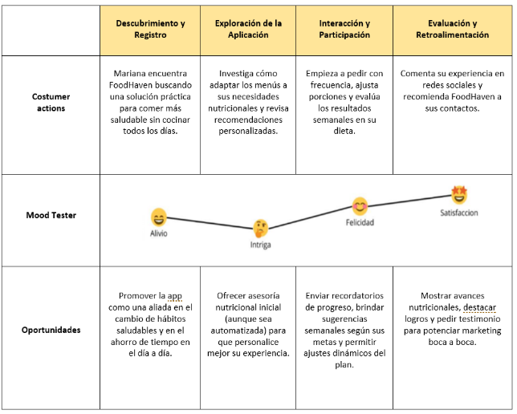
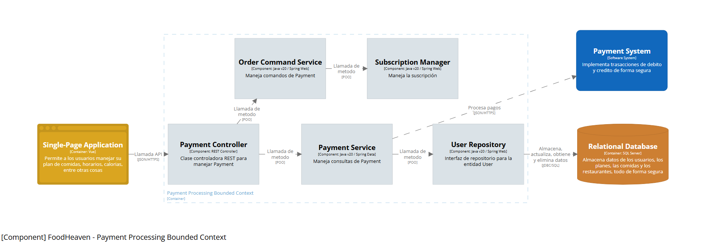
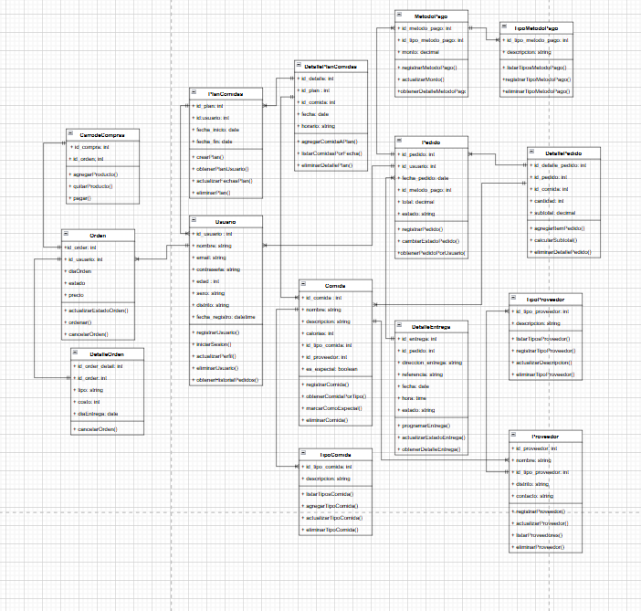
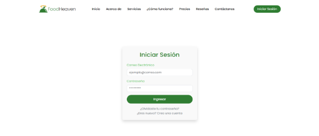

  

<strong>Universidad Peruana de Ciencias Aplicadas</strong>

<strong>Ingeniería de Software</strong> 
Aplicaciones Web  
<strong>Profesor:</strong> Naldo Reupo-Masayon Gastulo

<h2 align="center">INFORME</h2>

<h3 align="center">Startup: EuroCausas</h3>

<strong>Producto: FoodHeaven</strong>

<strong>Ciclo: 2025-10</strong>

<h3 align="center">Team Members:</h3>

| **Member**                           | **Code**     |
|--------------------------------------|--------------|
|Paulo Percy Quincho Gamarra      |  U20191E562  |
|Ricardo Fernando Cardenas Minaya |  U202310004  |
|Santiago Iván Cárdenas Concha    |  U202311207  |
|Luis Piero Rodríguez Rodríguez   |  U202311334  |
|Luis Gustavo Román Pajuelo       |  U202123373  |
|Santiago Manuel Suárez Romero    |  U202311532  |

<strong>Junio, 2025</strong>

# Registro de Versiones del Informe
| Versión | Fecha       | Autor(es)                                                              | Descripción                                                                                                                                         |
|---------|-------------|------------------------------------------------------------------------|-----------------------------------------------------------------------------------------------------------------------------------------------------|
| TB1     | 25/03/2025  | Santiago Iván Cárdenas Concha, Luis Piero Rodríguez Rodríguez          | Desarrollo del capítulo I: Introducción                                                                                                             |
|         | 29/03/2025  | Ricardo Fernando Cárdenas Minaya                                       | Desarrollo del capítulo II: Competidores                                                                                                            |
|         | 29/03/2025  | Santiago Iván Cárdenas Concha                                          | Desarrollo del capítulo II: Entrevistas                                                                                                             |
|         | 30/03/2025  | Paulo Percy Quincho Gamarra                                            | Desarrollo del capítulo II: Needfinding                                                                                                             |
|         | 08/04/2025  | Paulo Percy Quincho Gamarra                                            | Desarrollo del capítulo III: To-Be Scenario Mapping y Product Backlog                                                                              |
|         | 10/04/2025  | Paulo Percy Quincho Gamarra, Luis Gustavo Román Pajuelo                | Desarrollo del capítulo III: User stories                                                                                                           |
|         | 12/04/2025  | Luis Piero Rodríguez Rodríguez                                         | Desarrollo del capítulo III: Impact Mapping                                                                                                         |
|         | 14/04/2025  | Paulo Percy Quincho Gamarra, Ricardo Fernando Cárdenas Minaya          | Desarrollo del capítulo IV: Style Guidelines, Landing Page UI Design, Web Applications UX/UI Design, Web Application Prototyping y Domain-Driven Software Architecture |
|         | 16/04/2025  | Santiago Manuel Suárez Romero                                          | Desarrollo del capítulo IV: Software Object-Oriented Design y Database Design                                                                      |
|         | 18/04/2025  | Santiago Manuel Suárez Romero                                          | Desarrollo del capítulo V: Software Configuration Management                                                                                       |
|         | 20/04/2025  | Luis Gustavo Román Pajuelo, Luis Piero Rodríguez Rodríguez             | Desarrollo del capítulo V: Sprint Planning 1                                                                                                        |
| TP1     | 14/05/2025  | Santiago Iván Cárdenas Concha, Luis Piero Rodríguez Rodríguez, Paulo Percy Quincho Gamarra, Luis Gustavo Román Pajuelo, Ricardo Fernando Cárdenas Minaya, Santiago Manuel Suárez Romero            | Desarrollo de sprint 2                                                                                                  |
| TB2     | 20/06/2025  | Santiago Iván Cárdenas Concha, Luis Piero Rodríguez Rodríguez, Paulo Percy Quincho Gamarra, Luis Gustavo Román Pajuelo, Ricardo Fernando Cárdenas Minaya, Santiago Manuel Suárez Romero            | Desarrollo de sprint 3                                                                                                  |
# Project Report Collaboration Insights
Link del repositorio: https://github.com/1ASI0730-2510-4371-G03-FoodHaven/Report

Insights (Todos participaron):

  

  

# Contenido
- [Registro de Versiones del Informe](#registro-de-versiones-del-informe)
- [Project Report Collaboration Insights](#project-report-collaboration-insights)
- [Student Outcome](#student-outcome)

## Capítulo I: Introducción
- [1.1 Start-up Profile](#11-start-up-profile)
  - [1.1.1. Descripción de la Startup](#111-descripción-de-la-startup)
  - [1.1.2. Perfiles de integrantes del equipo](#112-perfiles-de-integrantes-del-equipo)
- [1.2. Solution Profile](#12-solution-profile)
  - [1.2.1 Antecedentes y problemática](#121-antecedentes-y-problemática)
  - [1.2.2 Lean UX Process](#122-lean-ux-process)
    - [1.2.2.1. Lean UX Problem Statements](#1221-lean-ux-problem-statements)
    - [1.2.2.2. Lean UX Assumptions](#1222-lean-ux-assumptions)
    - [1.2.2.3. Lean UX Hypothesis Statements](#1223-lean-ux-hypothesis-statements)
    - [1.2.2.4. Lean UX Canvas](#1224-lean-ux-canvas)
- [1.3. Segmentos objetivo](#13-segmentos-objetivo)

## Capítulo II: Requirements Elicitation & Analysis
- [2.1. Competidores](#21-competidores)
  - [2.1.1. Análisis competitivo](#211-análisis-competitivo)
  - [2.1.2. Estrategias y tácticas frente a competidores](#212-estrategias-y-tácticas-frente-a-competidores)
- [2.2. Entrevistas](#22-entrevistas)
  - [2.2.1. Diseño de entrevistas](#221-diseño-de-entrevistas)
  - [2.2.2. Registro de entrevistas](#222-registro-de-entrevistas)
  - [2.2.3. Análisis de entrevistas](#223-análisis-de-entrevistas)
- [2.3. Needfinding](#23-needfinding)
  - [2.3.1. User Personas](#231-user-personas)
  - [2.3.2. User Task Matrix](#232-user-task-matrix)
  - [2.3.3. User Journey Mapping](#233-user-journey-mapping)
  - [2.3.4. Empathy Mapping](#234-empathy-mapping)
  - [2.3.5. As-is Scenario Mapping](#235-as-is-scenario-mapping)
- [2.4. Ubiquitous Language](#24-ubiquitous-language)

## Capítulo III: Requirements Specification
- [3.1. To-Be Scenario Mapping](#31-to-be-scenario-mapping)
- [3.2. User Stories](#32-user-stories)
- [3.3. Impact Mapping](#33-impact-mapping)
- [3.4. Product Backlog](#34-product-backlog)

## Capítulo IV: Product Design
- [4.1. Style Guidelines](#41-style-guidelines)
  - [4.1.1. General Style Guidelines](#411-general-style-guidelines)
  - [4.1.2. Web Style Guidelines](#412-web-style-guidelines)
- [4.2. Information Architecture](#42-information-architecture)
  - [4.2.1. Organization Systems](#421-organization-systems)
  - [4.2.2. Labeling Systems](#422-labeling-systems)
  - [4.2.3. SEO Tags and Meta Tags](#423-seo-tags-and-meta-tags)
  - [4.2.4. Searching Systems](#424-searching-systems)
  - [4.2.5. Navigation Systems](#425-navigation-systems)
- [4.3. Landing Page UI Design](#43-landing-page-ui-design)
  - [4.3.1. Landing Page Wireframe](#431-landing-page-wireframe)
  - [4.3.2. Landing Page Mock-up](#432-landing-page-mock-up)
- [4.4. Web Applications UX/UI Design](#44-web-applications-uxui-design)
  - [4.4.1. Web Applications Wireframes](#441-web-applications-wireframes)
  - [4.4.2. Web Applications Wireflow Diagrams](#442-web-applications-wireflow-diagrams)
  - [4.4.2. Web Applications Mock-ups](#442-web-applications-mock-ups)
  - [4.4.3. Web Applications User Flow Diagrams](#443-web-applications-user-flow-diagrams)
- [4.5. Web Applications Prototyping](#45-web-applications-prototyping)
- [4.6. Domain-Driven Software Architecture](#46-domain-driven-software-architecture)
  - [4.6.1. Software Architecture Context Diagram](#461-software-architecture-context-diagram)
  - [4.6.2. Software Architecture Container Diagrams](#462-software-architecture-container-diagrams)
  - [4.6.3. Software Architecture Components Diagrams](#463-software-architecture-components-diagrams)
- [4.7. Software Object-Oriented Design](#47-software-object-oriented-design)
  - [4.7.1. Class Diagrams](#471-class-diagrams)
  - [4.7.2. Class Dictionary](#472-class-dictionary)
- [4.8. Database Design](#48-database-design)
  - [4.8.1. Database Diagram](#481-database-diagram)

  ## Capítulo V: Product Implementation, Validation & Deployment
- [5.1. Software Configuration Management](#51-software-configuration-management)
  - [5.1.1. Software Development Environment Configuration](#511-software-development-environment-configuration)
  - [5.1.2. Source Code Management](#512-source-code-management)
  - [5.1.3. Source Code Style Guide & Conventions](#513-source-code-style-guide--conventions)
  - [5.1.4. Software Deployment Configuration](#514-software-deployment-configuration)
- [5.2. Landing Page, Services & Applications Implementation](#52-landing-page-services--applications-implementation)
  - [5.2.1. Sprint 1](#52x-sprint)
    - [5.2.1.1. Sprint Planning 1](#5211-sprint-planning-n)
    - [5.2.1.2. Sprint Backlog 1](#52x2-sprint-backlog-n)
    - [5.2.1.3. Development Evidence for Sprint Review](#5213-development-evidence-for-sprint-review)
    - [5.2.1.4. Testing Suite Evidence for Sprint Review](#5214-testing-suite-evidence-for-sprint-review)
    - [5.2.1.5. Execution Evidence for Sprint Review](#5215-execution-evidence-for-sprint-review)
    - [5.2.1.6. Services Documentation Evidence for Sprint Review](#5216-services-documentation-evidence-for-sprint-review)
    - [5.2.1.7. Software Deployment Evidence for Sprint Review](#5217-software-deployment-evidence-for-sprint-review)
    - [5.2.1.8. Team Collaboration Insights during Sprint](#5218-team-collaboration-insights-during-sprint)
  - [5.2.2. Sprint 2	](#5.2.2.-sprint-2)
    - [5.2.2.1. Sprint Planning ](#5.2.2.1.-sprint-planning-2.)
    - [5.2.2.2. Aspect Leaders and Collaborators.	](#5.2.2.2.-aspect-leaders-and-collaborators.)
    - [5.2.2.3. Sprint Backlog 2\.	](#5.2.2.3.-sprint-backlog-2.)
    - [5.2.2.4. Development Evidence for Sprint Review.	](#5.2.2.4.-development-evidence-for-sprint-review.)
    - [5.2.2.5. Execution Evidence for Sprint Review.	](#5.2.2.5.-execution-evidence-for-sprint-review.)
    - [5.2.2.6. Services Documentation Evidence for Sprint Review.	](#5.2.2.6.-services-documentation-evidence-for-sprint-review.)
    - [5.2.2.7. Software Deployment Evidence for Sprint Review.	](#5.2.2.7.-software-deployment-evidence-for-sprint-review.)
    - [5.2.2.8. Team Collaboration Insights during Sprint.	](#5.2.2.8.-team-collaboration-insights-during-sprint.)
  - [5.2.3. Sprint 3	](#5.2.3.-sprint-3)
    - [5.2.3.1. Sprint Planning ](#5.2.3.1.-sprint-planning)
    - [5.2.3.2. Aspect Leaders and Collaborators.	](#5.2.3.2.-aspect-leaders-and-collaborators)
    - [5.2.3.3. Sprint Backlog 3\.	](#5.2.3.3.-sprint-backlog-3)
    - [5.2.3.4. Development Evidence for Sprint Review.	](#5.2.3.4.-development-evidence-for-sprint-review)
    - [5.2.3.5. Execution Evidence for Sprint Review.	](#5.2.3.5.-execution-evidence-for-sprint-review)
    - [5.2.3.6. Services Documentation Evidence for Sprint Review.	](#5.2.3.6.-services-documentation-evidence-for-sprint-review)
    - [5.2.3.7. Software Deployment Evidence for Sprint Review.	](#5.2.3.7.-software-deployment-evidence-for-sprint-review)
    - [5.2.3.8. Team Collaboration Insights during Sprint.	](#5.2.3.8.-team-collaboration-insights-during-sprint)
  - [5.3. Validation Interviews](#5.3.-validation-interviews)
    - [5.3.1. Diseño de Entrevistas](#5.3.1.-diseño-de-entrevistas)
    - [5.3.2. Registro de Entrevistas](#5.3.2.-registro-de-entrevistas)
    - [5.3.3. Evaluaciones según heurísticas](#5.3.3.-evaluaciones-según-heurísticas)
  - [5.4. Video About-the-Product](#5.4.-video-about-the-product)
  ## [Conclusiones](conclusiones)

  ## [Bibliografia](bibliografia)

  ## [Anexos](anexos)

# Student Outcome
| Criterio específico | Acciones realizadas | Conclusiones |
|---------------------|---------------------|--------------|
| Participa en equipos multidisciplinarios con eficacia, eficiencia y objetividad, en el marco de un proyecto en soluciones de ingeniería de software. | **Santiago Iván Cárdenas Concha** (TB1): Durante el desarrollo del TB1, mi principal aporte fue la realización de los impact maps de nuestro negocio. Asimismo, desarrollé una primera versión del Landing Page de nuestro producto, la cuál sirvió al equipo para poder hacer las modificaciones necesarias.    **Ricardo Fernando Cárdenas Minaya** (TB1): En la elaboración del TB1, redacté las historias de usuario, colaboré en el desarrollo del landing page, así como en las secciones finales del capítulo 5 y revisión del documento.    **Paulo Percy Quincho Gamarra** (TB1): En la presentación de TB1 desarrollé el Needfinding de los segmentos objetivos y el To-Be Scenario Mapping. Asimismo, redacté las historias de usuario y me ocupé de organizar el control de proyectos con Trello. Por otro lado, desarrollé el diseño del producto de landing page y aplicación web y los diagramas C4.    **Luis Piero Zinadine Rodríguez Rodríguez** (TB1): Ayudé en la coordinación del equipo para llevar a cabo un correcto desarrollo del TB1 en el cuál desarrollé en su totalidad el capítulo 1 del informe. Asimismo, participé en el desarrollo colaborativo del diagrama UML y de bases de datos, así como de varias secciones del capítulo 5 y revisión general del contenido desarrollado.    **Luis Gustavo Román Pajuelo** (TB1): Para la realización del TB1, me encargué de la elaboración de los Wireframes, tanto para el landing page como para la versión Mobile. De igual forma, me encargué de elaborar los Mockups y Prototipos de la versión Mobile.    **Santiago Manuel Suárez Romero** (TB1): La herramienta Figma para el diseño del landing page y aplicaciones web resulta ser una herramienta sumamente útil al momento de diseñar prototipos previos al desarrollo gracias a sus funciones colaborativas en tiempo real y la conformación de proyectos organizados con la función de organizaciones. | Se reafirma la importancia de la comunicación a la hora de hacer las entrevistas a los diferentes segmentos objetivo que hemos definido.    Es indispensable conocer a nuestro segmento objetivo para poder darle un producto acorde a sus necesidades y que tengan una buena experiencia de usuario al ser clientes nuestros.    El desarrollo del product backlog permite tener un mejor control sobre el flujo de trabajo en equipos colaborativos. Asimismo, permite a los desarrolladores tener un panorama general y claro sobre lo que se busca desarrollar para el sprint actual.    En una entrevista acerca de nuestra aplicación, es fundamental estar abiertos a críticas y opiniones sinceras. Al escuchar activamente a los usuarios y permitirles expresar sus puntos de vista, podemos identificar áreas de mejora y realizar ajustes para satisfacer mejor sus necesidades. La retroalimentación constructiva es una oportunidad valiosa para fortalecer nuestra aplicación y brindar una experiencia de usuario excepcional.    El video about the team nos ha permitido realizar una autoevaluación del proceso de trabajo y rescatar puntos de mejora que podemos aplicar en futuros proyectos. |
| Conoce al menos un sector empresarial o dominio de aplicación de soluciones de software. | **Santiago Iván Cárdenas Concha** (TB1): Coordiné y realicé una entrevista con uno de los miembros de nuestros segmentos objetivos, garantizando obtener toda la información posible para el proyecto. También dediqué tiempo a revisar las user stories definidas entre el equipo.    **Ricardo Fernando Cárdenas Minaya** (TB1): Redacté las historias de usuario para cada segmento objetivo y el Product Backlog, de esta manera se prioriza las funcionalidades que debe tener nuestra aplicación web para ofrecerles un producto de calidad a nuestros clientes.    **Paulo Percy Quincho Gamarra** (TB1): Realicé una entrevista al segmento objetivo y colaboré en el análisis de entrevistas para postulantes.    **Luis Piero Zinadine Rodríguez Rodríguez** (TB1): Desarrollé el diseño de entrevistas y registro de las mismas para 3 entrevistados que pertenecen al segmento objetivo de reclutador. Por lo que, adquirí un mejor conocimiento del sector de reclutamiento en el área de recursos humanos de una empresa. Asimismo, realicé el análisis de las entrevistas dónde se me permitió conocer (de manera más resumida) cómo se llevan a cabo las diferentes actividades de los reclutadores y cómo se siente el reclutador al afrontar un proceso de reclutamiento.    **Luis Gustavo Román Pajuelo** (TB1): Me encargué de la búsqueda de posibles competidores de nuestra start-up. Es así que se desarrolló un análisis de cada uno de esos para compararlo con lo que nuestro proyecto propone. De igual forma, realicé una de las entrevistas al segmento objetivo de postulantes y redacté su análisis.    **Santiago Manuel Suárez Romero** (TB1): El procedimiento de recopilación de información demostró los diferentes puntos de vista de nuestros usuarios en potencia, permitiendo así construir los elementos necesarios para un proyecto más sólido para nuestro objetivo principal. | La construcción de los diferentes mapas con diferentes plataformas ayuda a mejorar nuestras capacidades y expandir nuestras habilidades.    Realizar la priorización de requisitos y tareas que la aplicación debe contener es fundamental, ya que el equipo sabrá qué es lo que se tiene que entregar en primer lugar.    La comunicación interna del equipo resulta de vital importancia para mantener un correcto flujo de desempeño y lograr que todos puedan cumplir con los objetivos actuales.    La retroalimentación de los usuarios en la entrevista ha sido valiosa para mejorar nuestra aplicación y cumplir con sus necesidades. La comunicación interna y la priorización de tareas son clave para un desarrollo exitoso.    El video about the product nos permitirá presentar un demo de nuestro producto a nuestros clientes potenciales, por lo que resulta indispensable al ser una primera vista de la aplicación.    Incluir un testimonio personal en el video "About the Team" resalta las actividades y esfuerzos del proyecto, aportando una perspectiva humana y real. Es una oportunidad para compartir experiencias, desafíos superados, colaboración en equipo y aprendizajes obtenidos. |
| Participa en equipos multidisciplinarios con eficacia, eficiencia y objetividad, en el marco de un proyecto en soluciones de ingeniería de software. | El equipo avanzó el apartado frontend de la aplicación | La construcción de los diferentes mapas con diferentes plataformas ayuda a mejorar nuestras capacidades y expandir nuestras habilidades.    Realizar la priorización de requisitos y tareas que la aplicación debe contener es fundamental, ya que el equipo sabrá qué es lo que se tiene que entregar en primer lugar.    La comunicación interna del equipo resulta de vital importancia para mantener un correcto flujo de desempeño y lograr que todos puedan cumplir con los objetivos actuales.    La retroalimentación de los usuarios en la entrevista ha sido valiosa para mejorar nuestra aplicación y cumplir con sus necesidades. La comunicación interna y la priorización de tareas son clave para un desarrollo exitoso.    El video about the product nos permitirá presentar un demo de nuestro producto a nuestros clientes potenciales, por lo que resulta indispensable al ser una primera vista de la aplicación.    Incluir un testimonio personal en el video "About the Team" resalta las actividades y esfuerzos del proyecto, aportando una perspectiva humana y real. Es una oportunidad para compartir experiencias, desafíos superados, colaboración en equipo y aprendizajes obtenidos. |

# Project: FoodHaven
# Capítulo 1: Introduction
## 1.1 Startup Profile

### 1.1.1.  Descripción de la Startup

EuroCausas es una startup liderada por estudiantes de la Universidad Peruana de Ciencias Aplicadas (UPC), dedicada a transformar la forma en que las personas organizan sus comidas diarias a través de soluciones digitales prácticas y personalizadas. Con el objetivo de brindar una alternativa eficiente y accesible para la gestión alimentaria, se ha desarrollado el proyecto FoodHaven, una innovadora plataforma web que facilita la organización de comidas semanales mediante un sistema de suscripción flexible.
En EuroCausas, creemos que la buena alimentación es clave para una vida equilibrada, productiva y saludable. Sabemos que muchas personas enfrentan el desafío del tiempo y la planificación, por ello FoodHeaven busca convertirse en el aliado ideal para quienes desean resolver sus comidas de manera práctica, sin renunciar a la calidad ni al sabor. La plataforma permite combinar planes personalizados, reservar comidas especiales, elegir horarios de entrega y llevar un control nutricional mediante funciones como el contador de calorías.

- **Nombre:** FoodHaven  
- **Misión:** Facilitar la organización de comidas semanales en Perú a través de una plataforma digital intuitiva, conectando a usuarios con una red diversa de proveedores de comida bajo un modelo de suscripción personalizado. FoodHeaven busca ofrecer una experiencia práctica y saludable, adaptada a los ritmos de vida modernos.
- **Visión:** Convertirse en la plataforma líder en Perú para la planificación y entrega de comidas personalizadas, promoviendo una alimentación organizada, saludable y accesible. Aspiramos a construir una comunidad de usuarios que valoran su tiempo, bienestar y calidad de vida, revolucionando la forma en que se gestionan las comidas en el día a día.
- **Valores:** Transparencia, simplicidad y colaboración.  

##  Perfiles de Integrantes del Grupo

| Foto                          | Información                                                                 |
|-------------------------------|------------------------------------------------------------------------------|
|  | **Nombre:** Paulo Percy Quincho Gamarra  
**Código de estudiante:** U20191E562  
**Carrera:** Ingeniería de Software  
**Descripción:**  
Soy puntual, lo que me permite realizar todos los trabajos a tiempo. Me gusta tener buena comunicación con el equipo. |
|  | **Nombre:** Santiago Iván Cárdenas Concha  
**Código de estudiante:** U202311207  
**Carrera:** Ingeniería de Software
**Descripción:**
Soy responsable, creativo y siempre trato de apoyar al equipo en todo hasta el final.
|  | **Nombre:** Santiago Manuel Suárez Romero 
**Código de estudiante:** U202311532  
**Carrera:** Ingenieria de Software  
**Descripción:**  
Soy una persona amigable, trabajadora y creativa, cuando trabajo siempre trato de dar lo mejor de mi.
|  | **Nombre:** Luis Piero Rodríguez Rodríguez 
**Código de estudiante:** U202311334
**Carrera:** Ingeniería de Software  
**Descripción:**  
Soy una persona optimista, dedicada y que trata de mejorar |
|  | **Nombre:** Ricardo Fernando Cardenas Minaya  
**Código de estudiante:** U202310004  
**Carrera:** Ingenieria de Software
**Descripción:**
Soy creativo y dedicado en lo que hago. Estoy comprometido a dar lo mejor de mí para lograr buenos resultados  
|  | **Nombre:** Luis Gustavo Román Pajuelo
**Código de estudiante:** U202123373 
**Carrera:** Ingeniería de Software  
**Descripción:**
Soy responsable y siempre busco cumplir mis objetivos.

## 1.2  Solution Profile

FoodHeaven es una aplicación web diseñada para transformar la manera en que las personas planifican y disfrutan sus comidas diarias. A través de una plataforma intuitiva y flexible, permite a los usuarios organizar su alimentación semanal mediante planes de suscripción personalizados, adaptados a sus gustos, necesidades y horarios.
La plataforma ofrece una amplia variedad de opciones para desayuno, almuerzo y cena, así como la posibilidad de reservar comidas especiales para ocasiones únicas. Además, conecta a los usuarios con una red diversa de proveedores, como restaurantes y cocineros independientes, funcionando como un intermediario que garantiza calidad, variedad y puntualidad.
Con el objetivo de simplificar la rutina alimentaria y promover una alimentación consciente, FoodHeaven también incorpora funciones como un contador de calorías, ofreciendo una experiencia completa, saludable y adaptada al ritmo de vida moderno.
FoodHeaven busca convertirse en el aliado ideal para personas con agendas ocupadas, brindando una solución práctica y personalizada en un entorno digital moderno.

### 1.2.1  Antecedentes y Problemática

Para comprender con mayor claridad las necesidades de los usuarios, es esencial realizar un análisis de antecedentes y problemáticas utilizando la técnica de las 5W’s y 2H’s. Según Lean Construction México, esta herramienta resulta fundamental para definir y desarrollar un plan estratégico (Álvarez, 2020). La información que se presenta a continuación ha sido obtenida aplicando dicha metodología.
Las dos preguntas correspondientes a la letra "H" en la técnica “5W+2H” hacen referencia a “¿Cómo?” y “¿Cuánto?”. La pregunta “¿Cómo?” se centra en identificar de qué manera se llevan a cabo las acciones, lo cual resulta esencial para analizar y explicar cualquier situación. En el caso de FoodHeaven, esta pregunta nos permitirá explorar cómo lograremos captar el interés de personas con agendas ocupadas y cómo facilitaremos la conexión con proveedores de comida, como restaurantes y cocineros independientes. Por otro lado, la pregunta “¿Cuánto?” tiene como finalidad cuantificar la problemática y evaluar su dimensión. En este contexto, utilizaremos datos y estadísticas que nos ayuden a comprender mejor los hábitos alimenticios de nuestro público objetivo, la frecuencia con la que enfrentan dificultades para organizar sus comidas y el impacto económico que podría tener una solución como FoodHeaven en su día a día.

### 5W2H

| **Categoría** | **Pregunta** | **Respuesta** |
|--------------|--------------|---------------|
| **What (¿Qué?)** | ¿Cuál es el problema? | En Perú, muchas personas tienen dificultades para planificar y consumir comidas saludables debido a la falta de tiempo, planificación alimentaria y acceso a servicios adecuados. Aunque hay preocupación por la salud, no existen suficientes herramientas que faciliten una dieta equilibrada. FoodHeaven surge como solución digital para conectar usuarios con proveedores confiables mediante planes personalizados. |
| | ¿Cuál es la relación con la persona en cuestión? | Personas que buscan una solución práctica y saludable para organizar su alimentación diaria, eliminando barreras de tiempo, planificación y acceso a comidas equilibradas. |
| **When (¿Cuándo?)** | ¿Cuándo ocurre el problema? | Cuando las personas con rutinas exigentes intentan organizar sus comidas, pero no cuentan con tiempo, opciones adecuadas o herramientas que apoyen sus decisiones nutricionales. |
| | ¿Cuándo utiliza el cliente el producto? | Cuando necesita organizar sus comidas sin complicaciones, gracias a funciones como suscripciones, horarios personalizados y seguimiento nutricional. |
| **Where (¿Dónde?)** | ¿Dónde está el cliente cuando usa el producto? | En casa, en el trabajo o en movimiento, gracias a que FoodHeaven es una aplicación web accesible desde cualquier dispositivo. |
| | ¿A dónde se dirige? | Hacia un estilo de vida más saludable, práctico y organizado con mejor control sobre su alimentación diaria. |
| | ¿Dónde surge el problema? | En hogares y espacios de trabajo donde el ritmo de vida impide planificar comidas saludables, y hay poco acceso a opciones nutritivas. |
| **Who (¿Quién?)** | ¿Quiénes están involucrados? | Personas con agendas ocupadas, usuarios interesados en mejorar su dieta y proveedores de comida (restaurantes o cocineros independientes). |
| | ¿A quiénes les sucede el problema? | A profesionales, estudiantes y trabajadores que no tienen tiempo ni herramientas para una alimentación saludable. También afecta a quienes quieren mejorar su dieta sin saber cómo hacerlo. |
| | ¿Quién lo utilizará? | Personas con rutinas ocupadas, o que valoran la comodidad y personalización en su alimentación. |
| **Why (¿Por qué?)** | ¿Cuál es la causa del problema? | Falta de tiempo, escasa educación alimentaria, inseguridad alimentaria y accesibilidad limitada a alimentos saludables. Esto lleva a una mala alimentación y enfermedades crónicas como obesidad y diabetes. |
| **How (¿Cómo?)** | ¿En qué condiciones nuestros clientes usan el producto? | Desde casa, el trabajo o en tránsito, usando cualquier dispositivo. Lo usan para planificar su semana, seguir una dieta o evitar el estrés de cocinar. |
| | ¿Cómo nos conocieron los compradores? | Por redes sociales, colaboraciones con influencers, y publicidad en gimnasios, universidades y coworkings. |
| | ¿Cómo prefieren los lectores acceder a nuestro contenido? | A través de la aplicación web desde sus dispositivos, valorando la experiencia simple, rápida y personalizada. |
| | ¿Qué llevó a la persona a llegar a esta situación? | Falta de tiempo para cocinar, desinformación sobre nutrición, alimentos saludables costosos, y normalización de patrones alimenticios poco nutritivos. |
| **How much (¿Cuánto?)** | Estadísticas que sustentan la problemática | - 49 % de peruanos siguen dietas bajas en grasa.   - 17 millones no pueden garantizar sus comidas diarias (FAO 2023).   - Mercado de delivery superará los $1.94 mil millones en 2025 (Statista 2024).   - La comida saludable es menos accesible y más cara (UNICEF 2022). |

### 1.2.2 Lean UX Process

El enfoque Lean UX se centra en el trabajo colaborativo para desarrollar productos de calidad, poniendo como prioridad la mejora de la experiencia del usuario y la satisfacción del cliente por encima de un diseño completamente perfeccionado. Esta metodología facilita una comprensión profunda de los objetivos del negocio, permitiendo integrar ideas de forma flexible y generar soluciones más eficaces (Lean UX y Lean Startup: potencia experiencia y diseño de producto, 2023).

#### 1.2.2.1. Lean UX Problem Statements

FoodHeaven es una plataforma que busca combinar la practicidad de un servicio de entrega con la personalización de una planificación alimentaria saludable. Más que un sistema de pedidos, su propósito es facilitar la organización de comidas semanales, promover una alimentación equilibrada y construir una comunidad de usuarios conectados con su bienestar y nutrición.
Actualmente, la alimentación diaria enfrenta múltiples desafíos. La falta de tiempo, la sobrecarga de responsabilidades, el desconocimiento nutricional y la limitada oferta de servicios accesibles y personalizados dificultan que las personas puedan alimentarse de forma organizada y saludable. Además, los usuarios experimentan una gestión fragmentada de sus comidas, debiendo alternar entre apps de delivery, redes sociales y consultas nutricionales sin una solución centralizada que se ajuste a sus horarios, gustos y objetivos alimenticios.
¿Cómo podemos mejorar la experiencia digital de planificación alimentaria para facilitar el acceso a comidas personalizadas, promover una alimentación saludable y conectar a los usuarios con una red confiable de proveedores en una plataforma flexible, intuitiva y adaptada a su ritmo de vida?

#### 1.2.2.2. Lean UX Assumptions

##### 1.2.2.2.1 Resultados del usuario
Los usuarios de FoodHeaven esperan una solución que les permita organizar y personalizar sus comidas semanales de forma rápida, sencilla y saludable. Buscan tener acceso a menús variados adaptados a sus preferencias alimenticias, restricciones dietéticas y horarios, todo desde una plataforma intuitiva que les ahorre tiempo y esfuerzo en la toma de decisiones diarias.  
Además, desean contar con funcionalidades adicionales como el seguimiento de dietas, el contador de calorías, y la flexibilidad en la elección de horarios de entrega, con la tranquilidad de que están accediendo a opciones confiables y de calidad, proporcionadas por una red diversa de restaurantes y cocineros independientes.  
El resultado esperado es una experiencia de usuario fluida y personalizada que permita mantener una alimentación equilibrada sin complicaciones. Esto se traduce en una mejora en su bienestar general, una reducción del estrés relacionado con la planificación alimentaria, y una mayor motivación para adoptar hábitos alimenticios sostenibles en el tiempo.

##### 1.2.2.2.2 Features
- Planes de comida personalizados (desayuno, almuerzo, cena y combinaciones adaptadas).
- Selección flexible de horarios de entrega.
- Contador de calorías integrado.
- Sistema de reservas para comidas especiales (eventos, celebraciones, etc.).
- Recomendaciones automatizadas basadas en preferencias, historial y objetivos nutricionales.
- Conexión con una red de proveedores verificados (restaurantes y cocineros independientes).
- Panel de control del usuario con historial de consumo.
- Interfaz web intuitiva y accesible desde múltiples dispositivos.

##### 1.2.2.2.3 Business Outcomes
- **Promover una alimentación organizada y saludable**: El objetivo principal de FoodHeaven es ayudar a las personas a mejorar su rutina alimentaria mediante una plataforma que simplifique la organización de comidas semanales a través de planes personalizados, recomendaciones automatizadas y funciones como el contador de calorías.
- **Generación de ingresos**: Mediante un modelo de negocio basado en suscripciones, FoodHeaven podrá generar ingresos recurrentes que permitan escalar y mejorar el servicio. Estos fondos serán reinvertidos en el perfeccionamiento de la plataforma, ampliación de la red de proveedores, incorporación de contenido educativo nutricional y desarrollo de nuevas funcionalidades centradas en la experiencia del usuario.
- **Diferenciación en el mercado**: Gracias a sus características únicas —como la personalización de planes, la reserva de comidas especiales y la conexión con una red de cocineros y restaurantes verificados— FoodHeaven se posiciona como una alternativa innovadora frente a aplicaciones tradicionales de delivery. Su enfoque en salud, flexibilidad y bienestar la convierte en una propuesta de valor diferenciada.
- **Formación de alianzas estratégicas**: La plataforma ofrece oportunidades para establecer asociaciones comerciales con restaurantes, nutricionistas, cocineros independientes y empresas del rubro alimenticio. Estas alianzas no solo permitirán diversificar la oferta dentro de la plataforma, sino también ampliar el alcance del servicio a nuevos públicos y fortalecer la marca en el mercado local.

##### 1.2.2.2.4 User Benefits
- Acceso a una amplia variedad de opciones alimenticias desde una sola plataforma, permitiendo planificar, personalizar y recibir comidas de forma rápida, saludable y sencilla.
- Mejora de hábitos alimenticios gracias al seguimiento de dietas, contador de calorías y recomendaciones automáticas adaptadas a los objetivos, preferencias y estilo de vida del usuario.
- Planes personalizados según horarios, necesidades nutricionales y restricciones alimentarias, facilitando una experiencia alimentaria única, eficiente y sin complicaciones.
- Conexión directa con una red de proveedores verificados, como cocineros independientes y restaurantes, lo que garantiza variedad, calidad y confianza en cada comida.
- Acceso multiplataforma desde cualquier dispositivo con conexión a internet, pensado para personas con agendas ocupadas que valoran la flexibilidad y la comodidad.
- Ahorro de tiempo y esfuerzo en la planificación y organización de comidas, centralizando en una sola plataforma todo el proceso: desde la selección del menú hasta la entrega.

##### 1.2.2.2.5 ¿Quién es el usuario?
El usuario de FoodHeaven es una persona que valora la practicidad, el bienestar y la buena alimentación en su día a día. Está motivado por el deseo de mantener una dieta equilibrada sin tener que invertir demasiado tiempo en planificar, cocinar o decidir qué comer.  
Estos usuarios suelen tener agendas ocupadas —ya sea por trabajo, estudio u otras responsabilidades— y buscan soluciones digitales que se adapten a su estilo de vida. Valoran especialmente la personalización, el acceso rápido a comidas saludables, y la posibilidad de elegir opciones según sus gustos, objetivos y horarios.  
Además, muchos de ellos están interesados en mejorar sus hábitos alimenticios, por lo que encuentran en FoodHeaven una herramienta flexible y confiable para facilitar su rutina alimentaria.

##### 1.2.2.2.6 ¿Dónde encaja nuestro producto en su trabajo o vida?
FoodHeaven encaja en la vida de sus usuarios como una herramienta accesible, práctica y flexible que les permite organizar su alimentación diaria sin complicaciones. Se integra de forma natural en su rutina, ya sea durante el trabajo, el estudio o el tiempo libre, facilitando la planificación y el consumo de comidas saludables y personalizadas.  
La plataforma se convierte en una aliada esencial para quienes tienen agendas apretadas, ayudándoles a ahorrar tiempo, reducir el estrés por la toma de decisiones alimenticias y mantener una dieta equilibrada sin tener que cocinar o buscar opciones cada día. FoodHeaven no solo simplifica su vida diaria, sino que también promueve el bienestar, la eficiencia y el autocuidado como parte de su estilo de vida.

##### 1.2.2.2.7 ¿Cuándo y cómo es usado nuestro producto?
FoodHeaven es utilizado principalmente en momentos clave de la rutina diaria, como al comenzar la semana, al planificar las comidas del día o al buscar una opción práctica para alimentarse sin necesidad de cocinar. Los usuarios acceden a la plataforma cuando desean ahorrar tiempo, comer de forma saludable o mantener un control sobre su dieta, especialmente en contextos de trabajo, estudio o tiempos reducidos.  
La aplicación permite seleccionar planes de comida, reservar platos especiales, programar horarios de entrega y seguir el progreso nutricional desde cualquier dispositivo. Está diseñada para ser utilizada en cualquier momento del día, ya sea desde la comodidad del hogar, durante una pausa en el trabajo o en el camino a casa. Su interfaz intuitiva permite gestionar las comidas de forma rápida, flexible y personalizada, haciendo que la experiencia se adapte al estilo de vida del usuario y no al revés.

##### 1.2.2.2.8 ¿Qué características son importantes?
- **Planes de comida personalizados**: Permiten a los usuarios crear combinaciones adaptadas a sus necesidades alimenticias, preferencias y horarios. Esta personalización garantiza una experiencia flexible que se ajusta al ritmo de vida de cada persona, mejorando la organización alimentaria y el bienestar diario.
- **Selección flexible de horarios de entrega**: Facilita que los usuarios reciban sus comidas en los momentos más convenientes, ya sea en casa, en el trabajo o en cualquier otro lugar. Esta funcionalidad reduce la incertidumbre y mejora la experiencia logística, adaptándose a rutinas diversas.
- **Contador de calorías**: Esta característica ayuda a fomentar una alimentación más consciente y alineada con las metas personales de salud.
- **Sistema de reservas para comidas especiales**: Ofrece a los usuarios la posibilidad de planificar con anticipación menús únicos para celebraciones, eventos o fechas importantes, asegurando una solución práctica sin comprometer la calidad ni la personalización.
- **Recomendaciones automatizadas**: Un sistema inteligente que sugiere opciones alimenticias basadas en el historial del usuario, sus preferencias y sus metas. Esto agiliza la toma de decisiones y mejora la satisfacción del usuario al sentirse comprendido por la plataforma.
- **Red de proveedores verificados**: Garantiza que los alimentos provengan de cocineros independientes o restaurantes que cumplen con estándares de calidad y confiabilidad. Esta red amplia y diversa enriquece la oferta del servicio y da confianza al consumidor.
- **Panel de control del usuario**: Permite visualizar el historial de consumo, establecer metas alimenticias, y hacer seguimiento al progreso personal. Esta vista centralizada de la información promueve la constancia y el compromiso con una alimentación saludable.
- **Interfaz web intuitiva y multiplataforma**: Diseñada para funcionar fluidamente en celulares, tablets y computadoras, facilita el acceso desde cualquier lugar y en cualquier momento. Esta característica mejora la accesibilidad y promueve el uso frecuente de la plataforma.

##### 1.2.2.2.9 ¿Qué problemas tiene nuestro producto y cómo se pueden resolver?
Uno de los desafíos que podría enfrentar FoodHeaven es la competencia con otras plataformas de delivery o servicios de suscripción alimentaria que ya están posicionadas en el mercado. Si la propuesta de valor o las funcionalidades no resultan lo suficientemente diferenciadoras, los usuarios podrían optar por alternativas más conocidas o accesibles.
Además, podría presentarse el reto de fidelizar al usuario, especialmente si no percibe mejoras en su rutina alimentaria o si encuentra limitaciones en la variedad de opciones disponibles.
Estos problemas se pueden abordar mediante:
La mejora continua de la experiencia de usuario, asegurando una navegación intuitiva, rápida y sin fricciones.

La ampliación constante de la red de proveedores verificados, para ofrecer mayor diversidad en los menús y adaptarse a distintos estilos de alimentación.

- El fortalecimiento de las funcionalidades diferenciadoras, como el sistema de seguimiento de dietas, las recomendaciones automatizadas y la reserva de comidas especiales.
- Con estas acciones, FoodHeaven podrá consolidar su propuesta en el mercado y posicionarse como una solución única, práctica y saludable. usuarios reciban sus comidas en los momentos más convenientes, ya sea en casa, en el trabajo o en cualquier otro lugar. Esta funcionalidad reduce la incertidumbre y mejora la experiencia logística, adaptándose a rutinas diversas.
- Recomendaciones automatizadas: Un sistema inteligente que sugiere opciones alimenticias basadas en el historial del usuario. Esto agiliza la toma de decisiones y mejora la satisfacción del usuario al sentirse comprendido por la plataforma.
- Red de proveedores verificados: Garantiza que los alimentos provengan de cocineros independientes o restaurantes que cumplen con estándares de calidad y confiabilidad. Esta red amplia y diversa enriquece la oferta del servicio y da confianza al consumidor.
- Panel de control del usuario: Permite visualizar el historial de consumo. Esta vista centralizada de la información promueve la constancia y el compromiso con una alimentación saludable.
- Interfaz web intuitiva y multiplataforma: Diseñada para funcionar fluidamente en celulares, tablets y computadoras, facilita el acceso desde cualquier lugar y en cualquier momento. Esta característica mejora la accesibilidad y promueve el uso frecuente de la plataforma.

##### 1.2.2.2.10 ¿Cómo debe verse nuestro producto y cómo debe comportarse?
- **Interfaz de usuario moderna y amigable**: La plataforma de FoodHeaven cuenta con un diseño limpio, visualmente atractivo y fácil de usar, que transmite confianza y bienestar. La información está organizada de forma clara para que los usuarios puedan planificar sus comidas, gestionar pedidos y monitorear su alimentación sin complicaciones, incluso si no tienen experiencia previa con plataformas digitales.
- **Rápido y receptivo**: Todas las acciones dentro de la plataforma —como seleccionar planes de comida, modificar horarios de entrega o hacer reservas especiales— se procesan de manera ágil, permitiendo una experiencia fluida sin demoras. La plataforma responde en tiempo real para mantener la eficiencia que los usuarios con rutinas ocupadas necesitan.
- **Confiable y estable**: FoodHeaven debe garantizar una alta disponibilidad y funcionamiento continuo. Al tratarse de una herramienta de planificación alimentaria diaria, es crucial que los usuarios puedan acceder a sus funcionalidades sin interrupciones o errores técnicos que comprometan la experiencia o la entrega de sus comidas.
- **Segura y protegida**: FoodHeaven implementa protocolos robustos de seguridad para resguardar la información personal y los datos nutricionales de sus usuarios. Esto incluye autenticación segura, cifrado de datos sensibles y monitoreo constante de la plataforma para prevenir accesos no autorizados o vulnerabilidades.

#### 1.2.2.3 Lean UX Hypothesis Statements

1. **Planes de comida personalizados**
   Creemos que, al facilitar el acceso a planes de comida personalizados a través de nuestra aplicación web FoodHeaven, ayudaremos a nuestros usuarios a organizar mejor su alimentación diaria y promoveremos hábitos alimenticios más saludables en personas con rutinas ocupadas.
   
   **Indicador de éxito**: Sabremos que hemos tenido éxito cuando veamos un aumento del 60% en usuarios que completan al menos una semana de planificación continua, utilizando nuestros planes personalizados.

2. **Recomendaciones automatizadas**
   Creemos que, al ofrecer recomendaciones automatizadas basadas en las preferencias alimentarias, mejoraremos su experiencia dentro de la plataforma.
   
   **Indicador de éxito**: Sabremos que hemos tenido éxito cuando al menos un 80% de los usuarios interactúe con las sugerencias personalizadas y seleccione opciones recomendadas por la aplicación.

3. **Accesibilidad multiplataforma**
   Creemos que, al diseñar una aplicación web accesible, rápida y funcional en múltiples dispositivos, facilitaremos la adopción de FoodHeaven entre usuarios de diferentes contextos, permitiendo una experiencia fluida y constante sin importar el lugar o el momento.
   
   **Indicador de éxito**: Sabremos que hemos tenido éxito cuando el 70% de los usuarios activos acceda a la plataforma desde distintos dispositivos y logremos una tasa de retención mensual superior al 65%.

#### 1.2.2.4 Lean UX Canvas

| **Business Problem**       | **Business Question**      | **Solutions**              |
|----------------------------|----------------------------|----------------------------|
| FoodHeaven es una plataforma que combina la conveniencia de un servicio digital con la personalización de planes de comida saludable. Su objetivo es ayudar a las personas con agendas ocupadas a organizar su alimentación semanal, mejorar sus hábitos alimenticios y conectar con proveedores confiables. Ante la falta de tiempo, la escasa planificación alimentaria y la dificultad para acceder a opciones nutritivas, muchas personas recurren a soluciones poco saludables. Además, los usuarios enfrentan una experiencia fragmentada al usar múltiples aplicaciones para pedir comida, planificar dietas o hacer seguimiento nutricional. | ¿Cómo podemos mejorar la experiencia alimentaria digital para facilitar la planificación de comidas, promover hábitos saludables y conectar a los usuarios con una red confiable de proveedores en una plataforma intuitiva y accesible? | 1. Planes de comida personalizados según horarios, gustos y necesidades nutricionales.   2. Selección flexible de horarios de entrega.   3. Contador de calorías integrado.   4. Recomendaciones automatizadas basadas en historial, objetivos y preferencias.   5. Reservas de comidas especiales para eventos o fechas importantes.   6. Conexión con una red verificada de cocineros y restaurantes.   7. Panel de control con historial de consumo.   8. Interfaz web intuitiva, rápida y multiplataforma. |
| **Business Outcomes**      | **Customers**              | **Customer Benefits**      |
| 1. Aumentar el número de suscripciones activas mensuales.   2. Incrementar la retención de usuarios mediante seguimiento de progreso y recomendaciones.   3. Generar alianzas con restaurantes, nutricionistas y cocineros independientes.   4. Posicionar a FoodHeaven como la plataforma líder en alimentación personalizada en Perú. | Adultos jóvenes y adultos con agendas ocupadas, estudiantes universitarios, profesionales y personas que buscan soluciones prácticas para alimentarse mejor. Están interesados en llevar una dieta equilibrada, ahorrar tiempo y recibir recomendaciones que se alineen con sus preferencias y objetivos de salud. Valoran la comodidad, la personalización y el control sobre su alimentación diaria. | 1. Organización eficiente de comidas diarias sin estrés ni pérdida de tiempo.   2. Acceso rápido y confiable a opciones saludables desde cualquier dispositivo.   3. Recomendaciones personalizadas que apoyan sus objetivos nutricionales.    4. Ahorro de tiempo en la planificación y preparación de alimentos. |
| **Hypothesis**             | **What’s the most important thing we need to learn first?** | **What’s the least amount of work we need to do to get there?** |
| 1. Creemos que, al facilitar el acceso a planes de comida personalizados mediante FoodHeaven, ayudaremos a los usuarios a organizar mejor su alimentación diaria y promoveremos hábitos más saludables. Sabremos que hemos tenido éxito cuando veamos un aumento del 60% en usuarios que completan una semana de planificación continua.   2. Creemos que, al ofrecer recomendaciones automatizadas según hábitos alimenticios, historial y objetivos, mejoraremos la experiencia del usuario y su constancia dentro de la plataforma. Sabremos que hemos tenido éxito cuando al menos el 80% de los usuarios interactúe con las sugerencias personalizadas.   3. Creemos que, al diseñar una aplicación web accesible, funcional y multiplataforma, promoveremos una adopción inclusiva y constante. Sabremos que hemos tenido éxito cuando el 70% de los usuarios activos acceda desde diferentes dispositivos y mantenga su actividad semanal. | Debemos entender cómo los usuarios planean sus comidas actualmente y qué barreras enfrentan al intentar mantener una dieta equilibrada. También necesitamos identificar si valoran realmente la personalización, el seguimiento nutricional y las reservas especiales, y cómo perciben la utilidad de centralizar todas estas funciones en una sola plataforma. | 1. Implementar un sistema básico de planes personalizados y recomendaciones.   2. Configurar métricas para medir el uso del sistema de planificación y el nivel de interacción con las recomendaciones.   3. Realizar pruebas con un grupo reducido de usuarios para validar si las funcionalidades actuales cubren sus necesidades y motivaciones.   4. Aplicar encuestas y entrevistas rápidas para saber qué funciones consideran más útiles y si FoodHeaven realmente mejora su alimentación y organización. |

## 1.3 Segmentos Objetivos

### Segmento objetivo 1: Profesionales jóvenes con rutinas exigentes

**Aspectos demográficos:**
- Sexo: Masculino y femenino  
- Edades: 21 - 35 años  
- Nivel socioeconómico: Clases B y C (media-alta y media)

**Aspectos geográficos:**
- Nacionalidad: Peruana  
- Zona geográfica en la que vive: Urbana (principalmente Lima Metropolitana y ciudades principales)

**Aspectos psicográficos:**
-Intereses: Salud y bienestar, organización personal, alimentación balanceada, tecnología y productividad.
-Estilo de vida: Viven a ritmo acelerado, con poco tiempo libre para cocinar o planificar comidas. Buscan servicios digitales que les faciliten la vida y les ayuden a mantener una dieta sana.
-Actitudes: Valoran la practicidad, el control sobre su alimentación y la personalización. Son receptivos a herramientas digitales que los ayuden a mantener rutinas saludables sin esfuerzo adicional.

### Segmento objetivo 2: Personas interesadas en mejorar su alimentación y ahorrar tiempo

**Aspectos demográficos:**
- Sexo: Masculino y femenino  
- Edades: 30 - 50 años  
- Nivel socioeconómico: Clases A, B y C (alta, media-alta y media)
  
**Aspectos geográficos:**
- Nacionalidad: Peruana  
- Zona geográfica en la que vive: Urbana (principalmente Lima Metropolitana y ciudades principales)

**Aspectos psicográficos:**
-Intereses: Alimentación saludable, ahorro de tiempo, planificación del hogar, bienestar personal, cocina práctica.
-Estilo de vida: Profesionales, padres de familia o adultos independientes que valoran el equilibrio entre comodidad y salud. Tienen interés en opciones prácticas para resolver sus comidas sin sacrificar calidad ni nutrición.
-Actitudes: Son conscientes de la importancia de una buena alimentación, pero no siempre tienen el tiempo o los conocimientos para llevarla a cabo. Están abiertos a soluciones digitales que simplifiquen su día a día y mejoren su bienestar general.

# Capítulo 2: Requirements Elicitation & Analysis

## 2.1 Competidores
### 2.1.1 Analisis Competitivo

## Competitive Analysis Landscape
### ¿Por qué llevar a cabo este análisis?
Este análisis es fundamental ya que nos informa sobre el contexto de la competencia. Esto nos permite identificar oportunidades y amenazas, así como áreas potenciales para diferenciarse y destacar en el mercado. También ayuda a identificar fortalezas y debilidades en comparación a sus competidores, lo que puede guiar a mejores decisiones estratégicas. 

## Comparativa de FoodHeaven y Competidores

| **Categoría**                        | **FoodHeaven**                                                                                                                                                       | **Repeat**                                                                                                                                                   | **ManzanaVerde**                                                                                                                                              | **Tappers**                                                                                                                                    |
|-------------------------------------|----------------------------------------------------------------------------------------------------------------------------------------------------------------------|--------------------------------------------------------------------------------------------------------------------------------------------------------------|---------------------------------------------------------------------------------------------------------------------------------------------------------------|------------------------------------------------------------------------------------------------------------------------------------------------|
| **Nombre**                          | FoodHeaven                                                                                                                                                           | Repeat                                                                                                                                                        | ManzanaVerde                                                                                                                                                   | Tappers                                                                                                                                        |
| **Logo**                            |                                                                                                                                                                 |                                                                                                                                                          |                                                                                                                                                           |                                                                                                                                           |
| **Perfil / Overview**              | Plataforma web de suscripción que permite planificar comidas semanales de forma personalizada, conectando a usuarios con cocineros y restaurantes. Ideal para personas con poco tiempo que desean comer bien sin cocinar. | Servicio de suscripción de comidas saludables listas para calentar y consumir en 3 minutos, pensado para personas con estilo de vida acelerado.            | Startup peruana que combina comida saludable personalizada con asesoría nutricional a través de app y entregas diarias.                                       | Plataforma que conecta comensales con cocineras locales para ofrecer comida casera a domicilio.                                              |
| **Ventaja Competitiva**            | Ahorra tiempo con menús personalizados. Ofrece control nutricional, variedad y acceso a proveedores verificados, todo desde una sola plataforma.                      | Ahorro de tiempo con alimentos balanceados, sin necesidad de cocinar. Ofrece planes flexibles adaptados a distintas metas nutricionales.                     | Comidas diseñadas por nutricionistas, adaptadas por objetivos, con seguimiento del progreso.                                                                 | Comida tradicional, accesible y auténtica, preparada por amas de casa.                                                                        |
| **Mercado Objetivo**               | Adultos jóvenes, profesionales y familias en zonas urbanas del Perú, que buscan alimentación saludable sin complicarse.                                              | Adultos jóvenes y profesionales urbanos en Perú, que buscan soluciones prácticas y saludables sin invertir tiempo en cocinar.                               | Personas interesadas en salud, pérdida de peso o mantenimiento físico, en Perú y otros países de Latinoamérica.                                               | Trabajadores, estudiantes y familias que buscan comida económica y sabrosa, principalmente en Lima.                                          |
| **Estrategias de Marketing**       | Redes sociales, influencers de vida saludable, promociones y contenido educativo.                                              | Campañas en redes sociales, uso de influencers de fitness y nutrición, retargeting digital, promociones en primeras compras.                                 | Contenido educativo, publicidad en redes sociales, recomendaciones por clientes.                                                                             | Difusión local en redes, recomendaciones entre usuarios, enfoque comunitario.                                                                |
| **Productos y Servicios**          | Planes de comida personalizados, reservas especiales, horarios flexibles, seguimiento nutricional.                             | Planes semanales con platos listos, opciones vegetarianas, veganas y sin gluten. Envío a domicilio con refrigeración.                                       | Planes alimenticios personalizados con soporte nutricional y seguimiento por app.                                                                            | Menús diarios caseros, reservas por porciones o menús semanales.                                                                              |
| **Precios y Costos**               | Moderados, con buena relación valor-beneficio por la personalización y soporte.                                                | Regulares a altos, dependiendo del número de platos y frecuencia.                                                                                            | Regulares, con buena relación valor-precio por la asesoría incluida.                                                                                           | Bajos, ideal para el consumidor promedio.                                                                                                     |
| **Canales de Distribución**        | Web y app. Entregas programadas desde cocineros y restaurantes aliados.                                                        | Plataforma web, entregas programadas con cadena de frío.                                                                                                     | App móvil, sitio web, entregas diarias programadas.                                                                                                            | Pedidos por web, redes o WhatsApp. Entregas con motorizados independientes.                                                                  |
| **Fortalezas**                     | Personalización, acceso multiplataforma, recomendaciones inteligentes.                                                          | Rapidez, variedad, comodidad, buena presentación.                                                                                                            | Personalización, respaldo profesional, tecnología fácil de usar.                                                                                               | Sabor casero, cercanía, precio accesible, impacto social.                                                                                     |
| **Oportunidades**                  | Expansión, alianzas con empresas y lanzamientos de nuevos productos.                                                           | Expansión a otras ciudades, alianzas con empresas, añadir nuevos horarios.                                                                                   | Lanzar snacks saludables, integración con apps de ejercicio, convenios corporativos.                                                                         | Expandir zonas de cobertura, lanzar app propia, acuerdos con organizaciones sociales.                                                        |
| **Debilidades**                    | Dependencia logística y necesidad constante de diferenciación.                                                                 | Dependencia logística y percepción de precio frente a cocinar en casa.                                                                                       | Dificultades logísticas en expansión y gestión de calidad por zona.                                                                                           | Escalabilidad limitada, control de calidad y normativas sanitarias.                                                                          |
| **Amenazas**                       | Competencia de apps de delivery y servicios similares con mayor visibilidad.                                                   | Competencia en servicios de comida saludable y apps de delivery con menú balanceado.                                                                         | Apps similares y servicios de delivery con menú saludable.                                                                                                     | Apps de delivery tradicionales y regulaciones del rubro alimentario informal.                                                                |
                               |

### Estrategias y tácticas frente a competidores

#### 1. Diferenciación a través de Personalización Inteligente

- **Fortaleza utilizada:** Personalización de planes de comida, recomendaciones inteligentes.  
- **Oportunidad aprovechada:** Usuarios que buscan opciones alineadas a sus hábitos, salud y estilo de vida.  

- **Estrategia:**  
  Desarrollar algoritmos que optimicen las recomendaciones de comida según historial, objetivos nutricionales y comportamiento del usuario.

- **Táctica:**  
  Implementar inteligencia artificial para adaptar planes en tiempo real y mostrar sugerencias dinámicas en función de preferencias e historial de pedidos

#### 2. Enfoque en Segmentos Desatendidos (trabajadores con poco tiempo y adultos)

- **Fortaleza utilizada:** Flexibilidad en horarios y entrega personalizada.  
- **Oportunidad aprovechada:** Segmentos que no son atendidos por apps tradicionales de delivery.  

- **Estrategia:**  
  Desarrollar experiencias personalizadas para perfiles con necesidades específicas.

- **Táctica:**  
  Realizar estudios de mercado, adaptar los menús según cada perfil y lanzar campañas dirigidas en redes, centros de trabajo y comunidades.

#### 3. Precios accesibles con modelo escalable de suscripción

- **Fortaleza utilizada:** Relación valor-precio y modelo personalizable.  
- **Oportunidad aprovechada:** Alta demanda por soluciones prácticas sin altos costos.  

- **Estrategia:**  
  Ofrecer planes escalables con suscripción mensual que se ajusten al presupuesto del usuario.

- **Táctica:**  
  Diseñar paquetes con distintos niveles de personalización y frecuencia de entrega, permitiendo upgrades progresivos.

#### 4. Alianzas con restaurantes, cocineros independientes

- **Fortaleza utilizada:** Red de proveedores verificados y flexibilidad en la oferta.  
- **Oportunidad aprovechada:** Ampliación del catálogo de comidas y aumento de confianza.  

- **Estrategia:**  
  Crear una red colaborativa para diversificar la oferta y ampliar el alcance.

- **Táctica:**  
  Firmar acuerdos con pequeños restaurantes y cocineros locales, integrándolos como socios estratégicos dentro de la plataforma.

#### 5. Atención al cliente y seguimiento personalizado

- **Fortaleza utilizada:** Panel de control con progreso y objetivos.  
- **Oportunidad aprovechada:** Usuarios que valoran un acompañamiento personalizado.  

- **Estrategia:**  
  Ofrecer atención diferenciada, resolutiva y con foco en la experiencia del cliente.

- **Táctica:**  
  Implementar canales de soporte en tiempo real, seguimiento automatizado por nutrición y encuestas de satisfacción periódicas.

## 2.2 Entrevistas

### 2.2.1 Diseño de Entrevistas

| Segmento de Usuario                                         | Pregunta Nº | Pregunta                                                                                                                                         |
|-------------------------------------------------------------|-------------|--------------------------------------------------------------------------------------------------------------------------------------------------|
| **Profesionales jóvenes con rutinas exigentes**             | 1           | ¿Qué tan complicado te resulta organizar tus comidas entre el trabajo y otras actividades?                                                      |
|                                                             | 2           | ¿Qué tan importante es para ti tener tus comidas resueltas durante el día?                                                                      |
|                                                             | 3           | ¿Cómo sueles manejar tus comidas en la semana?                                                                                                   |
|                                                             | 4           | ¿Te interesaría una opción que te ayude a planificar tus comidas sin complicarte?                                                               |
|                                                             | 5           | ¿Has usado alguna app o servicio que te facilite el tema de las comidas? ¿Cómo fue tu experiencia?                                              |
|                                                             | 6           | ¿Usarías una app como FoodHeaven, que organiza tus comidas semanales con opciones variadas, listas para disfrutar y entregas programadas? ¿Por qué sí o no? |
| **Personas interesadas en mejorar su alimentación y ahorrar tiempo** | 1           | ¿Qué tan difícil te resulta organizar tus comidas durante la semana?                                                                            |
|                                                             | 2           | ¿Qué tan importante es para ti comer mejor sin perder tiempo en planificar o cocinar?                                                           |
|                                                             | 3           | ¿Qué haces actualmente para mejorar tu alimentación y ahorrar tiempo?                                                                           |
|                                                             | 4           | ¿Te gustaría contar con una opción que te ayude a elegir y recibir tus comidas de forma más sencilla?                                           |
|                                                             | 5           | ¿Has probado algún servicio que te facilite el tema de las comidas?                                                                             |
|                                                             | 6           | ¿Usarías una app como FoodHeaven, que te ofrece comidas variadas y programadas según tus preferencias, sin tener que preocuparte por organizar todo tú? |

### 2.2.2 Registro de entrevistas

#### Segmento objetivo #1: Profesionales jóvenes con rutinas exigentes

  

##### Nombre: Nadia Concha
- **Ocupación**: Docente de Ballet
- **Edad**: 26
- **Distrito**: Bellavista, Callao  
- **Link**: [Entrevista Nadia Concha](https://upcedupe-my.sharepoint.com/:v:/g/personal/u202311207_upc_edu_pe/ES8V6tt-XbFJmP4HwCKZ0WYBr6da7raOfb7o44oyqI7fNQ?e=NRKOqH&nav=eyJyZWZlcnJhbEluZm8iOnsicmVmZXJyYWxBcHAiOiJTdHJlYW1XZWJBcHAiLCJyZWZlcnJhbFZpZXciOiJTaGFyZURpYWxvZy1MaW5rIiwicmVmZXJyYWxBcHBQbGF0Zm9ybSI6IldlYiIsInJlZmVycmFsTW9kZSI6InZpZXcifX0%3D)
  
**Resumen de la entrevista**:
Nadia Concha, docente y bailarina profesional con una agenda exigente, encuentra difícil organizar sus comidas debido a su rutina. Recurría a menús comprados o soluciones rápidas como atún y galletas. Reconoce que la buena alimentación es clave para su rendimiento físico y, además de las comidas principales, necesita snacks. Actualmente depende de una conocida del mercado para sus comidas, pero está buscando opciones que le permitan planificar sus menús de manera sencilla y adaptada a su dieta saludable. Le interesa Food Heaven por su propuesta de personalización.

  

##### Nombre: Ariana Rodriguez
- **Ocupación**: Ingeniera Industrial
- **Edad**: 26
- **Distrito**: La Perla, Callao  
- **Link**: [Entrevista Ariana Rodriguez](https://upcedupe-my.sharepoint.com/:v:/g/personal/u202311207_upc_edu_pe/EdM83YX86gBHgOVHYrIQBBwB_fSGrUW7CJVMhA8UCwE61g?e=ZkFg0W&nav=eyJyZWZlcnJhbEluZm8iOnsicmVmZXJyYWxBcHAiOiJTdHJlYW1XZWJBcHAiLCJyZWZlcnJhbFZpZXciOiJTaGFyZURpYWxvZy1MaW5rIiwicmVmZXJyYWxBcHBQbGF0Zm9ybSI6IldlYiIsInJlZmVycmFsTW9kZSI6InZpZXcifX0%3D)
  
**Resumen de la entrevista**:
Ariana, ingeniera industrial con jornada de trabajo de 8 a 5, encuentra difícil organizar sus comidas y, aunque usa el comedor del trabajo, a menudo no hay opciones disponibles por llegar tarde. Busca una opción para planificar sus comidas, especialmente ahora que está retomando el ejercicio. Le interesa Food Heaven porque ofrece control sobre lo que consume, variedad de opciones y la posibilidad de ahorrar tiempo sin sacrificar la calidad de su alimentación.

  

##### Nombre: Giuliano Guzmán
- **Ocupación**: Ingeniero Ambiental
- **Edad**: 22
- **Distrito**: SanMiguel  
- **Link**: [Entrevista Giuliano Guzmán](https://upcedupe-my.sharepoint.com/:v:/g/personal/u202311207_upc_edu_pe/Ecu_NcjpgBdOqqt4x5lLCZIBcHTNwwMc4WHe1p7rcvLKeQ?e=TsfXfN&nav=eyJyZWZlcnJhbEluZm8iOnsicmVmZXJyYWxBcHAiOiJTdHJlYW1XZWJBcHAiLCJyZWZlcnJhbFZpZXciOiJTaGFyZURpYWxvZy1MaW5rIiwicmVmZXJyYWxBcHBQbGF0Zm9ybSI6IldlYiIsInJlZmVycmFsTW9kZSI6InZpZXcifX0%3D)
  
**Resumen de la entrevista**:
Giuliano, estudiante de ingeniería ambiental y trabajador en un chifa, tiene una rutina exigente que le dificulta organizar sus comidas. Generalmente, desayuna bien, pero el almuerzo y la cena son improvisados. Le interesa Food Heaven por su propuesta de organización de comidas, ya que la variedad y la comodidad podrían complementar su actividad física y mejorar su bienestar.

#### Segmento objetivo #2: Personas interesadas en mejorar su alimentación y ahorrar tiempo

  

##### Nombre: Dylan Campos
- **Ocupación**: Estudiante
- **Edad**: 20
- **Distrito**: Cercado de Lima, Lima  
- **Link**: [Entrevista Dylan Campos](https://upcedupe-my.sharepoint.com/:v:/g/personal/u202311207_upc_edu_pe/ESV8kH0wICxFuWtmq2vqFaMBcVZPxnDiuZ71ZzE7L5ATcA?e=iW6GOw&nav=eyJyZWZlcnJhbEluZm8iOnsicmVmZXJyYWxBcHAiOiJTdHJlYW1XZWJBcHAiLCJyZWZlcnJhbFZpZXciOiJTaGFyZURpYWxvZy1MaW5rIiwicmVmZXJyYWxBcHBQbGF0Zm9ybSI6IldlYiIsInJlZmVycmFsTW9kZSI6InZpZXcifX0%3D)
  
**Resumen de la entrevista**:
Dylan, estudiante de derecho con entrenamiento diario, tiene dificultades para organizar sus comidas debido a la falta de tiempo. Actualmente, depende de suplementos y comida rápida, pero reconoce que mejorar su alimentación es importante. Aunque desconfía de las apps de comida, está dispuesto a probar Food Heaven si demuestra ser confiable y le facilita mantener una dieta adecuada sin perder tiempo.

  

##### Nombre: Jorge Ocrospoma
- **Ocupación**: Estudiante
- **Edad**: 23
- **Distrito**: San Isidro, Lima  
- **Link**: [Entrevista Jorge Ocrospoma](https://upcedupe-my.sharepoint.com/:v:/g/personal/u202311207_upc_edu_pe/EVf3S7SsRCpLog_LzabHiq4B5L887qgb9uscG18Bw9wEog?e=telnhF&nav=eyJyZWZlcnJhbEluZm8iOnsicmVmZXJyYWxBcHAiOiJTdHJlYW1XZWJBcHAiLCJyZWZlcnJhbFZpZXciOiJTaGFyZURpYWxvZy1MaW5rIiwicmVmZXJyYWxBcHBQbGF0Zm9ybSI6IldlYiIsInJlZmVycmFsTW9kZSI6InZpZXcifX0%3D)
  
**Resumen de la entrevista**:
Jorge, estudiante universitario y trabajador, tiene poco tiempo libre y suele improvisar sus comidas, recurriendo a comida en la calle o delivery. Aunque le preocupa la influencia de su alimentación en su rendimiento, busca una solución práctica y saludable. Considera que Food Heaven podría ajustarse bien a su ritmo de vida y le ayudaría a organizar sus comidas de manera más saludable.

  

##### Nombre: Máximo Concha
- **Ocupación**: Trabajador
- **Edad**: 23
- **Distrito**: Cercado de Lima, Lima  
- **Link**: [Entrevista Máximo Concha](https://upcedupe-my.sharepoint.com/:v:/g/personal/u202311207_upc_edu_pe/EeGx_HhjsmpEjGQYKbnDJQkBLOPZWPxwsDBEHc_n77s_tQ?e=TdDbZm&nav=eyJyZWZlcnJhbEluZm8iOnsicmVmZXJyYWxBcHAiOiJTdHJlYW1XZWJBcHAiLCJyZWZlcnJhbFZpZXciOiJTaGFyZURpYWxvZy1MaW5rIiwicmVmZXJyYWxBcHBQbGF0Zm9ybSI6IldlYiIsInJlZmVycmFsTW9kZSI6InZpZXcifX0%3D)
  
**Resumen de la entrevista**:
Máximo, estudiante de inglés y trabajador medio tiempo, tiene una rutina diaria exigente que le dificulta organizar sus comidas. A pesar de intentar cuidar su dieta, sus horarios y presupuesto limitado complican la planificación. Le interesa Food Heaven, especialmente por su capacidad de entregar comidas programadas y la opción de elegir platos saludables para la semana. También sugiere ofrecer un periodo gratuito para probar el servicio.

### 2.2.3 Análisis de entrevistas

#### Segmento #1: Profesionales jóvenes con rutinas exigentes

##### Hallazgos:
- Los entrevistados comparten una rutina diaria intensa y estructurada, lo que les dificulta mantener una alimentación adecuada. Sienten que improvisar sus comidas afecta su energía, rendimiento laboral y físico.
- La mayoría no utiliza actualmente plataformas digitales relacionadas con comida saludable o planificación alimentaria, pero muestran una alta receptividad hacia soluciones tecnológicas que se adapten a sus horarios.
- Valoran especialmente la posibilidad de contar con opciones personalizadas y organizadas, así como la idea de contar con un sistema que facilite la selección de platos saludables sin invertir tiempo adicional.
- La falta de tiempo y la ausencia de hábitos de cocina impulsan a este grupo a depender de menús improvisados o pedidos informales, lo cual no siempre les garantiza calidad ni eficiencia.
- Muestran interés en un servicio que combine practicidad, alimentación balanceada y entregas programadas, y que también contemple snacks o complementos según su estilo de vida activo.

##### Conclusiones:
Los jóvenes profesionales entrevistados evidencian una necesidad urgente de soluciones prácticas que les permitan organizar su alimentación diaria sin frenar su productividad. Este segmento tiene una actitud abierta hacia el uso de herramientas digitales si estas les permiten mantener una dieta saludable de manera sencilla, rápida y compatible con sus tiempos.  
**FoodHeaven** tiene el potencial de convertirse en un recurso esencial para este grupo si enfatiza su facilidad de uso, la variedad de opciones saludables y la posibilidad de personalizar la experiencia según la rutina de cada usuario. La propuesta de valor se ve fortalecida al incluir entregas programadas y menús flexibles que les ahorren tiempo sin comprometer la calidad de su alimentación.

#### Segmento objetivo #2: Personas interesadas en mejorar su alimentación y ahorrar tiempo

##### Hallazgos:
- Este grupo muestra una fuerte intención de mejorar su alimentación, pero sus rutinas de estudio, trabajo y ejercicio dificultan una organización adecuada de sus comidas.
- La mayoría opta por soluciones rápidas, como comida en la calle o delivery informal, lo que termina afectando sus hábitos y bienestar general.
- Se valora positivamente la posibilidad de recibir comidas planificadas con anticipación y entregadas directamente, como forma de evitar pérdidas de tiempo y descuidos alimenticios.
- Existe cierto escepticismo hacia apps de comida, especialmente si su experiencia pasada ha sido negativa por exceso de publicidad, falta de soluciones reales o poca personalización.
- Las entrevistas reflejan interés por una interfaz amigable y funcional, con opciones claras, recomendaciones útiles y formatos de uso sencillos.

##### Conclusiones:
Los usuarios de este segmento buscan una solución concreta y confiable que les permita ahorrar tiempo y, al mismo tiempo, mejorar su calidad de alimentación. Aunque no todos tienen experiencia con apps similares, están dispuestos a probar plataformas que realmente aporten valor a su rutina y que les den control sobre lo que consumen.  
**FoodHeaven** puede posicionarse estratégicamente en este segmento si ofrece una experiencia libre de fricciones, opciones saludables accesibles, y una comunicación clara que construya confianza desde el primer contacto. El enfoque debe estar en la eficiencia, personalización y facilidad de uso, con incentivos iniciales (como periodos de prueba) que motiven a explorar la plataforma.

## 2.3 Needfinding

Las necesidades identificadas en los segmentos objetivo para la aplicación FoodHaven son las siguientes:

### Segmento #1: Profesionales jóvenes con rutinas exigentes

- **Alimentación práctica y rápida**:  
  Solución que les permita recibir comida lista para consumir sin tener que cocinar ni preocuparse por planificar sus comidas.

- **Flexibilidad en horarios y entregas**:  
  Opciones de programación de entrega según su disponibilidad, incluyendo horarios fuera del estándar laboral.

- **Variedad y personalización**:  
  Planes alimenticios que se adapten a sus gustos y objetivos personales (por ejemplo, mantener peso, ganar masa muscular, etc.).

- **Experiencia sin fricciones**:  
  Una plataforma digital intuitiva, rápida y con métodos de pago y renovación de suscripción automatizados.

- **Bienestar y productividad**:  
  Opciones de comidas que les ayuden a mantener energía y concentración durante el día, sin afectar su ritmo de trabajo.

### Segmento #2: Personas interesadas en mejorar su alimentación y ahorrar tiempo

- **Optimización del uso energético**:  
  Plataforma que facilite la monitorización avanzada del consumo de energía para grandes volúmenes, ayudando a identificar áreas de mejora y optimización.

- **Reducción de costos**:  
  Herramientas para analizar y gestionar el consumo energético con el objetivo de reducir costos operativos y mejorar la eficiencia.

- **Gestión de sostenibilidad**:  
  Funcionalidades que ayuden a las empresas a cumplir con sus objetivos de sostenibilidad a largo plazo, mitigando la volatilidad de los costos energéticos.

- **Implementación de tecnologías avanzadas**:  
  Soluciones tecnológicas para una gestión más efectiva y detallada del consumo energético, adaptadas a las necesidades de grandes corporaciones y sectores industriales.

- **Alertas y notificaciones**:  
  Sistema de alertas para gestionar posibles sobreconsumos y oportunidades de optimización, asegurando una operación continua y eficiente.

- **Seguridad operativa**:  
  Funcionalidades que permitan establecer alertas automáticas en caso de anomalías, garantizando la seguridad del entorno operativo y permitiendo acciones rápidas para corregir problemas antes de que se conviertan en incidentes graves.

### 2.3.1 User Persona

**Segmento #1: Profesionales jóvenes con rutinas exigentes**

  

**Segmento #2: Personas interesadas en mejorar su alimentación y ahorrar tiempo**

  

### 2.3.2 User Task Matrix

### Ernesto Rodas

  

### Mariana Cerna

  

### 2.3.3  User Journey Mapping

**Segmento #1: Profesionales jóvenes con rutinas exigentes**

  

**Segmento #2: Personas interesadas en mejorar su alimentación y ahorrar tiempo**

  

### 2.3.4 Empathy Mapping

**Segmento #1: Profesionales jóvenes con rutinas exigentes**

  

**Segmento #2: Personas interesadas en mejorar su alimentación y ahorrar tiempo**

  

### 2.3.5 As-is Scenario Mapping

**Segmento #1: Profesionales jóvenes con rutinas exigentes**

| **Categoría** | **Planificación General de Comidas** | **Evaluación de Comidas y Hábitos Alimenticios** | **Ajuste y Adopción de Nuevas Estrategias Alimenticias** |
|--------------|---------------------------------------|--------------------------------------------------|-----------------------------------------------------------|
| **Doing**     | - Planifica comidas sin herramientas específicas.   - Usa libretas o apps básicas sin seguimiento.   - Busca recetas saludables, aunque no siempre se ajustan a sus metas. | - Revisa cómo se siente después de comer sin seguimiento.   - Consulta info en línea pero no la integra.   - Usa apps de control, pero sin sugerencias personalizadas. | - Prueba dietas sin seguimiento.   - Compra alimentos saludables sin saber si los aprovecha.   - Ajusta su dieta, pero no sostiene los cambios. |
| **Thinking**   | - “Podría organizar mejor mis comidas, pero no tengo tiempo ni herramientas que me funcionen bien.”   - “¿Son estas recetas las mejores para mi estilo de vida y mis metas?” | - “Necesito una herramienta más eficiente para planificar y controlar lo que como.”   - “Sé que mis hábitos alimenticios pueden mejorar, pero no sé cómo analizarlos bien.” | - “Me gustaría ver resultados claros de mis esfuerzos, pero no tengo cómo medirlos.”   - “Una herramienta estructurada me ayudaría a seguir mis hábitos y medir mi progreso.” |
| **Feeling**    | - Frustración por falta de tiempo y organización.   - Inseguridad sobre si sus decisiones alimenticias son correctas. | - Ansiedad por querer mejorar sin un sistema claro.   - Frustración al no saber qué cambiar.   - Incertidumbre sobre si está haciendo lo mejor para su salud. | - Confusión al integrar información de distintas fuentes.   - Esperanza al ver mejoras.   - Nerviosismo por no saber si las estrategias serán sostenibles.   - Alivio parcial con dudas. |

**Segmento #2: Personas interesadas en mejorar su alimentación y ahorrar tiempo**

| **Categoría** | **Monitoreo de Alimentación y Planificación de Comidas** | **Identificación de Ineficiencias en la Planificación de Alimentación** | **Implementación de Soluciones de Alimentación Saludable y Eficiente** |
|--------------|------------------------------------------------------------|-------------------------------------------------------------------------|------------------------------------------------------------------------|
| **Doing**     | - Revisa semanalmente opciones de comida sin continuidad. - Intenta balancear su alimentación sin saber si cubre sus necesidades. - Compra o programa entregas según conveniencia, sin planificación semanal. | - Nota patrones poco saludables como comida rápida frecuente o saltarse comidas. - Revisa manualmente lo que ha consumido, sin metodología clara. - Consulta fuentes digitales o especialistas, pero le cuesta validar la información. | - Aplica recomendaciones de blogs, pero sin constancia. - Programa entregas por conveniencia sin visión a largo plazo. - Realiza cambios como reducir harinas o aumentar vegetales, sin seguimiento. - Explora plataformas tecnológicas, pero no encuentra una que integre todo. |
| **Thinking**   | - “Planificar lo que voy a comer me toma más tiempo del que tengo.” - “No sé si lo que como realmente se ajusta a mis objetivos.” - “Necesito una forma más simple de organizar mis comidas.” | - “Mis hábitos alimenticios no están siendo tan buenos como podrían.” - “Como lo primero que encuentro sin pensar si es bueno para mí.” - “Tal vez una herramienta me ayudaría a mejorar mi alimentación.” | - “Estoy intentando mejorar, pero no sé si voy por buen camino.” - “Las soluciones online no se ajustan a mi ritmo de vida.” - “Quisiera una plataforma que me diga qué elegir y cuándo.” - “Si esto se automatiza, puedo enfocarme en otras cosas sin sacrificar mi salud.” |
| **Feeling**    | - Frustración por tener que pensar cada día qué comer. - Alivio ocasional cuando encuentra opciones que parecen adecuadas. - Culpa por elegir comida poco saludable por falta de tiempo. | - Inseguridad sobre la calidad nutricional de sus decisiones. - Ansiedad por no cumplir sus metas alimentarias. - Frustración por no ver resultados visibles. | - Curiosidad por soluciones estructuradas. - Esperanza al probar nuevas herramientas o recomendaciones. - Desánimo cuando no logra constancia. - Nerviosismo por depender de sistemas que no sabe si podrá sostener. - Alivio al ver pequeñas

## 2.4 Ubiquitous Language

- **User (Usuario)**: Persona que utiliza la plataforma para organizar y personalizar sus comidas semanales.

- **Meal Plan (Plan de Comidas)**: Conjunto de comidas organizadas para la semana, diseñadas según las preferencias del usuario. Puede incluir desayuno, almuerzo y cena.

- **Meal (Comida)**: Cada una de las opciones alimentarias que el usuario puede seleccionar dentro de su plan. Incluye nombre, ingredientes y valor nutricional.

- **Combination (Combinación)**: Agrupación de comidas elegida por el usuario para un día específico dentro del plan. Puede variar según las preferencias alimentarias.

- **Subscription (Suscripción)**: Modalidad flexible que permite al usuario acceder a los servicios de organización de comidas.

- **Calendar (Calendario)**: Vista organizada por días de la semana donde se muestra el plan alimenticio asignado o personalizado por el usuario.

- **Meal History (Historial de Comidas)**: Registro de combinaciones y planes utilizados por el usuario en semanas anteriores, útil para seguimiento o repetir menús.

- **Customization (Personalización)**: Funcionalidad que permite al usuario ajustar el plan según sus preferencias.

- **Dashboard (Panel de Control)**: Vista general donde el usuario puede gestionar su plan actual, sus preferencias, historial y suscripciones.

- **Provider Network (Red de proveedores)**: Conjunto de restaurantes y cocineros independientes asociados a FoodHeaven que garantizan calidad y variedad de comidas.

- **Delivery Scheduling (Programación de entrega)**: Funcionalidad que permite al usuario elegir horarios específicos para recibir sus pedidos.

- **Busy User (Usuario con agenda ocupada)**: Usuario cuya rutina diaria le impide dedicar tiempo suficiente a la planificación o preparación de comidas.

# Capítulo 3: Requirements Specification

## 3.1 To-Be Scenario Mapping

**Segmento #1: Profesionales jóvenes con rutinas exigentes**

| **Categoría** | **Monitoreo de Alimentación y Planificación de Comidas** | **Identificación de Ineficiencias en la Planificación de Alimentación** | **Implementación de Soluciones de Alimentación Saludable y Eficiente** |
|--------------|------------------------------------------------------------|-------------------------------------------------------------------------|------------------------------------------------------------------------|
| **Doing**     | - Utiliza la app FoodHeaven para crear un plan semanal de comidas ajustado a su rutina y metas personales. - Recibe recomendaciones automáticas según preferencias, historial y objetivos nutricionales. - Configura sus entregas según los horarios disponibles en su agenda.  | - Revisa los informes y análisis que la app proporciona sobre su consumo de alimentos y las áreas en las que puede mejorar. - Usa la app para ajustar su planificación de comidas basándose en datos precisos sobre su dieta pasada y las sugerencias de la plataforma. - Consulta las recomendaciones de la app para mejorar su dieta de forma práctica y basada en sus preferencias.  | -Aplica las recomendaciones de la app y ajusta la planificación de comidas según los resultados de las métricas y las sugerencias de la plataforma. - Usa la app para realizar un seguimiento continuo de su progreso y asegurar que sus hábitos alimenticios se mantengan saludables. - Prueba nuevas funcionalidades que le ayudan a optimizar la compra de ingredientes o recibir opciones especiales para días muy ocupados. |
| **Thinking**   | - Pienso que ahora mi planificación de comidas es mucho más eficiente y adaptada a mis necesidades. - Me siento más seguro de que las recomendaciones que recibo son relevantes y adecuadas para mi salud y estilo de vida. - Pienso que la app ha simplificado una tarea que solía ser muy tediosa.  | - Pienso que ahora tengo una forma clara de identificar las áreas donde puedo mejorar mi alimentación. - Me siento más capaz de hacer ajustes en mi dieta con base en datos y análisis detallados que la app me ofrece. - Pienso que la app me ayuda a ver el impacto de mis decisiones alimenticias a lo largo del tiempo.  | - Pienso que las soluciones que la app me ofrece están realmente mejorando mi alimentación de manera práctica. - Me siento confiado en que la app me ayuda a cumplir mis metas nutricionales con mayor facilidad. - Pienso que ahora tengo una forma efectiva de seguir mi progreso y ajustar mis hábitos en tiempo real. |
| **Feeling**    | - Siento alivio al ver que puedo organizar mis comidas sin tanto esfuerzo. - Siento satisfacción al recibir recomendaciones que se alinean con mis objetivos de salud. - Siento confianza en que ahora tengo más control sobre mi alimentación.  | - Siento mayor confianza al poder identificar las ineficiencias de mi alimentación y corregirlas. - Siento tranquilidad al saber que tengo herramientas para mejorar mis hábitos alimenticios de manera eficiente. - Siento que la app está ayudando a maximizar mi salud y bienestar.|  - Siento satisfacción al ver los resultados positivos de las recomendaciones y ajustes en mi dieta.  -Siento alivio al saber que puedo seguir mi dieta y objetivos sin tener que complicarme la vida.  -Siento gratitud por tener una solución eficiente que se adapta perfectamente a mi rutina diaria. |

**Segmento #2: Personas interesadas en mejorar su alimentación y ahorrar tiempo**

| **Categoría** | **Planificación General de Comidas** | **Evaluación de Comidas y Hábitos Alimenticios** | **Ajuste y Adopción de Nuevas Estrategias Alimenticias** |
|--------------|-------------------------------------|-------------------------------------------------|--------------------------------------------------------|
| **Doing**     | - Utiliza FoodHeaven para planificar sus comidas semanales, eligiendo entre opciones preconfiguradas o personalizadas según sus metas. - Configura los horarios de entrega y selecciona los días en los que desea recibir sus comidas. - La app sugiere menús alineados con sus preferencias y estilo de vida. | - Consulta el historial de consumo dentro del panel de control para verificar si sus elecciones están alineadas con sus objetivos. - Revisa los gráficos y estadísticas sobre calorías, frecuencia de consumo de ciertos alimentos y balance general. - Compara su progreso semanal respecto a sus metas iniciales, usando indicadores visuales. | - Aplica recomendaciones de la app para variar su dieta, incorporar alimentos más saludables y mantener un mejor balance. - Activa funciones que le permiten recibir recordatorios sobre hábitos saludables o probar combinaciones nuevas. - Utiliza funciones como listas inteligentes de compras, recetas rápidas o propuestas para días con menos disponibilidad de tiempo. |
| **Thinking**   | - “Ahora puedo organizar mis comidas en minutos y saber que estoy cumpliendo mis metas.” - “Esta app me ahorra tiempo y me ayuda a comer mejor sin pensarlo tanto.” - “Puedo planificar sin tener que buscar recetas por todos lados.” | - “Me gusta ver cómo mis hábitos están mejorando poco a poco.” - “Puedo detectar fácilmente cuándo me desvío de mis objetivos.” - “La app me da claridad sobre lo que debo cambiar y por qué.” | - “Las recomendaciones que me ofrece la app me ayudan a mantenerme motivado.” - “Siento que con estos ajustes puedo lograr una alimentación más estable y balanceada.” - “La plataforma me ofrece justo lo que necesito, sin abrumarme con información innecesaria.” |
| **Feeling**    | - Se siente aliviado al no tener que preocuparse cada día por decidir qué comer. - Siente seguridad al saber que las opciones están adaptadas a sus objetivos. - Siente gratitud por tener una herramienta que le permite ahorrar tiempo y alimentarse bien. | - Se siente motivado al visualizar su progreso y entender cómo mejorar. - Se siente satisfecho al ver que está desarrollando mejores hábitos. - Siente tranquilidad al contar con un sistema claro y constante. | - Se siente esperanzado al implementar cambios sostenibles sin esfuerzo. - Siente confianza en las decisiones que toma con ayuda de la app. - Siente orgullo al notar que su alimentación mejora de forma constante y realista. |

## 3.2 User Stories

### 3.2.1 Epics

### EP01 - Experiencia de navegación en la landing page de FoodHeaven
**Descripción:**  
Como usuario, quiero navegar en una landing page clara, atractiva y funcional, para conocer FoodHeaven y explorar su propuesta, servicios y medios de contacto de forma intuitiva.

| **User Story ID** | **Título**                              |
|-------------------|-----------------------------------------|
| US01              | Presentación de FoodHeaven              |
| US02              | Acceso a la sección “Acerca de” desde la landing page |
| US03              | Acceso a la sección “Servicios” desde la landing page |
| US04              | Acceso a la sección “¿Cómo funciona?” desde la landing page |
| US05              | Acceso a la sección “Precios” desde la landing page |
| US06              | Acceso a la sección “Reseñas” desde la landing page |
| US07              | Acceso a la sección “Contáctanos” desde la landing page |
| US08              | Navegación mediante encabezado visible  |
| US09              | Formulario de registro e inicio de sesión |
| US10              | Diseño atractivo de la landing page     |
| US11              | Estructura clara de la landing page     |
| US12              | Elementos del pie de página             |

### EP02 - Registro y Gestión de Perfil
**Descripción:**  
Como usuario, quiero registrarme e iniciar sesión fácilmente desde cualquier dispositivo, y poder gestionar mis datos personales para utilizar FoodHeaven de forma segura y personalizada.

| **User Story ID** | **Título**                              |
|-------------------|-----------------------------------------|
| US13              | Registro de usuario                     |
| US14              | Inicio de sesión seguro                 |
| US15              | Gestión de dirección de entrega en el perfil |
| US16              | Edición del perfil de usuario desde la app |

### EP03 - Personalización de Plan de Comidas Semanal
**Descripción:**  
Como usuario, quiero personalizar mi plan de comidas semanal (desayuno, almuerzo, cena u otras combinaciones) para adaptarlo a mis gustos, necesidades nutricionales y horario.

| **User Story ID** | **Título**                              |
|-------------------|-----------------------------------------|
| US17              | Selección de combinación de comidas del plan |
| US18              | Selección de platos para cada día de la semana |
| US19              | Filtrado de platos según preferencias   |
| US20              | Guardado y confirmación del plan semanal |
| US21              | Confirmación de la programación de entregas |

### EP04 - Seguimiento de Dieta y Contador de Calorías
**Descripción:**  
Como usuario, quiero hacer seguimiento de mi dieta a través de un contador de calorías integrado para mantener un registro de mi consumo calórico y cumplir mis objetivos de salud.

| **User Story ID** | **Título**                              |
|-------------------|-----------------------------------------|
| US22              | Consulta del valor calórico de cada plato |
| US23              | Visualización del total de calorías diarias del plan |
| US24              | Visualización del total de calorías semanales del plan |

### EP05 - Recomendaciones Personalizadas
**Descripción:**  
Como usuario, quiero recibir recomendaciones de comidas y planes basadas en mis gustos, historial y objetivos nutricionales, para descubrir nuevas opciones que se ajusten a mis necesidades.

| **User Story ID** | **Título**                              |
|-------------------|-----------------------------------------|
| US25              | Sugerencias de platos durante la planificación semanal |
| US26              | Recomendaciones de menús completos según perfil de usuario |

### EP06 - Panel de Control del Usuario
**Descripción:**  
Como usuario, quiero consultar un panel de control con mi historial de consumo y progreso en el plan alimenticio, para evaluar mi avance y mantener la motivación.

| **User Story ID** | **Título**                              |
|-------------------|-----------------------------------------|
| US27              | Visualización del historial de consumo de comidas |
| US28              | Resumen de consumo calórico a lo largo del tiempo |

### EP07 - Gestión de Suscripción y Pagos
**Descripción:**  
Como usuario, quiero gestionar mi suscripción a FoodHeaven (selección de plan, pagos y renovaciones) para mantener el servicio activo de acuerdo a mis necesidades y presupuesto.

| **User Story ID** | **Título**                              |
|-------------------|-----------------------------------------|
| US29              | Selección de plan de suscripción        |
| US30              | Registro de método de pago seguro       |
| US31              | Renovación automática de suscripción    |
| US32              | Cambio de plan de suscripción           |
| US33              | Cancelación de suscripción              |

### 3.2.2 User Stories

| ID Épica | Épica                          | ID Historia de Usuario | Título Historia de Usuario                    | Descripción HU                                                                                   | Criterios de Aceptación                                                                                                                                                                                                                                                                                      |
|----------|--------------------------------|-------------------------|-----------------------------------------------|--------------------------------------------------------------------------------------------------|-----------------------------------------------------------------------------------------------------------------------------------------------------------------------------------------------------------------------------------------------------------------------------------------------------------|
| EP01     | Experiencia de navegación en la landing page de FoodHeaven | US01                    | Presentación de FoodHeaven                | Como visitante, quiero ver una presentación clara y atractiva de la propuesta de FoodHeaven al ingresar, para entender rápidamente el propósito del servicio. | **Escenario 1:** Eslogan destacado visible: Dado que el usuario ingresa a la landing page, cuando carga la sección de bienvenida, entonces debe visualizar un eslogan atractivo en texto grande y centrado.   **Escenario 2:** Descripción del servicio: Dado que el visitante observa la sección inicial, cuando revisa el contenido descriptivo, entonces debe encontrar un texto corto explicando el propósito de FoodHeaven.   **Escenario 3:** Botón de registro visible: Dado que el usuario revisa la presentación inicial, cuando observa los elementos interactivos, entonces debe encontrar un botón “Registrate” visible que lo lleve a la página de registro. |
| EP01     | Experiencia de navegación en la landing page de FoodHeaven | US02                    | Acceso a la sección “Acerca de”           | Como usuario, quiero poder acceder fácilmente a la sección “Acerca de” para conocer más sobre FoodHeaven. | **Escenario 1:** Navegación hacia “Acerca de”: Dado que el usuario se encuentra en cualquier parte de la página, cuando hace clic en el enlace “Acerca de” del menú superior, entonces debe realizarse scroll automático hacia esa sección.   **Escenario 2:** Anclaje funcional: Dado que la sección existe dentro de la página, cuando se accede desde el enlace, entonces debe visualizarse claramente la información de introducción sobre FoodHeaven. |
| EP01     | Experiencia de navegación en la landing page de FoodHeaven | US03                    | Acceso a la sección “Servicios”           | Como usuario, quiero poder visualizar la sección de servicios que ofrece la plataforma, para saber qué puede hacer FoodHeaven. | **Escenario 1:** Navegación hacia “Servicios”: Dado que el visitante está en la landing, cuando hace clic en el enlace “Servicios” del encabezado, entonces debe desplazarse automáticamente a esa sección.   **Escenario 2:** Tarjetas organizadas con jerarquía: Dado que el usuario visualiza los bloques de servicios, cuando observa su diseño, entonces debe haber una jerarquía visual clara entre ícono, título y descripción.   **Escenario 3:** Contenido completo en cada tarjeta: Dado que el visitante explora la sección, cuando revisa las tarjetas, entonces cada tarjeta debe incluir un ícono distintivo y texto explicativo. |
| EP01     | Experiencia de navegación en la landing page de FoodHeaven | US04                    | Acceso a la sección “¿Cómo funciona?”     | Como visitante, quiero conocer cómo funciona FoodHeaven desde una sección dedicada, para saber cómo usarlo. | **Escenario 1:** Enlace funcional a “¿Cómo funciona?”: Dado que el usuario explora el encabezado, cuando selecciona “¿Cómo funciona?”, entonces debe desplazarse automáticamente a esa sección.   **Escenario 2:** Presentación por pasos: Dado que el usuario llega a la sección, cuando observa el contenido, entonces debe encontrar tarjetas con pasos que explican el proceso de uso del servicio.   **Escenario 3:** Estructura clara por tarjeta: Dado que el visitante revisa las tarjetas, cuando observa cada una, entonces debe tener ícono, título y texto descriptivo. |
| EP01     | Experiencia de navegación en la landing page de FoodHeaven | US05                    | Acceso a la sección “Precios”             | Como usuario interesado, quiero ver los diferentes planes disponibles en una sección dedicada, para saber cuál podría ser de utilidad para mí. | **Escenario 1:** Acceso desde el menú a “Precios”: Dado que el usuario navega en la página, cuando hace clic en “Precios”, entonces debe moverse automáticamente hacia la sección correspondiente.   **Escenario 2:** Visualización de planes: Dado que la sección está visible, cuando el visitante examina el contenido, entonces debe haber varias tarjetas de planes con nombre, precio y características.   **Escenario 3:** Botón funcional para elegir plan: Dado que el visitante revisa los planes, cuando selecciona uno, entonces debe ver un botón “Elegir plan” que lo redirige al inicio de sesión. |
| EP01     | Experiencia de navegación en la landing page de FoodHeaven | US06                    | Acceso a la sección “Reseñas”             | Como usuario potencial, quiero leer opiniones de otros usuarios para tener confianza en el servicio. | **Escenario 1:** Enlace funcional a “Reseñas”: Dado que el visitante está explorando, cuando hace clic en “Reseñas” desde el menú, entonces debe desplazarse hacia esa sección automáticamente.   **Escenario 2:** Múltiples reseñas visibles: Dado que el visitante revisa la sección, cuando examina el contenido, entonces debe encontrar al menos tres tarjetas con reseñas.   **Escenario 3:** Detalles completos en cada reseña: Dado que el visitante lee las reseñas, cuando visualiza cada tarjeta, entonces cada una debe incluir nombre, rol, imagen y opinión escrita. |
| EP01     | Experiencia de navegación en la landing page de FoodHeaven | US07                    | Acceso a la sección “Contáctanos”         | Como visitante, quiero poder tener una sección de contacto a FoodHeaven, para contactar ante cualquier duda que tenga. | **Escenario 1:** Acceso a la sección mediante enlace: Dado que el usuario desea contactar, cuando hace clic en “Contáctanos” en el menú, entonces debe dirigirse automáticamente a dicha sección.   **Escenario 2:** Visualización del formulario de contacto: Dado que el usuario accede a la sección, cuando observa el contenido, entonces debe haber un formulario con los campos nombre, correo y número.   **Escenario 3:** Validaciones activas en el formulario: Dado que el usuario intenta enviar el formulario, cuando algún campo está vacío o mal escrito, entonces debe mostrarse una alerta que impida el envío.   **Escenario 4:** Mensaje de confirmación al enviar: Dado que el formulario fue completado y enviado correctamente, cuando el visitante hace clic en el botón “Contáctanos”, entonces debe mostrarse un mensaje de agradecimiento como alerta emergente. |
| EP01     | Experiencia de navegación en la landing page de FoodHeaven | US08                    | Navegación mediante encabezado visible     | Como usuario, quiero siempre tener la barra de navegación visible, para poder navegar de forma rápida. | **Escenario 1:** Encabezado fijo visible al desplazarse: Dado que el usuario recorre la página, cuando hace scroll, entonces el encabezado debe permanecer visible en la parte superior.   **Escenario 2:** Enlaces funcionales a secciones: Dado que el usuario interactúa con el menú, cuando hace clic en una opción, entonces debe moverse automáticamente a la sección deseada. |
| EP01     | Experiencia de navegación en la landing page de FoodHeaven | US09                    | Formulario de registro e inicio de sesión  | Como usuario, quiero registrarme e iniciar sesión en FoodHeaven con validaciones que garanticen datos correctos, para poder usar la aplicación. | **Escenario 1:** Registro con campos obligatorios: Dado que el usuario accede a la página de registro, cuando observa el formulario, entonces debe ver campos para correo, contraseña y repetición de contraseña, todos obligatorios.   **Escenario 2:** Inicio de sesión con campos mínimos: Dado que el usuario accede a la página de inicio de sesión, cuando observa el formulario, entonces debe encontrar los campos de correo y contraseña como requeridos.   **Escenario 3:** Validación activa en ambos formularios: Dado que el usuario intenta enviar el formulario, cuando hay campos incompletos, entonces el envío debe ser impedido hasta que se completen correctamente. |
| EP01     | Experiencia de navegación en la landing page de FoodHeaven | US10                    | Diseño atractivo de la landing page        | Como usuario, quiero navegar en una página atractiva, para no perder interés en FoodHeaven. | **Escenario 1:** Presentación atractiva: Dado que el usuario accede a la página, cuando la observa, entonces la página mostrará un diseño con paleta de colores coherente, imágenes y tipografía las cuales juntas harán una página atractiva.   **Escenario 2:** Imágenes coherentes: Dado que el usuario navegue por la landing page, cuando observe las imágenes e iconos, entonces entenderá el mensaje de cada uno y le será agradable. |
| EP01     | Experiencia de navegación en la landing page de FoodHeaven | US11 | Estructura clara de la landing page | Como usuario, quiero una organización clara para entender fácilmente el contenido de la página. | **Escenario 1:** Secciones delimitadas: Dado que el visitante navega por la página, cuando examina el contenido, entonces debe notar que cada bloque importante (acerca, servicios, etc.) está claramente separado.   **Escenario 2:** Títulos jerárquicos presentes: Dado que el usuario observa las secciones, cuando analiza el contenido, entonces debe encontrar títulos que usen diferentes tamaños para mostrar su nivel de importancia.   **Escenario 3:** Consistencia visual en los bloques: Dado que el visitante navega por varias secciones, cuando observa la estructura general, entonces debe percibir una jerarquía clara entre títulos, íconos y descripciones. |
| EP01     | Experiencia de navegación en la landing page de FoodHeaven | US12 | Elementos del pie de página | Como usuario, quiero un pie de página con elementos para poder acceder a enlaces desde ahí. | **Escenario 1:** Enlaces relevantes: Dado que el usuario está en el pie de página, cuando hace clic en algún enlace (ya sea redes sociales, información legal o soporte), entonces debe ser redirigido a dicho enlace. |
| EP02     | Registro y Gestión de Perfil | US13 | Registro de usuario | Como nuevo usuario, quiero registrarme fácilmente en la plataforma para empezar a utilizar los servicios de FoodHeaven. | **Escenario 1:** Registro básico: Dado que soy un usuario nuevo, cuando ingreso mis datos requeridos y los envío, entonces se debe crear mi cuenta y mostrarme un mensaje de bienvenida.   **Escenario 2:** Validación de campos obligatorios: Dado que estoy completando el formulario, cuando omito un campo obligatorio, entonces el sistema debe mostrar un mensaje de error.   **Escenario 3:** Confirmación de correo electrónico: Dado que me he registrado, cuando el sistema envíe un correo de confirmación, entonces debo poder activarlo para finalizar mi registro. |
| EP02     | Registro y Gestión de Perfil | US14 | Inicio de sesión seguro | Como usuario registrado, quiero iniciar sesión de forma segura para acceder a mi cuenta sin inconvenientes. | **Escenario 1:** Inicio correcto: Dado que soy un usuario registrado, cuando ingreso credenciales válidas, entonces debo acceder a mi panel sin errores.   **Escenario 2:** Contraseña incorrecta: Dado que soy un usuario, cuando ingreso una contraseña incorrecta, entonces el sistema debe mostrar un mensaje de error.   **Escenario 3:** Sesión segura: Dado que he iniciado sesión, cuando permanezco inactivo cierto tiempo, entonces el sistema debe cerrar la sesión automáticamente. |
| EP02     | Registro y Gestión de Perfil | US15 | Gestión de dirección de entrega en el perfil | Como usuario, quiero agregar y gestionar mis direcciones de entrega para recibir mis pedidos correctamente. | **Escenario 1:** Registro de nueva dirección: Dado que estoy en mi perfil, cuando agrego una dirección válida, entonces esta se debe guardar correctamente.   **Escenario 2:** Modificación de dirección: Dado que ya tengo una dirección registrada, cuando la edito, entonces el sistema debe actualizarla sin errores.   **Escenario 3:** Dirección inválida: Dado que ingreso una dirección, cuando esta es inválida o incompleta, entonces el sistema debe mostrar una advertencia. |
| EP02     | Registro y Gestión de Perfil | US16 | Edición del perfil de usuario desde la app | Como usuario, quiero poder editar mi perfil desde la aplicación para poder tener más versatilidad. | **Escenario 1:** Acceso a la edición del perfil: Dado que estoy en la aplicación y he iniciado sesión, cuando accedo a la sección de perfil, entonces debo ver una opción para editar mis datos personales.   **Escenario 2:** Guardado de selección personalizada: Dado que he modificado mis datos del perfil, cuando guardo los cambios, entonces el sistema debe actualizar la información y mostrar una confirmación de éxito.   **Escenario 3:** Validación de combinaciones: Dado que intento editar mi perfil, cuando dejo campos obligatorios vacíos o ingreso datos inválidos, entonces se debe mostrar un mensaje de error indicando qué campos requieren corrección. |
| EP03     | Personalización de Plan de Comidas Semanal | US17 | Selección de combinación de comidas del plan | Como usuario, quiero elegir qué comidas incluir en mi plan para definir cuántas recibiré al día. | **Escenario 1:** Selección de comidas: Dado que estoy armando mi plan, cuando selecciono desayuno, almuerzo y/o cena, entonces el sistema debe actualizar mi plan con esas comidas.   **Escenario 2:** Combinación personalizada: Dado que elijo solo desayuno y cena, cuando guardo la selección, entonces solo esas dos deben incluirse en el plan semanal.   **Escenario 3:** Cambios antes de guardar: Dado que estoy seleccionando, cuando modifico mi combinación, entonces los cambios deben reflejarse de inmediato. |
| EP03     | Personalización de Plan de Comidas Semanal | US18 | Selección de platos para cada día de la semana | Como usuario, quiero elegir los platos específicos para cada día para tener control total de mi menú. | **Escenario 1:** Menú diario: Dado que estoy en la planificación, cuando selecciono un plato para el lunes, entonces este debe guardarse para ese día.   **Escenario 2:** Menú completo: Dado que selecciono para toda la semana, cuando guardo el plan, entonces el sistema debe registrar los platos por día.   **Escenario 3:** Verificación visual: Dado que he seleccionado platos, cuando reviso el calendario semanal, entonces debo ver los platos asignados a cada fecha. |
| EP03     | Personalización de Plan de Comidas Semanal | US19 | Filtrado de platos según preferencias dietéticas | Como usuario, quiero filtrar los platos según mis preferencias para ver solo opciones que se alineen a mis necesidades. | **Escenario 1:** Filtros activos: Dado que accedo al catálogo, cuando selecciono filtros como “vegetariano”, entonces solo deben mostrarse opciones vegetarianas.   **Escenario 2:** Combinación de filtros: Dado que uso más de un filtro, cuando aplico la búsqueda, entonces solo deben aparecer platos que cumplan todos los criterios.   **Escenario 3:** Reinicio de filtros: Dado que tengo filtros activos, cuando los borro, entonces deben mostrarse todos los platos disponibles. |
| EP03     | Personalización de Plan de Comidas Semanal | US20 | Guardado y confirmación del plan semanal | Como usuario, quiero guardar mi plan semanal personalizado para que se programe automáticamente. | **Escenario 1:** Plan completo: Dado que he seleccionado todas las comidas, cuando confirmo el plan, entonces el sistema debe guardar la configuración.   **Escenario 2:** Confirmación visible: Dado que confirmé el plan, cuando reviso mi calendario, entonces debe mostrarse el resumen del plan semanal.   **Escenario 3:** Edición posterior: Dado que ya confirmé, cuando deseo editarlo, entonces debe permitirme modificar antes de cierta fecha. |
| EP03     | Personalización de Plan de Comidas Semanal | US21 | Confirmación de la programación de entregas | Como usuario, quiero confirmar la programación de entregas para recibir los platos en los horarios deseados. | **Escenario 1:** Selección de horarios: Dado que he armado el plan, cuando elijo los horarios de entrega, entonces el sistema debe mostrarlos para confirmar.   **Escenario 2:** Recordatorio: Dado que programé entregas, cuando se acerque el día, entonces debo recibir una notificación.   **Escenario 3:** Modificación de horarios: Dado que ya programé, cuando deseo cambiar la hora, entonces debe ser posible si no ha vencido el plazo. |
| EP04     | Seguimiento de Dieta y Contador de Calorías | US22 | Consulta del valor calórico de cada plato | Como usuario, quiero ver el valor calórico de cada plato antes de seleccionarlo, para tomar decisiones informadas según mis necesidades. | **Escenario 1:** Visualización básica: Dado que el usuario está revisando un plato, cuando abre la vista detallada del plato, entonces debe mostrarse claramente el valor calórico total del mismo.   **Escenario 2:** Acceso desde buscador: Dado que el usuario busca platos en la plataforma, cuando accede a la lista de resultados, entonces cada plato debe mostrar una etiqueta con su cantidad de calorías.   **Escenario 3:** Visualización desde historial: Dado que el usuario accede a su historial de consumo, cuando revisa un plato ya seleccionado, entonces debe poder ver el valor calórico que tenía ese plato. |
| EP04     | Seguimiento de Dieta y Contador de Calorías | US23 | Visualización del total de calorías diarias del plan | Como usuario, quiero ver cuántas calorías consumiré por día según mi plan semanal para evaluar si está equilibrado. | **Escenario 1:** Cálculo automático: Dado que el usuario selecciona platos en su plan, cuando visualiza el resumen diario, entonces la app debe mostrar la suma total de calorías por día.   **Escenario 2:** Resumen diario actualizado: Dado que el usuario modifica un plato, cuando el cambio es confirmado, entonces el total de calorías del día correspondiente debe actualizarse automáticamente.   **Escenario 3:** Acceso desde panel de planificación: Dado que el usuario está personalizando su plan semanal, cuando accede a un día específico, entonces puede ver el total calórico de ese día en una sección destacada. |
| EP04     | Seguimiento de Dieta y Contador de Calorías | US24 | Visualización del total de calorías semanales del plan | Como usuario, quiero ver el total de calorías del plan semanal para tener una visión general de mi dieta. | **Escenario 1:** Suma semanal automática: Dado que el usuario tiene un plan confirmado, cuando abre el resumen semanal, entonces la app debe mostrar el total de calorías sumadas de los siete días.   **Escenario 2:** Comparación visual: Dado que el usuario revisa su resumen, cuando consulta el gráfico de calorías, entonces debe visualizar barras comparativas por día y total semanal.   **Escenario 3:** Revisión post-entrega: Dado que ha finalizado la semana, cuando revisa el historial del plan, entonces la app debe conservar y mostrar la suma semanal correspondiente. |
| EP05     | Recomendaciones Personalizadas | US25 | Sugerencias de platos durante la planificación semanal | Como usuario, quiero ver sugerencias automáticas de platos mientras planifico mis comidas para descubrir nuevas opciones compatibles. | **Escenario 1:** Sugerencias visibles: Dado que el usuario está seleccionando platos, cuando accede a una comida vacía, entonces debe ver una lista de platos sugeridos.   **Escenario 2:** Basado en historial: Dado que el usuario ha usado la app previamente, cuando abre el planificador, entonces las sugerencias deben basarse en elecciones anteriores.   **Escenario 3:** Personalización: Dado que el usuario quiere refinar sugerencias, cuando modifica sus preferencias, entonces las nuevas sugerencias deben actualizarse. |
| EP05     | Recomendaciones Personalizadas | US26 | Recomendaciones de menús completos según perfil de usuario | Como usuario, quiero recibir sugerencias de planes completos para facilitar la organización de mi semana sin pensar demasiado. | **Escenario 1:** Generación automática de menús: Dado que el usuario accede a sugerencias, cuando selecciona “menú semanal recomendado”, entonces debe visualizar un plan completo preconfigurado.   **Escenario 2:** Adaptación automática: Dado que el usuario cambia sus preferencias, cuando accede a esta sección, entonces las recomendaciones deben reflejar los nuevos parámetros.   **Escenario 3:** Aprobación parcial: Dado que el usuario revisa un menú completo, cuando decide no aceptar todos los platos, entonces debe poder reemplazar algunos sin perder el resto del plan. |
| EP06     | Panel de Control del Usuario | US27 | Visualización del historial de consumo de comidas | Como usuario, quiero ver el historial de las comidas que he consumido, para poder revisar qué platos elegí anteriormente y tomar mejores decisiones en el futuro. | **Escenario 1:** Acceso al historial: Dado que el usuario está en su panel de control, cuando accede a la sección de historial, entonces debe ver una lista cronológica de los platos que ha consumido.   **Escenario 2:** Detalle de cada comida: Dado que el usuario selecciona un plato del historial, cuando hace clic en el mismo, entonces debe ver el detalle completo, incluyendo nombre, fecha, calorías y porciones.   **Escenario 3:** Filtro por fechas: Dado que el usuario quiere revisar un periodo específico, cuando filtra por fechas, entonces la app debe mostrar solo las comidas correspondientes a ese rango. |
| EP06     | Panel de Control del Usuario | US28 | Resumen de consumo calórico a lo largo del tiempo | Como usuario, quiero ver un resumen visual de mi consumo calórico diario y semanal, para identificar si estoy siguiendo un patrón saludable. | **Escenario 1:** Gráfico de calorías diarias: Dado que el usuario accede al panel de control, cuando elige la vista diaria, entonces debe ver un gráfico con el total calórico por día.   **Escenario 2:** Comparación semanal: Dado que el usuario accede a la vista semanal, cuando selecciona una semana, entonces debe ver un promedio calórico comparado con el objetivo.   **Escenario 3:** Indicadores de sobrepaso o déficit: Dado que el usuario ha superado o no alcanzado su objetivo, cuando ve el resumen, entonces debe visualizar alertas o indicadores visuales (colores, íconos, etc.). |
| EP07     | Gestión de Suscripción y Pagos | US29 | Selección de plan de suscripción adecuado | Como usuario, quiero elegir entre diferentes planes de suscripción, para contratar el que mejor se ajuste a mi presupuesto y frecuencia de uso. | **Escenario 1:** Vista de planes disponibles: Dado que el usuario accede a la sección de suscripción, cuando entra a “ver planes”, entonces debe visualizar una lista con opciones detalladas (precio, frecuencia, beneficios).   **Escenario 2:** Selección de plan: Dado que el usuario elige un plan, cuando lo selecciona y lo confirma, entonces debe quedar registrado como su plan activo.   **Escenario 3:** Confirmación visual y por correo: Dado que el usuario finaliza la selección del plan, cuando el proceso se completa, entonces debe recibir una notificación en la app y por correo. |
| EP07     | Gestión de Suscripción y Pagos | US30 | Registro de método de pago seguro | Como usuario, quiero registrar un método de pago seguro, para asegurar mis transacciones dentro de la plataforma. | **Escenario 1:** Registro de tarjeta o billetera digital: Dado que el usuario no ha registrado ningún método, cuando accede a la sección de pagos, entonces debe poder añadir una tarjeta o medio de pago digital.   **Escenario 2:** Validación del método de pago: Dado que el usuario ingresa los datos, cuando los envía, entonces el sistema debe validarlos con el proveedor correspondiente.   **Escenario 3:** Seguridad de la información: Dado que los datos son sensibles, cuando son almacenados, entonces deben estar cifrados y no visibles por terceros. |
| EP07     | Gestión de Suscripción y Pagos | US31 | Renovación automática de suscripción | Como usuario, quiero activar o desactivar la renovación automática, para tener control sobre la continuidad de mi plan. | **Escenario 1:** Activación de renovación automática: Dado que el usuario desea no preocuparse por renovar, cuando activa la opción, entonces el sistema debe renovar el plan automáticamente al final del periodo.   **Escenario 2:** Desactivación por parte del usuario: Dado que no desea que se renueve sin su consentimiento, cuando desactiva la función, entonces el sistema debe respetar la elección y no cobrar al vencer el plan.   **Escenario 3:** Confirmación de configuración: Dado que el usuario cambia el estado de la renovación, cuando lo guarda, entonces debe recibir una confirmación visual inmediata. |
| EP07     | Gestión de Suscripción y Pagos | US32 | Cambio de plan de suscripción | Como usuario, quiero cambiar de plan en cualquier momento, para ajustar mi servicio a nuevas necesidades o presupuesto. | **Escenario 1:** Vista de planes disponibles para cambio: Dado que el usuario desea cambiar su plan, cuando accede a la opción, entonces debe ver las otras opciones compatibles.   **Escenario 2:** Confirmación de cambio: Dado que selecciona un nuevo plan, cuando lo confirma, entonces el cambio debe aplicarse al inicio del siguiente ciclo.   **Escenario 3:** Notificación del cambio: Dado que el cambio fue exitoso, cuando el proceso termina, entonces debe notificarse al usuario por correo y en la plataforma. |
| EP07     | Gestión de Suscripción y Pagos | US33 | Cancelación o pausa de suscripción | Como usuario, quiero poder cancelar o pausar mi suscripción, para detener temporal o permanentemente el servicio según mi situación. | **Escenario 1:** Solicitud de cancelación: Dado que el usuario desea suspender su suscripción, cuando accede a la configuración, entonces debe ver las opciones de cancelación.   **Escenario 2:** Confirmación obligatoria: Dado que selecciona una de las opciones, cuando confirma su decisión, entonces debe mostrarse un resumen de las consecuencias y confirmación final.   **Escenario 3:** Reversibilidad: Dado que el usuario desea reactivar el servicio, cuando accede nuevamente, entonces debe tener la opción de reactivar su suscripción sin perder sus datos. |

## 3.3. Impact Mapping

  

## 3.4. Product Backlog

| # Orden | User Story ID | Título                                                | Descripción                                                                                                                                                 | Prioridad | Story Points (1/2/3/5/8) |
|---------|----------------|--------------------------------------------------------|-------------------------------------------------------------------------------------------------------------------------------------------------------------|-----------|--------------------------|
| 1       | US28           | Resumen de consumo calórico a lo largo del tiempo     | Como usuario, quiero ver un resumen visual de mi consumo calórico diario y semanal, para identificar si estoy siguiendo un patrón saludable.              | Media     | 8                        |
| 2       | US26           | Recomendaciones de menús completos según perfil       | Como usuario, quiero recibir sugerencias de planes completos para facilitar la organización de mi semana sin pensar demasiado.                             | Alta      | 8                        |
| 3       | US09           | Formulario de registro e inicio de sesión             | Como usuario, quiero registrarme e iniciar sesión en FoodHeaven con validaciones que garanticen datos correctos, para poder usar la aplicación.            | Alta      | 5                        |
| 4       | US13           | Registro de usuario                                   | Como nuevo usuario, quiero registrarme fácilmente en la plataforma para empezar a utilizar los servicios de FoodHeaven.                                    | Media     | 5                        |
| 5       | US14           | Inicio de sesión seguro                               | Como usuario registrado, quiero iniciar sesión de forma segura para acceder a mi cuenta sin inconvenientes.                                                | Media     | 5                        |
| 6       | US15           | Gestión de dirección de entrega en el perfil          | Como usuario, quiero agregar y gestionar mis direcciones de entrega para recibir mis pedidos correctamente.                                                | Media     | 5                        |
| 7       | US17           | Selección de combinación de comidas del plan          | Como usuario, quiero elegir qué comidas incluir en mi plan para definir cuántas recibiré al día.                                                           | Media     | 5                        |
| 8       | US21           | Confirmación de la programación de entregas           | Como usuario, quiero confirmar la programación de entregas para recibir los platos en los horarios deseados.                                               | Media     | 5                        |
| 9       | US23           | Visualización del total de calorías diarias del plan  | Como usuario, quiero ver cuántas calorías consumiré por día según mi plan semanal para evaluar si está equilibrado.                                        | Media     | 5                        |
| 10      | US24           | Visualización del total de calorías semanales del plan| Como usuario, quiero ver el total de calorías del plan semanal para tener una visión general de mi dieta.                                                  | Alta      | 5                        |
| 11      | US27           | Visualización del historial de consumo de comidas     | Como usuario, quiero ver el historial de las comidas que he consumido, para poder revisar qué platos elegí anteriormente y tomar mejores decisiones.       | Media     | 5                        |
| 12      | US29           | Selección de plan de suscripción                      | Como usuario, quiero elegir entre diferentes planes de suscripción, para contratar el que mejor se ajuste a mi presupuesto y frecuencia de uso.           | Alta      | 5                        |
| 13      | US30           | Registro de método de pago seguro                     | Como usuario, quiero registrar un método de pago seguro, para asegurar mis transacciones dentro de la plataforma.                                          | Alta      | 5                        |
| 14      | US25           | Sugerencias de platos durante la planificación semanal| Como usuario, quiero ver sugerencias automáticas de platos mientras planifico mis comidas para descubrir nuevas opciones compatibles.                       | Media     | 5                        |
| 15      | US19           | Filtrado de platos según preferencias                 | Como usuario, quiero filtrar los platos según mis preferencias para ver solo opciones que se alineen a mis necesidades.                                     | Alta      | 5                        |
| 16      | US20           | Guardado y confirmación del plan semanal              | Como usuario, quiero guardar mi plan semanal personalizado para que se programe automáticamente.                                                            | Alta      | 5                        |
| 17      | US01           | Presentación de FoodHeaven                            | Como visitante, quiero ver una presentación clara y atractiva de la propuesta de FoodHeaven al ingresar, para entender rápidamente el propósito del servicio.| Alta      | 3                        |
| 18      | US08           | Navegación mediante encabezado visible                | Como usuario, quiero siempre tener la barra de navegación visible, para poder navegar de forma rápida.                                                     | Media     | 3                        |
| 19      | US10           | Diseño atractivo de la landing page                   | Como usuario, quiero navegar en una página atractiva, para no perder interés en FoodHeaven.                                                                | Alta      | 3                        |
| 20      | US31           | Renovación automática de suscripción                  | Como usuario, quiero activar o desactivar la renovación automática, para tener control sobre la continuidad de mi plan.                                    | Alta      | 3                        |
| 21      | US16           | Edición del perfil de usuario desde la app            | Como usuario, quiero poder editar mi perfil desde la aplicación para poder tener más versatilidad.                                                         | Media     | 3                        |
| 22      | US18           | Selección de platos para cada día de la semana        | Como usuario, quiero elegir los platos específicos para cada día para tener control total de mi menú.                                                      | Alta      | 3                        |
| 23      | US22           | Consulta del valor calórico de cada plato             | Como usuario, quiero ver el valor calórico de cada plato antes de seleccionarlo, para tomar decisiones informadas según mis necesidades.                   | Alta      | 3                        |
| 24      | US32           | Cambio de plan de suscripción                         | Como usuario, quiero cambiar de plan en cualquier momento, para ajustar mi servicio a nuevas necesidades o presupuesto.                                    | Alta      | 3                        |
| 25      | US33           | Cancelación de suscripción                            | Como usuario, quiero poder cancelar o pausar mi suscripción, para detener temporal o permanentemente el servicio según mi situación.                       | Alta      | 3                        |
| 26      | US07           | Acceso a la sección “Contáctanos” desde la landing page| Como visitante, quiero poder tener una sección de contacto a FoodHeaven, para contactar ante cualquier duda que tenga.                                     | Media     | 2                        |
| 27      | US04           | Acceso a la sección “¿Cómo funciona?” desde la landing page| Como visitante, quiero conocer cómo funciona FoodHeaven desde una sección dedicada, para saber cómo usarlo.                                              | Media     | 1                        |
| 28      | US12           | Elementos del pie de página                           | Como usuario, quiero un pie de página con elementos para poder acceder a enlaces desde ahí.                                                                | Baja      | 1                        |
| 29      | US03           | Acceso a la sección “Servicios” desde la landing page | Como usuario, quiero poder visualizar la sección de servicios que ofrece la plataforma, para saber qué puede hacer FoodHeaven.                             | Alta      | 1                        |
| 30      | US05           | Acceso a la sección “Precios” desde la landing page   | Como usuario interesado, quiero ver los diferentes planes disponibles en una sección dedicada, para saber cuál podría ser de utilidad para mí.             | Alta      | 1                        |
| 31      | US02           | Acceso a la sección “Acerca de” desde la landing page | Como usuario, quiero poder acceder fácilmente a la sección “Acerca de” para conocer más sobre FoodHeaven.                                                 | Alta      | 1                        |
| 32      | US06           | Acceso a la sección “Reseñas” desde la landing page   | Como usuario potencial, quiero leer opiniones de otros usuarios para tener confianza en el servicio.                                                       | Media     | 1                        |
| 33      | US11           | Estructura clara de la landing page                   | Como usuario, quiero una organización clara para entender fácilmente el contenido de la página.                                                            | Media     | 1                        |

### Product Backlog en Trello

  

[Product Backlog FoodHeaven - Trello](https://trello.com/invite/b/67fc295c88272e8c0a6aede4/ATTI837fada1a371ec99383211e7d16ad1658C4ABAB3/product-backlog-foodheaven )

# Capítulo IV: Product Design

## 4.1. Style Guidelines

FoodHeaven es una plataforma web diseñada para transformar la manera en que las personas organizan su alimentación diaria, especialmente aquellas con rutinas exigentes o poco tiempo para cocinar. A través de un sistema de suscripción flexible, permite programar y recibir comidas semanales de forma sencilla, práctica y personalizada. Con herramientas digitales intuitivas, FoodHeaven facilita la planificación de la semana, ayudando a crear una rutina alimenticia ordenada, sin complicaciones y adaptada al estilo de vida moderno.

Esta sección contiene una guía visual estructurada que reúne todos los elementos de diseño aplicados en la plataforma FoodHeaven. Desde tipografías y paletas de colores hasta componentes gráficos clave, se organiza todo en dos bloques: General Style Guidelines y Web Style Guidelines, para garantizar una identidad visual coherente y funcional. Gracias a esta consistencia, se ofrece una experiencia de usuario clara, accesible y unificada, tanto en la versión web como en dispositivos móviles, reforzando el propósito de la plataforma: simplificar la alimentación diaria de forma moderna y eficiente.

### 4.1.1. General Style Guidelines

El branding de FoodHeaven constituye la base de su identidad visual y ha sido pensado para transmitir sus valores esenciales: organización alimentaria, accesibilidad y bienestar a medida. Con una estética contemporánea, amigable y cercana, la marca busca representar la experiencia de una alimentación gestionada digitalmente, generando una imagen visual que inspire confianza y cercanía. Su logotipo, colores y tipografía reflejan orden, energía y simplicidad, cualidades que refuerzan la facilidad con la que los usuarios pueden planificar y recibir sus comidas. Toda la línea visual está en sintonía con el enfoque práctico e inclusivo de la plataforma, permitiendo que personas con diferentes estilos de vida se sientan parte de una comunidad que valora el equilibrio y la comodidad en su alimentación diaria.

#### 4.1.1.1 Tipografía

La tipografía de FoodHeaven cumple una función clave en reflejar su identidad, aportando una sensación de calidez, simplicidad y cercanía en la interacción con los usuarios. Se optó por 2 fuentes que garantizarán una experiencia de lectura clara y agradable en todo tipo de dispositivos y formatos.

**Logo:** El logotipo de FoodHeaven utiliza la tipografía Helvetica, una elección que refuerza su identidad visual con elegancia y modernidad. Reconocida por su diseño limpio y atemporal, Helvetica aporta una estética profesional y accesible que conecta eficazmente con una audiencia contemporánea. Su estructura equilibrada y legibilidad excepcional garantizan una presencia sólida en entornos digitales, adaptándose perfectamente a diversas plataformas sin perder claridad ni impacto visual.

Además, la neutralidad de Helvetica permite que el mensaje de la marca se destaque sin distracciones, ofreciendo una versatilidad que ha sido aprovechada por numerosas empresas globales en sus identidades visuales. Esta característica la convierte en una herramienta poderosa para transmitir confianza y profesionalismo, cualidades esenciales para una plataforma como FoodHeaven que busca resonar emocionalmente con su público objetivo.

**Texto General:** Para la interfaz de la aplicación web de FoodHeaven, se ha optado por la tipografía Poppins, una fuente sans serif geométrica que combina modernidad y calidez. Su diseño limpio y monolineal, junto con una altura de x generosa, facilita una lectura fluida en diversas plataformas y tamaños de pantalla. La familia tipográfica ofrece una amplia gama de pesos (desde light hasta bold), lo que permite estructurar eficazmente la jerarquía visual del contenido y mejorar la experiencia del usuario. Además, Poppins es reconocida por su legibilidad y versatilidad en entornos digitales, adaptándose perfectamente a las necesidades de accesibilidad y diseño contemporáneo.

  

#### 4.1.1.2 Colores

La paleta de colores de FoodHeaven ha sido cuidadosamente seleccionada para reflejar una estética natural, saludable y acogedora. Los tonos verdes y neutros promueven una sensación de calma, frescura y conexión con lo orgánico. A continuación, se describe cada color y su uso en la aplicación:

**Colores principales:**

- **Verde Intenso (#307D33):** Este tono representa la frescura, naturalidad y confianza que FoodHeaven busca transmitir en cada comida. Su profundidad comunica solidez y equilibrio, evocando ingredientes frescos y una alimentación ordenada.
- **Verde Claro (#53C758):** Complementa al verde principal con una energía más luminosa y accesible. Aporta dinamismo, optimismo y vitalidad al entorno visual, alineándose con la idea de una rutina alimenticia más simple y eficiente.
- **Blanco (#FFFFFF):** Presente como color de fondo y en elementos clave, el blanco potencia la claridad visual, la limpieza estética y la sensación de orden. Transmite transparencia y confianza en el servicio.

**Colores secundarios:**

- **Negro (#000000):** Utilizado para contrastes tipográficos y algunos detalles, este color aporta estructura, elegancia y profesionalismo. Permite destacar información relevante y mantiene una lectura clara.
- **Gris (#808080):** Su uso en textos secundarios y descripciones genera una jerarquía visual sutil y moderna. Este tono neutro equilibra el diseño y aporta sobriedad sin restar calidez.
- **Amarillo (#FFC107):** Presente en las estrellas de reseñas, este tono aporta calidez, cercanía y valoración positiva. Transmite la satisfacción del usuario y añade un toque emocional a la experiencia visual.

  

#### 4.1.1.3 Espaciado

**Botones:**  
Los botones principales de FoodHeaven, como “Iniciar sesión”, “Regístrate” y “Elegir plan”, utilizan un diseño con bordes redondeados (border-radius: 50px) y una tipografía clara en Poppins. Se ha definido un padding aproximado de 1rem vertical y 2rem horizontal (como se evidencia en `.signin-button`, `.login-button` y `.portada-button`), lo que garantiza una zona clickeable amplia, mejorando la accesibilidad táctil en dispositivos móviles y manteniendo la coherencia visual en todo el sitio. Además, los botones cuentan con efectos de hover que refuerzan la interactividad, cambiando de color a un tono verde más claro (`--second-color`).

**Separación entre textos:**  
Para asegurar una lectura fluida, se ha establecido una separación clara entre los elementos de texto como títulos (`h1`, `h2`) y párrafos (`p`). Estos usan un `margin-bottom` general de 1rem, lo cual evita que los bloques textuales se vean saturados y permite una jerarquía visual más legible, especialmente en secciones como “¿Cómo funciona?” y “Reseñas”.

**Espaciado entre componentes:**  
Componentes clave como las tarjetas de servicios (`.servicio`) y tarjetas de precios (`.precio-card`) incorporan un `margin-bottom` de 1.5rem y un padding interno generoso, facilitando la diferenciación entre bloques de contenido y mejorando el ritmo visual en el scroll de la página. En el caso de `.precio-card`, el padding llega hasta 6rem en pantallas grandes, aportando mayor elegancia visual.

**Espaciado entre secciones principales:**  
Cada sección del sitio (por ejemplo, `#servicios`, `#precios`, `#contactanos`) aplica un padding vertical mínimo de 2rem y puede ampliarse hasta 6rem en vistas desktop, de acuerdo con las media queries utilizadas. Este espaciado proporciona una estructura ordenada y balanceada en todo el layout, contribuyendo a una experiencia de navegación más cómoda y estética tanto en dispositivos móviles como en pantallas grandes.

#### 4.1.1.4  Iconografía

En FoodHeaven, los íconos cumplen un rol clave al facilitar la comprensión de las funciones dentro de la plataforma. Estos elementos gráficos, simples y visualmente intuitivos, permiten que los usuarios identifiquen con rapidez cada sección o acción, ya sea desde una computadora o un dispositivo móvil.

El uso de íconos no solo mejora la estética visual de la interfaz, sino que también agiliza la navegación y hace más accesible el contenido. Gracias a su carácter universal, estos símbolos trascienden el lenguaje escrito, permitiendo que cualquier persona, sin importar su idioma o experiencia previa, pueda desenvolverse con naturalidad dentro del entorno digital de FoodHeaven. Se emplea la biblioteca **Bootstrap Icons**, lo que asegura una estética moderna, coherente y responsiva en diferentes dispositivos.

  

#### 4.1.1.5 Tono de Comunicación y Lenguaje Aplicado

El tono de FoodHeaven es cercano, práctico y motivador, diseñado para generar una conexión de confianza con los usuarios que buscan mejorar su alimentación sin complicaciones. La plataforma acompaña a las personas en la organización de sus comidas diarias, facilitando la elección de planes alimentarios personalizados, el acceso a opciones saludables y la gestión eficiente del tiempo. Por ello, el tono se mantiene claro y positivo, transmitiendo sencillez, bienestar y compromiso con una experiencia alimentaria equilibrada.

En cuanto al lenguaje, se utiliza un estilo directo y comprensible, evitando tecnicismos o estructuras complejas. Todo el contenido está pensado para ser accesible a personas con diferentes niveles de conocimiento sobre nutrición o tecnología. Se emplea un lenguaje amigable que destaca los beneficios de una alimentación organizada, con una voz cercana, dinámica y enfocada en soluciones prácticas.

Este enfoque comunicativo busca crear una experiencia simple, motivadora y funcional, alineada con los valores de FoodHeaven: simplificar la vida diaria, promover el bienestar personal y facilitar el acceso a una alimentación consciente y personalizada.

### 4.1.2. Web Style Guidelines

Para las Style Guidelines de la página web de FoodHeaven, hemos decidido mantener el uso exclusivo de la fuente **Poppins**, seleccionada por su diseño moderno, limpio y amigable para la lectura digital. Esta tipografía refleja perfectamente el espíritu de la plataforma: accesible, natural y enfocada en el bienestar.

También hemos decidido mantener la paleta de colores, ya que se utiliza de forma coherente y estratégica para transmitir sensaciones de frescura, confianza y conexión con lo natural. Estos colores no solo aportan una estética armoniosa, sino que también ayudan a los usuarios a navegar de manera intuitiva por el sitio, reforzando visualmente las acciones clave.

## 4.2. Information Architecture

### 4.2.1. Organization Systems

**Landing Page:**  

  

Este sistema de organización asegura una navegación intuitiva y lógica para los usuarios, permitiendo una experiencia fluida mientras interactúan con la plataforma.

### 4.2.2. Labeling Systems

La interfaz de FoodHeaven ha sido estructurada pensando en la simplicidad y la fluidez de navegación, brindando a los usuarios una experiencia ágil y sin fricciones. El objetivo es que cualquier persona pueda acceder rápidamente a la información o funcionalidad que necesita, sin distracciones ni pasos innecesarios. Para ello, se ha optado por un diseño limpio, organizado y con etiquetas breves pero claras, que guían la interacción de forma intuitiva. A continuación, se detalla el conjunto de etiquetas empleadas dentro de la plataforma y su propósito dentro de la estructura del sitio:

### 4.2.3. SEO Tags and Meta Tags

Las metaetiquetas (meta tags) son elementos fundamentales dentro de la estructura HTML, ya que permiten proporcionar metadatos sobre la página web que no son visibles para el usuario, pero que resultan cruciales para los navegadores y motores de búsqueda. Estas etiquetas ayudan a mejorar el posicionamiento (SEO) de la plataforma en los resultados de búsqueda, facilitan el análisis del contenido por rastreadores web y mejoran la accesibilidad general del sitio.
A continuación, se detallan las principales metaetiquetas utilizadas en el proyecto FoodHeaven:
**1. Título (Title)**
Se utiliza como encabezado en los resultados de los motores de búsqueda (SERP). Es clave para el SEO y debe ser breve, clara y representativa de la plataforma:
<title>Organiza tu alimentación con FoodHeaven - Planifica, elige y disfruta</title>
**2. Codificación de caracteres**
Permite que los caracteres especiales (acentos, eñes, símbolos) se muestren correctamente en la página web:
<meta charset="utf-8">
**3. Descripción (Meta Description)**
Resume el contenido general de la página y aparece debajo del título en los resultados de búsqueda. Debe captar la atención del usuario de forma clara:
<meta name="description" content="FoodHeaven es una plataforma web que te permite planificar tus comidas semanales de forma sencilla y personalizada. Elige platos saludables, programa entregas y mejora tu alimentación sin complicaciones.">
**4. Palabras clave (Meta Keywords)**
Contiene términos asociados al contenido del sitio, utilizados para mejorar el SEO. Aunque algunos motores de búsqueda ya no las consideran, siguen siendo útiles para ciertos rastreadores:
<meta name="keywords" content="comida saludable, planificación de comidas, alimentación semanal, delivery saludable, FoodHeaven, menú personalizado, cocineros locales, comida organizada">
**5. Autor y derechos de autor (Author & Copyright)**
Especifica el equipo responsable de la creación del sitio web y protege los derechos del contenido publicado:
<meta name="author" content="Equipo FoodHeaven">
<meta name="copyright" content="© 2025 FoodHeaven - Todos los derechos reservados">

### 4.2.4. Searching Systems

Dentro de la plataforma FoodHeaven, es clave organizar y presentar la información de forma clara y accesible, especialmente ante el volumen de datos que se generará conforme crezcan los usuarios y los pedidos. Por ello, se ha priorizado un sistema que permita mostrar de manera estructurada los distintos planes alimenticios, proveedores vinculados y preferencias de los usuarios. La interfaz está pensada para que los datos relevantes (como registros de comidas, historial de entregas o configuraciones de suscripción) sean fácilmente visualizados y entendidos. Esto permitirá una administración más eficiente del contenido y una experiencia más fluida para quienes gestionan la plataforma.

#### 4.2.5. Navigation Systems

En la Landing Page de FoodHeaven, la navegación principal se encuentra distribuida en los menús superior e inferior. A través del sistema de etiquetas, los usuarios pueden desplazarse fácilmente hacia las diferentes secciones del sitio. En caso de no utilizar estos accesos directos, el contenido puede explorarse de forma descendente a lo largo de la página.
Dentro de la plataforma, la experiencia de navegación ha sido pensada para ser intuitiva y secuencial. Los usuarios podrán avanzar por pasos definidos, desde la creación de cuenta hasta la configuración de sus preferencias y visualización de su plan semanal. Botones y llamadas a la acción facilitan cada interacción, como seleccionar un plan, confirmar pedidos o modificar su menú, asegurando un flujo claro y ordenado en el recorrido del usuario.

## 4.3. Landing Page UI Design

### 4.3.1. Landing Page Wireframe

  

  

### 4.3.2. Landing Page Mock-up

  

  

  

## 4.4. Web Applications UX/UI Design

Link del Figma con los wireframes y mock-ups: https://www.figma.com/design/N7LIs5nxM0nVuGhQ4VL1s7/FoodHeaven?node-id=0-1&p=f&t=mybUupKshw1IGJvO-0

### 4.4.1. Web Applications Wireframes

Register y Login:
Se presenta el wireframe del registro e inicio de sesión. En ella los usuarios podrán crear una cuenta e iniciar sesión para poder acceder a la aplicación

  

Inicio:
Se presenta el home de la página donde el usuario podrá visualizar los desayunos, almuerzos y cena, junto con el calendario que representa el día actual. El usuario deberá escoger la comida que desee

  

Calendario semanal:
El usuario podrá visualizar el desayuno, almuerzo y cena que escogió y podrá confirmar su plan semanal

  

Cuenta:
En el apartado de la cuenta principal nosotros podremos visualizar los datos del usuario, su plan actual y cambiar de plan. También se podrá visualizar el botón para cancelar la suscripción

  

Planes:
En el apartado de planes podremos visualizar los planes disponibles que hay

  

Borrar cuenta:
En el apartado de borrar cuenta nos aparecerá cuánto tiempo nos queda de suscripción y confirmar la cancelación

  

Plan cancelado:
Se le llevará al usuario al apartado de cuenta con un botón para afiliarse a un nuevo plan

  

### 4.4.2 Web Applications Wireflow Diagrams
**User Goal para Segmento 1: Profesionales jóvenes con rutinas exigentes:** 

Como usuario, quiero personalizar mi plan de comidas semanal (desayuno, almuerzo, cena u otras combinaciones) para adaptarlo a mis gustos, necesidades nutricionales y horario.

Task Flow:

  

Wireflow:

  

Para que el usuario pueda personalizar su plan de comidas semanal debe seleccionar el botón “añadir” del apartado de inicio, con esto se podrá añadir cada desayuno, almuerzo y cena para poder agregarlo al plan semanal los días y horas que desee el usuario, luego tendrá que confirmar su plan semanal y podrá cancelarlo si es que el usuario desea.

**User Goal para segmento 2: Personas interesadas en mejorar su alimentación y ahorrar tiempo:**

Como usuario, quiero hacer seguimiento de mi dieta a través de un contador de calorías integrado para mantener un registro de mi consumo calórico y cumplir mis objetivos de salud

Task Flow:

  

Wireflow:

  

Para que el usuario pueda hacer seguimiento de las calorías que consume tiene que crear su calendario semanal o revisar su calendario semanal ya creado, luego de crearlo el usuario podrá visualizar el contador de calorías diarios y de la semana de su calendario semanal.

### 4.4.3. Web Applications Mock-ups

  

  

  

  

  

  

  

  

  

  

  

### 4.4.4. Web Applications User Flow Diagrams
Link lucidchart: 

https://lucid.app/lucidchart/4a10948d-c7e3-4896-8a59-e4db0955e299/edit?viewport_loc=1532%2C4626%2C3326%2C1546%2C0_0&invitationId=inv_e0b9f7b7-7e5f-474f-a91e-6630cdd69c4c

User goal: Iniciar sesión y Registro de cuenta 

Explicación del flujo: El usuario podrá crear su cuenta completando la información necesaria en la sección de registro para luego poder iniciar sesión de forma correcta y revisar su cuenta en el apartado de “Cuenta”

  

User goal: Crear y revisar el calendario semanal

Explicación del flujo: El usuario en la sección de inicio podrá seleccionar el desayuno, almuerzo y cena de cada día de la semana y completar su calendario semanal, para poder visualizarlo luego de añadir la comida que eligió

  

User goal: Visualización de cuenta y cambiar de plan

Explicación del flujo: El usuario en la sección de cuenta podrá visualizar sus datos y tener la opción de cambiar plan, el cual permite visualizar al usuario los planes disponibles

  

User goal: Cancelación de plan

Explicación del flujo: El usuario podrá cancelar su plan en la sección de usuario mediante la opción “Cancelar suscripción”, esto mostrará cuánto tiempo le quedaría de suscripción al usuario y se procederá a la cancelación del plan

  

## 4.5. Web Applications Prototyping
Se desarrolló un prototipo interactivo enfocado en la navegación web para evaluar y mejorar la accesibilidad y la experiencia de usuario antes del lanzamiento final. Este modelo simula fielmente el recorrido dentro del sitio, permitiendo explorar secciones y flujos como en la versión definitiva. Diseñado con una arquitectura clara, jerarquía visual coherente y principios de diseño inclusivo, garantiza una navegación intuitiva y accesible. Gracias a sus maquetas de alta fidelidad, el prototipo permite validar decisiones de diseño, detectar fricciones y asegurar una experiencia de uso consistente.

Link al prototipo: https://www.figma.com/proto/N7LIs5nxM0nVuGhQ4VL1s7/FoodHeaven?node-id=133-1686&t=ehzepUhX7nAtfQAA-1&scaling=min-zoom&content-scaling=fixed&page-id=0%3A1&starting-point-node-id=177%3A3315&show-proto-sidebar=1

Link del video explicativo: https://drive.google.com/file/d/1lzEr0v3NJQZtGXhAL5Xhe_z62Aijl6j3/view?usp=sharing

## 4.6. Domain-Driven Software Architecture

El Domain Driven Design (DDD) busca lograr una comprensión común del dominio específico relacionado con el problema que se quiere resolver. Este enfoque facilita una mejor colaboración entre los desarrolladores y los especialistas en el tema, promoviendo una comunicación más efectiva. Más allá del uso de un lenguaje compartido, DDD incorpora una serie de patrones, metodologías y diagramas arquitectónicos que ayudan a alinear el desarrollo del software con las particularidades del dominio, fortaleciendo así una visión coherente y conjunta entre todos los involucrados.

### 4.6.1. Software Architecture Context Diagram

#### System Context Diagram
Representa los actores externos que interactúan con el sistema, así como sus relaciones principales con este. Permite visualizar el alcance general del sistema y su conexión con usuarios y sistemas externos.

  

### 4.6.2. Software Architecture Container Diagrams

#### Container Diagram
Este diagrama muestra los contenedores principales del sistema, como aplicaciones web, bases de datos o servicios, y cómo se comunican entre sí. Es útil para identificar la distribución de responsabilidades y tecnologías involucradas.

  

### 4.6.3 Software Architecture Components Diagrams

#### Log-in Bounded Context
Componentes relacionados con la autenticación y gestión de usuarios. Incluye clases como `Usuario`, con funcionalidades como `registrarUsuario()` o `iniciarSesion()`.

  

#### Meal Plan Management Bounded Context
Incluye la gestión de planes de comida (`PlanComidas`), sus detalles (`DetallePlanComidas`), y la relación con `Comida`. Este contexto permite crear, modificar y consultar planes de comida personalizados.

  

#### Order and Delivery Bounded Context
Agrupa entidades como `Pedido`, `DetallePedido` y `DetalleEntrega`. Este contexto se encarga del proceso completo de pedidos, desde su generación hasta la entrega.

  

#### Supplier Management Bounded Context
Incluye las entidades `Proveedor` y `TipoProveedor`. Administra la información y categorización de los proveedores de comida.

  

#### Payment Processing Bounded Context
Relaciona `MetodoPago` y `TipoMetodoPago`. Se encarga de registrar y procesar los métodos de pago utilizados por los usuarios.

  

## 4.7. Software Object-Oriented Design

### 4.7.1. Class Diagrams

El diseño orientado a objetos se basa en clases que encapsulan atributos y comportamientos relacionados al dominio. A continuación se presentan las clases del sistema agrupadas según su funcionalidad:

  

### 4.7.2. Class Dictionary

#### Clase: Usuario

**Atributos:**
- id_usuario: int  
- nombre: string  
- email: string  
- contraseña: string  
- edad: int  
- sexo: string  
- distrito: string  
- fecha_registro: datetime  

**Métodos:**
- registrarUsuario()  
- iniciarSesion()  
- actualizarPerfil()  
- eliminarUsuario()  
- obtenerHistorialPedidos()  

#### Clase: TipoProveedor

**Atributos:**
- id_tipo_proveedor: int  
- descripcion: string  

**Métodos:**
- listarTiposProveedor()  
- registrarTipoProveedor()  
- actualizarDescripcion()  
- eliminarTipoProveedor()  

#### Clase: Proveedor

**Atributos:**
- id_proveedor: int  
- nombre: string  
- id_tipo_proveedor: int  
- distrito: string  
- contacto: string  

**Métodos:**
- registrarProveedor()  
- actualizarProveedor()  
- listarProveedores()  
- eliminarProveedor()  

#### Clase: TipoComida

**Atributos:**
- id_tipo_comida: int  
- descripcion: string  

**Métodos:**
- listarTiposComida()  
- agregarTipoComida()  
- actualizarTipoComida()  
- eliminarTipoComida()  

#### Clase: Comida

**Atributos:**
- id_comida: int  
- nombre: string  
- descripcion: string  
- calorias: int  
- id_tipo_comida: int  
- id_proveedor: int  
- es_especial: boolean  

**Métodos:**
- registrarComida()  
- obtenerComidasPorTipo()  
- marcarComoEspecial()  
- eliminarComida()  

#### Clase: PlanComidas

**Atributos:**
- id_plan: int  
- id_usuario: int  
- fecha_inicio: date  
- fecha_fin: date  

**Métodos:**
- crearPlan()  
- obtenerPlanUsuario()  
- actualizarFechasPlan()  
- eliminarPlan()  

#### Clase: DetallePlanComidas

**Atributos:**
- id_detalle: int  
- id_plan: int  
- id_comida: int  
- fecha: date  
- horario: string  

**Métodos:**
- agregarComidaAPlan()  
- listarComidasPorFecha()  
- eliminarDetallePlan()  

#### Clase: TipoMetodoPago

**Atributos:**
- id_tipo_metodo_pago: int  
- descripcion: string  

**Métodos:**
- listarTiposMetodoPago()  
- registrarTipoMetodoPago()  
- eliminarTipoMetodoPago()  

#### Clase: MetodoPago

**Atributos:**
- id_metodo_pago: int  
- id_tipo_metodo_pago: int  
- monto: decimal  

**Métodos:**
- registrarMetodoPago()  
- actualizarMonto()  
- obtenerDetalleMetodoPago()  

#### Clase: Pedido

**Atributos:**
- id_pedido: int  
- id_usuario: int  
- fecha_pedido: date  
- id_metodo_pago: int  
- total: decimal  
- estado: string  

**Métodos:**
- registrarPedido()  
- cambiarEstadoPedido()  
- obtenerPedidosPorUsuario()  

#### Clase: DetallePedido

**Atributos:**
- id_detalle_pedido: int  
- id_pedido: int  
- id_comida: int  
- cantidad: int  
- subtotal: decimal  

**Métodos:**
- agregarItemPedido()  
- calcularSubtotal()  
- eliminarDetallePedido()  

#### Clase: DetalleEntrega

**Atributos:**
- id_entrega: int  
- id_pedido: int  
- direccion_entrega: string  
- referencia: string  
- fecha: date  
- hora: time  
- estado: string  

**Métodos:**
- programarEntrega()  
- actualizarEstadoEntrega()  
- obtenerDetalleEntrega()  

## Clase: CarritoCompra

### Atributos:
- `id_carrito`: int  
- `id_cliente`: int  
- `productos`: List<(id_comida, cantidad)>

### Métodos:
- `añadirProducto(id_comida, cantidad)`  
- `removerProducto(id_comida)`  
- `pagarCarrito()`

### Atributos:
- `id_orden`: int  
- `id_cliente`: int  
- `fecha_compra`: date  
- `estado`: string  
- `precio_total`: decimal

### Métodos:
- `ordenarCompra()` 
- `actualizarCompra()`  
- `cancelarOrden()`

## Clase: DetalleOrden

### Atributos:
- `id_detalle_orden`: int  
- `id_orden`: int  
- `direccion_entrega`: string  
- `tipo_compra`: string 
- `costo_envio`: decimal  
- `dia_entrega`: date

### Métodos:
- `cancelarDetalleOrden()`

## 4.8. Database Design

La base de datos de FoodHeaven ha sido diseñada bajo un enfoque relacional, con el objetivo de asegurar la integridad de los datos, trazabilidad de los pedidos, y eficiencia en la gestión de planes alimenticios personalizados. Cada tabla representa una entidad clave dentro del ecosistema del sistema, permitiendo una gestión integral tanto para los usuarios como para los proveedores de alimentos. La arquitectura considera aspectos fundamentales como métodos de pago, programación de entregas, planificación de comidas y categorización de alimentos.

### 4.8.1. Database Diagram

#### Usuario

- id_usuario: INT (PK)  
- nombre: VARCHAR(100)  
- email: VARCHAR(100) (UNIQUE)  
- contraseña: VARCHAR(255)  
- edad: INT  
- sexo: VARCHAR(10)  
- distrito: VARCHAR(100)  
- fecha_registro: DATETIME  

#### TipoProveedor

- id_tipo_proveedor: INT (PK)  
- descripcion: VARCHAR(50)  

#### Proveedor

- id_proveedor: INT (PK)  
- nombre: VARCHAR(100)  
- id_tipo_proveedor: INT (FK → TipoProveedor.id_tipo_proveedor)  
- distrito: VARCHAR(100)  
- contacto: VARCHAR(100)  

#### TipoComida

- id_tipo_comida: INT (PK)  
- descripcion: VARCHAR(50)  

#### Comida

- id_comida: INT (PK)  
- nombre: VARCHAR(100)  
- descripcion: TEXT  
- calorias: INT  
- id_tipo_comida: INT (FK → TipoComida.id_tipo_comida)  
- id_proveedor: INT (FK → Proveedor.id_proveedor)  
- es_especial: BIT (DEFAULT 0)  

#### PlanComidas

- id_plan: INT (PK)  
- id_usuario: INT (FK → Usuario.id_usuario)  
- fecha_inicio: DATE  
- fecha_fin: DATE  

#### DetallePlanComidas

- id_detalle: INT (PK)  
- id_plan: INT (FK → PlanComidas.id_plan)  
- id_comida: INT (FK → Comida.id_comida)  
- fecha: DATE  
- horario: VARCHAR(20)  

#### TipoMetodoPago

- id_tipo_metodo_pago: INT (PK)  
- descripcion: VARCHAR(50)  

#### MetodoPago

- id_metodo_pago: INT (PK)  
- id_tipo_metodo_pago: INT (FK → TipoMetodoPago.id_tipo_metodo_pago)  
- monto: DECIMAL(10,2)  

#### Pedido

- id_pedido: INT (PK)  
- id_usuario: INT (FK → Usuario.id_usuario)  
- fecha_pedido: DATE  
- id_metodo_pago: INT (FK → MetodoPago.id_metodo_pago)  
- total: DECIMAL(10,2)  
- estado: VARCHAR(20)  

#### DetallePedido

- id_detalle_pedido: INT (PK)  
- id_pedido: INT (FK → Pedido.id_pedido)  
- id_comida: INT (FK → Comida.id_comida)  
- cantidad: INT  
- subtotal: DECIMAL(10,2)  

#### DetalleEntrega

- id_entrega: INT (PK)  
- id_pedido: INT (FK → Pedido.id_pedido)  
- direccion_entrega: VARCHAR(200)  
- referencia: TEXT  
- fecha: DATE  
- hora: TIME  
- estado: VARCHAR(20)

  

# Capítulo V: Product Implementation, Validation & Deployment

## 5.1. Software Configuration Management

### 5.1.1. Software Development Environment Configuration

### Requirements Management

**Trello**:  
Es una plataforma que permite organizar y supervisar el desarrollo de proyectos, especialmente aquellos que siguen metodologías ágiles. Se utilizará para representar visualmente y mantener actualizadas las tareas e historias de usuario correspondientes al sprint en curso.  
[https://trello.com/es](https://trello.com/es)

### Product UX/UI Design

**Figma**:  
Es una herramienta enfocada en la creación de prototipos y edición visual, ampliamente empleada en el diseño digital. En el contexto del proyecto, se utilizará específicamente para desarrollar los prototipos de la aplicación.  
[https://www.figma.com/](https://www.figma.com/)

### Software Development

**Visual Studio Code**:  
Es el entorno de desarrollo integrado (IDE) seleccionado para programar y compilar el código del proyecto, debido al conocimiento previo del equipo sobre esta herramienta. Su uso aporta valor al desarrollo gracias a su compatibilidad con múltiples sistemas operativos, la posibilidad de instalar extensiones útiles y su soporte para varios lenguajes de programación.  
[https://code.visualstudio.com/](https://code.visualstudio.com/)

**HTML5**:  
Lenguaje de marcado utilizado para estructurar el contenido de páginas web. En este proyecto, se empleará para definir la presentación de la información dentro de la interfaz de la aplicación.  
[https://www.w3schools.com/html/html5_syntax.asp](https://www.w3schools.com/html/html5_syntax.asp)

**CSS**:  
Hojas de estilo en cascada que permiten controlar la apariencia y el diseño visual de los sitios web. Se implementará junto con HTML para definir el estilo de la aplicación.  
[https://google.github.io/styleguide/htmlcssguide.html](https://google.github.io/styleguide/htmlcssguide.html)

**JavaScript**:  
Lenguaje de programación interpretado y orientado a objetos que se usará para desarrollar la interacción y funcionalidades de la interfaz del usuario en la plataforma.  [https://developer.mozilla.org/es/docs/Web/JavaScript](https://developer.mozilla.org/es/docs/Web/JavaScript)

### Software Deployment

**GitHub**:  
Es una plataforma en la nube utilizada para almacenar y gestionar los repositorios del proyecto. Permitirá que los integrantes del equipo trabajen de forma colaborativa, realizando aportes y revisiones en tiempo real. El acceso a esta herramienta se realizará directamente desde los navegadores web de los usuarios.  
[https://github.com/](https://github.com/)

### Software Documentation and Project Management

**GitHub**:  
También se emplea como herramienta de documentación y gestión del proyecto, utilizando su funcionalidad de issues y wikis para registrar decisiones, avances y documentación técnica.  
[https://github.com/](https://github.com/)

### 5.1.2. Source Code Management

El equipo utiliza **Git** y **GitHub** para el control de versiones y la colaboración en los distintos productos.

**Repositorios:**
- Report: [https://github.com/1ASI0730-2510-4371-G03-FoodHaven/Report.git](https://github.com/1ASI0730-2510-4371-G03-FoodHaven/Report.git)
- LandingPage: [https://github.com/1ASI0730-2510-4371-G03-FoodHaven/LandingPage.git](https://github.com/1ASI0730-2510-4371-G03-FoodHaven/LandingPage.git)

**Modelo de ramas - GitFlow:**
- `main`: Rama principal
- `develop`: Rama de desarrollo
- `feature/{nombre-funcionalidad}`: Funcionalidades nuevas (ej. `feature/user-authentication`)
- `release/{version}`: Preparación de lanzamientos (ej. `release/1.0.0`)
- `hotfix/{descripcion}`: Correcciones urgentes (ej. `hotfix/fix-login-redirect`)

**Convenciones:**
- **Versionado semántico**: `MAJOR.MINOR.PATCH` (ej. `1.0.0`)
- **Mensajes de commit (Conventional Commits):**
  - `feat`: agregar nueva funcionalidad
  - `fix`: corrección de bug
  - `docs`: cambios en documentación
  - `style`: cambios de estilo sin afectar funcionalidad
  - `refactor`: mejoras internas sin cambios funcionales
  - `test`: añadir pruebas

### 5.1.3. Source Code Style Guide & Conventions

#### HTML
- **Cierre obligatorio de etiquetas**: `
Bienvenido a FoodHeaven
`
- **Uso consistente de minúsculas**: ``
- **Atributos entre comillas**: `<a href="#servicios" class="nav-link">Servicios</a>`
- **Uso de `alt`, `width` y `height` en imágenes**: ``

#### CSS
- **Nombres de clase descriptivos y breves**: `.hero-section`, `.login-button`
- **Separación con guiones**: `.precio-card`, `#form-contacto`
- **Omisión de unidades para cero**: `margin: 0;`
- **Formato limpio y organizado**: Cada regla en líneas separadas

#### JavaScript
- **Estructura clara del DOM**: Usar `DOMContentLoaded` para esperar la carga completa
- **Nombres de variables representativos**: `formContacto`, `correo`, `numero`
- **Evitar funciones anidadas innecesarias**: Modularización del código

Estas convenciones permiten que el desarrollo y mantenimiento de **FoodHeaven** se realice de forma eficiente, garantizando escalabilidad y facilidad de lectura para cualquier miembro del equipo.

### 5.1.4. Software Deployment Configuration

La Landing Page de FoodHeaven es de facil acceso para el publico, presentamos aquí las formas para entrar a nuestra Landing Page: 
**1. Ingreso al repositorio en GitHub:**
Visita el repositorio oficial de FoodHeaven mediante el siguiente enlace:
https://github.com/1ASI0730-2510-4371-G03-FoodHaven/LandingPage.git

  

**2. Descarga del proyecto:**
Haz clic en el botón verde que dice “Code” y selecciona la opción “Download ZIP” para obtener una copia comprimida del proyecto.

  

**3. Extracción del archivo comprimido:**
Ubica el archivo .zip descargado en tu computadora.
Haz clic derecho sobre él y selecciona la opción “Extraer todo” o utiliza tu herramienta de descompresión preferida para descomprimir el contenido en una carpeta de tu preferencia.

  

**4. Visualización de la Landing Page:**
Una vez extraído, navega dentro de la carpeta del proyecto y abre el archivo index.html con el navegador web de tu elección, como Google Chrome o Mozilla Firefox.

  

## 5.2. Landing Page, Services & Applications Implementation.
### 5.2.1. Sprint 1
#### 5.2.1.1. Sprint Planning 1.
La reunión de planificación del sprint marca el inicio del mismo y establece qué se va a desarrollar y cómo se llevará a cabo. Su propósito es reunir al equipo para definir una meta específica (Sprint Goal), elegir las historias de usuario y dividirlas en tareas. Esta sesión permite que se distribuya el trabajo de manera organizada y se mantenga al grupo enfocado en ofrecer valor real al usuario final.
A continuación se podrá apreciar la tabla del sprint planificado:
| **Sprint #**                    | Sprint 1                                                                 |
|--------------------------------|---------------------------------------------------------------------------|
| **Sprint Planning Background** |                                                                           |
| **Date**                       | 2025-04-10                                                                |
| **Time**                       | 10:30 PM                                                                  |
| **Location**                   | Reunión virtual                                                           |
| **Prepared By**                | Santiago Cárdenas, Gustavo Román                                         |
| **Attendees (to planning meeting)** | Santiago Cárdenas / Gustavo Román / Luis Rodríguez / Santiago Suárez / Ricardo Cárdenas / Paulo Quincho |
| **Sprint n – 1 Review Summary** | A lo largo del Sprint, se implementaron doce historias de usuario centradas en la creación de la landing page, lo que permitió consolidar una primera impresión robusta de la plataforma. El equipo de desarrollo (integrado por Paulo Quincho, Luis Rodríguez, Gustavo Román y Santiago Cárdenas) resaltó que una adecuada estimación de Story Points y la definición precisa de las tareas contribuyeron a sostener un flujo de trabajo equilibrado y sostenido. Por su parte, el diseñador UX/UI (Santiago Suárez), enfatizó que el enfoque modular adoptado favoreció una organización visual coherente y flexible. Finalmente, el product owner (Ricardo Cárdenas) manifestó su conformidad con los avances logrados durante el Sprint. |
| **Sprint n – 1 Retrospective Summary** | Durante el transcurso del Sprint, el equipo subrayó varios aspectos positivos, entre ellos la eficiente organización de las tareas, una adecuada estimación temporal basada en Story Points, y una comunicación fluida que facilitó la pronta resolución de obstáculos. Se destacó además la colaboración activa al momento de definir los criterios de aceptación, lo cual fortaleció la alineación del equipo. Como aspecto a mejorar, se reconoció la importancia de afinar la estimación de tiempos, especialmente en tareas relacionadas con el diseño visual, así como de optimizar las sesiones de revisión para enfocarse con mayor profundidad en los aprendizajes obtenidos y en la retroalimentación proporcionada por el product owner. |
| **Sprint Goal & User Stories** |                                                                           |
| **Sprint n Goal**              | Our focus is on delivering a functional and visually appealing landing page that presents FoodHeaven’s value proposition, facilitates intuitive access to all core sections, and enables account registration and login.  We believe it delivers clarity and trust to new visitors and helps convert them into users by clearly explaining what FoodHeaven offers and how to begin using the service.  This will be confirmed when users can navigate through sections like “Acerca de”, “Servicios” and “¿Cómo funciona?”, explore available plans, read user reviews, fill out the contact form, and access registration or login from any device. |
| **Sprint n Velocity**          | 20                                                                        |
| **Sum of Story Points**        | 20                                                                        |

#### 5.2.1.2. Aspect Leaders and Collaborators.
En esta sección, el equipo desarrolló una Leadership and Collaboration Matrix (LACX) adaptada al contexto de FoodHeaven, con el propósito de mejorar la claridad y eficiencia en la comunicación interna. Este artefacto asigna de forma explícita a una persona líder y a sus colaboradores por cada aspecto relevante del Sprint. Dichos aspectos representan áreas clave del alcance funcional trabajado en esta iteración, tales como secciones específicas de la landing page o funcionalidades principales. La sección incluye una introducción que describe los componentes priorizados durante el Sprint y cómo el LACX permite identificar con claridad las responsabilidades compartidas y los puntos de coordinación en el equipo.
Se han definido los roles de líder (L) y colaborador (C) para los integrantes del grupo en cada aspecto definido del sprint
Los aspectos que se han tenido en cuenta para este sprint son:
Barra de navegación, portada y “acerca de”
“Servicios” y “¿Cómo funciona?”
“Precios” y “Reseñas”
“Contacto” y pie de página
Inicio de sesión y registro
Revisión y mejoras generales, responsive

| **Team Member (Last Name, First Name)**      | **GitHub Username** | **Top Navigation Bar, Hero Section, and "About"** | **"Services" and "How It Works"** | **"Pricing" and "Reviews"** | **"Contact" Section and Footer** | **Login and Registration Pages** | **Overall Review and Enhancements, Responsive Design** |
|---------------------------------------------|---------------------|---------------------------------------------------|-----------------------------------|------------------------------|----------------------------------|-------------------------------|--------------------------------------------------------|
| Quincho Gamarra, Paulo Percy                | Paulo02-pixel       | L                                                 | C                                 | C                            | C                                | C                             | C                                                      |
| Cárdenas Concha, Santiago Iván              | Sack136             | C                                                 | L                                 | C                            | C                                | C                             | C                                                      |
| Román Pajuelo, Luis Gustavo                 | Raizo400            | C                                                 | C                                 | C                            | C                                | L                             | C                                                      |
| Suárez Romero, Santiago Manuel              | SDarXx              | C                                                 | C                                 | C                            | L                                | C                             | C                                                      |
| Cárdenas Minaya, Ricardo Fernando           | Kratosllego         | C                                                 | C                                 | L                            | C                                | C                             | C                                                      |
| Rodríguez Rodríguez, Luis Piero             | luissssrr           | C                                                 | C                                 | C                            | C                                | C                             | L                                                      |

#### 5.2.1.3. Sprint Backlog 1.
En este sprint se muestran los trabajos realizados para desplegar la primera versión de nuestro landing page.
| **Sprint #** | Sprint #1 |
|--------------|-----------|

### User Story & Work-Item / Task

| **User Story ID** | **User Story Title**                                         | **Work Item ID** | **Task Title**                         | **Task Description**                                                                 | **Estimation (Hours)** | **Assigned To**    | **Status** |
|------------------|--------------------------------------------------------------|------------------|----------------------------------------|--------------------------------------------------------------------------------------|-------------------------|--------------------|------------|
| US01             | Presentación de FoodHeaven                                   | WU01-1           | Diseño de portada                       | Desarrollar la sección visual de bienvenida con imagen, mensaje y botón.            | 2                       | Developer Team     | Done       |
| US01             | Presentación de FoodHeaven                                   | WU01-2           | Estilización de portada                 | Aplicar estilos CSS a la portada y al botón de registro.                            | 2                       | Developer Team     | Done       |
| US02             | Acceso a la sección “Acerca de” desde la landing page        | WU02-1           | Anclar navegación a sección 'Acerca de' | Habilitar navegación mediante ancla desde el menú.                                  | 2                       | Developer Team     | Done       |
| US02             | Acceso a la sección “Acerca de” desde la landing page        | WU02-2           | Diseño de sección 'Acerca de'           | Diseñar el contenido e imagen representativa.                                       | 2                       | Developer Team     | Done       |
| US03             | Acceso a la sección “Servicios” desde la landing page        | WU03-1           | Implementar sección 'Servicios'         | Agregar cards con íconos y descripciones.                                           | 2                       | Developer Team     | Done       |
| US03             | Acceso a la sección “Servicios” desde la landing page        | WU03-2           | Conectar sección al menú                | Habilitar scroll automático desde el encabezado.                                    | 2                       | Developer Team     | Done       |
| US04             | Acceso a la sección “¿Cómo funciona?” desde la landing page  | WU04-1           | Crear cards de pasos                    | Implementar las 6 etapas del proceso en formato tarjeta.                            | 2                       | Developer Team     | Done       |
| US04             | Acceso a la sección “¿Cómo funciona?” desde la landing page  | WU04-2           | Diseño responsivo de sección            | Ajustar estilos para móviles y pantallas medianas.                                  | 2                       | Developer Team     | Done       |
| US05             | Acceso a la sección “Precios” desde la landing page          | WU05-1           | Diseño de cards de planes               | Incluir los 4 planes con precios y beneficios.                                      | 2                       | Developer Team     | Done       |
| US05             | Acceso a la sección “Precios” desde la landing page          | WU05-2           | Estilización responsiva                 | Ajustar visualmente las tarjetas para distintos dispositivos.                       | 2                       | Developer Team     | Done       |
| US06             | Acceso a la sección “Reseñas” desde la landing page          | WU06-1           | Agregar cards de reseñas                | Mostrar 3 testimonios con imagen, nombre y profesión.                               | 2                       | Developer Team     | Done       |
| US07             | Acceso a la sección “Contáctanos” desde la landing page      | WU07-1           | Formulario de contacto                  | Crear inputs de nombre, correo, número y botón de envío.                            | 2                       | Developer Team     | Done       |
| US07             | Acceso a la sección “Contáctanos” desde la landing page      | WU07-2           | Mapa con ubicación                      | Insertar mapa de Google Maps con la dirección institucional.                        | 2                       | Developer Team     | Done       |
| US08             | Navegación mediante encabezado visible                        | WU08-1           | Navbar fijo superior                    | Implementar barra de navegación fija con enlaces funcionales.                       | 2                       | Developer Team     | Done       |
| US08             | Navegación mediante encabezado visible                        | WU08-2           | Menú hamburguesa responsive             | Agregar offcanvas en vistas pequeñas.                                               | 2                       | Developer Team     | Done       |
| US09             | Formulario de registro e inicio de sesión                    | WU09-1           | Diseño de formulario de registro        | Crear inputs, repetir contraseña y enlace a login.                                  | 2                       | Developer Team     | Done       |
| US09             | Formulario de registro e inicio de sesión                    | WU09-2           | Diseño de formulario de inicio          | Crear campos de email y password, con enlace de recuperación.                       | 2                       | Developer Team     | Done       |
| US10             | Diseño atractivo de la landing page                          | WU10-1           | Estilos generales                       | Aplicar colores, tipografías y estructura visual general.                           | 2                       | Developer Team     | Done       |
| US10             | Diseño atractivo de la landing page                          | WU10-2           | Revisión de íconos e imágenes           | Verificar que los elementos visuales estén correctos.                               | 2                       | Developer Team     | Done       |
| US11             | Estructura clara de la landing page                          | WU11-1           | Estructura HTML semántica               | Asegurar uso correcto de secciones (section, nav, footer, etc).                    | 2                       | Developer Team     | Done       |
| US12             | Elementos del pie de pagina                                  | WU12-1           | Diseño de footer                        | Agregar enlaces legales, soporte y redes sociales.                                  | 2                       | Developer Team     | Done       |

#### 5.2.1.4. Development Evidence for Sprint Review.
| **Repository**                                              | **Branch**     | **Commit Id** | **Commit Message**                                              | **Commit Message Body** | **Committed on (Date)** |
|-------------------------------------------------------------|----------------|----------------|------------------------------------------------------------------|--------------------------|--------------------------|
| Paulo02-pixel/1ASI0730-2510-4371-G03-FoodHaven/LandingPage  | feature/main   | 78f2c4e        | feat: Implementación de barra de navegación e inicio            | -                        | 18/04/2025               |
| Raizo400/1ASI0730-2510-4371-G03-FoodHaven/LandingPage       | feature/main   | 1e7d93a        | feat: Secciones “Acerca de” y “Servicios”                       | -                        | 18/04/2025               |
| SDarXx/1ASI0730-2510-4371-G03-FoodHaven/LandingPage         | feature/main   | 5b4a2d9        | feat: Secciones “¿Cómo Funciona?” y “Precios”                   | -                        | 20/04/2025               |
| Kratosllego/1ASI0730-2510-4371-G03-FoodHaven/LandingPage    | feature/main   | 9bd621f        | feat: Secciones “Reseñas”, “Contáctanos” y Footer               | -                        | 20/04/2025               |
| Sack136/1ASI0730-2510-4371-G03-FoodHaven/LandingPage        | feature/main   | 23f85ac        | feat: Página de inicio de sesión y registro                     | -                        | 22/04/2025               |
| luissssrr/1ASI0730-2510-4371-G03-FoodHaven/LandingPage      | feature/main   | 6d2c918        | feat: Revisión general, responsive                              | -                        | 22/04/2025               |

#### 5.2.1.5. Execution Evidence for Sprint Review.
Durante el Sprint 1, se desarrollaron 12 historias de usuario centradas en la construcción integral de la landing page de FoodHeaven, con especial atención en la navegación intuitiva, contenido visual atractivo y una estructura modular de secciones clave como “Acerca de”, “Servicios”, “¿Cómo funciona?”, “Precios”, “Reseñas”, “Contáctanos” y el área de inicio.
El equipo cumplió con todas los entregables planeados. Se logró un responsive funcional, buen diseño de la página y navegación clara y fluida
A continuación, mostraremos las evidencias de nuestro trabajo en este sprint:

**Portada:**

  

**Acerca de:**

  

**Servicios:**

  

**¿Cómo Funciona?:**

  

**Precios:**

  

**Reseñas:**

  

**Contáctanos y pie de página::**

  

**Iniciar Sesión:**

  

**Registrate:**

  

Video de la pagina en ejecución: https://youtu.be/CEGSufdW5Xg

#### 5.2.1.6. Services Documentation Evidence for Sprint Review.
Durante el presente Sprint, el equipo de desarrollo centró sus esfuerzos exclusivamente en el diseño e implementación de la landing page de la plataforma FoodHeaven, estableciendo así la base visual y estructural del proyecto. Como parte de esta primera etapa, se priorizó la construcción de la interfaz pública inicial, enfocándose en aspectos como el diseño responsive, la navegación fluida, la presentación clara de los servicios, planes de suscripción y la recopilación visual de reseñas y datos de contacto. En consecuencia, aún no se ha iniciado el desarrollo ni la documentación de endpoints relacionados con servicios web, por lo que no se cuenta con especificaciones OpenAPI, verbos HTTP implementados, parámetros, ni ejemplos de respuesta o interacción de APIs. La integración de servicios backend y la documentación correspondiente a Web Services están planificadas para sprints posteriores, una vez completada la capa visual y definidas las funcionalidades clave del sistema. Por tanto, esta sección no contiene por el momento URLs de endpoints, commits asociados a la documentación, ni capturas de interacción con APIs, dado que su desarrollo aún no ha comenzado.

#### 5.2.1.7. Software Deployment Evidence for Sprint Review.
En este sprint, el equipo realizó el despliegue de la landing page del proyecto.
Se creó un repositorio público en github: https://github.com/1ASI0730-2510-4371-G03-FoodHaven/LandingPage
Se configuró la rama main como fuente y /root como origen de contenido, de tal forma la landing page es pública desde el siguiente enlace: https://1asi0730-2510-4371-g03-foodhaven.github.io/LandingPage/
Gracias al uso de GitHub (y por ende, GitHub Pages), la landing page se actualiza de forma automática después de cada commit, de esta forma no hay problema para avanzar la misma.
Se evaluó el rendimiento de la landing page y se verificó que todo estaba óptimo.
Gracias a este avance, se puede visualizar la landing page y con ello la propuesta de FoodHeaven, así como un primer paso para avanzar el frontend de la plataforma futura a realizar.

#### 5.2.1.8. Team Collaboration Insights during Sprint.
A lo largo de este Sprint, el equipo concentró sus esfuerzos en el desarrollo inicial de la página principal del proyecto FoodHeaven. Se llevaron a cabo actividades relacionadas con el diseño estético, organización del contenido, codificación con tecnologías como HTML y CSS, y la incorporación de funcionalidades mediante JavaScript. Además, se completó la integración y publicación del sitio a través de GitHub. Todos los integrantes del equipo contribuyeron activamente en la creación colaborativa de este primer entregable visual del proyecto, se definieron los diseños, se desarrolló el codigo HTML con sus estilos CSS, añadimos funcionalidades en JavaScript, configuramos el repositorio en GitHub, y finalmente, como grupo hicimos revisiones de todo el trabajo para asegurarnos de hacer un buen trabajo.
**Análiticas de colaboración GitHub:**
A continuación, presentaremos evidencia de la participación de los integrantes en el GitHub:

  

  

### **5.2.2 Sprint 2**

#### **5.2.2.1. Sprint Planning 2\.**

A continuación se podrá apreciar la tabla del sprint planificado:

| Sprint 2 | Sprint 2 |
| :---- | :---- |
| **Sprint Planning Background**  |  |
| Date | 2025-05-12 |
| Time | 10:30 PM |
| Location | Reunión virtual |
| Prepared By | Santiago Cárdenas, Gustavo Román |
| Attendees (to planning meeting) | Santiago Cárdenas / Gustavo Román / Luis Rodríguez / Santiago Suárez / Ricardo Cárdenas / Paulo Quincho |
| Sprint 2 – 1 Review Summary | Durante el Sprint se completaron dieciséis historias de usuario orientadas al desarrollo del frontend de la aplicación, logrando así consolidar una primera impresión sólida de la plataforma. El equipo de desarrollo (compuesto por Paulo Quincho, Luis Rodríguez, Gustavo Román y Santiago Cárdenas) destacó que una correcta estimación de Story Points y una buena definición de tareas permitieron mantener un ritmo de trabajo constante y equilibrado. Por su parte, el diseñador UX/UI, Santiago Suárez, señaló que la estructura modular aplicada facilitó una presentación visual coherente y adaptable. Finalmente, el product owner, Ricardo Cárdenas, expresó su satisfacción con los avances obtenidos durante este Sprint. |
| Sprint 2 – 1 Retrospective Summary | A lo largo del Sprint, el equipo destacó varios aspectos positivos, como la buena organización de tareas, una estimación temporal acertada basada en Story Points, y una comunicación constante que permitió resolver rápidamente los problemas surgidos. También se valoró la colaboración activa en la definición de criterios de aceptación, lo cual ayudó a mantener al equipo alineado. Como área de mejora, se identificó la necesidad de ajustar con mayor precisión los tiempos estimados, especialmente en actividades vinculadas al diseño visual, y de mejorar las sesiones de revisión para profundizar en los aprendizajes y en la retroalimentación brindada por el product owner. |
| **Sprint Goal & User Stories**  |  |
| Sprint 2 Goal | **Our focus is** on enhancing the platform’s functionality by implementing essential features for user account management, meal planning, and subscription management. This sprint included the development of user registration, secure login, profile editing, and address management within the app. Additionally, users can now customize their meal plans, select specific dishes for each day, save their weekly plan, and schedule deliveries. **We believe it delivers** a streamlined and personalized experience, empowering users to take full control of their meal planning and subscriptions. It provides convenience and flexibility, making FoodHeaven more accessible and efficient. **This will be confirmed when** users can easily register and log in, manage their delivery address, edit their profile, customize meal plans, monitor daily and weekly calorie intake, securely register payment methods, enable automatic subscription renewal, change plans, and cancel subscriptions directly from the platform. |
| Sprint 2 Velocity | 20 |
| Sum of Story Points | 20 |

#### 

#### **5.2.2.2. Aspect Leaders and Collaborators.**

Se han definido los roles de líder (L) y colaborador (C) para los integrantes del grupo en cada aspecto definido del sprint

Los aspectos que se han tenido en cuenta para este sprint son:

1. Login y register  
2. Home page  
3. Pestaña de calendario  
4. Pestaña de planes  
5. Pestaña de perfil y configuración  
6. Implementación de fake API

| Team Member (Last Name, First Name) | GitHub Username | Login and register | Home page | Calendar tab  | Plans tab  | Profile and Settings Tab  | Implementation of fake API |
| :---- | :---- | :---- | :---- | :---- | :---- | :---- | :---- |
| Quincho Gamarra, Paulo Percy | Paulo02-pixel | C | C | C | L | C | C |
| Cárdenas Concha, Santiago Iván | Sack136 | C | C | C | C | L | C |
| Román Pajuelo, Luis Gustavo | Raizo400 | C | L | C | C | C | C |
| Suárez Romero, Santiago Manuel | SDarXx | C | C | L | C | C | C |
| Cárdenas Minaya, Ricardo Fernando | Kratosllego | C | C | C | C | C | L |
| Rodríguez Rodríguez, Luis Piero | luissssrr | L | C | C | C | C | C |

#### **5.2.2.3. Sprint Backlog 2\.**

| Sprint \#2 |  | Sprint \#2 |  |  |  |  |  |
| :---- | :---- | :---- | :---- | :---- | :---- | :---- | :---- |
| User Story |  | Work-Item / Task |  |  |  |  |  |
| User Story ID | User Story Title | Work Item ID | Task Title | Task Description | Estimation (Hours) | Assigned To | Status |
| US13 | Registro de usuario | WU13-1 | Diseño de formulario de registro | Crear formulario con campos de correo y contraseña | 2 | Developer Team | Done |
| US13 | Registro de usuario | WU13-2 | Validaciones en formulario | Implementar validaciones para campos obligatorios | 2 | Developer Team | Done |
| US14 | Inicio de sesión seguro | WU14-1 | Diseño de formulario de inicio | Crear formulario con campos de correo y contraseña | 2 | Developer Team | Done |
| US14 | Inicio de sesión seguro | WU14-2 | Gestión de errores de autenticación | Mostrar mensajes de error si los datos son incorrectos | 2 | Developer Team | Done |
| US15 | Gestión de dirección de entrega en el perfil | WU15-1 | Formulario de dirección | Agregar campos para ciudad, distrito y dirección | 2 | Developer Team | Done |
| US15 | Gestión de dirección de entrega en el perfil | WU15-2 | Guardar dirección | Guardar y mostrar dirección en el perfil del usuario | 2 | Developer Team | Done |
| US16 | Edición del perfil de usuario desde la app | WU16-1 | Formulario de edición | Permitir editar nombre, correo y número de teléfono | 2 | Developer Team | Done |
| US17 | Selección de combinación de comidas del plan | WU17-1 | Checkbox de comidas | Permitir seleccionar desayuno, almuerzo o cena | 2 | Developer Team | In Progress |
| US18 | Selección de platos para cada día de la semana | WU18-1 | Interfaz de selección | Mostrar platos disponibles por día de la semana | 2 | Developer Team | In Progress |
| US20 | Guardado y confirmación del plan semanal | WU20-1 | Botón de confirmación | Guardar el plan semanal y mostrar resumen | 2 | Developer Team | In Progress |
| US21 | Confirmación de la programación de entregas | WU21-1 | Programar entregas | Permitir al usuario ver y confirmar horarios de entrega | 2 | Developer Team | In Progress |
| US22 | Consulta del valor calórico de cada plato | WU22-1 | Mostrar calorías por plato | Mostrar calorías en la vista del detalle de cada plato | 2 | Developer Team | Done |
| US23 | Visualización del total de calorías diarias del plan | WU23-1 | Calorías por día | Mostrar total calórico por día en el calendario | 2 | Developer Team | In Progress |
| US24 | Visualización del total de calorías semanales del plan | WU24-1 | Suma semanal | Mostrar total de calorías de la semana | 2 | Developer Team | In Progress |
| US29 | Selección de plan de suscripción | WU29-1 | Cards de planes | Diseñar interfaz con diferentes planes y precios | 2 | Developer Team | Done |
| US30 | Registro de método de pago seguro | WU30-1 | Formulario de pago | Diseñar formulario para agregar tarjeta o medio de pago | 2 | Developer Team | Done |
| US31 | Renovación automática de suscripción | WU31-1 | Toggle de renovación | Agregar opción de activar o desactivar renovación | 2 | Developer Team | In Progress |
| US32 | Cambio de plan de suscripción | WU23-2 | Cambio de plan | Permitir al usuario seleccionar un nuevo plan activo | 2 | Developer Team | In Progress |
| US33 | Cancelación de suscripción | WU24-2 | Confirmación de cancelación | Mostrar opciones de cancelación y confirmar acción | 2 | Developer Team | In Progress |

#### **5.2.2.4. Development Evidence for Sprint Review.**

| Repository | Branch | Commit Id | Commit Message | Commit Message Body | Commited on (Date) |
| :---- | :---- | :---- | :---- | :---- | :---- |
| Paulo02-pixel/1ASI0730-2510-4371-G03-FoodHaven/Front-End | feature/main | 65h56fj | feat: Desarrollo de front end | feat: Implementación de planes y cuenta | 13/05/2025 |
| Raizo400/1ASI0730-2510-4371-G03-FoodHaven/Front-End | feature/main | 4mv3dol | feat: Desarrollo de front end | feat: Implementación de home page | 13/05/2025 |
| SDarXx/1ASI0730-2510-4371-G03-FoodHaven/Front-End | feature/main | gd3l59d | feat: Desarrollo de front end | feat: Implementación de calendario | 13/05/2025 |
| Kratosllego/1ASI0730-2510-4371-G03-FoodHaven/Front-End | feature/main | 4g2dnxf | feat: Desarrollo de front end | feat: Creación de Fake API | 13/05/2025 |
| Sack136/1ASI0730-2510-4371-G03-FoodHaven/Front-End | feature/main | 3lmkv3e | feat: Desarrollo de front end | feat: Implementación de configuración | 13/05/2025 |
| luissssrr/1ASI0730-2510-4371-G03-FoodHaven/Front-End | feature/main | 3kg3mcg | feat: Desarrollo de front end | feat: Implementación de login y register | 13/05/2025 |

#### 

#### **5.2.2.5. Execution Evidence for Sprint Review.**

Durante el Sprint 2, se desarrollaron 16 historias de usuario centradas en la construcción del apartado frontend de las mismas.

El equipo cumplió con todas los entregables planeados, ya faltando la implementación de un backend para hacerlo funcional.

#### **5.2.2.6. Services Documentation Evidence for Sprint Review.**

Durante el Sprint 2, el desarrollo del frontend de FoodHeaven para las funcionalidades del usuario, comida se implementó con la API fake. La api se localizó en una carpeta server y dentro se encuentra el archivo db.json, el cual tiene la información de datos utilizada, además estos datos ayudaron a simular la base de datos sin tenerla de verdad.

| Endpoint Simulado (Fake API)                           | Entidad Principal Gestionado                            | Operaciones CRUD (Simuladas) vía JSON Server | Futuro Alcance con OpenAPI                                                                                     |
|--------------------------------------------------------|----------------------------------------------------------|-----------------------------------------------|------------------------------------------------------------------------------------------------------------------|
| [http://localhost:3000/Usuario](http://localhost:3000/Usuario)           | Usuario (User)                                           | GET, PUT                                      | Documentación para la información de usuarios registrados en la plataforma.                                     |
| [http://localhost:3000/TipoProveedor](http://localhost:3000/TipoProveedor) | Tipo de Proveedor (Supplier Type)                       | GET                                           | Documentación para obtener la información de los tipos de proveedores disponibles.                              |
| [http://localhost:3000/Proveedor](http://localhost:3000/Proveedor)         | Proveedor (Supplier)                                     | GET                                           | Documentación para obtener la información de los proveedores.                                                   |
| [http://localhost:3000/TipoComida](http://localhost:3000/TipoComida)       | Tipo de Comida (Meal Type)                              | GET                                           | Documentación para obtener la información de los tipos de comida.                                               |
| [http://localhost:3000/Comida](http://localhost:3000/Comida)               | Comida (Meal)                                            | GET, POST, DELETE (Por ID)                   | Documentación para obtener la información de la comida.                                                         |
| [http://localhost:3000/PlanComidas](http://localhost:3000/PlanComidas)     | Plan de comidas (Meal Plan)                             | GET                                           | Documentación para obtener la información.                                                                      |
| [http://localhost:3000/DetallePlanComidas](http://localhost:3000/DetallePlanComidas) | Detalle de plan de comidas (Meal Plan Details)          | GET                                           | Documentación para consultar el contenido detallado de cada plan de comida.                                     |
| [http://localhost:3000/TipoMetodoPago](http://localhost:3000/TipoMetodoPago) | Tipo de método de pago (Payment Method Type)            | GET                                           | Documentación para obtener la información de los tipos de métodos de pago permitidos.                           |
| [http://localhost:3000/MetodoPago](http://localhost:3000/MetodoPago)       | Método de pago (Payment Method)                         | GET                                           | Documentación para obtener la información de los métodos de pago habilitados para los usuarios.                 |
| [http://localhost:3000/Pedido](http://localhost:3000/Pedido)               | Pedido (Order)                                           | GET, POST                                     | Documentación para obtener la información de los pedidos realizados.                                            |
| [http://localhost:3000/DetallePedido](http://localhost:3000/DetallePedido) | Detalle del pedido (Order Details)                      | GET                                           | Documentación para visualizar los productos específicos de cada pedido.                                         |
| [http://localhost:3000/DetalleEntrega](http://localhost:3000/DetalleEntrega) | Detalle de entrega (Delivery Details)                   | GET                                           | Documentación para conocer la información de entrega de cada pedido.                                            |

URL de la API local simulada:  http://localhost:3000/
En las siguientes imágenes se presenta el resultado esperado al acceder al endpoint 

  

  

  

  

  

#### **5.2.2.7. Software Deployment Evidence for Sprint Review.**

En este sprint, el equipo realizó el despliegue de la parte frontend del proyecto.

1. Se creó un repositorio público en github: [https://github.com/1ASI0730-2510-4371-G03-FoodHaven/Front-End](https://github.com/1ASI0730-2510-4371-G03-FoodHaven/Front-End)
2. Se puede ver la pagina en ejecución en: https://eurocausasfoodheaven.netlify.app/
3. Gracias al uso de netlify, se puede ejecutar la app sin problemas.  
4. Se evaluó el rendimiento de la aplicación web y se verificó que todo estaba óptimo.

Gracias a este avance, se puede visualizar todo el apartado frontend del proyecto

#### **5.2.2.8. Team Collaboration Insights during Sprint.**

A lo largo de este Sprint, el equipo centró sus esfuerzos en el desarrollo funcional de la plataforma FoodHeaven utilizando Vue.js como framework principal. Se trabajó en la implementación completa de interfaces clave, como la pantalla de selección de platos, el calendario semanal, el flujo de registro e inicio de sesión, así como la gestión de perfil y suscripciones. Se emplearon algunos componentes de PrimeVue para optimizar la experiencia de usuario en botones y calendarios. Además, se llevaron a cabo tareas de integración de vistas y navegación entre secciones. Todo el equipo participó activamente en el desarrollo, asegurando una experiencia fluida y coherente para el usuario final.

### **5.2.3 Sprint 3**

#### **5.2.3.1. Sprint Planning 3\.**

A continuación se podrá apreciar la tabla del sprint planificado:

| Sprint 3 | Sprint 3 |
| :---- | :---- |
| **Sprint Planning Background**  |  |
| Date | 2025-06-15 |
| Time | 10:30 PM |
| Location | Reunión virtual |
| Prepared By | Paulo Quincho, Ricardo Cárdenas |
| Attendees (to planning meeting) | Santiago Cárdenas / Gustavo Román / Luis Rodríguez / Santiago Suárez / Ricardo Cárdenas / Paulo Quincho |
| Sprint 3 – 1 Review Summary | Durante el Sprint 3, el equipo de FoodHeaven abordó un total de 14 historias de usuario que comprendieron tanto la implementación de funcionalidades del backend como mejoras y correcciones en el frontend. Esta fase permitió fortalecer la estructura técnica del sistema, optimizando la base de datos en MySQL. Paralelamente, se aplicaron ajustes visuales y funcionales en la interfaz desarrollada con Vue.js, elevando la experiencia de usuario y corrigiendo errores detectados en sprints anteriores. Luis Rodríguez, Luis Román y Paulo Quincho se enfocaron en la lógica de base de datos, relaciones entre tablas y consultas eficientes para garantizar rendimiento y consistencia. Santiago Suárez, Ricardo Cárdenas y Santiago Cárdenas lideraron la revisión del frontend, incorporando ajustes visuales, mejoras de usabilidad y adaptación responsive en distintas vistas. Además, se implementó Swagger junto con documentación OpenAPI para estandarizar los endpoints RESTful y facilitar la visualización y prueba de servicios. Esta documentación no solo mejora la comunicación técnica interna, sino que también prepara la plataforma para futuras integraciones. |
| Sprint 3 – 1 Retrospective Summary | Durante el Sprint 3, el equipo de FoodHeaven consolidó los cimientos del backend de la plataforma, logrando una integración efectiva de los servicios esenciales. Se avanzó notablemente en la optimización de la base de datos en MySQL, con consultas refinadas que mejoraron el rendimiento general del sistema. Gracias a una dinámica de trabajo coordinada, las funcionalidades backend se desarrollaron de forma fluida, complementadas con ajustes visuales y funcionales en el frontend para garantizar una experiencia más robusta para el usuario. Además, se logró estructurar correctamente las APIs RESTful necesarias para manejar operaciones. En cuanto a la documentación, se utilizó Swagger y OpenAPI para describir los endpoints implementados, lo cual facilitó la validación e integración entre componentes del sistema. Como objetivos para el siguiente Sprint, se propone seguir optimizando las consultas SQL, ampliar la documentación técnica de los endpoints más complejos, reforzar la seguridad del sistema y realizar pruebas exhaustivas que garanticen estabilidad y fiabilidad en todo el flujo funcional. |
| **Sprint Goal & User Stories**  |  |
| Sprint 3 Goal | **Our focus is** on strengthening both the backend and improving the frontend of the FoodHeaven platform. This Sprint involved the implementation of 20 user stories, covering everything from creating essential MySQL endpoints for subscriptions, users, and meal combinations, to significant improvements in user experience and interface fixes in the Vue.js frontend. Key features like meal selection, delivery scheduling, and payment processing were also integrated to create a more complete and seamless digital ecosystem. **We believe it delivers** a robust technical foundation that ensures operational efficiency and enhanced usability. With optimized SQL queries, fully functional APIs, and a refined interface, the application now provides a faster, more stable experience tailored to user needs. Documentation through OpenAPI also enhances system clarity and enables smoother integration of future modules or external services. **This will be confirmed when** users are able to perform actions like customizing their meal plans, managing subscriptions, and receiving delivery confirmations without issues. Additionally, backend performance will be validated through load testing, a seamless frontend experience, and accurate responses from all documented endpoints. A fully integrated, error-free experience will confirm the Sprint’s success. |
| Sprint 3 Velocity | 60 |
| Sum of Story Points | 60 |

#### 

#### **5.2.3.2. Aspect Leaders and Collaborators.**

Se han definido los roles de líder (L) y colaborador (C) para los integrantes del grupo en cada aspecto definido del sprint

Los aspectos que se han tenido en cuenta para este sprint son:

1. Bounded Context de mealplan
2. Bounded Context de foodcatalog
3. Bounded Context de users
4. Desarrollo de base de datos
5. Correciones
6. Despliegue

| Team Member (Last Name, First Name) | GitHub Username | Bounded Context de mealplan | Bounded Context de foodcatalog | Bounded Context de users  | Desarrollo de base de datos  | Correciones | Despliegue |
| :---- | :---- | :---- | :---- | :---- | :---- | :---- | :---- |
| Quincho Gamarra, Paulo Percy | Paulo02-pixel | C | C | L | C | C | C |
| Cárdenas Concha, Santiago Iván | Sack136 | C | L | C | C | C | C |
| Román Pajuelo, Luis Gustavo | Raizo400 | C | C | C | C | L | C |
| Suárez Romero, Santiago Manuel | SDarXx | C | C | C | L | C | C |
| Cárdenas Minaya, Ricardo Fernando | Kratosllego | C | C | C | C | C | L |
| Rodríguez Rodríguez, Luis Piero | luissssrr | L | C | C | C | C | C |

#### **5.2.3.3. Sprint Backlog 3\.**

| Sprint \#3 |  | Sprint \#3 |  |  |  |  |  |
| :---- | :---- | :---- | :---- | :---- | :---- | :---- | :---- |
| User Story |  | Work-Item / Task |  |  |  |  |  |
| User Story ID | User Story Title | Work Item ID | Task Title | Task Description | Estimation (Hours) | Assigned To | Status |
| US17 | Selección de combinación de comidas del plan | WU17-1 | Checkbox de comidas | Permitir seleccionar desayuno, almuerzo o cena | 6 | Developer Team | Done |
| US18 | Selección de platos para cada día de la semana | WU18-1 | Interfaz de selección | Mostrar platos disponibles por día de la semana | 6 | Developer Team | Done |
| US19 | Filtrado de platos según preferencias | WU19-1 | Buscador | Mostrar platos según preferencias | 6 | Developer Team | In Progress |
| US20 | Guardado y confirmación del plan semanal | WU20-1 | Botón de confirmación | Guardar el plan semanal y mostrar resumen | 6 | Developer Team | Done |
| US21 | Confirmación de la programación de entregas | WU21-1 | Programar entregas | Permitir al usuario ver y confirmar horarios de entrega | 6 | Developer Team | Done |
| US23 | Visualización del total de calorías diarias del plan | WU23-1 | Calorías por día | Mostrar total calórico por día en el calendario | 6 | Developer Team | Done |
| US24 | Visualización del total de calorías semanales del plan | WU24-1 | Suma semanal | Mostrar total de calorías de la semana | 6 | Developer Team | Done |
| US25 | Sugerencias de platos durante la planificación semanal | WU25-1 | Sugerencias de platos | Mostrar platos sugeridos | 6 | Developer Team | Done |
| US26 | Recomendaciones de menús completos según perfil | WU26-1 | Recomendaciones de menús | Mostrar menús sugeridos | 6 | Developer Team | In Progress |
| US27 | Visualización del historial de consumo de comidas | WU27-1 | Historial de consumo | Mostrar historial de consumo | 6 | Developer Team | In Progress |
| US28 | Resumen de consumo calórico a lo largo del tiempo | WU28-1 | Historial de consumo calórico | Mostrar calórias consumidas a lo largo del tiempo | 4 | Developer Team | In Progress |
| US31 | Renovación automática de suscripción | WU31-1 | Toggle de renovación | Agregar opción de activar o desactivar renovación | 6 | Developer Team | Done |
| US32 | Cambio de plan de suscripción | WU23-2 | Cambio de plan | Permitir al usuario seleccionar un nuevo plan activo | 6 | Developer Team | Done |
| US33 | Cancelación de suscripción | WU24-2 | Confirmación de cancelación | Mostrar opciones de cancelación y confirmar acción | 6 | Developer Team | Done |

#### **5.2.3.4. Development Evidence for Sprint Review.**

| Repository | Branch | Commit Id | Commit Message | Commit Message Body | Commited on (Date) |
| :---- | :---- | :---- | :---- | :---- | :---- |
| Paulo02-pixel/1ASI0730-2510-4371-G03-FoodHaven/Back-End | feature/main | b7k3d9p | feat: | --- | 18/06/2025 |
| Raizo400/1ASI0730-2510-4371-G03-FoodHaven/Back-End | feature/main | l2m8q1z | feat: | --- | 18/06/2025 |
| SDarXx/1ASI0730-2510-4371-G03-FoodHaven/Back-End | feature/main | x9t4b6n | feat: | --- | 18/06/2025 |
| Kratosllego/1ASI0730-2510-4371-G03-FoodHaven/Back-End | feature/main | r5c2e7w | feat: | --- | 20/06/2025 |
| Sack136/1ASI0730-2510-4371-G03-FoodHaven/Back-End | feature/main | j1v6u3y | feat: | --- | 20/06/2025 |
| luissssrr/1ASI0730-2510-4371-G03-FoodHaven/Back-End | feature/main | d8h9s0l| feat: | ---  | 20/06/2025 |

#### 

#### **5.2.3.5. Execution Evidence for Sprint Review.**

Durante el Sprint 3, se avanzó significativamente en el desarrollo del backend de la plataforma FoodHeaven, enfocándose en la consolidación de funcionalidades clave como la gestión de usuarios, proveedores, comidas, planes alimenticios y entregas. Este sprint estuvo orientado principalmente a fortalecer la arquitectura del sistema mediante la implementación completa de los bounded contexts correspondientes, respetando el enfoque Domain-Driven Design (DDD).

Se desarrollaron servicios, validaciones y controladores para cada entidad del dominio, asegurando una integración fluida entre los diferentes módulos del sistema, incluyendo la planificación de comidas, la gestión de catálogos alimenticios y el registro de entregas. Además, se reforzó la base de datos con entidades bien mapeadas y relaciones consistentes, garantizando integridad y escalabilidad.

Asimismo, se integró y documentó completamente la API utilizando Swagger/OpenAPI, permitiendo una visualización clara de los endpoints disponibles y facilitando tanto las pruebas como el desarrollo de futuras funcionalidades dentro de la plataforma.

#### **5.2.3.6. Services Documentation Evidence for Sprint Review.**

Durante el Sprint 3, se avanzó considerablemente en la construcción del backend real de la plataforma FoodHeaven, sustituyendo cualquier lógica de prueba o datos simulados por una implementación funcional y estructurada, basada en una arquitectura Domain-Driven Design (DDD) sobre .NET 9 y MySQL. Si bien el frontend aún no está conectado, se dejó completamente preparado el backend para soportar dicha integración a futuro.

Uno de los principales focos de este sprint fue el desarrollo completo del bounded context FoodCatalogContext, responsable de gestionar todo el ecosistema de proveedores y comidas dentro de la plataforma. Este módulo permite la creación, edición y eliminación de productos alimenticios, así como la administración de los proveedores asociados.

** Funcionalidades implementadas en FoodCatalogContext**
1. Comidas (Comida)

GET: Listar todas las comidas.
GET: Buscar una comida por nombre.
POST: Registrar una nueva comida (nombre, descripción, calorías, tipo, proveedor, si es especial).
PUT: Actualizar una comida existente.
DELETE: Eliminar una comida por ID.

2. Proveedores (Proveedor)

GET: Listar todos los proveedores.
GET: Obtener un proveedor específico por ID.
POST: Crear un nuevo proveedor con su tipo, contacto y distrito.
PUT: Editar la información de un proveedor.
DELETE: Eliminar un proveedor del sistema.

3. Tipos de comida y tipos de proveedor

Utilizados como enumeraciones (enum) y value objects para garantizar integridad de los datos al crear o editar entidades.

Siguiendo el mismo patrón aplicado en FoodCatalogContext, también se desarrollaron otros módulos del backend. 

Aunque el frontend aún no ha sido integrado, toda la API ha sido documentada y expuesta mediante Swagger, permitiendo una interacción completa y pruebas desde su interfaz. Esto permite explorar, validar y verificar cada endpoint directamente desde el navegador, dejando el backend listo para ser consumido.

Swagger muestra claramente cada operación disponible (GET, POST, PUT, DELETE), los parámetros requeridos, los formatos esperados y las respuestas generadas, sirviendo como herramienta indispensable para los siguientes pasos de integración.

#### **5.2.3.7. Software Deployment Evidence for Sprint Review.**

Durante el Sprint 3, el equipo de desarrollo se enfocó en la construcción, validación y preparación del backend de FoodHeaven, sentando las bases para una futura integración completa con el frontend. Aunque el sistema aún no ha sido desplegado en producción ni conectado al entorno visual del usuario, se avanzó sustancialmente en la configuración de la infraestructura técnica y en el desarrollo de una API RESTful robusta. A continuación, se describen los principales hitos alcanzados:

1. Construcción de la API Backend
Se desarrolló una API RESTful completa utilizando .NET 9 como framework principal y MySQL como sistema gestor de base de datos. Esta API abarca la gestión de entidades clave como comidas, proveedores, usuarios, planes alimenticios y entregas. El diseño sigue un enfoque Domain-Driven Design (DDD), con bounded contexts independientes y bien estructurados.

2. Documentación con Swagger
Toda la API fue documentada e integrada con Swagger, lo cual permite explorar y probar los endpoints de manera interactiva. Esta documentación facilita la validación del backend y será clave en el proceso de integración con el frontend en futuros sprints.

3. Entorno Local Configurado
Aunque aún no se ha desplegado en un servidor de producción, se dejó lista la estructura de carpetas, el contexto de base de datos y los controladores para funcionar localmente. Gracias al uso de EnsureCreated(), las tablas son creadas automáticamente si aún no existen.

4. Configuración de la Base de Datos
Se construyó el modelo de datos utilizando MySQL, replicando fielmente las relaciones entre tablas (usuarios, comidas, planes, pedidos, etc.). Se utilizaron DbSet y OnModelCreating en el contexto FoodHeavenContext para asegurar un mapeo completo y preciso. La estructura garantiza integridad referencial y escalabilidad.

5. Pruebas de Consistencia y Funcionalidad
Se realizaron pruebas locales utilizando Swagger para verificar que todos los endpoints de los bounded contexts respondieran correctamente. Cada servicio fue validado con datos de prueba para confirmar la creación, actualización, obtención y eliminación de recursos.

6. Preparación para Despliegue y Mantenimiento
Aunque la API aún no está desplegada en un entorno de producción, se preparó todo el código y la estructura necesaria para hacerlo. Esto incluye separación de capas, inyección de dependencias, validadores de entrada con FluentValidation, y un sistema base para pruebas, monitoreo futuro y respaldo de datos.

1. Se creó un repositorio público en github: [https://github.com/1ASI0730-2510-4371-G03-FoodHaven/Back-end](https://github.com/1ASI0730-2510-4371-G03-FoodHaven/Back-end)
2. Ahí se puede apreciar todo el código desarrollado

#### **5.2.3.8. Team Collaboration Insights during Sprint.**

Durante este Sprint 3, el equipo se enfocó en la implementación de las funcionalidades clave del backend para la plataforma web FoodHeaven, utilizando .NET como entorno principal de desarrollo y MySQL (desplegado en Azure) como sistema de gestión de base de datos. Se avanzó en la construcción de APIs RESTful bien estructuradas que permiten operaciones CRUD completas para entidades fundamentales como usuarios, comidas, proveedores, entregas y planes de comida, respetando una arquitectura basada en Domain-Driven Design (DDD).

1. Estructura del Backend:
Se desarrollaron distintos bounded contexts independientes —como Usuarios, FoodCatalogContext, DetalleEntregas y PlanComidas— con sus respectivas entidades, servicios, repositorios e interfaces REST. Cada módulo fue implementado con separación clara de responsabilidades, facilitando el mantenimiento y la escalabilidad futura del sistema.

2. Operaciones CRUD:
Las funcionalidades de crear, obtener, actualizar y eliminar fueron desarrolladas para cada entidad del dominio. Esto incluye la administración de usuarios registrados, el registro de comidas y sus proveedores, la planificación semanal de menús y el detalle logístico de las entregas.

3. Documentación con OpenAPI y Swagger:
Se integró la documentación completa de la API usando Swagger, lo cual permite visualizar todos los endpoints disponibles y probar sus respuestas desde una interfaz interactiva. Esto garantiza que cualquier desarrollador pueda comprender rápidamente las operaciones disponibles y validar su comportamiento antes de integrarlas con el frontend.

4. Base de Datos MySQL en Azure:
La base de datos ya se encuentra alojada en Azure, con una estructura bien definida que respeta las relaciones entre entidades como usuario, comida, proveedor, pedido y plan_comida. Se utilizó EnsureCreated() para asegurar la creación automática de tablas durante la ejecución local, y se optimizaron las operaciones básicas de consulta y persistencia.

5. Preparación del Frontend (sin integración aún):
Aunque el frontend aún no está conectado al backend, se ha dejado completamente lista la API para su consumo. Todos los endpoints están documentados, probados con datos reales, y diseñados para ser consumidos por vistas futuras relacionadas con el plan alimenticio, selección de comidas y seguimiento de pedidos.

## **5.3. Validation Interviews.**

### **5.3.1. Diseño de Entrevistas.**

**Segmento Objetivo #1: Profesionales jóvenes con rutinas exigentes**

- Acerca del entrevistado:

¿Cuál es tu nombre y en qué trabajas actualmente?
¿Cómo sueles organizar tus comidas entre semana con tu estilo de vida ocupado?
¿Has usado alguna aplicación o servicio de comida a domicilio o planificación de comidas antes?

- Landing Page:

¿Qué entendiste que ofrece FoodHeaven?
¿Crees que esta plataforma está pensada para alguien como tú, que tiene poco tiempo para cocinar o planificar?
¿Qué mejorarías en la página para hacerla más atractiva o clara para profesionales jóvenes como tú?

- Aplicación web:

¿Qué impresión general te dio la plataforma FoodHeaven?
¿Te parece útil para organizar tus comidas y mantener una rutina más saludable?
¿Fue fácil de usar y entender cómo seleccionar platos y horarios?
¿Qué tan relevante te parece la opción de personalizar planes?
¿Qué funcionalidades agregarías para que la plataforma se adapte aún mejor a tu estilo de vida?

- Cierre:

¿Qué es lo que más te gustó de FoodHeaven?
¿Usarías regularmente esta plataforma para resolver tu alimentación semanal? ¿Por qué?

**Segmento Objetivo #2: Personas interesadas en mejorar su alimentación y ahorrar tiempo**

- Acerca del entrevistado:

¿Cuál es tu nombre y qué importancia le das a comer saludable en tu día a día?

¿Qué haces actualmente para comer mejor o llevar una dieta más equilibrada?

¿Has usado antes alguna app o servicio que te ayude con la organización de tus comidas?

- Landing Page:

¿Qué entendiste que ofrece FoodHeaven?

¿Crees que esta plataforma puede ayudarte a comer más sano y ahorrar tiempo?

¿Qué mejorarías en la página para que te resulte más atractiva o clara?

- Aplicación web:

¿Qué impresión general te dio la plataforma FoodHeaven?

¿Crees que facilita la organización de una alimentación balanceada?

¿Fue sencillo navegar y elegir platos?

¿Te resultaron útiles funciones como la visualización calórica y la planificación semanal?

¿Qué funcionalidades adicionales te gustaría ver para facilitar aún más tu alimentación saludable?

- Cierre:

¿Qué es lo que más te gustó de la plataforma?

¿La usarías para mejorar tu alimentación de forma práctica? ¿Por qué?

### **5.3.2. Registro de Entrevistas.**

#### Segmento objetivo #1: Profesionales jóvenes con rutinas exigentes

  

##### Nombre: Gabriel Borja
- **Ocupación**: Analista de datos
- **Edad**: 24
- **Distrito**: Lince, Lima
- **Empieza en el minuto**: 0:00
- **Duración**: 5:05
- **Link**: [https://upcedupe-my.sharepoint.com/:v:/g/personal/u202311334_upc_edu_pe/EZgC_JTTAKZOjXTOKOMXmbcB-2rr-BG9__OnJaRXo-8LqA?e=bgevia](https://upcedupe-my.sharepoint.com/:v:/g/personal/u202311334_upc_edu_pe/EZgC_JTTAKZOjXTOKOMXmbcB-2rr-BG9__OnJaRXo-8LqA?e=bgevia)
  
**Resumen de la entrevista**:
Gabriel, 24 años, analista de datos, señala que suele pedir menú por apps o comer algo rápido en la oficina debido a su estilo de vida acelerado. Aunque ha usado servicios como Rappi, no ha planificado sus comidas con ninguna app. Le parece que FoodHeaven ofrece una solución clara para organizar las comidas de la semana, lo cual valora positivamente ya que no tiene tiempo para pensar en eso a diario. Le gustó especialmente la vista semanal y la posibilidad de personalizar el plan. Considera útil la plataforma y la usaría si el precio es accesible.

  

##### Nombre: Daniela Gómez
- **Ocupación**: Abogada
- **Edad**: 24
- **Distrito**: Breña, Lima
- **Empieza en el minuto**: 5:05
- **Duración**: 4:27
- **Link**: [https://upcedupe-my.sharepoint.com/:v:/g/personal/u202311334_upc_edu_pe/EZgC_JTTAKZOjXTOKOMXmbcB-2rr-BG9__OnJaRXo-8LqA?e=bgevia](https://upcedupe-my.sharepoint.com/:v:/g/personal/u202311334_upc_edu_pe/EZgC_JTTAKZOjXTOKOMXmbcB-2rr-BG9__OnJaRXo-8LqA?e=bgevia)
  
**Resumen de la entrevista**:
Daniela, 24 años, abogada, comenta que normalmente improvisa sus comidas y recurre a delivery por falta de tiempo. No ha utilizado herramientas para planificar su alimentación. Cree que FoodHeaven está muy alineada con su necesidad de orden y practicidad, y valora la planificación semanal como un diferenciador importante. Sugiere agregar imágenes reales de los platos y considera relevante la personalización. Afirma que usaría la plataforma si se mantiene a un costo razonable y cumple con lo prometido.

  

##### Nombre: Fabián Blas
- **Ocupación**: Desarrollador de software
- **Edad**: 20
- **Distrito**: San Borja, Lima
- **Empieza en el minuto**: 9:33
- **Duración**: 5:47
- **Link**: [https://upcedupe-my.sharepoint.com/:v:/g/personal/u202311334_upc_edu_pe/EZgC_JTTAKZOjXTOKOMXmbcB-2rr-BG9__OnJaRXo-8LqA?e=bgevia](https://upcedupe-my.sharepoint.com/:v:/g/personal/u202311334_upc_edu_pe/EZgC_JTTAKZOjXTOKOMXmbcB-2rr-BG9__OnJaRXo-8LqA?e=bgevia)
  
**Resumen de la entrevista**:
Fabian, 20 años, desarrollador de software, organiza sus comidas entre cocina nocturna y pedidos rápidos. Ha usado Rappi, pero sin planificación. Le pareció que FoodHeaven ofrece una solución funcional para recibir menús semanales predefinidos. Destaca la visualización del calendario y la importancia de repetir planes anteriores sin esfuerzo. Considera útil la propuesta y afirma que lo ayudaría a comer mejor sin perder tiempo, lo cual es clave para su estilo de vida.

#### Segmento objetivo #2: Personas interesadas en mejorar su alimentación y ahorrar tiempo

  

##### Nombre: Abigail Goñe
- **Ocupación**: Diseñadora
- **Edad**: 22
- **Distrito**: Callao
- **Empieza en el minuto**: 15:21
- **Duración**: 5:05
- **Link**: [https://upcedupe-my.sharepoint.com/:v:/g/personal/u202311334_upc_edu_pe/EZgC_JTTAKZOjXTOKOMXmbcB-2rr-BG9__OnJaRXo-8LqA?e=bgevia](https://upcedupe-my.sharepoint.com/:v:/g/personal/u202311334_upc_edu_pe/EZgC_JTTAKZOjXTOKOMXmbcB-2rr-BG9__OnJaRXo-8LqA?e=bgevia)
  
**Resumen de la entrevista**:
Abigail, 22 años, diseñadora, indica que intenta comer sano aunque a veces recurre a delivery poco saludable por falta de tiempo. Usa apps para recetas pero no para organizar su alimentación. Entiende que FoodHeaven le permite elegir comidas según un plan semanal, algo que valora mucho para tener más control. Resalta la utilidad de la planificación calórica y la simplicidad de uso. Le gustaría ver filtros por tipo de comida. Afirma que lo usaría para evitar decisiones diarias y ahorrar tiempo.

  

##### Nombre: Lukas Coronado
- **Ocupación**: Estudiante
- **Edad**: 20
- **Distrito**: La Victoria, Lima
- **Empieza en el minuto**: 20:27
- **Duración**: 4:02
- **Link**: [https://upcedupe-my.sharepoint.com/:v:/g/personal/u202311334_upc_edu_pe/EZgC_JTTAKZOjXTOKOMXmbcB-2rr-BG9__OnJaRXo-8LqA?e=bgevia](https://upcedupe-my.sharepoint.com/:v:/g/personal/u202311334_upc_edu_pe/EZgC_JTTAKZOjXTOKOMXmbcB-2rr-BG9__OnJaRXo-8LqA?e=bgevia)
  
**Resumen de la entrevista**:
Lukas, 20 años, estudiante independiente, considera importante comer bien por preocupación por su salud futura. Intenta cocinar en casa, aunque no siempre tiene tiempo. Le gustó la estructura clara de FoodHeaven y destaca que le permitiría planificar sin esfuerzo. Valora funciones como la visualización calórica y sugiere mejoras como mostrar equivalentes en porciones. Usaría la plataforma por la conveniencia que ofrece y porque reduce su carga mental diaria.

  

##### Nombre: Juan Córdova
- **Ocupación**: Oficinista
- **Edad**: 20
- **Distrito**: Surquillo, Lima
- **Empieza en el minuto**: 24:29
- **Duración**: 5:06
- **Link**: [https://upcedupe-my.sharepoint.com/:v:/g/personal/u202311334_upc_edu_pe/EZgC_JTTAKZOjXTOKOMXmbcB-2rr-BG9__OnJaRXo-8LqA?e=bgevia](https://upcedupe-my.sharepoint.com/:v:/g/personal/u202311334_upc_edu_pe/EZgC_JTTAKZOjXTOKOMXmbcB-2rr-BG9__OnJaRXo-8LqA?e=bgevia)
  
**Resumen de la entrevista**:
Juan, 20 años, oficinista, afirma que cuida su alimentación debido a su rutina sedentaria. Normalmente improvisa o lleva comida de casa. Le pareció que FoodHeaven resuelve el problema de planificar sin esfuerzo y le gustó su estructura sencilla. Considera útil la planificación semanal y las calorías visibles. Sugiere funciones como alertas sobre repetición de platos. Usaría la plataforma por su practicidad y porque le facilita mantener una alimentación saludable sin complicaciones.

### **5.3.3. Evaluaciones según heurísticas.**

### **5.4. Video About-the-Team**

El equipo ha elaborado un video about the team el cual habla más de cada uno y lo realizado en el trabajo:

[https://upcedupe-my.sharepoint.com/personal/u202311207_upc_edu_pe/_layouts/15/stream.aspx?id=%2Fpersonal%2Fu202311207%5Fupc%5Fedu%5Fpe%2FDocuments%2FMi%20video%2Emp4&nav=eyJyZWZlcnJhbEluZm8iOnsicmVmZXJyYWxBcHAiOiJTdHJlYW1XZWJBcHAiLCJyZWZlcnJhbFZpZXciOiJTaGFyZURpYWxvZy1MaW5rIiwicmVmZXJyYWxBcHBQbGF0Zm9ybSI6IldlYiIsInJlZmVycmFsTW9kZSI6InZpZXcifX0&ga=1&referrer=StreamWebApp%2EWeb&referrerScenario=AddressBarCopied%2Eview%2Ee501bc26%2D2001%2D469b%2D8525%2D5c1ce049785d
](https://upcedupe-my.sharepoint.com/personal/u202311207_upc_edu_pe/_layouts/15/stream.aspx?id=%2Fpersonal%2Fu202311207%5Fupc%5Fedu%5Fpe%2FDocuments%2FMi%20video%2Emp4&nav=eyJyZWZlcnJhbEluZm8iOnsicmVmZXJyYWxBcHAiOiJTdHJlYW1XZWJBcHAiLCJyZWZlcnJhbFZpZXciOiJTaGFyZURpYWxvZy1MaW5rIiwicmVmZXJyYWxBcHBQbGF0Zm9ybSI6IldlYiIsInJlZmVycmFsTW9kZSI6InZpZXcifX0&ga=1&referrer=StreamWebApp%2EWeb&referrerScenario=AddressBarCopied%2Eview%2Ee501bc26%2D2001%2D469b%2D8525%2D5c1ce049785d)

# Conclusiones
- FoodHeaven aborda un problema común: muchas personas con rutinas ocupadas no logran planificar ni preparar comidas saludables por falta de tiempo. Esto las obliga a optar por soluciones rápidas (comida rápida, improvisada) que comprometen su nutrición y bienestar diario.
- La dificultad para organizar una alimentación equilibrada no solo afecta a individuos (productividad, calidad de vida, riesgo de salud a largo plazo), sino que es un problema extendido. Cada vez más personas buscan comer mejor (por ejemplo, cerca de la mitad de peruanos intenta seguir dietas más sanas), pero la falta de herramientas de planificación les dificulta mantener esos hábitos en el día a día. -Al mismo tiempo, el auge del delivery de comida muestra una alta demanda de conveniencia, aunque con frecuencia a costa de la personalización y la salud en las opciones disponibles.
- Las investigaciones revelaron que muchos de estos usuarios actualmente dependen de soluciones poco estructuradas: comen fuera, piden comida de último momento o incluso saltan comidas, lo que no garantiza calidad ni nutrición. No suelen usar aplicaciones o plataformas de planificación de comidas en la actualidad, pero muestran una gran disposición a probar soluciones tecnológicas si estas se adaptan a sus horarios y realmente les facilitan la vida. Esto señala una oportunidad importante: existe un vacío de mercado donde FoodHeaven puede encajar, ya que los usuarios buscan una herramienta confiable que les ayude a organizar sus comidas.
- Un hallazgo clave es que los usuarios valoran la personalización en el servicio. Quieren poder ajustar los planes de comida a sus necesidades nutricionales, sus horarios y sus preferencias de sabor. También necesitan flexibilidad en las entregas, es decir, programar horarios que se acomoden a su rutina, incluso fuera de los típicos horarios de comida. FoodHeaven responde a esto ofreciendo planes de suscripción flexibles y personalizados, con variedad de opciones para desayuno, almuerzo, cena e incluso comidas especiales para ocasiones puntuales.
- La aplicación debe ser muy intuitiva y fácil de usar. Los usuarios no quieren perder tiempo entendiendo cómo funciona una plataforma; por el contrario, buscan que la tecnología les simplifique la vida. FoodHeaven tomó la decisión de enfatizar la usabilidad: una navegación sencilla, procesos rápidos para seleccionar menús, métodos de pago y suscripción automatizados y sin pasos engorrosos. Un diseño limpio y una comunicación clara en cada paso del uso son claves para que el usuario sienta que la herramienta le facilita la organización de sus comidas sin agregarle esfuerzo adicional.
- La solución diseñada reúne varios elementos para atender estas necesidades. FoodHeaven es una plataforma web (accesible desde cualquier dispositivo) que permite organizar la alimentación semanal mediante suscripción. Ofrece planes personalizados según los horarios, objetivos de cada usuario. Conecta directamente con una red de proveedores verificados (cocineros independientes y restaurantes), garantizando que cada comida tenga variedad, calidad y confiabilidad. En esencia, centraliza en un solo lugar todo el proceso: desde elegir un menú balanceado que se ajuste al usuario, hasta la entrega programada en la puerta de su casa u oficina. Además, incluye herramientas de bienestar como contador de calorías.
- A diferencia de los servicios de comida a domicilio tradicionales, que suelen ofrecer conveniencia pero con opciones genéricas, FoodHeaven se diferencia por su enfoque integral en conveniencia + salud + personalización. No se trata solo de pedir comida rápida, sino de planificar con anticipación comidas equilibradas adaptadas a cada persona. Esto responde directamente a la carencia que muchos identificaron: las soluciones actuales de entrega de comida no garantizan comidas saludables ni adaptadas a objetivos individuales. FoodHeaven llena ese vacío al brindar comodidad sin sacrificar la calidad nutricional ni los gustos personales.
- En base a los hallazgos, se tomaron decisiones de diseño importantes. Por ejemplo, se definió una estética contemporánea y cercana para la plataforma, con un estilo visual coherente que transmita organización y bienestar (colores, tipografías y componentes gráficos sencillos y modernos). Esto busca que la experiencia de usuario sea agradable y transmita confianza. Asimismo, cada funcionalidad prioritaria (como la personalización del plan de comidas, la programación de entregas y el seguimiento nutricional) se integró de forma visible y accesible en la interfaz. El objetivo de diseño fue alinear la plataforma con los valores de simplicidad, transparencia y eficacia, reflejando en cada detalle la propuesta de facilitar la alimentación diaria de forma moderna y eficiente.
- En conjunto, todas estas conclusiones señalan que FoodHeaven tiene un alto potencial de mejorar la vida diaria de sus usuarios. Al ofrecer una solución que ahorra tiempo, reduce el estrés de “¿qué voy a comer hoy?” y promueve hábitos más saludables, la plataforma podría convertirse en un aliado indispensable para personas ocupadas. Si FoodHeaven consigue ejecutar estas ideas de forma sólida –con una experiencia de usuario sin fricciones, comidas de calidad y una comunicación que genere confianza–, es muy probable que logre una adopción significativa en su mercado objetivo. En última instancia, el proyecto busca no solo resolver un problema logístico de comidas, sino también contribuir a que más personas lleven una alimentación organizada, saludable y acorde a su estilo de vida moderno, creando así un impacto positivo en su bienestar general.

# Bibliografia
- Alvarez, A. (2020, 5 de agosto). 5W2H: Qué significa, para qué sirve, cómo aplicarla y algunos ejemplos. LeanConstructionMexico. https://www.leanconstructionmexico.com.mx/post/5w2h-qu%C3%A9-significapara-qu%C3%A9-sirve-c%C3%B3mo-aplicarla-y-algunos-ejemplos
- Datum Internacional. (2020). Hábitos alimenticios saludables en el Perú. https://www.datum.com.pe/
- FAO. (2022). El Perú es el país con la Inseguridad Alimentaria más alta de Sudamérica.https://www.fao.org/peru/noticias/detail-events/es/c/1603081/
- Lean UX y Lean Startup: potencia experiencia y diseño de producto. (2023. 28 de
septiembre). Pragma. https://www.pragma.co/es/blog/lean-ux-y-lean-startuppotencia-experiencia-y-diseno-de-producto
- Ministerio de Salud. (2019). Advierten que el 66% de la población en Lima Metropolitana consume comida chatarra. https://www.gob.pe/institucion/minsa/noticias/36574-advierten-que-el-66-de-la-poblacion-en-lima-metropolitana-consume-comida-chatarra
- Ministerio de Salud. (2022). Minsa: 15 millones de personas tienen sobrepeso y obesidad. https://www.gob.pe/institucion/minsa/noticias/634511-minsa-15-millones-de-personas-tienen-sobrepeso-y-obesidad
- Mitma, D. (2024, 25 de julio). FAO: Más de 17 millones de peruanos no garantizan sus comidas del día. Salud con Lupa. https://saludconlupa.com/noticias/fao-mas-de-17-millones-de-peruanos-no-garantizan-sus-comidas-del-dia/​Salud con lupa
- Manrique, N., & Hemmerde, M. (2024, 16 de octubre). A contrarreloj: Alimentación en tiempos de inmediatez. Nexos - Universidad de Lima. https://nexos.ulima.edu.pe/2024/10/16/a-contrarreloj-alimentacion-en-tiempos-de-inmediatez/​Nexos+3Nexos+3Nexos+3
- Olivares, S., Bustos, N., Díaz, N., & Lera, L. (2012). Cambios en los hábitos alimentarios en la familia: una revisión. Revista Chilena de Nutrición, 39(3), 106–113. https://doi.org/10.4067/S0717-75182012000300006
UNICEF. (2022). Nutrición infantil y adolescente en el Perú. https://www.unicef.org/peru/nutricion-ninez-adolescencia
- Organización de las Naciones Unidas en Perú. (2022, 22 de noviembre). La crisis alimentaria avanza en Perú: más de la mitad de la población carece de comida suficiente. https://peru.un.org/es/208354-la-crisis-alimentaria-avanza-en-per%C3%BA-m%C3%A1s-de-la-mitad-de-la-poblaci%C3%B3n-carece-de-comida​Perú Naciones Unidas
- NielsenIQ. (2016, 5 de octubre). El 49% de los peruanos sigue dietas bajas en grasa, ubicándose en el segundo lugar de Latinoamérica. https://nielseniq.com/global/es/insights/report/2016/el-49-por-ciento-de-los-peruanos-sigue-dietas-bajas-en-grasa/​NIQ
- Redacción ContentLab. (2019, 2 de agosto). ¿Por qué promover la alimentación saludable en el Perú?. Perú Sostenible. https://especial.elcomercio.pe/perusostenible/por-que-promover-la-alimentacion-saludable-en-el-peru/​
- Statista. (s.f.). Online food delivery - Perú. https://www.statista.com/outlook/emo/online-food-delivery/peru​

# Anexos
## Video de exposición TB1: 
[https://upcedupe-my.sharepoint.com/personal/u202311532_upc_edu_pe/_layouts/15/stream.aspx?id=%2Fpersonal%2Fu202311532%5Fupc%5Fedu%5Fpe%2FDocuments%2Fupc%2Dpre%2D202510%2D1asi0730%2D4371%2DEuroCausas%2Dexpo%2Dtb1%201%2Emp4&nav=eyJyZWZlcnJhbEluZm8iOnsicmVmZXJyYWxBcHAiOiJTdHJlYW1XZWJBcHAiLCJyZWZlcnJhbFZpZXciOiJTaGFyZURpYWxvZy1MaW5rIiwicmVmZXJyYWxBcHBQbGF0Zm9ybSI6IldlYiIsInJlZmVycmFsTW9kZSI6InZpZXcifX0&ga=1&referrer=StreamWebApp%2EWeb&referrerScenario=AddressBarCopied%2Eview%2E8bbf0aa5%2D96b8%2D4609%2Dbf95%2D44738766e685](https://upcedupe-my.sharepoint.com/personal/u202311532_upc_edu_pe/_layouts/15/stream.aspx?id=%2Fpersonal%2Fu202311532%5Fupc%5Fedu%5Fpe%2FDocuments%2Fupc%2Dpre%2D202510%2D1asi0730%2D4371%2DEuroCausas%2Dexpo%2Dtb1%201%2Emp4&nav=eyJyZWZlcnJhbEluZm8iOnsicmVmZXJyYWxBcHAiOiJTdHJlYW1XZWJBcHAiLCJyZWZlcnJhbFZpZXciOiJTaGFyZURpYWxvZy1MaW5rIiwicmVmZXJyYWxBcHBQbGF0Zm9ybSI6IldlYiIsInJlZmVycmFsTW9kZSI6InZpZXcifX0&ga=1&referrer=StreamWebApp%2EWeb&referrerScenario=AddressBarCopied%2Eview%2E8bbf0aa5%2D96b8%2D4609%2Dbf95%2D44738766e685)

## Repositorio de front-end:
[https://github.com/1ASI0730-2510-4371-G03-FoodHaven/Front-End](https://github.com/1ASI0730-2510-4371-G03-FoodHaven/Front-End)

## Video de exposición TP1:
[https://upcedupe-my.sharepoint.com/:v:/g/personal/u202311334_upc_edu_pe/EalLz1zwuIJJvP0JIU1mxGMBzsGXsxltmnzKmaNm2EHrLQ?nav=eyJyZWZlcnJhbEluZm8iOnsicmVmZXJyYWxBcHAiOiJPbmVEcml2ZUZvckJ1c2luZXNzIiwicmVmZXJyYWxBcHBQbGF0Zm9ybSI6IldlYiIsInJlZmVycmFsTW9kZSI6InZpZXciLCJyZWZlcnJhbFZpZXciOiJNeUZpbGVzTGlua0NvcHkifX0&e=4ZQwX0](https://upcedupe-my.sharepoint.com/:v:/g/personal/u202311334_upc_edu_pe/EalLz1zwuIJJvP0JIU1mxGMBzsGXsxltmnzKmaNm2EHrLQ?nav=eyJyZWZlcnJhbEluZm8iOnsicmVmZXJyYWxBcHAiOiJPbmVEcml2ZUZvckJ1c2luZXNzIiwicmVmZXJyYWxBcHBQbGF0Zm9ybSI6IldlYiIsInJlZmVycmFsTW9kZSI6InZpZXciLCJyZWZlcnJhbFZpZXciOiJNeUZpbGVzTGlua0NvcHkifX0&e=4ZQwX0)

## Link de deploy frontend:
[https://eurocausasfoodheaven.netlify.app/](https://eurocausasfoodheaven.netlify.app/)

## Repositorio de back-end:
[https://github.com/1ASI0730-2510-4371-G03-FoodHaven/Back-end](https://github.com/1ASI0730-2510-4371-G03-FoodHaven/Back-end)

## Video de exposición TB2:

## Video About-The-Team:
[https://upcedupe-my.sharepoint.com/personal/u202311207_upc_edu_pe/_layouts/15/stream.aspx?id=%2Fpersonal%2Fu202311207%5Fupc%5Fedu%5Fpe%2FDocuments%2FMi%20video%2Emp4&nav=eyJyZWZlcnJhbEluZm8iOnsicmVmZXJyYWxBcHAiOiJTdHJlYW1XZWJBcHAiLCJyZWZlcnJhbFZpZXciOiJTaGFyZURpYWxvZy1MaW5rIiwicmVmZXJyYWxBcHBQbGF0Zm9ybSI6IldlYiIsInJlZmVycmFsTW9kZSI6InZpZXcifX0&ga=1&referrer=StreamWebApp%2EWeb&referrerScenario=AddressBarCopied%2Eview%2Ee501bc26%2D2001%2D469b%2D8525%2D5c1ce049785d
](https://upcedupe-my.sharepoint.com/personal/u202311207_upc_edu_pe/_layouts/15/stream.aspx?id=%2Fpersonal%2Fu202311207%5Fupc%5Fedu%5Fpe%2FDocuments%2FMi%20video%2Emp4&nav=eyJyZWZlcnJhbEluZm8iOnsicmVmZXJyYWxBcHAiOiJTdHJlYW1XZWJBcHAiLCJyZWZlcnJhbFZpZXciOiJTaGFyZURpYWxvZy1MaW5rIiwicmVmZXJyYWxBcHBQbGF0Zm9ybSI6IldlYiIsInJlZmVycmFsTW9kZSI6InZpZXcifX0&ga=1&referrer=StreamWebApp%2EWeb&referrerScenario=AddressBarCopied%2Eview%2Ee501bc26%2D2001%2D469b%2D8525%2D5c1ce049785d)
